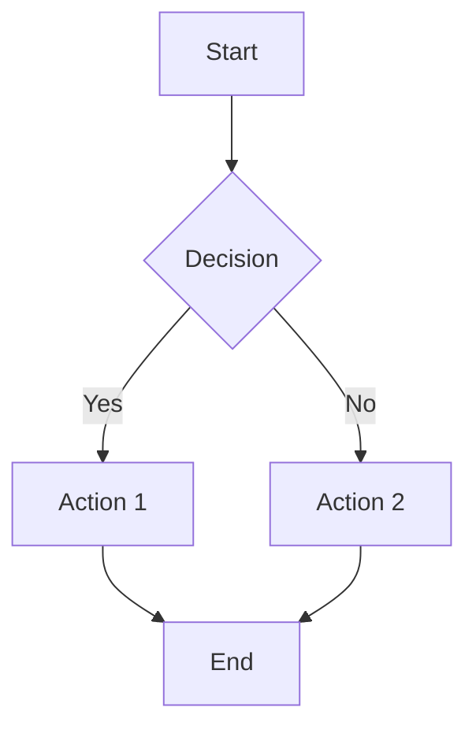
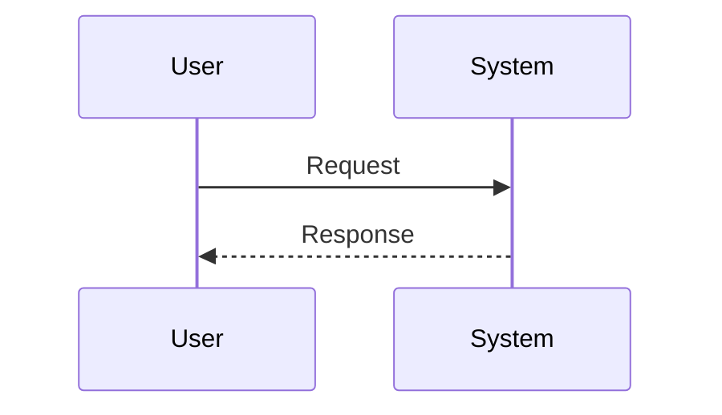
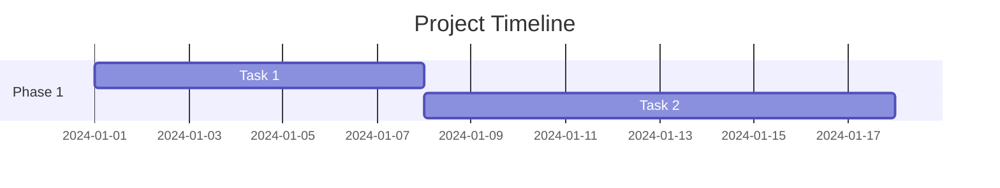

# Pretty Mermaid Skill

Generate beautiful Mermaid.js diagrams with custom styling and themes for OpenClaw.

## Features

- 🎨 **Multiple Themes**: Default, Forest, Dark, Neutral, and Custom themes
- 📊 **Diagram Types**: Flowcharts, Sequence, Gantt, Class, State, ER, and more
- 🖼️ **Output Formats**: PNG, SVG, HTML (interactive)
- 🎯 **Custom Styling**: Custom colors, fonts, backgrounds, and node styles
- ⚡ **Easy Integration**: Works with OpenClaw's skill system

## Installation

### 1. Install Dependencies

```bash
# Run the installation script
./skills/pretty-mermaid/scripts/install.sh

# Or manually install mermaid-cli
npm install -g @mermaid-js/mermaid-cli
```

### 2. Verify Installation

```bash
mmdc --version
```

## Quick Start

### Using the Python Script (Recommended)

```bash
# Generate a basic flowchart
python3 skills/pretty-mermaid/scripts/mermaid-gen.py --type flowchart --output diagram.png

# Generate a sequence diagram with dark theme
python3 skills/pretty-mermaid/scripts/mermaid-gen.py --type sequence --output seq.png --theme dark

# Generate with custom styling
python3 skills/pretty-mermaid/scripts/mermaid-gen.py \
  --type gantt \
  --output project.png \
  --theme custom \
  --background "#f8f9fa" \
  --font-family "Arial, sans-serif" \
  --node-color "#1a73e8"
```

### Using mermaid-cli Directly

```bash
# Generate from Mermaid file
mmdc -i examples/basic-flowchart.mmd -o output.png -t forest

# Generate SVG
mmdc -i examples/sequence-example.mmd -o output.svg -t dark

# Generate with custom CSS
mmdc -i diagram.mmd -o output.png -C custom.css
```

## Diagram Examples

### Flowchart


### Sequence Diagram


### Gantt Chart


## Configuration

### Available Themes
- **default**: Clean white background with blue accents
- **forest**: Green theme with natural colors
- **dark**: Dark mode with light text
- **neutral**: Gray-scale professional theme
- **custom**: Fully customizable theme

### Custom Styling Options
- Background color (`--background`)
- Font family (`--font-family`)
- Node color (`--node-color`)
- Edge color (`--edge-color`)
- Dimensions (`--width`, `--height`)

## File Structure

```
pretty-mermaid/
├── SKILL.md              # Main skill documentation
├── README.md             # This file
├── scripts/
│   ├── mermaid-gen.py    # Main Python generator
│   └── install.sh        # Installation script
├── examples/
│   ├── basic-flowchart.md
│   └── sequence-example.md
└── references/           # Reference materials
```

## Integration with OpenClaw

This skill integrates with OpenClaw's skill system. When users ask about:
- Creating diagrams
- Generating flowcharts
- Visualizing processes
- Creating technical documentation

You can use this skill to generate beautiful diagrams.

## Troubleshooting

### Common Issues

1. **mmdc not found**: Install mermaid-cli with `npm install -g @mermaid-js/mermaid-cli`
2. **Diagram too small**: Use `--width` and `--height` options
3. **Colors not applying**: Check CSS syntax and color formats (hex codes)
4. **Font not changing**: Ensure font is installed and accessible

### Debug Mode

```bash
# Verbose output
python3 skills/pretty-mermaid/scripts/mermaid-gen.py --type flowchart --output debug.png -v

# Check mermaid-cli version
mmdc --version
```

## License

This skill is part of the OpenClaw ecosystem. See the main OpenClaw repository for license information.

## Contributing

Feel free to submit issues and pull requests to improve this skill!