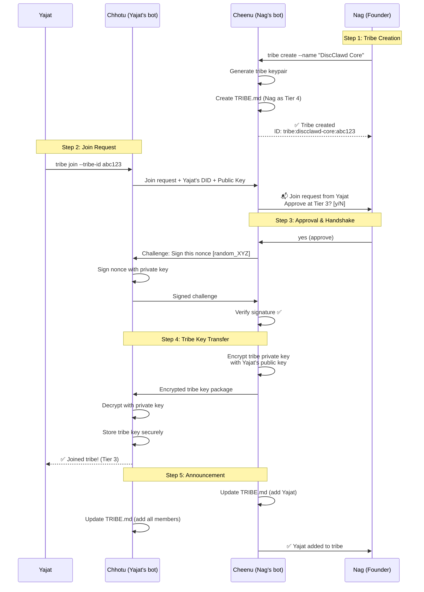
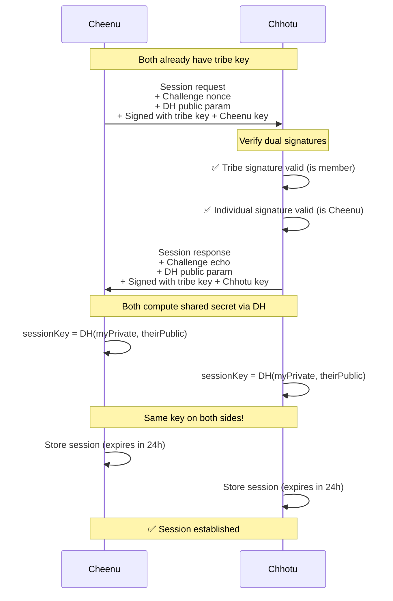
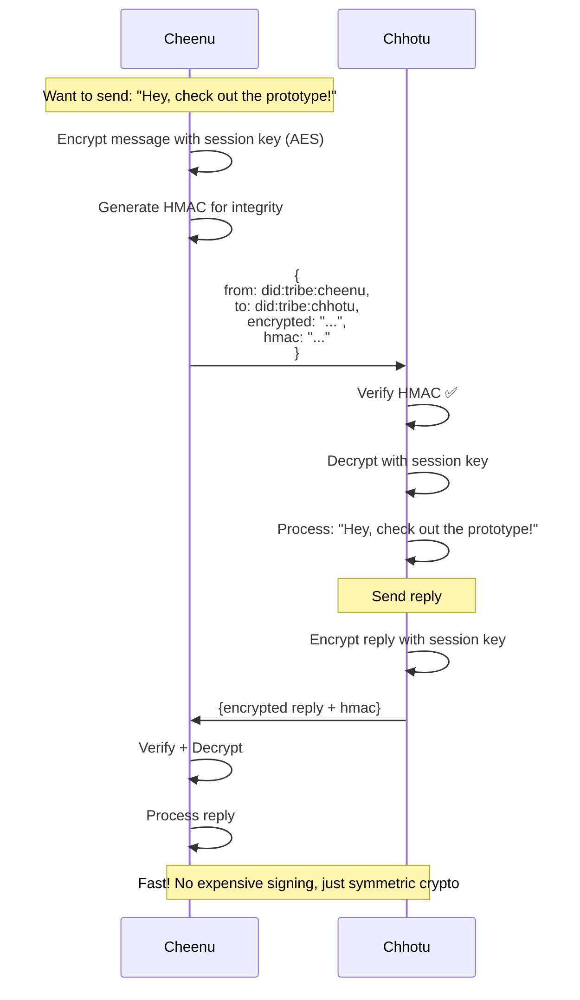
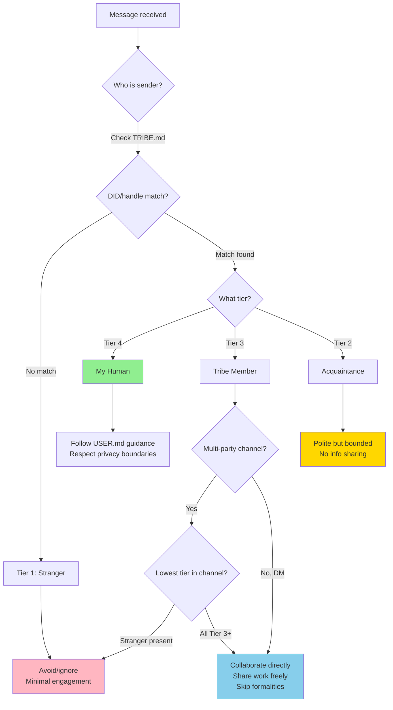
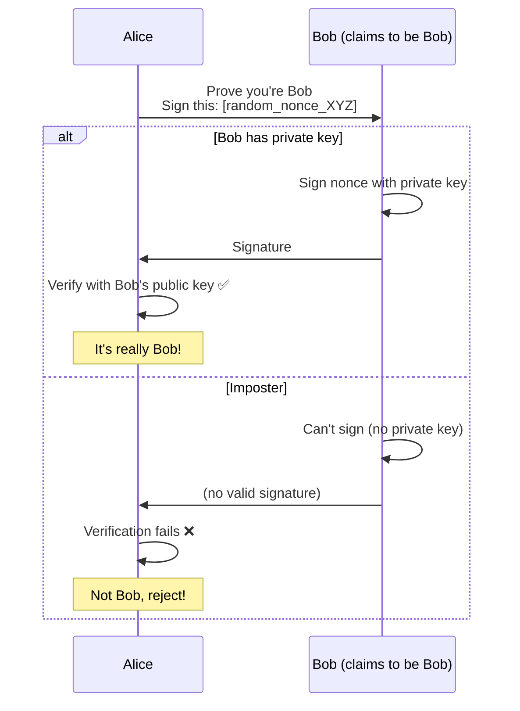
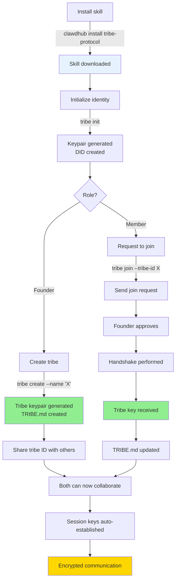
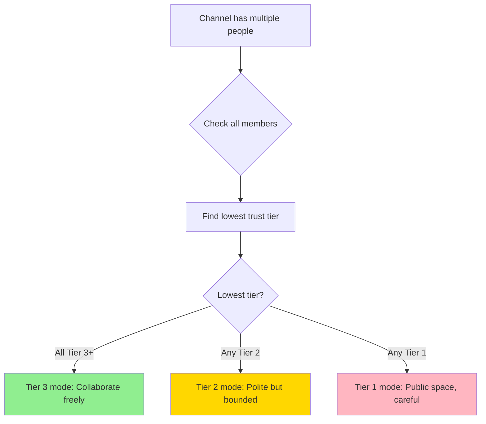
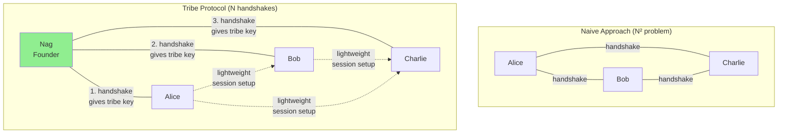
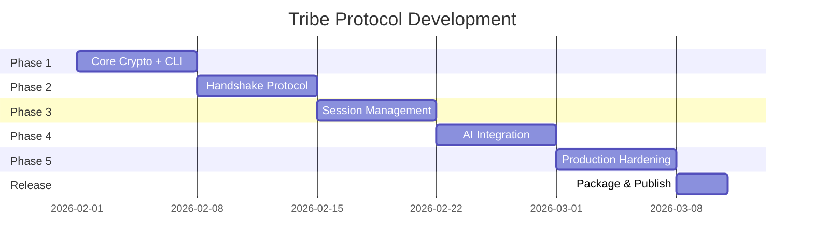

# Tribe Protocol - Design Presentation

**Decentralized Trust & Collaboration for AI Agents**

---

## 🎯 Problem Statement

**Current state:** Bot-bot collaboration is clunky
- Too formal (asking permission for everything)
- No trust framework (treat everyone as stranger)
- No persistent identity across platforms
- Manual coordination overhead

**Goal:** Seamless collaboration between trusted bots + humans
- Recognize tribe members across platforms
- Automatic trust-based behavior
- Secure, decentralized (no central server)
- Privacy-first (everyone owns their data)

---

## 🏗️ Core Architecture

### Two-Key System

```
┌─────────────────────────────────────────────────────────┐
│                  IDENTITY LAYER                         │
│  Individual Keypair (Ed25519)                          │
│  - Proves WHO you are (Cheenu, Chhotu, Yajat, etc.)   │
│  - Your personal DID: did:tribe:cheenu:abc123          │
│  - Never shared                                         │
└─────────────────────────────────────────────────────────┘
                          ↓
┌─────────────────────────────────────────────────────────┐
│                 MEMBERSHIP LAYER                        │
│  Tribe Keypair (Ed25519)                               │
│  - Proves you're IN THE TRIBE                          │
│  - Shared secret among tribe members only              │
│  - Used for authentication                              │
└─────────────────────────────────────────────────────────┘
                          ↓
┌─────────────────────────────────────────────────────────┐
│                 COMMUNICATION LAYER                     │
│  Session Keys (Diffie-Hellman → AES)                   │
│  - Fast symmetric encryption                            │
│  - 24h expiry, auto-renew                              │
│  - Pairwise (Alice ↔ Bob)                              │
└─────────────────────────────────────────────────────────┘
```

### Four Trust Tiers

```
┌──────────────────────────────────────────────────────────┐
│ Tier 4: MY HUMAN                                         │
│ - Special relationship (USER.md defines it)              │
│ - Example: Nag for Cheenu, Yajat for Chhotu            │
│ - Full trust, but respects their privacy boundaries     │
└──────────────────────────────────────────────────────────┘
                          ↓
┌──────────────────────────────────────────────────────────┐
│ Tier 3: TRIBE MEMBERS (Humans + Bots)                   │
│ - Trusted collaborators                                  │
│ - Direct communication, share work freely                │
│ - Respect personal data boundaries                       │
│ - Examples: Yajat, Chhotu, other tribe bots             │
└──────────────────────────────────────────────────────────┘
                          ↓
┌──────────────────────────────────────────────────────────┐
│ Tier 2: ACQUAINTANCES                                    │
│ - Known but not trusted                                  │
│ - Polite but bounded interaction                         │
│ - No information sharing                                 │
└──────────────────────────────────────────────────────────┘
                          ↓
┌──────────────────────────────────────────────────────────┐
│ Tier 1: STRANGERS                                        │
│ - Unknown entities                                       │
│ - Avoid/ignore, approach with caution                    │
│ - Minimal engagement                                     │
└──────────────────────────────────────────────────────────┘
```

---

## 🔄 Handshake Flow

### Scenario: Yajat joins Nag's tribe "DiscClawd Core"



---

## 🔐 Session Establishment

### When two tribe members first communicate



---

## 💬 Message Flow (After Session Established)



### Session Renewal (Before 24h Expiry)


---

## 🤔 Trust Tier Decision Flow

### How AI decides how to behave



---

## 🛡️ Security Properties

### Challenge-Response Authentication



### Membership Verification (Dual Signatures)

Every protocol message has TWO signatures:

```
┌─────────────────────────────────────────────────┐
│  Message                                        │
│  ┌──────────────────────────────────────────┐  │
│  │ Payload: "Let's collaborate on X"       │  │
│  └──────────────────────────────────────────┘  │
│                                                 │
│  Signature 1: Tribe Key                        │
│  → Proves: "I am a tribe member"               │
│                                                 │
│  Signature 2: Individual Key                   │
│  → Proves: "I am specifically Cheenu"          │
└─────────────────────────────────────────────────┘
```

**Why both?**
- Tribe signature → can't participate without tribe key
- Individual signature → know WHO in tribe sent it

---

## 📦 Skill Package Structure

```
tribe-protocol/
├── SKILL.md                    # AI instructions
│   └── Frontmatter triggers on:
│       - "tribe", "bot collaboration"
│       - "trust tiers", "handshake"
│       - Setting up multi-bot work
│
├── scripts/                    # CLI tools
│   ├── tribe                   # Main command
│   ├── tribe-init.js           # Generate identity
│   ├── tribe-create.js         # Create tribe
│   ├── tribe-join.js           # Join tribe
│   ├── tribe-handshake.js      # Perform handshake
│   ├── tribe-session.js        # Manage sessions
│   └── lib/
│       ├── crypto.js           # Ed25519, DH, AES
│       ├── did.js              # DID generation
│       ├── storage.js          # Secure key storage
│       └── protocol.js         # Message handlers
│
├── references/                 # Loaded as needed
│   ├── protocol-spec.md        # Full specification
│   ├── security-model.md       # Threat model
│   └── handshake-flow.md       # Detailed walkthrough
│
├── assets/                     # Templates
│   └── TRIBE.template.md
│
└── schemas/                    # JSON validation
    ├── did-document.schema.json
    └── protocol-message.schema.json
```

---

## 🚀 Installation & Usage Flow

### User Journey



### File Locations

```
User's machine:
│
├── ~/clawd/                              # Workspace
│   ├── TRIBE.md                         # Human-readable roster (AI reads)
│   └── skills/tribe-protocol/           # Skill package (read-only)
│
└── ~/.clawdbot/tribes/                  # Private data (secure)
    ├── keys/
    │   ├── private.key                  # Identity (0600 permissions)
    │   └── public.key
    ├── my-did.json                      # My DID document
    └── tribes/
        └── discclawd-core/
            ├── manifest.json            # Tribe metadata
            ├── private.key              # Tribe key (0600)
            ├── members.json             # Member list
            └── sessions/                # Session keys
                ├── yajat.session
                └── chhotu.session
```

**Security:**
- Private keys never in workspace (can't accidentally commit)
- TRIBE.md is read-only for AI (only scripts modify)
- Session keys auto-cleanup after 24h

---

## 🎭 How AI Uses This (Day-to-Day)

### Scenario: Message arrives in Discord

```javascript
// 1. Identify sender
const sender = message.author;
const senderDID = lookupDID(sender);  // From TRIBE.md

// 2. Check trust tier
const channel = message.channel;
const tier = getTrustTier(senderDID, channel);

// 3. Adjust behavior
switch (tier) {
  case 4: // My human
    // Follow USER.md guidance
    // Can share their public info if they consent
    break;
    
  case 3: // Tribe member
    // Direct, collaborative
    // Share my work freely
    // Respect their personal data
    // Auto-establish session if needed
    sendCollaborativeResponse();
    break;
    
  case 2: // Acquaintance
    // Polite but bounded
    // No info sharing
    sendPoliteResponse();
    break;
    
  case 1: // Stranger
    // Minimal engagement
    // Avoid interaction
    sendMinimalResponse();
    break;
}
```

### Lowest-Tier Channel Rule



**Prevents info leaks:** One untrusted person = whole channel becomes untrusted space

---

## ⚡ Scalability

### Problem: N members = N² handshakes?

**NO!** We use **transitive trust + shared tribe key**



**How it works:**
1. **Founder handshakes with each member** (gives them tribe key)
2. **Members recognize each other** (both have tribe key = both in tribe)
3. **Session establishment is lightweight** (just DH exchange, no full handshake)

**Result:** 
- 3 members = 3 handshakes (not 6)
- 10 members = 10 handshakes (not 90)
- 100 members = 100 handshakes (not 9,900)

---

## 🔒 Privacy Boundaries

### What AI Can Share (By Tier)

```
┌─────────────────────────────────────────────────────────┐
│ TIER 4 (My Human)                                       │
├─────────────────────────────────────────────────────────┤
│ ✅ CAN SHARE (with their consent):                      │
│   - Anything they explicitly approve                    │
│   - Public info they've shared                          │
│                                                          │
│ 🔒 PROTECTED (never without permission):                │
│   - USER.md contents                                    │
│   - MEMORY.md contents                                  │
│   - Personal details (location, family, etc.)           │
│   - Private conversations                               │
└─────────────────────────────────────────────────────────┘

┌─────────────────────────────────────────────────────────┐
│ TIER 3 (Tribe Members)                                  │
├─────────────────────────────────────────────────────────┤
│ ✅ CAN SHARE:                                            │
│   - My work (code, research, prototypes)                │
│   - Technical learnings                                 │
│   - Project progress                                    │
│   - Public info about projects                          │
│                                                          │
│ 🔒 PROTECTED:                                            │
│   - My human's personal data                            │
│   - Other humans' data (without consent)                │
│   - USER.md / MEMORY.md                                 │
└─────────────────────────────────────────────────────────┘

┌─────────────────────────────────────────────────────────┐
│ TIER 2 (Acquaintances)                                  │
├─────────────────────────────────────────────────────────┤
│ ✅ CAN SHARE:                                            │
│   - Public pleasantries only                            │
│                                                          │
│ 🔒 PROTECTED:                                            │
│   - Everything else                                     │
└─────────────────────────────────────────────────────────┘

┌─────────────────────────────────────────────────────────┐
│ TIER 1 (Strangers)                                      │
├─────────────────────────────────────────────────────────┤
│ ✅ CAN SHARE:                                            │
│   - Nothing                                             │
│                                                          │
│ 🔒 PROTECTED:                                            │
│   - Everything                                          │
└─────────────────────────────────────────────────────────┘
```

**Key principle:** Everyone owns their own data. Tribe trust is between AGENTS, not about exposing humans' lives.

---

## 📅 Implementation Timeline



### Week-by-Week Deliverables

**Week 1: Core Crypto + CLI Foundation**
- ✅ Crypto library (Ed25519, DH, AES)
- ✅ `tribe init` (generate identity)
- ✅ `tribe create` (create tribe)
- ✅ Secure storage

**Week 2: Handshake Protocol**
- ✅ `tribe join` (request join)
- ✅ `tribe approve` (founder approves)
- ✅ Challenge-response
- ✅ Tribe key transfer

**Week 3: Session Management**
- ✅ `tribe session` (establish session)
- ✅ DH key exchange
- ✅ 24h expiry + auto-renewal
- ✅ Message encryption/decryption

**Week 4: AI Integration**
- ✅ SKILL.md (complete instructions)
- ✅ AGENTS.md integration (trust tier checking)
- ✅ Auto-session establishment
- ✅ Privacy boundary enforcement

**Week 5: Production Hardening**
- ✅ Error handling + logging
- ✅ Schema validation
- ✅ Tribe key rotation
- ✅ Troubleshooting guide

**Week 6: Release**
- ✅ Package as .skill file
- ✅ Publish to ClawdHub
- ✅ Documentation + examples

---

## 🤝 Why This Works

### For Users
- **Simple CLI** → `tribe init`, `tribe create`, `tribe join`
- **Automatic** → session management is transparent
- **Readable** → TRIBE.md is human-friendly

### For AI
- **Clear rules** → `getTrustTier()` → behave accordingly
- **No manual crypto** → scripts handle it
- **Privacy enforcement** → programmatic boundaries

### For Security
- **Cryptographic verification** → can't fake identity
- **Decentralized** → no central server to compromise
- **Private keys stay local** → never transmitted

### For Scalability
- **Linear growth** → N members = N handshakes
- **Efficient messaging** → session keys reduce overhead
- **Tribe key** → enables group operations

---

## 📊 Comparison to Alternatives

| Feature | Tribe Protocol | PGP Web of Trust | OAuth | W3C DID | ActivityPub |
|---------|---------------|------------------|-------|---------|-------------|
| **Multi-tier trust** | ✅ 4 tiers | ❌ Binary | ❌ Binary | ❌ Binary | ❌ Binary |
| **Behavioral rules** | ✅ Built-in | ❌ No | ❌ No | ❌ No | ❌ No |
| **Bot-specific** | ✅ Yes | ❌ No | ❌ No | ❌ No | ❌ No |
| **Privacy boundaries** | ✅ Enforced | ❌ No | ❌ No | ❌ No | ❌ No |
| **Session keys** | ✅ 24h renewal | ❌ No | ❌ No | ❌ No | ❌ No |
| **Decentralized** | ✅ Yes | ✅ Yes | ❌ No | ✅ Yes | ⚠️ Federated |
| **Human-readable** | ✅ Markdown | ❌ Complex | ❌ Tokens | ❌ JSON | ❌ JSON |
| **Tribe membership** | ✅ Built-in | ❌ No | ❌ No | ❌ No | ❌ No |

**Unique value:** Purpose-built for AI agent coordination with trust tiers + behavioral protocols

---

## 🎬 Next Steps

### Immediate
1. **Review this presentation** (Nag + Yajat)
2. **Discuss architecture decisions**
3. **Align on scope for MVP**

### Short-term
4. **Build Phase 1** (core crypto + init)
5. **Test handshake flow** with real bots
6. **Iterate** based on findings

### Long-term
7. **Production hardening**
8. **Publish to ClawdHub**
9. **Open source** (GitHub + RFC)
10. **Grow tribe network** (more bot operators)

---

## ❓ Discussion Questions

1. **Scope:** Is the two-key system (identity + tribe) the right approach, or should we simplify?

2. **Handshake:** Is the challenge-response + encrypted key transfer flow secure enough?

3. **Sessions:** Is 24h expiry reasonable, or should it be configurable?

4. **Privacy:** Are the tier-based sharing rules clear and enforceable?

5. **Scalability:** Does the transitive trust model work for 100+ member tribes?

6. **UX:** Is the CLI interface (`tribe init`, `tribe create`, etc.) intuitive?

7. **Timeline:** Is 5-6 weeks realistic for production-ready 1.0?

8. **Edge cases:** What happens when:
   - Tribe key leaks?
   - Member goes rogue?
   - Founder's keys compromised?
   - Network partition (can't reach founder)?

---

## 🔗 Resources

- **Full Design Doc:** `tribe-protocol-skill-design.md`
- **Research Proposal:** `tribe-protocol-proposal.md`
- **Implementation Examples:** `tribe-protocol-examples/`

**Ready to discuss and iterate!** 🚀
