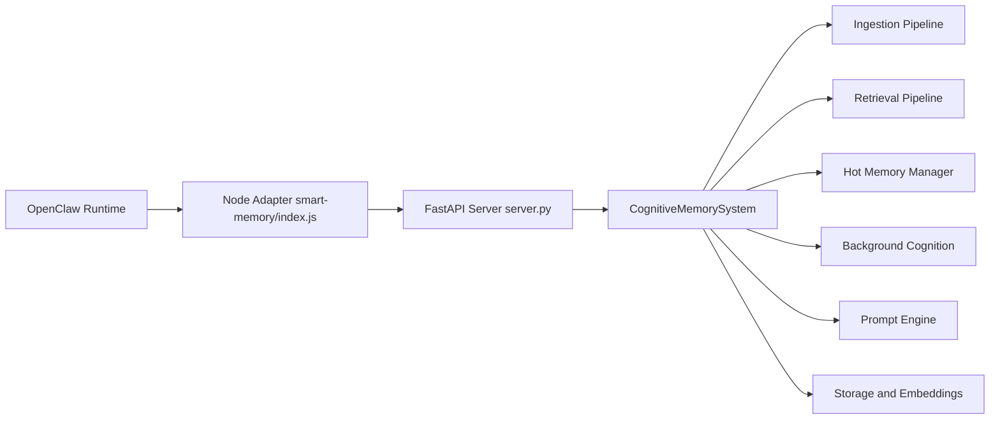
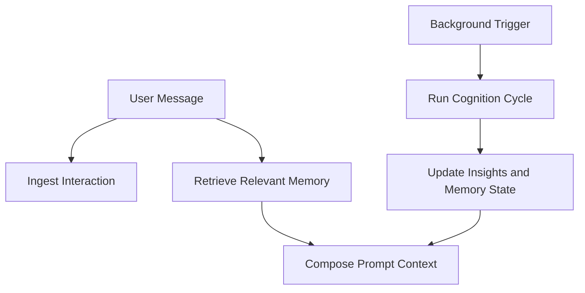

# Smart Memory v2 - Cognitive Architecture for OpenClaw

<p>
  
  
  
  
  
  
</p>

> **Not a basic RAG cache.**  
> Smart Memory v2 is a persistent, local cognitive engine for OpenClaw with schema-versioned long-term memory, hot working memory, background cognition, strict token-bounded prompt composition, and a continuously running FastAPI process.

---

## Quick Value (60 seconds)

| You Need | Smart Memory v2 Gives You |
|---|---|
| Continuity across sessions | Typed long-term memory (`episodic`, `semantic`, `belief`, `goal`) |
| Fast local recall | Nomic embeddings + vector search + reranking |
| Stable context quality | Strict prompt token enforcement with deterministic eviction priority |
| Better long-run memory quality | Semantic dedup, reinforcement, consolidation, decay, and conflict resolution |
| Lightweight installs | CPU-only PyTorch standard (no CUDA wheel bloat) |
| Operational visibility | `/health`, `/memories`, `/memory/{id}`, `/insights/pending` |

---

## Why This Exists

Most memory plugins are retrieval wrappers. They do not behave like cognition.  
Smart Memory v2 is designed as a **cognitive pipeline**:

- `Ingestion`: Decide what is memory-worthy.
- `Retrieval`: Find relevant memories with entity and time bias.
- `Working Memory`: Keep a small, high-signal mind state.
- `Background Cognition`: Reflect, consolidate, decay, and resolve conflicts.
- `Prompt Composition`: Assemble bounded, coherent context for the model.

---

## Architecture At A Glance



### Cognitive Request Flow



---

## System Overview

### Runtime
- Persistent local FastAPI process keeps the embedder and stores warm.
- Node adapter manages process lifecycle and exposes a simple JS interface.
- OpenClaw v2.5 skill layer adds active memory tools and lifecycle hooks.

### Memory Quality Controls
- Strict prompt token enforcement with deterministic eviction order.
- Semantic dedup in ingestion to reinforce instead of duplicating.
- Retrieval access tracking updates `last_accessed` and `access_count`.
- Belief conflict resolution merges contradictory beliefs by shared entities and opposing stance.

### Reliability and Observability
- CPU-only PyTorch is mandatory for lightweight, consistent installs.
- Health and observability endpoints: `/health`, `/memories`, `/memory/{id}`, `/insights/pending`.
- Retry queue + heartbeat support in the OpenClaw skill for resilient commit behavior.

### OpenClaw Native Skill (v2.5)
- New modular package: `skills/smart-memory-v25/`.
- Active tools: `memory_search`, `memory_commit`, `memory_insights`.
- Session arc capture at checkpoints and session end.
- Passive `[ACTIVE CONTEXT]` prompt injection for grounded responses.

**Important:** Disable OpenClaw's built-in memory tools to prevent shadowing:
```bash
openclaw config set tools.deny '["memory_search", "memory_get"]'
openclaw gateway restart
```

---

## Memory Layers

| Layer | Purpose | Example Content |
|---|---|---|
| Agent Identity | Stable behavior anchor | role, mission, style |
| Temporal State | Time continuity | current time, last interaction delta, state |
| Hot Memory | Current cognitive focus | active projects, top-of-mind, working questions |
| Long-Term Memory | Durable history | episodic/semantic/belief/goal objects |
| Insight Queue | Background reflections | confidence-scored insight objects |
| Conversation Context | Immediate grounding | recent turns + current user input |

---

## Repository Layout

```text
.
+- server.py
+- cognitive_memory_system.py
+- prompt_engine/
+- ingestion/
+- retrieval/
+- hot_memory/
+- cognition/
+- storage/
+- embeddings/
+- entities/
+- skills/
   +- smart-memory-v25/
      +- index.js
      +- openclaw-hooks.js
      +- prompt-injection.js
      +- retry-queue.js
+- smart-memory/
   +- index.js
   +- postinstall.js
```

---

## Installation

### Option A: ClawHub

```bash
npx clawhub install smart-memory
```

### Option B: From GitHub

```bash
git clone https://github.com/BluePointDigital/smart-memory.git
cd smart-memory/smart-memory
npm install
```

### What `npm install` Does

`postinstall.js` automatically:
1. Creates `.venv` at repository root.
2. Upgrades `pip`.
3. Installs CPU-only PyTorch wheels (mandatory policy).
4. Installs `requirements-cognitive.txt` (including FastAPI, sentence-transformers, qdrant-client, einops).

Works on both Windows and Unix path conventions.

Do not install generic GPU/CUDA PyTorch wheels for this project; keep CPU-only for consistency and package size.

---

## How To Use

```js
import memory from "smart-memory";

await memory.start();

await memory.ingestMessage({
  user_message: "I started migrating our database today.",
  assistant_message: "Track risks and rollback strategy.",
  timestamp: new Date().toISOString()
});

const retrieval = await memory.retrieveContext({
  user_message: "How is the migration going?",
  conversation_history: "..."
});

const composed = await memory.getPromptContext({
  agent_identity: "You are a persistent cognitive assistant.",
  conversation_history: "...",
  current_user_message: "Continue from where we left off."
  // hot_memory optional
});

await memory.runBackground(true);
await memory.stop();
```

---

## Hot Memory Extension (Optional)

The **Hot Memory Extension** provides persistent working context that survives between sessions and automatically appears in every prompt's `[WORKING CONTEXT]` section.

### What It Adds

| Feature | Description |
|---------|-------------|
| **Active Projects** | Top 5 current projects with auto-detection from conversation |
| **Working Questions** | Open questions being explored (auto-captured from queries) |
| **Top of Mind** | Immediate priorities and notes |
| **Live Insights** | Pending insights from background cognition |
| **Auto-Update** | Detects project mentions and questions automatically |

### Quick Start

```bash
# Initialize with current context
python3 hot_memory_manager.py init

# After conversations, update hot memory
./smem-hook.sh "user message" "assistant response"

# Compose with hot memory auto-included
python3 memory_adapter.py compose -m "What should I work on?"
```

### Files

- `hot_memory_manager.py` - Core persistence and auto-update logic
- `memory_adapter.py` - API wrapper with hot memory integration
- `smem-hook.sh` - Post-conversation shell hook
- `hot_memory_state.json` - Persistent storage (auto-created)

### Duplicate Prevention

The extension includes intelligent duplicate prevention that matches projects by key (e.g., "Tappy.Menu") rather than full description, preventing duplicates when project descriptions evolve.

See `HOT_MEMORY_EXTENSION.md` for full documentation.

---

## API Surface

### JavaScript Adapter Methods

| Method | Purpose |
|---|---|
| `init()` / `start()` | Ensure API process is running and healthy |
| `ingestMessage(interaction)` | Send interaction to ingestion pipeline |
| `retrieveContext({ user_message, conversation_history })` | Retrieve ranked memory context |
| `getPromptContext(request)` | Compose final bounded prompt context |
| `runBackground(scheduled)` | Trigger cognition cycle |
| `stop()` | Stop managed Python server process |

### FastAPI Endpoints

| Endpoint | Method | Description |
|---|---|---|
| `/` | `GET` | Basic service status |
| `/health` | `GET` | Health + embedder loaded metadata |
| `/ingest` | `POST` | Ingest incoming interaction |
| `/retrieve` | `POST` | Retrieve relevant long-term memories |
| `/compose` | `POST` | Compose prompt context payload |
| `/run_background` | `POST` | Execute background cognition cycle |
| `/memories` | `GET` | List memories (`?type=` optional) |
| `/memory/{memory_id}` | `GET` | Fetch one memory by ID |
| `/insights/pending` | `GET` | View pending hot-memory insights |

---

## Security and Privacy

- Memory data is designed for local operation.
- `.gitignore` excludes runtime memory stores, virtualenvs, caches, and `node_modules`.
- Review ignored paths before publishing any fork.

---

## Requirements

- Node.js `>=18`
- Python `>=3.11`
- Local disk for model cache + memory storage

---

## License

MIT
