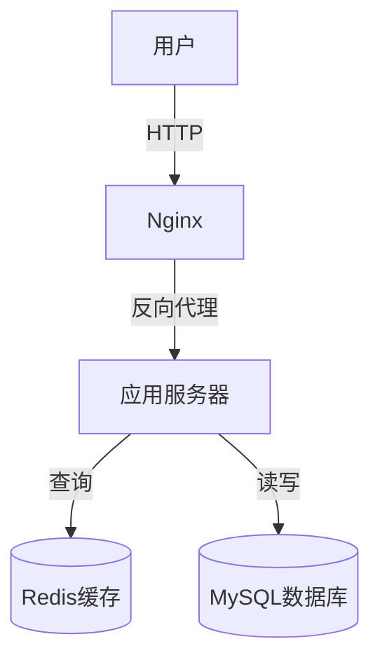
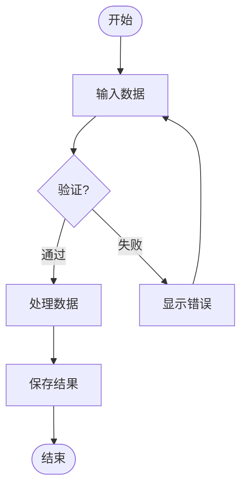
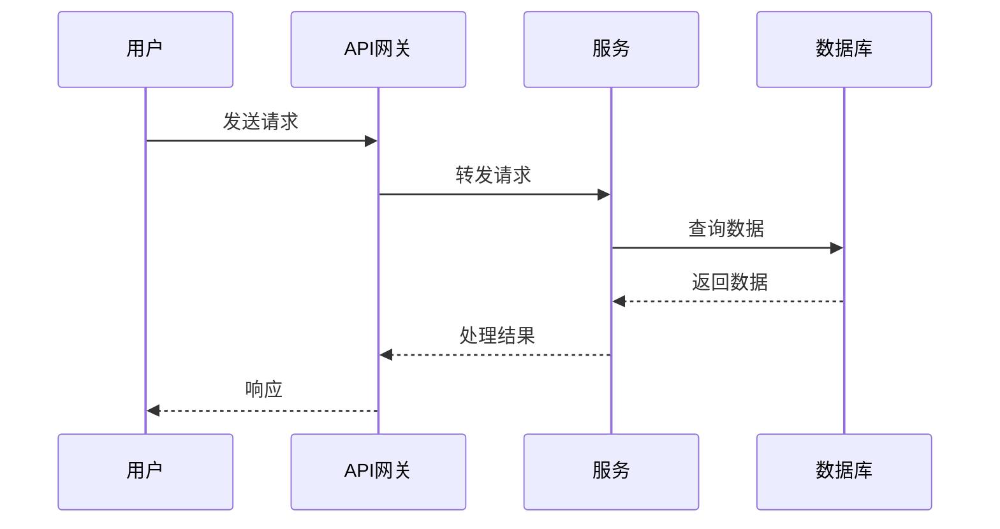
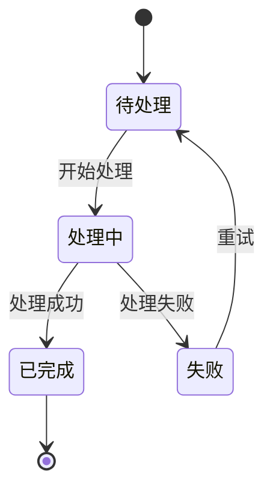
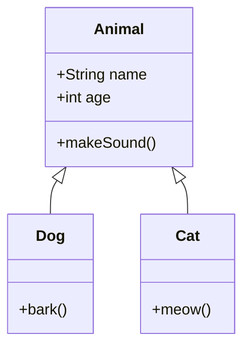
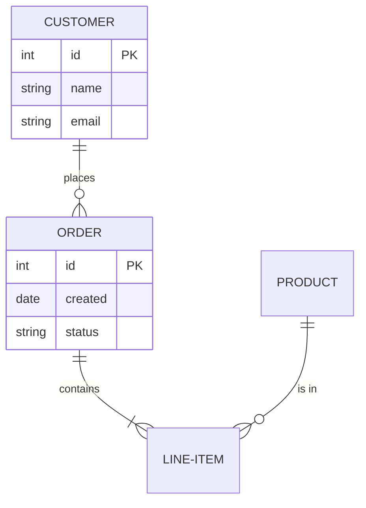
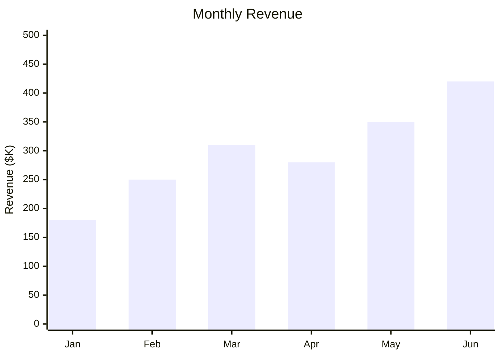
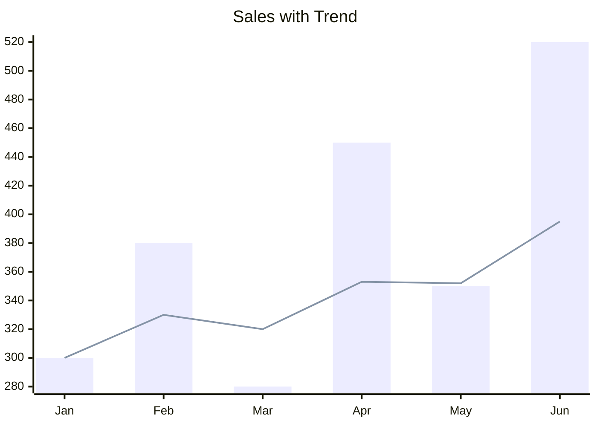

# Beautiful Mermaid Skill

## 概述

Beautiful Mermaid 是一个高性能的 Mermaid 图表渲染库，专为 AI 时代设计。它将 Mermaid 语法转换为美观的 SVG 图形、PNG 位图或 ASCII 艺术字，支持同步渲染、全主题定制、CSS级样式定制，零 DOM 依赖。

| 说明 | 地址 |
|------|------|
| 本 Skill | [https://github.com/chouraycn/beautiful-mermaid](https://github.com/chouraycn/beautiful-mermaid) |
| 上游项目 | [https://github.com/lukilabs/beautiful-mermaid](https://github.com/lukilabs/beautiful-mermaid) |

## 核心能力

### 1. 支持的图表类型

- **流程图 (Flowchart)**：`graph TD`、`graph LR`、`graph BT`、`graph RL` 等方向
- **序列图 (Sequence Diagram)**：参与者之间的交互
- **状态图 (State Diagram)**：状态转换
- **类图 (Class Diagram)**：面向对象设计
- **实体关系图 (ER Diagram)**：数据库设计
- **XY 图表**：条形图、折线图、组合图（`xychart-beta` 语法）

### 2. 输出格式

- **SVG**：适用于富 UI 界面，支持透明背景和内联样式
- **PNG**：适用于文档嵌入、高清位图输出，支持自定义尺寸和 DPI
- **ASCII/Unicode**：适用于终端环境，支持颜色输出

### 3. 主题系统

- **15 内置主题**：tokyo-night、dracula、github-dark、nord 等（9 暗色 + 6 亮色）
- **完整 7 字段**：每个主题包含 `bg`、`fg`、`line`、`accent`、`muted`、`surface`、`border` 全部字段
- **Mono 模式**：仅需提供背景色(bg)和前景色(fg)，自动推导整套配色
- **自定义主题**：可覆盖任意元素颜色
- **Shiki 集成**：通过 `fromShikiTheme()` 直接使用 VS Code 编辑器主题

#### 主题完整对照表

| 主题名 | 类型 | 背景色 | 强调色(accent) | 推荐预设 | 适用场景 |
|--------|------|--------|--------------|---------|---------|
| `zinc-light` | 亮色 | `#FFFFFF` | `#3F3F46` | outline | 极简文档 |
| `zinc-dark` | 暗色 | `#18181B` | `#A1A1AA` | glass | 极简暗场景 |
| `tokyo-night` | 暗色 | `#1a1b26` | `#7aa2f7` | glass | 代码架构图 |
| `tokyo-night-storm` | 暗色 | `#24283b` | `#7aa2f7` | modern | 系统设计图 |
| `tokyo-night-light` | 亮色 | `#d5d6db` | `#34548a` | modern | 亮色演示 |
| `catppuccin-mocha` | 暗色 | `#1e1e2e` | `#cba6f7` | glass | 产品展示 |
| `catppuccin-latte` | 亮色 | `#eff1f5` | `#8839ef` | modern | 分享文档 |
| `nord` | 暗色 | `#2e3440` | `#88c0d0` | modern | 技术文档暗色 |
| `nord-light` | 亮色 | `#eceff4` | `#5e81ac` | outline | 技术文档亮色 |
| `dracula` | 暗色 | `#282a36` | `#bd93f9` | gradient | 视觉展示 |
| `github-light` | 亮色 | `#ffffff` | `#0969da` | default | GitHub/文档 |
| `github-dark` | 暗色 | `#0d1117` | `#4493f8` | modern | 代码深度分析 |
| `solarized-light` | 亮色 | `#fdf6e3` | `#268bd2` | outline | 护眼亮色 |
| `solarized-dark` | 暗色 | `#002b36` | `#268bd2` | modern | 护眼暗色 |
| `one-dark` | 暗色 | `#282c34` | `#c678dd` | gradient | 紫色调 |

#### 主题字段说明

| 字段 | 说明 | 用途 |
|------|------|------|
| `bg` | 画布背景色 | 整体底色 |
| `fg` | 主前景/文字色 | 节点标签、主要文字 |
| `line` | 连线颜色 | 边/箭头连线 |
| `accent` | 强调色 | 箭头头部、子图标题、高亮节点 |
| `muted` | 次要色 | 边标签、辅助注释文字 |
| `surface` | 节点填充次级色 | 比 bg 深/浅一级，用于节点内填充 |
| `border` | 节点边框精确色 | 节点外框描边 |

#### 推荐主题 × 预设搭配

```
tokyo-night   + glass     → 代码架构图的最佳组合（深蓝毛玻璃）
dracula       + gradient  → 视觉展示最强（紫色渐变阴影）
github-light  + default   → 文档嵌入首选（简洁中性）
catppuccin-mocha + glass  → 产品 Deck 展示（柔和紫色调）
nord          + modern    → 技术报告暗色版（冰蓝现代感）
one-dark      + gradient  → 紫色调视觉最强（彩色阴影）
orange-dark   + glass     → 暖色系深色主题（橙色毛玻璃）
orange-light  + modern    → 暖色系浅色主题（橙色现代感）
```

> **AI 预览工作规则（最高优先级）**：任何涉及渲染 Mermaid 图表的请求，**无论用户是否已指定主题/预设**，都必须先调用 `preview_url` 打开预览工具，让用户在 preview.html 中直观确认效果后，再执行渲染命令。
>
> **触发场景（包括但不限于）**：
> - 用户询问主题/配色推荐
> - 用户已明确指定主题和预设（如"用 tokyo-night + glass 渲染"）→ **仍需先打开 preview 让用户确认，不得跳过**
> - 需要查看图表效果
> - 任何使用 skill 渲染图表的场景
>
> **打开方式**（唯一合法方式）：
> - 工具：`preview_url`
> - URL：`file://{__SKILL_DIR__}/assets/preview.html`（`__SKILL_DIR__` 为技能安装目录的绝对路径）
>
> **唯一例外**：用户明确说"直接渲染，不用预览"或"跳过预览"时，才可跳过 preview 步骤。
>
> **禁止**：
> - 使用 `open`/`start`/`xdg-open` 等命令打开系统浏览器
> - 启动 `python3 -m http.server` 或任何本地 HTTP 服务
> - 用户未明确说跳过时，擅自跳过 preview 直接执行渲染
>
> 用户打开预览后，可在 Themes 和 Presets 标签页中直接点击切换对比效果。

### 4. 样式定制系统

- **节点样式**：圆角、边框、阴影、填充色
- **连线样式**：粗细、颜色、箭头、圆角
- **字体排版**：支持多种字体和响应式适配
- **5种预设风格**：默认、现代简约、渐变、线条轮廓、毛玻璃

## 使用方法

### 安装

```bash
npm install beautiful-mermaid
# 或
bun add beautiful-mermaid
```

### 交互式预览工具

提供可视化的样式定制界面，**AI 必须用 `preview_url` 工具直接以文件路径打开**（在 IDE 内置浏览器中显示，无需服务器）：

```
preview_url(`file://{__SKILL_DIR__}/assets/preview.html`)
```

❌ 禁止使用 `open`/`start` 命令或启动任何 HTTP 服务器。

**预览工具功能**：

- **15 主题即时预览**：点击切换，实时查看效果
- **5 种样式预设**：default / modern / gradient / outline / glass
- **自定义颜色**：背景色、前景色、连线颜色
- **9 种图表类型**：Flowchart、Sequence、State、Class、ER、Bar、Line、Combo、H-Bar
- **实时代码编辑器**：支持自定义 Mermaid 代码，Tab 缩进，400ms debounce 自动渲染
- **状态持久化**：所有选择（主题、预设、颜色、自定义代码）自动保存到 localStorage
- **一键导出**：复制代码或导出带完整样式的 SVG 文件

### 丰富结果 HTML（多图表聚合展示）

当用户需要将**多张 Mermaid 图表**整合为一个专业的展示页面时，使用 `scripts/rich-html.js`。

生成的 HTML 包含：
- 顶部 **Badge**（显示主题和预设）+ 标题 + 副标题
- **标签页导航**（每张图表对应一个 Tab，支持 ① ② ③ … 编号）
- 每个 Tab 内的**信息卡片网格**（图表类型 + 自定义元数据）
- **卡片式 SVG 图表区**（带图标、标题、描述）
- 底部页脚（渲染信息）
- **完整继承用户选择的主题风格**（背景、前景、强调色等）

#### 基本用法

```bash
# 方式一：直接调用脚本
node scripts/rich-html.js "标题" \
  --diagrams file1.mmd file2.mmd file3.mmd \
  --theme tokyo-night --preset glass \
  --subtitle "副标题" \
  --output result.html

# 方式二：通过 npm script（等效）
npm run rich-html -- "标题" \
  --diagrams file1.mmd file2.mmd file3.mmd \
  --theme tokyo-night --preset glass \
  --subtitle "副标题" \
  --output result.html
```

#### 批量模式（渲染整个目录）

```bash
node scripts/rich-html.js "示例集" \
  --batch assets/examples \
  --theme dracula --preset gradient \
  --output examples-report.html

# npm 方式
npm run rich-html -- "示例集" --batch assets/examples --theme dracula --preset gradient --output examples-report.html
```

#### 为图表添加元数据（可选）

在 `.mmd` 文件中通过注释声明元数据，显示在信息卡片中：

```
# @title  用户下单完整流程
# @desc   从进入活动页到订单完成的端到端链路，含限流、库存扣减、异步建单
# @icon   🛒
# @type   Flowchart
# @meta   关键节点:8 个|覆盖阶段:全链路|主题:Tokyo Night|限流策略:Redis Lua
graph TD
    A[用户进入秒杀页] --> B{限流检查}
    ...
```

元数据字段说明：
- `@title`：Tab 名称和卡片标题
- `@desc`：卡片描述（小字，显示在标题下方）
- `@icon`：图标 emoji（默认根据图表类型自动推断）
- `@type`：图表类型说明（自动推断，可手动覆盖）
- `@meta`：信息卡片内容，格式 `标签:值|标签:值`（最多 4 组）

#### 主题继承规则

生成的 HTML **完整继承**渲染时指定的主题颜色：
- 页面背景 = 主题 `bg`
- 卡片/导航背景 = 主题 `surface`
- 边框 = 主题 `border`
- 正文文字 = 主题 `fg`
- 次要文字 = 主题 `muted`
- 强调色（Badge、Tab 激活、数值） = 主题 `accent`
- SVG 图表背景 = 比 `bg` 略深/浅，自动计算

> **AI 工作规则**：生成 rich-html 后，必须用 `preview_url` 工具打开生成的 HTML 文件，让用户直观查看效果。

### SVG 渲染

```typescript
import { renderMermaidSVG, THEMES } from 'beautiful-mermaid';

// 使用内置主题
const svg = renderMermaidSVG(`graph TD
    A[开始] --> B{判断}
    B -->|是| C[执行操作]
    B -->|否| D[结束]`, THEMES['tokyo-night']);

// 使用自定义主题
const customSvg = renderMermaidSVG(diagramCode, {
  bg: '#1a1b26',
  fg: '#a9b1d6',
  accent: '#7aa2f7',
  transparent: true,
});

// 使用 CSS 变量（支持实时主题切换）
const cssVarSvg = renderMermaidSVG(diagramCode, {
  bg: 'var(--background)',
  fg: 'var(--foreground)',
  transparent: true,
});

// 异步渲染（适用于 async 上下文）
const asyncSvg = await renderMermaidSVGAsync(diagramCode, THEMES['dracula']);
```

### ASCII 渲染

```typescript
import { renderMermaidASCII } from 'beautiful-mermaid';

// Unicode 模式（默认）
const unicode = renderMermaidASCII(`graph LR
A --> B --> C`);

// 纯 ASCII 模式
const ascii = renderMermaidASCII(`graph LR
A --> B --> C`, { useAscii: true });

// 带颜色输出
const colored = renderMermaidASCII(`graph LR
A --> B --> C`, { colorMode: 'truecolor' });

// 输出示例：
// ┌───┐     ┌───┐     ┌───┐
// │   │     │   │     │   │
// │ A │────►│ B │────►│ C │
// │   │     │   │     │   │
// └───┘     └───┘     └───┘
```

### React 集成

```typescript
import { renderMermaidSVG } from 'beautiful-mermaid';

function MermaidDiagram({ code }: { code: string }) {
  const { svg, error } = React.useMemo(() => {
    try {
      return {
        svg: renderMermaidSVG(code, {
          bg: 'var(--background)',
          fg: 'var(--foreground)',
          transparent: true,
        }),
        error: null,
      };
    } catch (err) {
      return { svg: null, error: err as Error };
    }
  }, [code]);

  if (error) return <pre>{error.message}</pre>;
  return <div dangerouslySetInnerHTML={{ __html: svg }} />;
}
```

### XY 图表（柱状图、折线图、组合图）

```typescript
import { renderMermaidSVG } from 'beautiful-mermaid';

// 柱状图
const bar = renderMermaidSVG(`xychart-beta
    title "Monthly Revenue"
    x-axis [Jan, Feb, Mar, Apr, May, Jun]
    y-axis "Revenue ($K)" 0 --> 500
    bar [180, 250, 310, 280, 350, 420]`, THEMES['tokyo-night']);

// 折线图
const line = renderMermaidSVG(`xychart-beta
    title "User Growth"
    x-axis [Jan, Feb, Mar, Apr, May, Jun]
    line [1200, 1800, 2500, 3100, 3800, 4500]`, THEMES['github-dark']);

// 组合图（柱状 + 折线）
const combo = renderMermaidSVG(`xychart-beta
    title "Sales with Trend"
    x-axis [Jan, Feb, Mar, Apr, May, Jun]
    bar [300, 380, 280, 450, 350, 520]
    line [300, 330, 320, 353, 352, 395]`, THEMES['dracula']);

// 交互式 XY 图表（鼠标悬停显示 tooltip）
const interactive = renderMermaidSVG(chartCode, {
  bg: '#1a1b26',
  fg: '#a9b1d6',
  accent: '#7aa2f7',
  interactive: true,
});
```

### Shiki 主题集成

```typescript
import { getSingletonHighlighter } from 'shiki';
import { renderMermaidSVG, fromShikiTheme } from 'beautiful-mermaid';

// 使用任意 VS Code 主题
const highlighter = await getSingletonHighlighter({
  themes: ['vitesse-dark', 'rose-pine', 'material-theme-darker']
});

const colors = fromShikiTheme(highlighter.getTheme('vitesse-dark'));
const svg = renderMermaidSVG(code, colors);
```

## CLI 命令行工具

### 基本用法

```bash
# 渲染文件为 SVG
node scripts/render.js diagram.mmd -o output.svg

# 使用指定主题
node scripts/render.js diagram.mmd -t dracula -o output.svg

# 渲染为 PNG (高清位图)
node scripts/render.js diagram.mmd -f png -o output.png

# PNG 自定义尺寸 (宽度)
node scripts/render.js diagram.mmd -f png -w 2400 -o output.png

# PNG 高清缩放 (2x)
node scripts/render.js diagram.mmd -f png -s 2 -o output.png

# PNG 高 DPI (印刷质量)
node scripts/render.js diagram.mmd -f png --dpi 300 -o output.png

# 渲染为 ASCII (终端)
node scripts/render.js diagram.mmd -f ascii

# XY 图表启用交互式 tooltip
node scripts/render.js chart.mmd --interactive -o chart.svg

# 直接传入代码 (注意：Mermaid 代码中换行用 \n)
node scripts/render.js -c "graph TD\nA --> B" -o output.svg
```

### 命令行参数

| 参数 | 说明 |
|------|------|
| `--format`, `-f` | 输出格式: `svg` (默认) \| `ascii` \| `png` |
| `--theme`, `-t` | 主题名称: tokyo-night, dracula, nord 等 15 个，或自定义 JSON |
| `--output`, `-o` | 输出文件路径（批量模式为输出目录） |
| `--code`, `-c` | 直接传入 Mermaid 代码 |
| `--bg` | 背景色 (如: #f7f7fa) |
| `--fg` | 前景色/文字颜色 (如: #27272a) |
| `--line` | 连线颜色 (如: #6b7280) |
| `--preset`, `-p` | 样式预设: `default` \| `modern` \| `gradient` \| `outline` \| `glass`（可与 --theme 联用） |
| `--width`, `-w` | PNG 输出宽度 (默认: 1200px) |
| `--scale`, `-s` | PNG 缩放比例 (默认: 1, 范围: 0.5-4) |
| `--dpi` | PNG 输出 DPI (默认: 144, 范围: 72-600) |
| `--interactive` | 启用交互式 tooltip (仅 XY 图表) |
| `--color-mode` | ASCII 颜色模式: `none` \| `auto` \| `ansi16` \| `ansi256` \| `truecolor` \| `html` |
| `--batch` | 批量模式: 渲染指定目录下所有 .mmd 文件 |
| `--list-themes` | 列出所有可用主题及其推荐预设搭配 |
| `--help`, `-h` | 显示帮助信息 |

### PNG 输出说明

PNG 格式适用于文档嵌入、PPT 演示等场景：

- **默认宽度**：1200px
- **默认 DPI**：144（适合屏幕显示）
- **缩放范围**：0.5x - 4x (通过 `-s` 参数)
- **DPI 范围**：72 - 600 (通过 `--dpi` 参数，72=屏幕，300=印刷)
- **透明背景**：PNG 输出支持透明背景
- **高质量**：默认 100% 质量输出

```bash
# 屏幕显示 (默认 144 DPI)
node scripts/render.js diagram.mmd -f png -o screen.png

# 印刷质量 (300 DPI)
node scripts/render.js diagram.mmd -f png --dpi 300 -o print.png

# 2K 高清 (2400px)
node scripts/render.js diagram.mmd -f png -w 2400 -o hd.png

# 4K 超清 (4800px)
node scripts/render.js diagram.mmd -f png -s 4 -o 4k.png

# 图标尺寸 (600px)
node scripts/render.js diagram.mmd -f png -w 600 -o icon.png
```

### 样式预设

通过 `--preset` 参数使用与 `preview.html` 一致的样式预设。**推荐与 `--theme` 联用**：

```bash
# ✅ 推荐：主题 + 预设自由组合
node scripts/render.js diagram.mmd -t tokyo-night -p glass -o output.svg
node scripts/render.js diagram.mmd -t dracula -p gradient -o output.svg
node scripts/render.js diagram.mmd -t catppuccin-mocha -p glass -f png -o output.png

# 也支持自定义颜色 + 预设
node scripts/render.js diagram.mmd --bg '#f7f7fa' --fg '#27272a' --line '#6b7280' -p modern -o output.svg
node scripts/render.js diagram.mmd --bg '#f7f7fa' --fg '#27272a' --line '#6b7280' -p gradient -o output.svg
node scripts/render.js diagram.mmd --bg '#f7f7fa' --fg '#27272a' --line '#6b7280' -p outline -o output.svg
node scripts/render.js diagram.mmd --bg '#f7f7fa' --fg '#27272a' --line '#6b7280' -p glass -f png -o output.png
```

**可用预设对比：**

| 预设 | 圆角 | 边框 | 阴影 | 场景 |
|------|------|------|------|------|
| default | 8px | 2px | 中等 | 通用场景 |
| modern | 16px | 1px | 柔和 | 现代产品 UI |
| gradient | 12px | 0px | 彩色 | 视觉展示 |
| outline | 4px | 2px | 无 | 技术文档 |
| glass | 12px | 1px | 高模糊 | 深色叠加 |

### 批量渲染

使用 `--batch` 参数可以一次渲染目录下所有 `.mmd` 文件：

```bash
# 批量渲染为 SVG（输出到源目录）
node scripts/render.js --batch ./diagrams -t dracula

# 批量渲染为 PNG，输出到指定目录
node scripts/render.js --batch ./diagrams -f png -t tokyo-night -o ./output

# 批量渲染为 ASCII
node scripts/render.js --batch ./examples -f ascii --color-mode ansi256
```

批量模式会遍历指定目录下的所有 `.mmd` 文件，自动按文件名生成对应的 `.svg`/`.png`/`.txt` 输出文件。

### ASCII 颜色模式

通过 `--color-mode` 参数控制 ASCII 渲染的着色方式：

```bash
# 无颜色（纯 ASCII）
node scripts/render.js diagram.mmd -f ascii --color-mode none

# 256 色模式（兼容更多终端）
node scripts/render.js diagram.mmd -f ascii --color-mode ansi256

# HTML 模式（可在网页中展示）
node scripts/render.js diagram.mmd -f ascii --color-mode html
```

## 主题配置

### `--theme` 与 `--preset` 联用（推荐）

`--preset` 现在可以与 `--theme` 联用，不再互斥：

```bash
# ✅ 推荐：--theme + --preset 自由组合
node scripts/render.js diagram.mmd -t dracula -p gradient -o out.svg
node scripts/render.js diagram.mmd -t tokyo-night -p glass -o out.svg
node scripts/render.js diagram.mmd -t github-light -p modern -o out.svg

# ✅ 仍然支持：--preset 配合 --bg/--fg
node scripts/render.js diagram.mmd --bg '#f7f7fa' --fg '#27272a' -p modern -o out.svg

# ✅ 自动推荐预设：只指定 --theme，自动使用该主题的推荐预设
node scripts/render.js diagram.mmd -t dracula -o out.svg
# 输出: ✓ SVG 已保存: out.svg + preset:gradient  (dracula 推荐 gradient)
```

### 查看所有主题

```bash
# 列出所有主题及其推荐预设
node scripts/render.js --list-themes

# 输出示例:
# ● 暗色主题 (Dark):
#   tokyo-night               → 推荐预设: glass
#   dracula                   → 推荐预设: gradient
#   ...
# ● 亮色主题 (Light):
#   github-light              → 推荐预设: default
#   ...
```

### 参数优先级

1. `--bg` + `--fg` → 自定义基础配色（line/accent/muted 自动推导）
2. `--theme` 名称 → 从内置 15 主题取完整 7 字段配色
3. `--theme` JSON → 直接使用 JSON 对象（缺省字段自动补全）
4. `--preset` → 应用形状预设（与任何颜色来源都可以搭配）
5. 自动推荐预设 → 不传 `--preset` 时，自动使用主题推荐的预设

### CSS 样式注入原理

样式预设通过 **CSS 变量覆盖** 实现：

1. beautiful-mermaid 库使用 CSS 变量：`var(--_node-fill)`、`var(--_line)`
2. render.js 在 SVG `<svg>` 标签后注入 `<style>` 标签
3. 通过 `!important` 覆盖 CSS 变量和元素属性

```css
/* 注入的 CSS 结构 */
svg {
  --_text: #27272a !important;
  --_line: #6b7280 !important;
  --_node-fill: #f7f7fa !important;
}

rect { rx: 16px !important; }  /* 圆角 */
path { stroke-width: 1.5px !important; }  /* 线宽 */
```

### Mono 主题（最简单）

```typescript
const monoTheme = {
  bg: '#0f0f0f',  // 背景色
  fg: '#e0e0e0',  // 前景色
};
```

### 丰富主题

```typescript
const richTheme = {
  bg: '#0f0f0f',      // 背景色
  fg: '#e0e0e0',      // 前景色
  accent: '#ff6b6b',  // 箭头/高亮色
  muted: '#666666',   // 次要文字/标签
  surface: '#1a1a1a', // 节点填充色
  border: '#333333',  // 边框色
};
```

## 风格选择 → 生成 → 管理 工作流

### 推荐工作流（Playground → CLI → 管理）

> ⚠️ **强制规则**：Step 1 不可跳过。即使用户已指定主题和预设，AI 也必须先打开 Playground 让用户在 preview.html 中确认效果，再执行 Step 2 渲染。唯一例外：用户明确说"跳过预览"。

**Step 1 — 在 Playground 中确认风格（强制）**

AI 直接用 `preview_url` 工具打开 `file://{__SKILL_DIR__}/assets/preview.html`（无需服务器，见上方"AI 预览工作规则"）。用户在页面中选择主题和预设后，底部会实时显示 CLI 命令栏：

```
node scripts/render.js input.mmd -t dracula -p gradient -o output-dracula-gradient.svg
```

**Step 2 — 将选定风格传递给生成**

Playground 提供三种传递方式：

| 按钮 | 内容 | 用途 |
|------|------|------|
| **CLI 命令栏（点击）** | `node scripts/render.js ... -t <theme> -p <preset>` | 直接在终端粘贴执行 |
| **Copy Config** | JSON（含 theme、preset、颜色对象、CLI命令） | AI / 脚本读取，参数化批量生成 |
| **Copy Code** | `renderMermaidSVG(code, THEMES['...'])` | 嵌入 JS/TS 代码 |

**Step 3 — 统一管理生成的文件**

- **Download SVG**：文件名自动为 `mermaid-{theme}-{preset}.svg`，方便按风格整理
- **Export HTML**：生成包含图表 + 主题配色 + CLI 命令的独立 HTML，可直接分享或存档

**Step 4（可选）— 多图表丰富展示 HTML**

当用户有**多张 Mermaid 图表**需要整合展示时（如系统设计文档、架构评审、技术报告），使用 `scripts/rich-html.js`，生成带标签页导航和信息卡片的专业展示页面：

```bash
# 使用 Step 1 中用户确认的主题和预设
node scripts/rich-html.js "报告标题" \
  --diagrams file1.mmd file2.mmd file3.mmd \
  --theme <用户确认的主题> --preset <用户确认的预设> \
  --subtitle "副标题" \
  --output result.html
```

生成后**必须**用 `preview_url` 打开结果 HTML，让用户预览效果。

> **工作流关键点**：rich-html.js 不需要单独指定颜色，只需传入 Step 1 中用户已在 preview.html 中确认的 `--theme` 和 `--preset`，所有颜色自动继承。

---

## 多图表丰富展示 HTML 规范

> 当用户要求将**多张图表整合为报告/文档/展示页面**时，**必须使用 `scripts/rich-html.js`**，不要手动拼接 HTML。

### 触发场景

- 用户说「生成一个报告」「做一份文档」「整合成页面」「汇总展示」
- 用户有 2 张及以上图表需要一并展示
- 用户要求类似「像参考文件那样的丰富展示」

### 生成命令（直接执行，无需用户确认）

```bash
# 方式一：直接调用脚本
node scripts/rich-html.js "<标题>" \
  --diagrams <file1.mmd> [file2.mmd ...] \
  --theme <主题> --preset <预设> \
  --subtitle "<副标题>" \
  --output <输出路径.html>

# 方式二：npm script（等效，-- 之后的参数透传）
npm run rich-html -- "<标题>" \
  --diagrams <file1.mmd> [file2.mmd ...] \
  --theme <主题> --preset <预设> \
  --output <输出路径.html>
```

### 主题风格继承（核心规则）

**rich-html.js 自动从 `--theme` 和 `--preset` 继承所有颜色**，AI **无需手动指定**任何颜色值：

| 页面元素 | 来源 |
|---------|------|
| 页面背景 | 主题 `bg` |
| 卡片/导航背景 | 主题 `surface` |
| 边框线 | 主题 `border` |
| 正文文字 | 主题 `fg` |
| 次要文字/标签 | 主题 `muted` |
| 强调色（Badge/激活Tab/数值） | 主题 `accent` |
| SVG 图表背景 | `bg` 自动加深/变浅 |

### .mmd 文件中添加元数据（可选但推荐）

为了让信息卡片显示有意义的内容，在图表文件中添加注释元数据：

```
# @title  用户下单完整流程
# @desc   从进入活动页到订单完成的端到端链路
# @icon   🛒
# @meta   关键节点:8 个|覆盖阶段:全链路|主题:Tokyo Night|限流:Redis Lua
graph TD
    ...
```

### 生成后的展示规则

生成 HTML 后，**必须**调用 `preview_url` 工具打开文件，让用户直接在 IDE 内预览：

```
preview_url("file:///绝对路径/result.html")
```

---

## ⚠️ AI 生成独立 HTML 文件的强制规范

> 当用户要求将 Mermaid 图表输出为**独立 HTML 文件**时，AI **必须**严格按照本节模板生成，否则会出现样式串扰、SVG 裁剪、线条无颜色等问题。

### SVG 内联进 HTML 的三件事（缺一不可）

**① 每个 SVG 必须有唯一 id**
用 `injectStylesToSVG(svg, theme, preset, 'diagram-flow')` 第 4 个参数传入不同 id。
内联多个 SVG 时，每张图用不同 id（如 `diagram-flow`、`diagram-seq`、`diagram-3`）。

**② 内部 `<style>` 选择器必须用 id 作用域化**
`generateCSSStyles` 会自动完成（传入 svgId 参数后），输出：
```css
#diagram-flow { --_line: #A1A1AA; }   /* ✅ 有 id 作用域，不会污染其他 SVG */
#diagram-flow text { ... }
#diagram-flow path { ... }
```
而非裸选择器：
```css
svg { --_line: #A1A1AA; }   /* ❌ 内联进 HTML 后会影响所有 SVG */
text { ... }
path { ... }
```

**③ 外层 CSS 必须同时设 `max-width: 100%` + `height: auto`**
`max-width: 100%` 单独不够。当容器宽度窄于 SVG 的硬编码宽度时，SVG 宽度被压缩，
但若不设 `height: auto`，高度不跟随缩放，图表下半部分被截断。

```css
/* ✅ 正确：两个属性必须同时设置 */
.diagram-wrap svg {
  display: block;
  max-width: 100%;
  height: auto;   /* CRITICAL: 缺少这行会导致窄屏下图表被垂直截断 */
  width: auto;
}
```

### 独立打开 SVG 时线条无颜色的修复

SVG 内部元素使用 `stroke="var(--_line)"`，该变量通过 CSS 从 `--line` 映射而来。
`injectStylesToSVG` 会自动在 `<svg style="...">` 属性中内联所有 `--_xxx` 精确颜色值，
确保在 Figma、Inkscape、系统预览等独立软件中打开时线条也有正确颜色。

核心修复：
```html
<!-- 修复后的 SVG 开标签（--_line 等变量直接内联在 style 属性中） -->
<svg id="diagram-flow"
     style="background:#FFF;--_line:#A1A1AA;--_arrow:#A1A1AA;--_text:#27272A;..."
     width="229" height="606" viewBox="0 0 229 606">
```

### 核心禁忌（必须遵守）

1. **绝对不要给容器 div 设置 `overflow: hidden`** — 这会截断超出容器的 SVG 内容
2. **绝对不要设置固定的容器高度（如 `height: 400px`）再嵌入 SVG** — SVG 会被截断
3. **多张 SVG 内联时，每张必须有不同 id** — 否则 `#id` 作用域化后还是会互相影响
4. **容器 CSS 必须同时写 `max-width:100%` 和 `height:auto`** — 只写前者会在窄屏裁剪

### 标准代码（Node.js 生成 HTML 时使用）

```js
import { renderMermaidSVG } from 'beautiful-mermaid';
import { injectStylesToSVG, resolveTheme } from './scripts/styles.js';

const theme = resolveTheme('zinc-light');

// 多张图时：每张图传入不同的 svgId（第 4 个参数）
const flowSVG = injectStylesToSVG(renderMermaidSVG(flowCode, theme), theme, 'default', 'diagram-flow');
const seqSVG  = injectStylesToSVG(renderMermaidSVG(seqCode,  theme), theme, 'default', 'diagram-seq');
```

```html
<style>
  /* ✅ 正确：max-width + height:auto 同时设置 */
  .diagram-wrap svg {
    display: block;
    max-width: 100%;
    height: auto;   /* CRITICAL：防止窄屏垂直裁剪 */
    width: auto;
  }
</style>
<div class="diagram-wrap">
  <!-- flowSVG 已含 id="diagram-flow" 和作用域化 <style> -->
</div>
```

### SVG 嵌入前的检查清单

AI 在将 SVG 写入 HTML 前，必须确认：

- [ ] `<svg id="diagram-xxx">` — 每张图有**唯一 id**，多图时 id 不重复
- [ ] `<svg width="XXX" height="YYY">` — `width` 和 `height` 都是**具体像素数值**，不是 `100%`
- [ ] `<svg viewBox="0 0 XXX YYY">` — `viewBox` 存在
- [ ] SVG 内 `<style>` 选择器以 `#id` 开头（如 `#diagram-flow {`），无裸 `svg {` 或 `text {`
- [ ] SVG `style` 属性含 `--_line`、`--_arrow` 等直接颜色值
- [ ] 外层 CSS 同时设 `max-width: 100%` + `height: auto`

### 常见错误对比

```html
<!-- ❌ 错误1：裸选择器污染（两张图样式互串） -->
<style>svg { --_line: red; } text { color: blue; }</style>

<!-- ❌ 错误2：只设 max-width，窄屏下图表被竖向截断 -->
.diagram-wrap svg { max-width: 100%; }  /* 缺 height:auto */

<!-- ❌ 错误3：固定容器高度截断图表 -->
<div style="height:400px; overflow:hidden">
  <svg width="800" height="600" ...>...</svg>
</div>

<!-- ✅ 正确：id 作用域 + max-width/height:auto + 具体宽高 -->
.diagram-wrap svg { display:block; max-width:100%; height:auto; width:auto; }
<svg id="diagram-flow" width="229" height="606" viewBox="0 0 229 606" style="--_line:#A1A1AA;...">
  <style>#diagram-flow { --_line: #A1A1AA; } #diagram-flow path { stroke:#A1A1AA; }</style>
</svg>
```

---

### AI 使用 Copy Config 的格式

当 AI 拿到「Copy Config」的内容后，可直接解析并用于批量渲染：

```json
{
  "theme": "dracula",
  "preset": "gradient",
  "themeColors": { "bg": "#282a36", "fg": "#f8f8f2", ... },
  "cliCommand": "node scripts/render.js input.mmd -t dracula -p gradient -o output-dracula-gradient.svg",
  "npmUsage": "renderMermaidSVG(code, THEMES['dracula'])"
}
```

AI 工作流示例：
1. 用户在 Playground 选好 `tokyo-night + glass`，点「Copy Config」
2. 将 JSON 粘贴给 AI
3. AI 解析 `theme` / `preset`，用 `-t tokyo-night -p glass` 批量渲染所有 `.mmd` 文件

---

## 常见用例

### 1. 系统架构图



### 2. 流程图



### 3. 序列图



### 4. 状态图



### 5. 类图



### 6. ER 图



### 7. XY 图表 — 柱状图



### 8. XY 图表 — 折线图

```mermaid
xychart-beta
    title "User Growth"
    x-axis [Jan, Feb, Mar, Apr, May, Jun]
    line [1200, 1800, 2500, 3100, 3800, 4500]
```

### 9. XY 图表 — 组合图



## API 参考

### `renderMermaidSVG(text, options?): string`

将 Mermaid 代码渲染为 SVG 字符串。**同步**，可直接用于 React `useMemo()`。

**参数：**
- `text: string` - Mermaid 图表代码
- `options?: RenderOptions` - 渲染选项

**RenderOptions：**

| 选项 | 类型 | 默认值 | 说明 |
|------|------|--------|------|
| `bg` | `string` | `#FFFFFF` | 背景色（支持 CSS 变量） |
| `fg` | `string` | `#27272A` | 前景色（支持 CSS 变量） |
| `line` | `string?` | — | 连线颜色 |
| `accent` | `string?` | — | 箭头、高亮色 |
| `muted` | `string?` | — | 次要文字、标签 |
| `surface` | `string?` | — | 节点填充色 |
| `border` | `string?` | — | 节点边框色 |
| `font` | `string` | `Inter` | 字体族 |
| `transparent` | `boolean` | `false` | 透明背景 |
| `padding` | `number` | `40` | 画布内边距 (px) |
| `nodeSpacing` | `number` | `24` | 同级节点水平间距 |
| `layerSpacing` | `number` | `40` | 层间垂直间距 |
| `componentSpacing` | `number` | `24` | 断开组件间距 |
| `interactive` | `boolean` | `false` | XY 图表悬浮 tooltip |

**返回：** `string` - SVG 字符串

### `renderMermaidSVGAsync(text, options?): Promise<string>`

异步版本，相同输出。适用于 async 上下文。

### `renderMermaidASCII(text, options?): string`

将 Mermaid 代码渲染为 ASCII/Unicode 艺术字。**同步**。

**参数：**
- `text: string` - Mermaid 图表代码
- `options?: AsciiRenderOptions` - 渲染选项

**AsciiRenderOptions：**

| 选项 | 类型 | 默认值 | 说明 |
|------|------|--------|------|
| `useAscii` | `boolean` | `false` | 使用 ASCII（true）或 Unicode（false） |
| `paddingX` | `number` | `5` | 节点水平间距 |
| `paddingY` | `number` | `5` | 节点垂直间距 |
| `boxBorderPadding` | `number` | `1` | 节点框内边距 |
| `colorMode` | `string` | `'auto'` | `'none'` \| `'auto'` \| `'ansi16'` \| `'ansi256'` \| `'truecolor'` \| `'html'` |
| `theme` | `Partial<AsciiTheme>` | — | 自定义 ASCII 颜色 |

**返回：** `string` - ASCII 字符串

### `parseMermaid(text): MermaidGraph`

将 Mermaid 代码解析为结构化图对象（用于自定义处理）。支持流程图和状态图。

### `fromShikiTheme(theme): DiagramColors`

从 Shiki 主题对象提取图表颜色。映射关系：

| 编辑器颜色 | 图表角色 |
|-----------|---------|
| `editor.background` | `bg` |
| `editor.foreground` | `fg` |
| `editorLineNumber.foreground` | `line` |
| `focusBorder` / keyword token | `accent` |
| comment token | `muted` |
| `editor.selectionBackground` | `surface` |
| `editorWidget.border` | `border` |

### `THEMES`

内置主题集合，每个主题包含完整 7 字段（`bg`/`fg`/`line`/`accent`/`muted`/`surface`/`border`）。完整色值见"核心能力 → 主题完整对照表"。

| 主题名 | 类型 | accent 色 | 推荐预设 |
|--------|------|-----------|---------|
| `tokyo-night` | 暗色 | `#7aa2f7` | glass |
| `tokyo-night-storm` | 暗色 | `#7aa2f7` | modern |
| `tokyo-night-light` | 亮色 | `#34548a` | modern |
| `dracula` | 暗色 | `#bd93f9` | gradient |
| `github-dark` | 暗色 | `#4493f8` | modern |
| `github-light` | 亮色 | `#0969da` | default |
| `nord` | 暗色 | `#88c0d0` | modern |
| `nord-light` | 亮色 | `#5e81ac` | outline |
| `one-dark` | 暗色 | `#c678dd` | gradient |
| `catppuccin-mocha` | 暗色 | `#cba6f7` | glass |
| `catppuccin-latte` | 亮色 | `#8839ef` | modern |
| `solarized-dark` | 暗色 | `#268bd2` | modern |
| `solarized-light` | 亮色 | `#268bd2` | outline |
| `zinc-light` | 亮色 | `#3F3F46` | outline |
| `zinc-dark` | 暗色 | `#A1A1AA` | glass |

### `DEFAULTS`

默认颜色值（完整 7 字段）：

```typescript
{
  bg:      '#FFFFFF',  // 画布背景
  fg:      '#27272A',  // 主文字
  line:    '#A1A1AA',  // 连线
  accent:  '#3F3F46',  // 强调色
  muted:   '#71717A',  // 次要色
  surface: '#F4F4F5',  // 节点填充次级色
  border:  '#D4D4D8',  // 节点边框
}
```

## 代码级样式预设

```javascript
// 导入样式预设模块（ESM）
import { STYLE_PRESETS, generateCSSStyles, injectStylesToSVG } from './scripts/styles.js';
import { renderMermaidSVG } from 'beautiful-mermaid';

// 1. 渲染基础 SVG
const svg = renderMermaidSVG(code, {
  bg: '#f7f7fa',
  fg: '#27272a',
  line: '#6b7280'
});

// 2. 应用样式预设 (Node.js 环境)
const styledSvg = injectStylesToSVG(svg, {
  bg: '#f7f7fa',
  fg: '#27272a',
  line: '#6b7280'
}, 'modern');

// 3. 获取 CSS 字符串（可选）
const css = generateCSSStyles({ bg: '#f7f7fa', fg: '#27272a' }, 'modern');
console.log(css);
```

## 安全注意事项

1. **SVG 输出安全**：SVG 内容包含用户控制的文本，直接嵌入 HTML 可能导致 XSS。不要将不可信来源提供的 Mermaid 代码直接渲染后嵌入网页。如果 SVG 需要在浏览器中展示，建议对输出进行 sanitize 处理（如使用 DOMPurify）。
2. **输入信任边界**：本 Skill 设计用于渲染开发者自己编写的 .mmd 文件。如果渲染来自用户输入的 Mermaid 代码，请务必进行输入校验和输出清理。
3. **依赖安全**：定期检查 `npm audit` 输出，及时升级 beautiful-mermaid 至包含安全修复的最新版本。

## 注意事项

1. **同步渲染**：`renderMermaidSVG` 和 `renderMermaidASCII` 都是同步函数，可直接用于 React 的 `useMemo`
2. **异步渲染**：`renderMermaidSVGAsync` 返回 `Promise<string>`，适用于 async 上下文
3. **无 DOM 依赖**：可在 Node.js、浏览器、终端等多环境运行
4. **错误处理**：建议用 try-catch 包裹渲染调用
5. **性能**：100+ 图表可在 500ms 内完成渲染
6. **`--preset` 与 `--theme` 可以自由联用**：`-t dracula -p gradient` 完全合法；不传 `--preset` 时自动使用该主题的推荐预设
7. **CSS 注入顺序**：注入的 `<style>` 标签位于 `<svg>` 之后，使用 `!important` 确保覆盖
8. **CSS 变量主题切换**：传递 `var(--xxx)` 作为颜色值，SVG 可实时响应主题变化
9. **XY 图表**：使用 `xychart-beta` 语法，`accent` 颜色驱动图表系列配色
10. **linkStyle 支持**：流程图和状态图支持 `linkStyle` 内联边样式覆盖

## 相关链接

- [在线演示](https://agents.craft.do/mermaid)
- [Mermaid 语法文档](https://mermaid.js.org/)
- [GitHub 仓库](https://github.com/lukilabs/beautiful-mermaid)
- [Issue #79: Mermaid config 支持](https://github.com/lukilabs/beautiful-mermaid/issues/79) — 上游计划中，待实现后将跟进
- [Issue #59: 更多图表类型](https://github.com/lukilabs/beautiful-mermaid/issues/59) — Mindmap、Pie、Gantt 等类型待上游支持后同步
