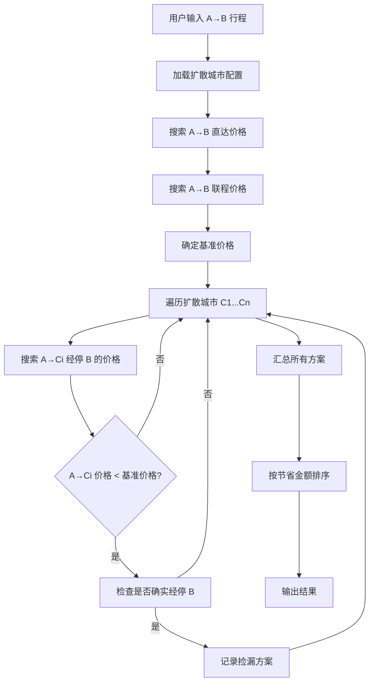

# bargain-flights 捡漏搜索

## 功能说明

捡漏机票（Hidden City Ticketing）是一种机票价格差异现象：有时 A→B→C 的联程票价低于 A→B 的直达票价。

**限制条件**：
- 只支持**单程**，不支持往返
- 只支持一段中转的联程航班（A→B→C，恰好2个航段），不支持多段中转

本工具用于：
- 用户搜索 A→B 单程行程
- 自动扩散搜索 A→C（在B中转一次）的单程联程价格
- 验证航班为恰好2个航段的联程
- 如果 A→C 联程价格更低，推荐捡漏方案

## 使用方法

```bash
# 基本用法
python scripts/bargain_flights.py --origin "北京" --destination "上海" --dep-date "2026-04-10"

# 使用城市代码
python scripts/bargain_flights.py --origin "BJS" --destination "SHA" --dep-date "2026-04-10"

# 设置最低节省阈值
python scripts/bargain_flights.py --origin "北京" --destination "上海" --dep-date "2026-04-10" --min-savings 100

# 手动指定扩散城市
python scripts/bargain_flights.py --origin "北京" --destination "上海" --dep-date "2026-04-10" --expand-cities "广州,深圳,成都"

# 使用自定义配置文件
python scripts/bargain_flights.py --origin "北京" --destination "香港" --dep-date "2026-04-10" --data-file ./my_drop_routes.json
```

## 参数说明

| 参数 | 必填 | 说明 |
|------|------|------|
| `--origin` | 是 | 出发城市（名称或代码） |
| `--destination` | 是 | 目的地城市（名称或代码，即中转城市B） |
| `--dep-date` | 是 | 出发日期 (YYYY-MM-DD) |
| `--min-savings` | 否 | 最低节省金额阈值（元），默认 0 |
| `--expand-cities` | 否 | 手动指定扩散城市（逗号分隔） |
| `--data-file` | 否 | 自定义扩散城市配置文件路径 |

## 搜索逻辑（一段中转）

```
1. 搜索 A→B 直达价格（journey_type=1），作为基准价格
2. 遍历扩散城市 C1...Cn:
   - 搜索 A→Ci 联程（journey_type=2），要求在 B 中转
   - 验证航班恰好为2个航段：A→B 和 B→C
   - 计算节省金额
3. 按节省金额排序输出
```

## 航段验证规则

只接受恰好 2 个航段的**联程中转**航班：
- ✅ 第一航段 A→B（航班号1）+ 第二航段 B→C（航班号2）—— 不同航班号，是真正的联程中转
- ❌ 直达航班（只有1个航段）
- ❌ 多段中转（3个及以上航段）
- ❌ **同一航班号经停**（第一、二航段航班号相同）—— 这是经停航班，不是联程中转，乘客不能在中转站下机

验证方式：
1. 检查航班 `journeys.segments` 长度必须为 2
2. 检查两个航段的 `marketingTransportNo`（航班号）必须不同

## 配置文件格式

扩散城市配置文件 `data/drop_routes.json` 格式：

```json
[
  {"o":"BJS", "d":"HKG", "drop":["TYO","SEL","OSA","BKK","SIN"]},
  {"o":"SHA", "d":"HKG", "drop":["TYO","SEL","OSA","BKK","SIN"]}
]
```

字段说明：
- `o`: 出发城市代码
- `d`: 目的地城市代码
- `drop`: 扩散城市列表（**顺序即为优先级，排在前面的优先尝试**）

## 捡漏风险提示

⚠️ 使用捡漏策略存在以下风险，**输出结果时必须重点提示用户**：

| 风险类型 | 说明 |
|----------|------|
| **行李直挂** | 托运行李将直挂到终点站C，无法在中转站B取出，**建议只携带随身行李** |
| **航司政策** | 频繁捡漏可能被航司列入黑名单，影响后续购票 |
| **航班变动** | 如第一段航班取消或延误，航司可能直接安排到终点站C，无法在B下机 |
| **返程风险** | 如购买往返票，捡漏会导致返程航段自动取消 |
| **会员权益** | 捡漏可能导致里程积分失效或会员等级降级 |

### 国际路线特别提醒

当出发地或目的地涉及境外城市（不含港澳台）时，**必须额外提示**：

| 提醒项 | 说明 |
|--------|------|
| **护照要求** | 国际航线需持有有效护照才能购买 |
| **签证要求** | 需确认目的地国家签证政策，部分国家需要提前办理签证 |

**判断逻辑**：
- 港澳台航线视为国际航线，触发护照/签证提醒
- 一方是国内城市（不含港澳台），另一方是境外城市（含港澳台），则判定为国际航线

### JSON 输出中的 warnings 字段

```json
{
  "data": {
    "is_international": true,
    "options": [...],
    "warnings": [
      "⚠️ 行李直挂：托运行李将直挂到终点站C，无法在中转站B取出，建议只携带随身行李",
      "⚠️ 航司政策：频繁捡漏可能被航司列入黑名单，影响后续购票",
      "⚠️ 航班变动：如第一段航班取消或延误，航司可能直接安排到终点站C，无法在B下机",
      "⚠️ 返程风险：如购买往返票，后半段不乘坐会导致返程航段自动取消",
      "⚠️ 会员权益：捡漏可能导致里程积分失效或会员等级降级",
      "⚠️ 护照要求：国际航线需持有有效护照才能购买",
      "⚠️ 签证要求：需确认目的地国家签证政策，部分国家需要提前办理签证"
    ]
  }
}
```

> `is_international` 字段标识是否为国际航线，国际路线会额外添加护照/签证提醒。

## 输出格式

```json
{
  "status": 0,
  "message": "找到 2 个捡漏方案",
  "data": {
    "origin": "北京",
    "destination": "上海",
    "dep_date": "2026-04-10",
    "base_price": 800,
    "options": [
      {
        "original_route": "北京 → 上海",
        "original_price": 800,
        "hidden_city_route": "北京 → 上海 → 广州",
        "hidden_city_price": 550,
        "drop_city": "广州",
        "savings": 250,
        "savings_percent": 31.2,
        "first_segment": {
          "flight_no": "CA1234",
          "dep_time": "21:00",
          "arr_time": "23:20",
          "note": "乘坐"
        },
        "second_segment": {
          "flight_no": "MU5678",
          "dep_time": "00:30",
          "arr_time": "02:50",
          "note": "不飞（第二段不乘坐）"
        },
        "flight_info": {...}
      }
    ],
    "warnings": [...]
  }
}
```

**排序规则**：结果按捡漏价格（`hidden_city_price`）从低到高排序。

## 展示格式要求

输出时需要**以表格形式**呈现捡漏方案，并用**删除线**标记不飞的航段：

### 表格格式

```markdown
### 原行程: 北京 → 上海
- 直达价格: ¥800

### ✅ 捡漏方案推荐

| 行程 | 价格 | 节省 | 第一航段 | 第二航段 |
|------|------|------|----------|----------|
| 北京→上海→~~广州~~ | ¥550 | ¥250 (31%) | CA1234 21:00-23:20 | ~~MU5678~~ |
| 北京→上海→~~深圳~~ | ¥580 | ¥220 (28%) | MU5432 22:00-00:10 | ~~CZ3456~~ |

[点击预订](链接)
```

### JSON 输出中的 table 字段

```json
{
  "data": {
    "base_price": 800,
    "options": [...],
    "table": [
      {
        "route": "北京→上海→~~广州~~",
        "price": "¥550",
        "savings": "¥250 (31%)",
        "flight1": "CA1234 21:00-23:20",
        "flight2": "~~MU5678~~",
        "jump_url": "https://..."
      }
    ]
  }
}
```

### 风险提示表格

```markdown
## ⚠️ 捡漏风险提示

| 风险 | 说明 |
|------|------|
| **行李直挂** | 托运行李将直挂到终点站C，无法在中转站B取出 |
| **航司政策** | 频繁捡漏可能被航司列入黑名单 |
| **航班变动** | 如第一段航班取消，航司可能直接安排到终点站C |
| **返程风险** | 往返票后半段不乘坐会导致返程航段自动取消 |
| **会员权益** | 可能导致里程积分失效或会员等级降级 |
```

## 城市代码对照表

| 代码 | 城市 | 代码 | 城市 |
|------|------|------|------|
| BJS | 北京 | SHA | 上海 |
| CAN | 广州 | SZX | 深圳 |
| CTU | 成都 | CKG | 重庆 |
| HGH | 杭州 | NKG | 南京 |
| XIY | 西安 | KMG | 昆明 |
| SYX | 三亚 | HAK | 海口 |
| HKG | 香港 | MFM | 澳门 |
| TYO | 东京 | SEL | 首尔 |
| OSA | 大阪 | BKK | 曼谷 |
| SIN | 新加坡 | TPE | 台北 |

## 捡漏风险提示

⚠️ 使用捡漏策略需要注意：

1. **行李直挂问题**：托运行李会到达终点站 C，无法在中转站 B 取出
2. **航司政策风险**：频繁捡漏可能被航司列入黑名单
3. **航班变动风险**：如前段航班取消，后段权益可能失效
4. **仅适用于手提行李**：建议只携带随身行李

## 工作流程

