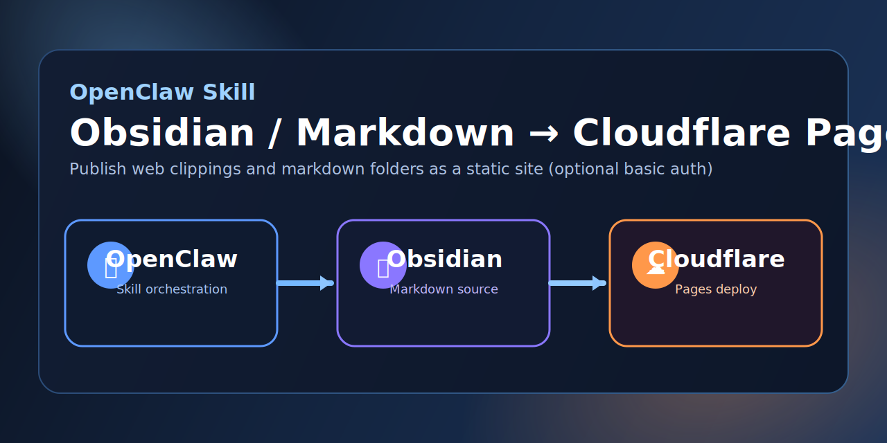

# OpenClaw Skill: Obsidian/Markdown → Cloudflare Pages (YOURDOMAIN.COM)



## Overview

This OpenClaw Skill automates publishing selected Obsidian notes (or any Markdown folder) to a static website on Cloudflare Pages.

It includes:
- Interactive onboarding wizard
- Vault folder sync
- Quartz build + deploy
- Optional Basic Auth protection (config or env-backed)
- Safer execution controls (`--dry-run`, destructive guard)
- Branded index pages
- `🔗 Copy Link` button next to each page title

> Replace `YOURDOMAIN.COM` with your real domain/subdomain (for example, `docs.example.com`).

---

## What’s Included

### 1) CLI workflow (`publishmd-cf.js`)

Commands:

- `init` — create config from example
- `wizard` — interactive setup
- `setup-project` — initialize Quartz workspace if needed
- `doctor` — dependency/env/path checks
- `sync` — copy selected vault folders into Quartz content
- `build` — build static site + post-processing customizations
- `deploy` — deploy to Cloudflare Pages
- `run` — full pipeline (`setup-project -> doctor -> sync -> build -> deploy`)

---

### 2) Config + env support

- Config file:
  - `skills/obsidian-cloudflare-pages/config/config.json`
- Config template:
  - `skills/obsidian-cloudflare-pages/config/config.example.json`
- Local secrets file:
  - `skills/obsidian-cloudflare-pages/.env`
- Env template:
  - `skills/obsidian-cloudflare-pages/.env.example`

The CLI auto-loads skill-local `.env` without overriding already-set shell env vars.

---

### 3) Basic Auth support

Wizard supports:

- `cloudflare.basicAuth.enabled`
- `cloudflare.basicAuth.username`
- `cloudflare.basicAuth.password`

On deploy, middleware is generated automatically at:

- `<workspace>/functions/_middleware.js`

If enabled, site requires HTTP Basic Auth.

---

### 4) UI customizations applied at build

Post-build transformations:

- Promote `/Clippings/index.html` -> `/index.html`
- Brand root and clippings index pages
- Replace top-left sidebar title across pages with:

```text
Obsidian Vault
YOURDOMAIN.COM
```

- Inject `🔗 Copy Link` button next to each page title (`<h1 class="article-title">`) that copies the current URL to clipboard.

---

## Prerequisites

- Node.js (compatible with Quartz 4 requirements)
- `npm`, `npx`
- `rsync`
- `wrangler` CLI
- Cloudflare account with Pages access
- Cloudflare API token + account ID

---

## Quick Start

### 1) Go to workspace

```bash
cd ~/.openclaw/workspace
```

### 2) Initialize config (first run)

```bash
node skills/obsidian-cloudflare-pages/bin/publishmd-cf.js init
```

### 3) Run onboarding wizard

```bash
node skills/obsidian-cloudflare-pages/bin/publishmd-cf.js wizard
```

### 4) Add Cloudflare secrets

```bash
cp skills/obsidian-cloudflare-pages/.env.example skills/obsidian-cloudflare-pages/.env
# then edit .env with real values
```

Required keys:

```env
CLOUDFLARE_API_TOKEN=...
CLOUDFLARE_ACCOUNT_ID=...
```

### 5) Run full pipeline

```bash
node skills/obsidian-cloudflare-pages/bin/publishmd-cf.js run
```

### 6) Safety controls

```bash
# preview actions without mutating files/deploying
node skills/obsidian-cloudflare-pages/bin/publishmd-cf.js run --dry-run

# allow destructive fallback during setup-project only when intentional
ALLOW_DESTRUCTIVE=1 node skills/obsidian-cloudflare-pages/bin/publishmd-cf.js setup-project
```

---

## Cloudflare Pages Domain Setup (YOURDOMAIN.COM)

1. Cloudflare Dashboard -> **Workers & Pages**
2. Open project: `obsidian-cloudflare-pages`
3. Go to **Custom domains**
4. Add `YOURDOMAIN.COM`
5. Confirm DNS record is attached to this Pages project

---

## Suggested Config Example

```json
{
  "source": {
    "vaultPath": "/path/to/your/ObsidianVault",
    "includeFolders": ["Clippings"],
    "excludeFolders": ["Private", "Templates", "Daily", ".obsidian"],
    "requireFrontmatterPublish": false
  },
  "publish": {
    "workspaceDir": "~/projects/your-pages-site",
    "contentDir": "content"
  },
  "site": {
    "generator": "quartz",
    "title": "Obsidian - YOURDOMAIN.COM",
    "baseUrl": "https://YOURDOMAIN.COM/pages",
    "theme": "default",
    "showBacklinks": false
  },
  "cloudflare": {
    "projectName": "obsidian-cloudflare-pages",
    "branch": "main",
    "productionDomain": "YOURDOMAIN.COM",
    "apiTokenEnv": "CLOUDFLARE_API_TOKEN",
    "accountIdEnv": "CLOUDFLARE_ACCOUNT_ID",
    "basicAuth": {
      "enabled": true,
      "username": "YOURUSERID",
      "password": "YOURPASSWORD"
    }
  }
}
```

---

## Security Notes

- Do **not** post API tokens in public channels.
- Rotate compromised tokens immediately.
- `.env` should remain uncommitted.
- Basic auth is intentionally simple and optional.
- Prefer env-backed auth credentials (`BASIC_AUTH_USERNAME` / `BASIC_AUTH_PASSWORD`) over storing passwords in config.
- Do **not** publish highly sensitive content unless you fully understand your security model and hardening choices.
- Use stronger credentials than `YOUR_USER/YOUR_PASS` for production.

---

## Known Warnings (Non-blocking)

Quartz may warn about:
- missing `content/index.md`
- invalid dates in some notes
- LaTeX/unicode parsing warnings

These do not necessarily block deploy, but should be cleaned up over time.
