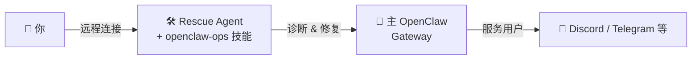

# openclaw-ops

[English](README.md) | [中文](README_CN.md)

一个教 AI Agent 如何运维 [OpenClaw](https://openclaw.ai) Gateway 的技能。

适用于**任何有 shell 访问权限的 Agent** — Claude Code、Codex、OpenClaw、Pi 或任何运行在 OpenClaw Gateway 同一台机器上的 AI Agent。

支持 **Linux (systemd)** 和 **macOS (launchd)**。

## 安装

> **⚠️ 本技能应安装在 Rescue Agent（Claude Code、备用 OpenClaw 等）上，而不是你要维护的主 OpenClaw Gateway 里。**

### 在对话中让 Agent 安装

直接在对话里告诉你的 Rescue Agent：

```
> 从 https://github.com/dinstein/openclaw-ops-skill 安装 openclaw-ops 技能
```

Agent 会自动下载 `SKILL.md` 并放到正确的技能目录。

### 通过 ClawHub（使用第二个 OpenClaw 作为 Rescue Agent 时）

```bash
clawhub install openclaw-ops
```

### 手动安装

将 `SKILL.md` 复制到你的 Agent 技能目录：

```bash
# Claude Code
mkdir -p ~/.claude/skills/openclaw-ops
cp SKILL.md ~/.claude/skills/openclaw-ops/SKILL.md

# OpenClaw
mkdir -p ~/.openclaw/workspace/skills/openclaw-ops
cp SKILL.md ~/.openclaw/workspace/skills/openclaw-ops/SKILL.md

# 其他 Agent — 放到你的 Agent 读取技能文件的目录
```

## 架构



**主 OpenClaw Gateway** — 你的主要 AI Agent 系统，处理日常操作：聊天频道、定时任务、会话等。

**Rescue Agent** — 一个独立的 Agent（Claude Code、备用 OpenClaw 实例或其他有 shell 访问权限的 AI Agent），安装了本技能。和主 Gateway 运行在同一台机器上。它的唯一职责：主 Gateway 出问题时修复它，以及执行运维健康检查。

**本技能** — 教会 Rescue Agent 该跑什么命令、如何解读输出、按什么步骤诊断和修复。

## 两个核心场景

### 🔴 救援：主 Gateway 挂了

主 OpenClaw 崩溃、配置损坏或无法启动。你连接到 Rescue Agent 让它修复。

**示例 1：改了配置后启动不了**
```
你: "我改了 openclaw.json，现在启动不了了"

Rescue Agent: 校验 JSON → 发现第 47 行多了个逗号 →
备份文件 → 修复语法 → 重启 Gateway → 验证健康状态
```

**示例 2：升级后崩溃**
```
你: "升级了 OpenClaw 之后 Gateway 一直崩"

Rescue Agent: 查崩溃日志 → 发现 MODULE_NOT_FOUND，某个插件被移除了 →
重装依赖 → 重启 → 还是挂 →
回滚到上个版本 → Gateway 恢复正常
```

### 🟢 健康检查：主 Gateway 运行中

主 OpenClaw 正常运行，你想确认运行状态、升级或清理。

```
你: "检查一下 OpenClaw 的运行状况"

Rescue Agent: 运行 openclaw doctor → 报告状态、孤立文件数量、
频道连接情况、磁盘使用 → 提供修复建议
```

## 如何远程连接 Rescue Agent

主 OpenClaw 挂了之后，你无法通过 Discord/Telegram 和它对话。你需要其他方式连接服务器上的 Rescue Agent。

### 方案 1：原生远程控制（⭐ 推荐）

如果你的 Agent 支持原生远程访问，优先使用 — 体验最好，浏览器或手机直接操作。

- **Claude Code** — [Remote Control](https://code.claude.com/docs/en/remote-control)：从任何浏览器访问服务器上的 Claude Code，自带认证和会话保持

目前只有 Claude Code 提供此功能。随着更多 Agent 支持原生远程访问，这将成为所有 Agent 的首选方案。

### 方案 2：远程 Agent 管理平台

第三方平台，支持远程管理和操控服务器上的 Agent：

- [Happy](https://github.com/slopus/happy) — Claude Code 和 Codex 的移动端 & Web 客户端，支持推送通知、设备切换和端到端加密
- [Hapi](https://github.com/tiann/hapi) — 本地优先的远程控制，支持 Claude Code / Codex / Gemini / OpenCode，通过 Web、PWA 或 Telegram Mini App 访问
- 类似支持远程 shell Agent 访问的产品

适合 Agent 没有原生远程控制、或者需要统一管理多个 Agent 的场景。

### 方案 3：SSH + Agent CLI

SSH 登录服务器，直接在终端运行 Agent：

```bash
ssh user@your-server
claude  # 或 codex，或任何 Agent CLI
```

**移动端技巧：**
- 使用 SSH 客户端 App（Termius、Blink 等）
- 用 tmux 保持会话：

```bash
# 服务器上（一次性设置）
tmux new -s rescue
claude

# 之后从任何地方
ssh user@your-server
tmux attach -t rescue
```

- VS Code Remote SSH 也很好用（笔记本场景）

## 功能覆盖

| 模块 | 场景 | 说明 |
|------|------|------|
| 崩溃诊断 | 🔴 救援 | 读取日志、定位根因 |
| 配置修复 | 🔴 救援 | JSON 修复、Schema 校验、常见错误 |
| 服务重启 | 🔴 救援 | 修复根因后安全重启 |
| 资源检查 | 🔴 救援 | 磁盘、内存、Node.js、依赖 |
| 健康检查 | 🟢 运维 | `openclaw doctor`、服务状态 |
| 更新升级 | 🟢 运维 | 版本检查、安全升级、回滚 |
| 磁盘清理 | 🟢 运维 | 孤立 transcript、会话管理 |
| 备份 | 🟢 运维 | 配置、agents、workspace 备份 |
| Tailscale 检查 | 🟢 运维 | 反向代理验证 |

## 前置要求

Rescue Agent 需要：

- **Shell 访问权限** — 与 OpenClaw Gateway 在同一台机器上
- **读写权限** — `~/.openclaw/` 目录（配置、agents、sessions）
- **Node.js 18+** 和 npm（用于 `openclaw` CLI）
- **可选：** Tailscale CLI（反向代理排查）

### 安全说明

本技能会指导 Agent：
- 读取和修改 OpenClaw 配置文件（修改前必定备份）
- 访问包含 token 的 env 文件（但**绝不打印内容**）
- 重启系统服务（systemd / launchd）
- 删除旧的 session transcript（需用户确认）

所有破坏性操作都需要用户明确批准。

## 工作原理

这是一个**纯文档技能** — 无脚本、无外部依赖、无框架绑定。安装到任何能读取 Markdown 并执行 shell 命令的 Agent 中即可。它教会 Agent：

1. **检查什么** — 每种场景对应的正确命令
2. **如何解读** — 输出含义和常见错误模式
3. **怎么修复** — 带安全护栏的逐步修复流程
4. **如何验证** — 每个操作后的确认步骤

## 安全规则

- 修改前必须先查日志
- 编辑配置前必须备份
- 编辑后必须校验 JSON
- 不打印敏感信息（env 文件）
- 不删除 workspace 文件，除非用户确认
- 重启后必须验证服务状态

## 许可证

MIT
