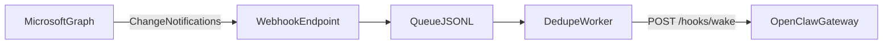

# Architecture

## Core idea

Push-based Microsoft Graph for OpenClaw:
- detect change by webhook event, not by recurring polling loops
- wake the agent only when work actually happens

## Event flow

## Component roles

- **Microsoft Graph**
  - emits change notifications for subscribed mail resources
- **Webhook endpoint (`mail_webhook_adapter.py`)**
  - validates path and handshake (`validationToken`)
  - validates `clientState`
  - enqueues compact events for async processing
- **Queue (`mail_webhook_queue.jsonl`)**
  - durable local handoff between adapter and worker
- **Dedupe worker (`mail_webhook_worker.py`)**
  - prevents duplicate processing
  - emits wake signal to OpenClaw (`/hooks/wake`) by default
- **OpenClaw hooks**
  - receives authenticated wake trigger
  - schedules/executes follow-up processing in the main session

## Why this architecture

- Removes recurring LLM wake-ups used only for inbox detection
- Preserves auditability with structured local operation logs
- Fits self-hosted production environments (EC2/systemd/Caddy)
