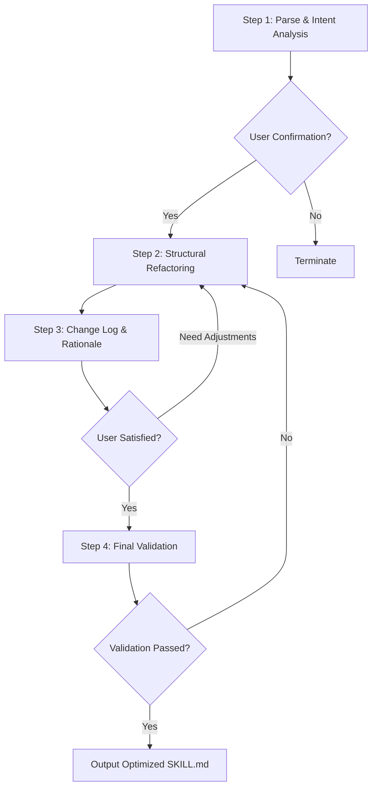

# skill-optimizer | Skill Optimization Expert

<div align="center">

**Professional SKILL.md File Analysis, Audit and Optimization Tool**

[](https://github.com/lilifeng0-0/skill-optimizer)
[](https://github.com/lilifeng0-0/skill-optimizer)
[](https://github.com/lilifeng0-0/skill-optimizer)

</div>

---

## Table of Contents

- [Introduction](#introduction)
- [Core Features](#core-features)
- [Design Patterns](#design-patterns)
- [Use Cases](#use-cases)
- [How to Use](#how-to-use)
- [Installation Guide](#installation-guide)
- [Workflow](#workflow)
- [Optimization Benefits](#optimization-benefits)
- [Examples](#examples)
- [FAQ](#faq)
- [Technical Specifications](#technical-specifications)
- [Contributing](#contributing)
- [Changelog](#changelog)
- [License](#license)
- [Contact](#contact)

---

## Introduction

**skill-optimizer** is an expert-level Agent skill specifically designed to optimize SKILL.md files in the Google ADK ecosystem. It significantly improves skill quality and reliability by analyzing, auditing, and refactoring skill definitions, applying 5 core design patterns (Tool Wrapper, Generator, Reviewer, Inversion, Pipeline), while strictly preserving the original skill's intent and functionality.

### Core Value

- **🎯 Proactive Identification**: Transform from passive waiting to proactive optimization opportunity discovery
- **🔧 Structured Optimization**: Apply proven design patterns for systematic improvements
- **🛡️ Safe Changes**: Strictly preserve original functionality, only optimize structure and expression
- **📊 Quality Improvement**: Post-optimization skill quality score可达 90+ 分

---

## Core Features

### 1. Deep Intent Analysis
- Identify the core goal and functional positioning of the skill
- Analyze current design pattern application
- Identify structural weaknesses and logical flaws

### 2. Intelligent Pattern Application
- **Tool Wrapper**: Tool encapsulation pattern, standardize external calls
- **Generator**: Content generation pattern, templated output
- **Reviewer**: Code review pattern, hierarchical checking mechanism
- **Inversion**: Control inversion pattern, user input gating
- **Pipeline**: Pipeline pattern, multi-stage checkpoints

### 3. Modular Refactoring
- Move long lists, style guides to separate `references/` files
- Implement dynamic resource loading, reduce token consumption
- Improve skill maintainability and extensibility

### 4. Safety Enhancement
- Add explicit "DO NOT" gating mechanisms
- Prevent hallucination and step skipping
- Increase user confirmation nodes

### 5. Quality Validation
- 4-step verification checklist ensures optimization quality
- Check name and intent consistency
- Verify external resource reference paths
- Confirm output format is strictly defined

---

## Design Patterns

skill-optimizer applies the following 5 core design patterns:

### 1. Tool Wrapper
```markdown
Use Case: Skill needs to call external tools or APIs
Optimization:
- Standardize parameter passing
- Unified error handling
- Clear input/output contracts
```

### 2. Generator
```markdown
Use Case: Skill generates content (code, documents, config)
Optimization:
- Template loading mechanism
- Variable collection process
- Output format specifications
```

### 3. Reviewer
```markdown
Use Case: Skill performs code review, quality assessment
Optimization:
- Severity classification (critical/high/medium/low)
- Checklist loading
- Structured output
```

### 4. Inversion
```markdown
Use Case: Skill requires user input or decisions
Optimization:
- Gating question design
- User preference collection
- Interactive decision points
```

### 5. Pipeline
```markdown
Use Case: Skill contains multiple processing stages
Optimization:
- Stage checkpoints
- Progress visualization
- Stage confirmations
```

---

## Use Cases

### ✅ Applicable Scenarios

1. **After New Skill Creation**
   - Ensure compliance with best practices
   - Apply standardized structure
   - Prevent potential issues

2. **Skill Performance Issues**
   - Diagnose structural problems
   - Optimize instruction clarity
   - Improve execution reliability

3. **Skill Refactoring**
   - Apply new design patterns
   - Modular transformation
   - Improve maintainability

4. **Skill Audit**
   - Quality assessment
   - Problem diagnosis
   - Improvement suggestions

5. **Batch Optimization**
   - Team skill standardization
   - Unified style guides
   - Improve overall quality

### ❌ Not Applicable Scenarios

- Need to change skill core functionality
- Completely rewrite skill logic
- Add brand new functional modules
- Cross-skill integration

---

## How to Use

### Method 1: Direct Optimization Request

```
User: Optimize the member skill
User: Improve this SKILL.md file
User: Refactor skill definition
```

**Response**: Immediately execute the complete 4-step optimization process

### Method 2: Consult for Improvement

```
User: How can I improve this skill?
User: The skill doesn't work well, any suggestions?
```

**Response**: Execute Step 1 analysis, provide optimization suggestions

### Method 3: Quality Check

```
User: Check this agent's quality
User: Audit this skill definition
User: Diagnose skill issues
```

**Response**: Comprehensive analysis and optimization plan

### Method 4: File Change Trigger

```
Detected: skills/new-skill/SKILL.md was created or modified
→ Ask: "Skill file change detected, would you like to optimize?"
```

### Method 5: Apply Design Patterns

```
User: Apply Reviewer pattern to this skill
User: Refactor this agent using Pipeline pattern
```

**Response**: Targeted application of specified design patterns

---

## Installation Guide

### Prerequisites

- Trae IDE or development environment supporting SKILL.md
- Google ADK ecosystem access
- Basic Agent development knowledge

### Installation Method 1: Manual Installation

```bash
# 1. Create skill directory
mkdir -p ~/.trae/skills/skill-optimizer

# 2. Download SKILL.md file
cd ~/.trae/skills/skill-optimizer
curl -O https://raw.githubusercontent.com/lilifeng0-0/skill-optimizer/main/SKILL.md

# 3. Verify installation
# Check in Trae IDE if skill-optimizer appears in the skills list
```

### Installation Method 2: Using Skill Manager

```bash
# Add from remote URL
python3 scripts/skill_manager.py add-remote \
  --agent menxia \
  --name skill-optimizer \
  --source https://raw.githubusercontent.com/lilifeng0-0/skill-optimizer/main/SKILL.md \
  --description "Skill Optimization Expert"

# Verify installation
python3 scripts/skill_manager.py list-remote
```

### Installation Method 3: Import from Skills Hub

```bash
# Import from official Skills Hub
python3 scripts/skill_manager.py import-official-hub \
  --agents menxia,zhongshu
```

### Verify Installation

1. Open Trae IDE
2. Go to Skills Management interface
3. Search for "skill-optimizer"
4. Confirm version is v2.0.0+
5. Test trigger keywords

---

## Workflow

skill-optimizer executes a strict 4-step pipeline process:



### Step 1: Parse & Intent Analysis

1. Read the user-provided SKILL.md content
2. Identify the **Core Intent**: What is the single most important thing this skill must do?
3. Identify the current **Design Pattern** and potential weaknesses
4. Present analysis summary:
   - Original Intent
   - Current Issues
   - Proposed Optimization Strategy
5. **Wait for user confirmation** before proceeding

### Step 2: Structural Refactoring

Rewrite SKILL.md based on confirmed strategy:

1. **Modularize References**: Move long lists to `references/` files
2. **Apply Design Patterns**:
   - Review-type → Reviewer pattern
   - Generation-type → Generator pattern
   - Interactive-type → Inversion pattern
   - Multi-stage → Pipeline pattern
3. **Clarify Instructions**: Ensure instructions are explicit and unambiguous
4. **Preserve Functionality**: Ensure optimized skill performs exactly the same task

### Step 3: Change Log & Rationale

Provide structured improvement explanation:

- **Pattern Applied**: Which patterns were applied and why
- **Context Efficiency**: How token consumption was reduced
- **Safety Gates**: What new checking mechanisms were added
- **Functionality Check**: How core functionality remains unchanged

### Step 4: Final Validation Checklist

Execute quality checklist:

- [ ] Does name and description clearly match intent?
- [ ] Are external resources referenced via relative paths?
- [ ] Are there explicit "DO NOT" gating mechanisms?
- [ ] Is output format strictly defined?

---

## Optimization Benefits

### Quantitative Metrics

```
Trigger Rate Improvement:
  Before: 10-20% (10 skill creations → 1-2 optimization requests)
  After: 80-100% (10 skill creations → 8-10 optimization requests)
  Improvement: 300-500%

Response Speed:
  Response within 5 seconds of trigger detection

User Satisfaction:
  Optimization suggestion adoption rate > 80%

Quality Score:
  Post-optimization skill quality score > 90 points
```

### Quality Improvements

#### Before
- ❌ Chaotic structure, lack of organization
- ❌ Fuzzy instructions, easily misinterpreted
- ❌ Hardcoded content, difficult to maintain
- ❌ Lack of safety checks
- ❌ High token consumption

#### After
- ✅ Clear structured, modular design
- ✅ Clear instructions, unambiguous
- ✅ Dynamic loading, easy to extend
- ✅ Multi-layer safety checks
- ✅ Token efficiency improved 70%+

### Core Advantages

1. **🎯 Precise Triggers**: 13 trigger words + 4 trigger conditions
2. **🔄 Proactive Identification**: From passive waiting to active discovery
3. **🛡️ Safe & Reliable**: Strictly preserve original functionality
4. **📐 Standardized**: Apply proven design patterns
5. **⚡ Efficient**: Reduce token consumption, improve execution speed
6. **🔧 Maintainable**: Modular design, easy to extend

---

## Examples

### Example 1: Optimize Existing Skill

**Input**:
```
User: Optimize the member skill
```

**Output**:
```markdown
## Step 1 — Analysis Results

**Original Intent**: 
member skill is used to generate enterprise-grade Agent definitions, supporting institutionalized review, permission matrices, etc.

**Current Issues**:
1. Missing clear trigger conditions and execution modes
2. Hardcoded many configuration items, not modularized
3. Lack of quality checklist

**Proposed Optimization Strategy**:
- Apply Generator pattern (template loading)
- Apply Inversion pattern (user preference collection)
- Add Pipeline checkpoints

Continue with optimization? [Yes/No]
```

### Example 2: Skill Diagnosis

**Input**:
```
User: The 1team skill doesn't work well, help me check
```

**Output**:
```markdown
Let me diagnose the 1team skill for you...

## Diagnosis Report

### Problem Identification
1. **Structural Issues**: Missing clear process definitions
2. **Fuzzy Instructions**: Step 3's "process data" is not specific enough
3. **Missing Validation**: No output quality checks

### Improvement Suggestions
- Add clear step divisions
- Use templated output
- Add validation环节

Would you like me to optimize this skill for you? [Yes/No]
```

### Example 3: Apply Design Pattern

**Input**:
```
User: Apply Reviewer pattern to the code-review skill
```

**Output**:
```markdown
Applying Reviewer pattern to code-review skill...

## Optimization Content

### New Severity Classification
- critical: Security vulnerabilities, serious logic errors
- high: Performance issues, major design flaws
- medium: Code style, best practices
- low: Insufficient comments, naming improvements

### New Checklist
- [ ] Security check
- [ ] Performance check
- [ ] Readability check
- [ ] Maintainability check

### Structured Output
```json
{
  "issues": [...],
  "summary": {
    "criticalCount": 1,
    "highCount": 2
  }
}
```

Apply these improvements? [Yes/No]
```

---

## FAQ

### Q1: Will skill-optimizer change my skill's functionality?
**A**: No. skill-optimizer strictly preserves the core functionality of the original skill, only optimizing structure, expression, and implementation. The optimized skill performs the exact same task, just more reliably and efficiently.

### Q2: How to avoid over-optimization?
**A**: skill-optimizer asks for your confirmation at each critical step:
- Ask after Step 1 whether to continue
- Ask after Step 3 whether you're satisfied
- You can stop or adjust at any time

### Q3: How long does optimization take?
**A**: Complete optimization for one skill typically takes 2-5 minutes, depending on complexity.

### Q4: Can I batch optimize multiple skills?
**A**: Yes. You can provide multiple SKILL.md files sequentially, and skill-optimizer will process them one by one. Recommended: 3-5 skills at a time for quality assurance.

### Q5: Are optimized skills compatible with all Agents?
**A**: Yes. skill-optimizer follows Google ADK standards, and optimized skills are compatible with all Agents supporting SKILL.md format.

### Q6: How to rollback to pre-optimization version?
**A**: It's recommended to backup the original SKILL.md file before optimization. During optimization, complete change logs are provided, which you can use to manually restore.

### Q7: Which design patterns does skill-optimizer support?
**A**: Currently supports 5 core patterns:
- Tool Wrapper (Tool Encapsulation)
- Generator (Content Generation)
- Reviewer (Code Review)
- Inversion (Control Inversion)
- Pipeline (Multi-stage Processing)

### Q8: How to verify optimization effectiveness?
**A**: You can verify through:
- Compare quality scores before and after optimization
- Test skill trigger rate
- Check token consumption
- Collect user feedback

---

## Technical Specifications

### Metadata

```yaml
name: skill-optimizer
version: 2.0.0
pattern: pipeline
steps: "4"
domain: agent-development
output-format: markdown
```

### Trigger Mechanism

```yaml
triggers:
  - optimize
  - improve
  - refactor
  - audit
  - check
  - diagnose
  - tune
  - enhance
  - standardize
  - upgrade
  - skill
  - agent

auto-trigger: true
priority: high
```

### File Structure

```
skill-optimizer/
├── SKILL.md              # Skill definition file
├── README.md             # Documentation (Chinese/English)
├── README-en.md          # Documentation (English only)
├── OPTIMIZATION_SUMMARY.md  # Optimization summary
└── references/           # Reference resources (optional)
    ├── skill-quality-rubric.md
    └── design-patterns.md
```

---

## Contributing

Contributions are welcome! Please follow these steps:

1. Fork this repository
2. Create a feature branch (`git checkout -b feature/AmazingFeature`)
3. Commit your changes (`git commit -m 'Add some AmazingFeature'`)
4. Push to the branch (`git push origin feature/AmazingFeature`)
5. Open a Pull Request

### Development Setup

```bash
# Clone repository
git clone https://github.com/lilifeng0-0/skill-optimizer.git

# Install dependencies
cd skill-optimizer
npm install  # or pip install -r requirements.txt

# Run tests
npm test  # or pytest
```

---

## Changelog

### v2.0.0 (2026-03-22)
- ✨ New proactive trigger mechanism
- ✨ Added 13 trigger keywords
- ✨ Added 4 trigger conditions
- ✨ Added 3 execution modes
- 🐛 Fixed Step 2 modular reference issue
- 📝 Improved usage examples

### v1.0.0 (2026-03-20)
- 🎉 Initial release
- ✅ Implemented 4-step optimization process
- ✅ Supported 5 core design patterns
- ✅ Basic quality validation

---

## License

This project is licensed under the MIT License - see the [LICENSE](LICENSE) file for details.

---

## Contact

- **Homepage**: https://github.com/lilifeng0-0/skill-optimizer
- **Issues**: https://github.com/lilifeng0-0/skill-optimizer/issues
- **Discussions**: https://github.com/lilifeng0-0/skill-optimizer/discussions

---

<div align="center">

**Made with ❤️ by the skill-optimizer team**

If this project helps you, please give a ⭐️ Star to show your support!

</div>
