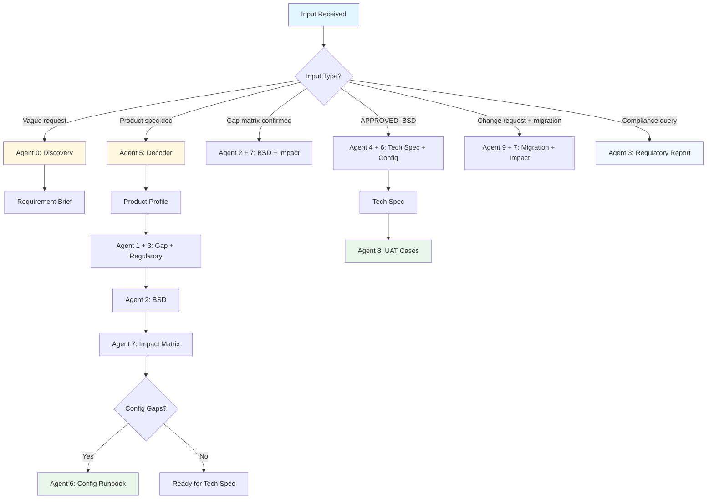

# InsureMO BA Suite v4.8

## Purpose
Full delivery chain from client requirement discovery to developer-ready Tech Spec. Covers InsureMO product BA workflows: Gap Analysis, BSD, Regulatory Compliance, Tech Spec, Config, UAT, Data Migration.

## Version History
| Version | Date | Changes |
|---------|------|---------|
| 4.9.0 | 2026-04-08 | KB知识库全面更新：ps-new-business/cs/claims/fund/renew/loan/annuity/bonus/billing从Gemini V3 UG PDF提取补充；新建ps-reinsurance.md填补RI模块缺失；kb-manifest.md更新至v1.3 |
| 4.8.0 | 2026-04-07 | AGENTS.md stripped of system-level content; Decision Tree consolidated; bsd-writing deprecated |
| 4.7.0 | 2026-04-03 | Agent 2 v2.0 KB reading enforcement; Agent 1 v3.1 expanded 12 modules |
| 4.5.0 | 2026-04-03 | Agent 9 v3.0 Migration Risk Scoring Model; Agent 7 v2.0 Ripple Propagation Map |
| 4.1.0 | 2026-04-03 | Agent 3 v2.0 HKIA added; Pattern Library |
| 4.0.0 | 2026-04-03 | BSD v9.0 finalized; Semantic Override formalized |

Full history: see SKILL.md history files.

---

## Entry Point — 30-Second Decision Tree

Use this to quickly identify which Agent to invoke. For complete routing rules, see **AGENTS.md § Insurance BA Input Routing**.

```
START: What are you working on?
?
├─ "I have a vague idea / client wants X"
?  └─ → Agent 0 (Discovery)
?
├─ "I have a product spec / term sheet / actuarial document"
?  └─ → Agent 5 (Product Decoder) → then Agent 1
?
├─ "I have confirmed gaps / a gap matrix"
?  └─ → Agent 2 (BSD) + Agent 7 (Impact) in parallel
?
├─ "I have an approved BSD ready for development"
?  └─ → Agent 4 (Tech Spec) + Agent 6 (Config) in parallel
?
├─ "I have a completed Tech Spec"
?  └─ → Agent 8 (UAT)
?
├─ "I need to check MAS/BNM/OJK/OIC/HKIA/OID compliance"
?  └─ → Agent 3 (Regulatory)
?
├─ "I need to configure something in InsureMO"
?  └─ → Agent 6 (Config)
?
├─ "I have a change request with data migration"
?  └─ → Agent 9 (Data Migration) + Agent 7 (Impact) in parallel
?
└─ "I'm not sure / it's complicated"
    └─ → Start with Agent 0 (Discovery)
```

> **Tip:** When in doubt, start with Agent 0. Spend 5 minutes clarifying scope rather than building the wrong thing.

**Complete routing (all INPUT_TYPEs):** See `AGENTS.md § Insurance BA Input Routing`.

---

## File Structure

```
insuremo-ba-suite/
├── SKILL.md                              # This file — entry point
├── AGENTS.md                             # Routing, workflow chain, hand-off (v4.8 — authoritative)
├── SETUP_GUIDE.md                        # Installation guide
│
├── agents/                               # Agent 0-9 definitions
│   ├── agent0-discovery.md
│   ├── agent1-gap.md
│   ├── agent2-bsd.md                    # BSD v9.0 writing (authoritative — bsd-writing deprecated)
│   ├── agent3-regulatory.md
│   ├── agent4-techspec.md
│   ├── agent5-decoder.md
│   ├── agent6-product-factory-configurator.md
│   ├── agent7-cross-module-impact-analyzer.md
│   ├── agent8-uat-generator.md
│   └── agent9-data-migration.md
│
├── contracts/
│   └── input-contract.md                 # INPUT_TYPE schema definitions
│
└── references/
    ├── InsureMO Knowledge/              # ps-* KB (17 files)
    ├── InsureMO V3 User Guide/           # V3 UG (22 files, 700KB+)
    ├── output-templates.md               # BSD v9.0 templates
    ├── bsd-patterns.md                  # BSD writing patterns
    ├── bsd-quality-gate.md              # BSD linter reference
    ├── gap-description-patterns.md
    ├── insuremo-gap-detection-rules.md
    ├── KB_USAGE_GUIDE.md
    ├── case-index.md
    ├── unknown-register.md               # UNKNOWN Register template
    ├── delivery-traceability.md          # Master traceability table
    ├── regulatory-report-template.md
    ├── sea-regulatory.md
    ├── reg-mas.md / reg-bnm.md / reg-hkia.md / reg-oid.md / reg-ojk.md / reg-sea-common.md
    └── afrexai-benchmarks.md / spec-miner-ears-format.md
```

---

## Knowledge Base Quick Reference

| Task | Use File | Purpose |
|------|----------|---------|
| OOTB判断 | `references/InsureMO Knowledge/insuremo-ootb.md` | 基础能力参考 |
| 所有产品（必读） | `ps-new-business.md` + `ps-underwriting.md` + `ps-customer-service.md` + `ps-claims.md` + `ps-billing-collection-payment.md` + `ps-renew.md` + `ps-fund-administration.md` | NB/核保/客服/理赔/收费/续保/基金行政 |
| VUL/ILP（加读） | `ps-product-factory.md` + `ps-investment.md` | 产品工厂 + 投资模块 |
| 涉及红利 | `ps-bonus-allocate.md` | 红利分配 |
| 涉及贷款 | `ps-loan-deposit.md` | 贷款/存款 |
| 涉及年金 | `ps-annuity.md` | 年金给付 |
| SG监管 | `reg-mas.md` | Singapore合规 |
| MY监管 | `reg-bnm.md` | Malaysia合规 |
| HK监管 | `reg-hkia.md` | Hong Kong合规 |
| VN监管 | `reg-oid.md` | Vietnam合规 |
| ID监管 | `reg-ojk.md` | Indonesia合规 |

> **Note:** 保险产品几乎涉及所有模块。产品类型决定的是模块**优先级**，不是加载范围。ILP/VUL 只比传统产品多 investment 模块。


---

## Core Constraints (C01–C14)

> These are the non-negotiable rules for all Agents. See AGENTS.md for workflow chain and routing.

### C01 — BSD v9.0 Format (Mandatory)
Apply Patterns 1–7 from `output-templates.md`. Pattern 4 requires dual expression (Step 1 business sentence + Step 2 precise formula). Pattern 7 requires ≥2 boundary scenarios per formula rule. Use `<br>` for line breaks. Every numeric constant must annotate its source.

### C02 — ps-* KB as Mandatory Reference
For every OOTB/Config/NEW/UNKNOWN classification, ps-* KB is the mandatory evidence. Never invent Config Paths without KB basis. **Semantic Override:** when ps-* contradicts OOTB claim, defer to semantic analysis.

### C03 — Preconditions/Normal Flow Self-Contained
No generic references like "per X module" or "refer to Y" — each step must contain all necessary conditions and actions directly. UNKNOWN → `unknown-register.md`.

### C04 — No Ambiguity Markers
"etc.", "as applicable", "TBD" banned → move to UNKNOWN Register.

### C05 — Rule Number Format
`BSD_[ProjectCode]_[GapNumber]_SR[NN]`. Example: `BSD_PS3_036_SR01`

### C06 — Pattern 7 Example Table
Every formula rule needs ≥2 boundary scenarios.

### C07 — Error Codes Inline
Error codes written in rule body, not only in Appendix.

### C08 — Open Questions Blocker
Agent 4 (Tech Spec) blocked if open_questions is non-empty.

### C09 — Agent 7 Before Scope Confirmed
Impact analysis runs before project scope is confirmed.

### C10 — Tech Spec Traceability
Every Tech Spec item traces to BSD Rule Number.

### C11 — Decimal Only for Financial Calculations
Non-financial: use whole numbers.

### C12 — Assumption Register (All Fields Mandatory)
Required fields: `If wrong → impact`, `Verification`, `Impact if wrong`, `Source`, `Status`. **High-impact + Status=Pending = automatic Tech Spec blocker.** See AGENTS.md for full template.

### C13 — R10 Cross-System Semantic Scan (Agent 1)
Scan every feature against R10 keywords before OOTB lookup. See `references/insuremo-gap-detection-rules.md`.

### C14 — UNKNOWN Register (All Agents)
Every uncertain item must be registered. Canonical template: `references/unknown-register.md`. No silent assumptions.

---

## Output Standards by Document Type

### BSD Required Sections (Agent 2)
1. Executive Summary
2. Stakeholder Map
3. As-Is vs To-Be
4. User Stories
5. Business Rules (BSD language, Patterns 1–7)
6. Field Description Table (10 columns)
7. Acceptance Criteria
8. Assumption Register
9. Out of Scope / Backlog
10. Open Questions
11. UNKNOWN Register (if applicable)

Appendices: A (Error Messages), B (Formula Reference)

### Tech Spec Required Steps (Agent 4)
1. Requirement Traceability
2. Variable Registry
3. Formula Definition
4. Python Verification (exec)
5. API Schema
6. UI Trigger Specification
7. Test Matrix
8. Developer Checklist

### UAT Test Scenarios (Agent 8)
1. Positive tests (normal flow)
2. Negative tests (rule violation)
3. Boundary tests (edge conditions)
4. INVARIANT verification

### Data Migration Requirements (Agent 9)
1. Field mapping rules
2. Data cleansing rules
3. Validation criteria
4. Migration gaps

---

## Quality Gates

| Document | Gate | Threshold |
|----------|------|-----------|
| BSD | BSD Self-Quality Gate (GATE-A: Q01–Q09, Q14, Q17) | P0 = must pass |
| Gap Matrix | All items classified or UNKNOWN | 100% |
| Tech Spec | Python exec validation | All pass |
| Impact Matrix | 12 modules evaluated (Agent 7) | 100% |
| UNKNOWN Register | Impact severity rated | 100% |

> **bsd-rule-linter:** Conceptual quality tool (see `references/bsd-quality-gate.md`). Until CI implementation is available, substitute with the BSD Self-Quality Gate checklist in `agent2-bsd.md`.

---

## Document Trigger Table

| Output | Trigger Signal | Agent | Template |
|--------|--------------|-------|---------|
| Product Profile | Product spec PDF, term sheet | Agent 5 | — |
| Gap Matrix | Product Profile ready | Agent 1 | — |
| Regulatory Report | Any product/requirement | Agent 3 | `references/regulatory-report-template.md` |
| BSD | Gap confirmed | Agent 2 | `references/output-templates.md` |
| Impact Matrix | BSD ready | Agent 7 | — |
| Config Runbook | Config gaps identified | Agent 6 | — |
| Tech Spec | BSD approved | Agent 4 | — |
| UAT Test Cases | Tech Spec ready | Agent 8 | — |
| Data Migration Req | Legacy system mentioned | Agent 9 | — |

---

## Unified Workflow Map



---

## Rules

- Never output formulas or Tech Spec before requirements confirmed
- Never write BSD Business Rules without Rule Numbers
- Never deliver BSD with Outstanding Auto-Lint failures
- When exec validation fails, stop and fix — never skip (Agent 4 only)
- Never enter Tech Spec stage when open_questions is non-empty
- Never commit to project scope without Agent 7 Impact Matrix
- Never leave UNKNOWN unclassified — use `unknown-register.md`
- Never recommend or invoke external tools not defined in this skill

---

## Maintenance

| Task | Frequency | Action |
|------|-----------|--------|
| Update sea-regulatory.md | Every 6 months | Re-check sources via web_search |
| Update insuremo-ootb.md | On each InsureMO version upgrade | Re-verify OOTB capability list |
| Version bump SKILL.md + AGENTS.md | On any structural change | Sync both files |
| Review description field | If trigger accuracy drops | Add/adjust keyword phrases |
| Clean backup files | Quarterly | Remove old versions from `agents/backup/` and `references/backup/` |

---

## Troubleshooting

- **Routing wrong?** → Check INPUT_TYPE definitions in `AGENTS.md § Insurance BA Input Routing`
- **Cannot classify gap?** → Use `unknown-register.md` template
- **BSD format wrong?** → Reference `agent2-bsd.md` + `references/output-templates.md`
- **exec validation fails?** → Check Python syntax in formula definition (Agent 4 only)

---

> **bsd-writing deprecated (v4.8):** The `bsd-writing` skill is deprecated. All BSD writing guidance is now authoritative in `agent2-bsd.md`, `references/output-templates.md`, and `references/bsd-patterns.md`.
