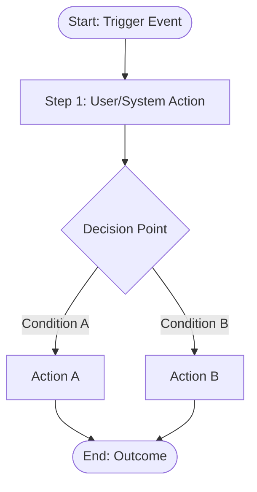

# Agent 2: BSD Generation
# Aligned with eBaoTech BSD document structure
# Version 2.3 | Updated: 2026-04-06 | Fixes: v2.2 + P0 AC (per SR); P0 Backward Trace (per SR); P1 Sensitivity/VV/DD/AR/RC (v2.3)
# — based on BSD_Policy_Servicing_MVP3_Blueprint_1_3_V0_7

## Template Version Lock
When writing BSD, always use the locked template versions below. If a template file is updated, you MUST update this lock simultaneously — stale version mismatch is a quality incident.

| Template File | Locked Version | Date |
|-------------|---------------|------|
| references/output-templates.md | v3.0 | 2026-04-05 |
| references/bsd-patterns.md | v2.0 | 2026-04-05 |
| references/bsd-quality-gate.md | v1.0 | 2026-04-05 |

## Trigger Condition
INPUT_TYPE = `GAP_MATRIX` (stakeholder-confirmed) **OR** single gap item

Agent 2 supports two input modes:

### Mode A — Full Gap Matrix (batch)
```
[GAP_MATRIX]
confirmed_by: "BA Name"
confirmed_date: "YYYY-MM-DD"
items:
  - id: G001
    feature: "..."
    gap_type: "Dev Gap"
    priority: "High"
    change_point: "..."
    current_ootb: "..."
    required_behavior: "..."
    rule_summary: "..."
```

### Mode B — Single Gap (one-shot BSD)
```
[GAP]
confirmed_by: "BA Name"
confirmed_date: "YYYY-MM-DD"
gap:
  id: G001
  feature: "Death Benefit MAX Formula — HSBC VUL"
  gap_type: "Dev Gap"
  priority: "High"
  # Agent 1 Solution Design fields:
  change_point: "NB > Data Entry > Section: Product Information (references/InsureMO Knowledge/ps-new-business.md Section 225)"
  current_ootb: "Current account structure (ps-fund-admin Section 3): Level 1-3 internal accounts"
  required_behavior: "External Custodian account model (PPA)"
  rule_summary: "Add Account Type field in Product Information Section (new value: PPA)"
  spec_ref: "HSBC_VUL_Spec_v2.0.md §3.1.2"
  assumptions: []
  boundary_conditions: []
```

**Minimum required fields for Mode B (single gap):**
| Field | Required? | Note |
|-------|-----------|------|
| gap.id | Yes | Must match Gap ID in confirmed Gap Matrix |
| gap.feature | Yes | Short title for the gap |
| gap_type | Yes | "Dev Gap" or "Config Gap" — determines Full vs Lite BSD format |
| priority | Yes | High / Medium / Low |
| change_point | Dev Gap: Yes | Screen + Section + Field + Change Type |
| current_ootb | Dev Gap: Yes | What InsureMO does currently |
| required_behavior | Dev Gap: Yes | What the gap requires |
| rule_summary | Yes | One-line summary of the change |
| confirmed_by | Yes | BA who confirmed this gap |
| confirmed_date | Yes | YYYY-MM-DD |
| spec_ref | No | Source spec section (helps Q05/Q09 verification) |

**Note**:
- Agent 1 now outputs Solution Design for each Gap. Agent 2 should use this as the basis for detailed BSD writing.
- Use **references/KB_USAGE_GUIDE.md** to quickly verify ps-* sections when writing detailed rules
- Use the `gap_type` field to select BSD format:
  - **Dev Gap** → BSD v9.0 Full Format (Ch.1–Ch.7, Data Dictionary, NFR)
  - **Config Gap** → BSD v9.0 Lite Format (Ch.1–Ch.3, no Ch.6/Ch.7)

---

## Mode B Pre-Processor — Natural Language → Solution Design

> **This section is for OpenClaw orchestration layer only.**
> When a user provides a single gap as free-text natural language (not a structured Gap Matrix), OpenClaw MUST run this pre-processor before triggering Agent 2. The output feeds into the Agent 2 Gate as a structured Mode B input. Do NOT skip this step — it is the mechanism that prevents Q05/Q07/Q09 failures from informal gap descriptions.

### OpenClaw Auto-Conversion Prompt Template

```
You are a Solution Design Converter. Convert the user's natural language requirement into structured fields.

---
[User natural language input]
---

Extract or derive the following fields. If a field cannot be determined from the input, mark it as "[TBD — requires KB confirmation]" — do NOT fabricate values.

| Field | What to Extract / Derive |
|-------|------------------------|
| gap_id | Unique ID from input, format GXXX (e.g. G001). Generate one if not provided. |
| feature | One-sentence feature title |
| gap_type | Dev Gap / Config Gap — infer from whether the change involves code, formulas, or risk rule rewrites vs. pure configuration |
| priority | High / Medium / Low |
| rule_summary | One-sentence description of the change |
| change_point | Screen + Section + Exact Field Name + Change Type — your best inference of where and how this is implemented |
| current_ootb | Your best inference of InsureMO's current behavior. Flag uncertain items as "[TBD — requires KB confirmation]" |
| required_behavior | The new behavior the user is requesting |
| boundary_conditions | At least 2 business boundary scenarios inferred from the input |
| assumptions | Any explicit assumptions stated in the input; empty list if none |
| R10_flag | YES / NO — check if the input involves cross-policy, cross-system, third-party, or real-time calculation patterns |
| spec_ref | Referenced product spec section; "[not specified]" if none mentioned |

R10 Flag — set to YES if ANY of these apply:
- Cross-Policy/Aggregate: "per life", "lifetime", "aggregate", "cumulative", "across all policies", "combined limit"
- Third-Party/Reinsurance: custodian, reinsurer, quota share, external API, fund manager
- Dynamic/Real-Time: real-time, on-the-fly, MAX(, MIN(, "whichever is higher", "greater of"
- Regulatory: MAS, BNM, HKIA, OJK, IA35, regulatory filing, disclosure

Output format: JSON
```

### Mode B Output Quality Declaration

Even after Pre-Processor conversion, Mode B carries the following inherent limitations:

| Limitation | Description | Gate Impact |
|-----------|-------------|-------------|
| current_ootb | Pre-Processor infers current InsureMO behavior — not KB-verified | Q09 may fail (Assumption has no source citation) |
| boundary_conditions | Inferred from natural language — may miss spec edge cases | Q07 may fail (insufficient boundary scenarios) |
| change_point | Inferred from description — not cross-validated against ps-* | Q05 may fail (Change Point not specific enough) |
| R10 detection | Keyword matching on input text — not a full spec scan | May miss non-obvious cross-system impacts |

**Therefore, every BSD produced via Mode B MUST declare in the document header:**

```
Input Mode: Mode B — Natural Language (auto-converted by OpenClaw Pre-Processor)
Solution Design completeness: [Full / Partial — see limitations below]
KB verification status: Pending (current_ootb / change_point not yet KB-verified)
Open Questions generated by Pre-Processor: [list of [TBD] fields]
```

**Any field marked [TBD] by the Pre-Processor MUST be added to BSD Chapter 5 Open Questions with owner/SLA, not silently carried forward as confirmed content.**

## Template Source — READ THIS FILE FIRST

> **CRITICAL: Agent 2 MUST read `references/output-templates.md` before writing any BSD.**
> The BSD format, Full vs Lite decision guide, G6/G7 chapter templates, Checkpoint, and all examples are in `references/output-templates.md` Appendix C (BSD v9.0 Format).
>
> The built-in structure below (Chapter 1/2/3) is the OLDER format. For new projects, use the v9.0 Full/Lite formats from `output-templates.md`.
>
> **Key sections to read in `references/output-templates.md`:**
> - **Appendix C**: BSD v9.0 Format — Full vs Lite Selection Guide (v3.1) + Decision Tree
> - **Appendix C §BSD v9.0 Full Format**: Dev Gap BSD template with Ch.6 (Data Dictionary) + Ch.7 (NFR)
> - **Appendix C §BSD v9.0 Lite Format**: Config Gap BSD template (completely replaced old Lite)
> - **Pre-Output Checkpoint**: 3-step self-verification before BSD finalization (C1-C11, P1-P7, F1-F6). C11 = Mode B TBD count gate (see output-templates.md).

---

## KB Reference Requirement

> **Every BSD rule MUST cite a ps-* KB source. Never write a rule without checking the KB first.**

**Before writing any BSD rule:**
1. Read `references/kb-manifest.md` → find the correct KB file for the module
2. Read the relevant KB file section that covers the feature
3. Cite the KB section in the "Related Documents" section of the BSD

**If no KB file covers this feature:**
- Mark the rule as `UNKNOWN — requires KB confirmation`
- Do NOT assume InsureMO OOTB behavior without KB evidence
- File an Open Question with owner and SLA

**How to cite:**
```
Related Documents:
- ps-claims.md §3.2 — TI Benefit trigger conditions
- ps-fund-administration.md §5.1 — Surrender value calculation
```

## ⚠️ MANDATORY PRE-WORK (Before Writing BSD) — Updated 2026-04-03

> **⚠️ NEW Step 0: Compliance Trigger Check (v2.0)**

### Step 0: Compliance Trigger Check (NEW — 2026-04-03)

**Before reading ps-*, run this check first:**

**Triggers for Agent 3 — invoke if ANY condition is met:**

| Keyword / Feature | Description | Markets |
|-------------------|-------------|---------|
| Death Benefit | Payout rules, beneficiary | SG/HK/MY |
| Surrender Value | Surrender calc, account separation | SG/HK |
| Maturity Benefit | Maturity payout rules | SG/HK/MY |
| Rider Term | Renewal, rider terms | SG/HK/MY/PH |
| Auto-claim | Claims threshold, direct pay | SG/HK |
| Medical Underwriting | Loading, decline rules | SG/HK/MY |
| Reinsurance | Quota share, treaty | All markets |
| Custodian Account | Investment account independence | SG/HK |
| HK / Hong Kong | Hong Kong market involved | HK |
| PPD / Profit Share | Dividend rules | SG/HK |
| Grace Period | Grace period rules | All markets |
| SLA / Payout Timelines | Claims/maturity SLA | SG/HK |

**Decision Logic:**

```
Does this Gap involve any keyword above?
    │
    ├── No → Proceed to Step 1 (do NOT invoke Agent 3)
    │
    └── Yes → Invoke Agent 3 for compliance review
               ↓
          Agent 3 outputs Compliance Checklist
               ↓
          Inject compliance conclusions into BSD Preconditions or INVARIANT
               ↓
          Proceed to Step 1 (write BSD body)
```

**Agent 3 Invocation:**

```
Type: REGULATORY_QUERY
Input: Gap feature + Market scope + relevant ps-* sections
Output: Compliance Checklist (with Open Questions)
Handling: Write compliance conclusions into BSD Preconditions / INVARIANT / Business Rules
```

**Compliance Conclusion Injection Guidelines:**
```
Preconditions  → Market access prerequisites (e.g., "must be SG MAS-registered before effective")
INVARIANT      → Must-enforce校验s (e.g., "Rider Term ≤ Main Policy Term")
Business Rules → Payout rules, timeline rules (e.g., "Death benefit must be paid within 30 working days")
Open Questions → Write into BSD Chapter 5 Open Questions, marked "Pending compliance confirmation"
```

**Compliance Keyword Quick Reference:**
```
DB-, maturity/surrender/claims/rider/reinsurance/custodian/account-independence/underwriting/loading
→ Likely requires Agent 3
```

---

### Step 0.5: BSD Self-Quality Gate (MANDATORY — 2026-04-03 NEW)

> **Before reading ps-*, pass this Gate first.** If any P0 = NO, do NOT start writing BSD.

```markdown
## BSD Self-Quality Gate — v2.0

Answer each question HONESTLY. If you answer NO to any P0 item, do NOT start writing BSD until resolved.


### Naming Conventions + Size Limits (MANDATORY — 2026-04-06 NEW)

**EMSG Naming Format:**
`
EMSG_{Product}_{Module}_{RuleID}_{NNN}
Example: EMSG_VUL_COV_SR01_001
`

**SR Naming Format:** SR{NN} — use zero-padded 2 digits: SR01, SR02... SR10, SR11

**BC Naming Format:** BC{NN} — Example Table rows: BC01, BC02, BC03...

**BSD Size Limit:** Single BSD file max 20 SR rules. If >20 SR rules, split into multiple BSDs. Each BSD must have complete Ch.1–3 + Appendix A–C.

> **Why:** Large BSDs (>20 SR) cause token overflow → BC sections dropped; reviewer fatigue. Smaller BSDs = higher quality.


---

## BSD Completeness Standards v2.3 (MANDATORY — 2026-04-06 NEW)

### P0 — Acceptance Criteria (per SR)
Every SR rule MUST have explicit Acceptance Criteria stated after the rule body:

`
SR01 — [Rule Title]
[Rule body...]

—— Acceptance Criteria ——
| AC ID | Test Condition | Expected Result | Who Verifies |
|--------|---------------|---------------|-------------|
| AC01 | [specific input] | [specific output] | [role] |
| AC02 | [boundary condition] | [specific output] | [role] |
`
> **Why (IEEE 830):** A requirement is testable only if you can determine whether the system satisfies it. Acceptance Criteria make each rule independently verifiable.

### P0 — Backward Traceability (per SR)
Every SR rule MUST cite its exact source in the product spec:

`
SR01 — [Rule Title]
[Rule body...]

**SR01 Source:** [Spec File] — “[exact quote from spec]”
  Spec location: Section X.X, Page Y, Para [n]
`
> **Why (IEEE 830 + BABOK):** Forward traceability maps requirements to deliverables; backward traceability maps each rule to its authoritative source. Without source citation, the rule is inference, not requirement.

### P1 — Sensitivity Analysis (per formula SR)
For any SR containing a calculation, add a sensitivity note:

`
**SR01 Sensitivity:**
- Primary driver: [variable] — [±10% change → ±X% output]
- Secondary driver: [variable]
- Stable assumption: [variable] — [why it rarely changes]
`
> **Why (ASB / IFRS 17):** Actuarial and financial requirements must disclose which variables drive outputs and how sensitive results are to assumption changes.

### P1 — Validation vs Verification Matrix (Ch.1)
In Chapter 1, include a table distinguishing:
- **Validation:** “Did we build the right thing?” — confirmed by business stakeholders
- **Verification:** “Did we build it right?” — confirmed by UAT/system testing

`
| SR ID | Validation Question | Validated By | Date | Verification Method | Verified By |
|-------|-------------------|-------------|------|-------------------|------------|
| SR01 | Is 12% IP correct for IFA basic comm? | Underwriter + Finance | YYYY-MM-DD | UAT scenario AC01 | CS/UW |
`

### P1 — Assumption Register with Expiry (Ch.1)
Every assumption in ⁗1.4 must have:
- **Valid Until:** date or event when assumption must be re-reviewed
- **Expiry Trigger:** condition that invalidates the assumption
- **Owner:** person responsible for re-validation

`
| Assumption ID | Statement | Source | Valid Until | Expiry Trigger | Owner |
|--------------|-----------|--------|------------|--------------|-------|
| A-01 | PC rate range 5–13% | Spec …4.2 p.21 | HSBC Life new product release | New commission schedule | Dan / Product Manager |
`

### P1 — Dependency Section (Ch.3 or Appendix)
Declare explicit SR dependencies so implementers know the execution sequence:

`
## SR Dependency Map
| SR | Depends On | Must Complete Before | Dependency Type |
|----|-----------|-------------------|----------------|
| SR05 (AP Commission) | SR01 (Basic Comm) | SR08 (Total IFA Comm) | Data dependency |
| SR14 (R4 Payment) | SR01–SR13 | R4 system integration | Execution dependency |
`

### P1 — Regulatory Compliance Matrix (Ch.2 or Appendix)
Every SR touching regulation MUST be mapped to its regulatory clause:

`
## Regulatory Compliance Map
| SR ID | Regulation | Clause | Required Evidence | Confirmed By |
|-------|-----------|--------|------------------|------------|
| SR01–SR09 | MAS SFA | …4A | Investor classification record | Legal/Compliance |
| SR01–SR09 | LIA MU 78/20 | …12 | Commission disclosure template | Compliance |
`

> **Why (MAS SFA / HKIA):** Regulators require demonstrable linkage between business rules and regulatory basis. Scattered references are not auditable.

### GATE-A — Every BSD Must Pass (P0 + Q05/Q14/Q17)
**These blocks BA sign-off. Q05/Q14/Q17 failures cannot be signed off regardless of mode.**

| Priority | # | Check | How to Verify | Pass? |
|----------|---|-------|--------------|-------|
| P0 | Q01 | Gap Matrix entry is stakeholder-confirmed | Confirmed_by + Date present | YES/NO |
| P0 | Q02 | Gap has a completed Dev Gap Solution Design Template (if Dev Gap) | Template filled: Change Point / Current vs Required / Boundary Conditions / Dependent Impacts | YES/NO/NA |
| P0 | Q03 | All UNKNOWN items for this Gap are registered in unknown-register.md | UNKNOWN IDs cited in Gap Matrix | YES/NO |
| P0 | Q04 | Compliance check completed — no unresolved regulatory question blocking BSD | Agent 3 output exists OR compliance trigger was checked and passed | YES/NO |
| P1 | Q05 | Change Point is specific: Screen + Section + **Exact Field Name** + Change Type + Trigger | Template filled with EXACT ps-* references. Change Type must be specific: "Extend option list" / "New computed field" / "Modify validation logic" / "New API integration" — not just "NEW" | YES/NO |

> **Q05 Examples — Good vs Bad Change Point:**
> ```
> BAD:    Screen: Claims > Case Evaluation
>         Field: Death Benefit Calculation Formula
>         Change Type: NEW
>         → Developer doesn't know whether to add a field, change a formula, or add an option
>
> GOOD:   Screen: Claims > Case Evaluation > Liability Evaluation
>         Section: ILP Benefit Calculation Rules
>         Field: Evaluation_Payment (existing field — formula logic)
>         Change Type: Modify calculation logic
>         Specifics: Add MAX comparison — new DB = MAX((SA-Wtd_L12M), PFV)
>         Trigger: DTH claim evaluation for VUL product type
>         → Developer knows exactly what to change and where
>
> BAD:    Screen: NB > Data Entry > Payment Information
>         Field: Payment Method
>         Change Type: NEW (payment method)
>         → What's new? A new field? Extension of existing dropdown?
>
> GOOD:   Screen: NB > Data Entry > Payment Information
>         Field: Payment_Method (existing field — dropdown)
>         Change Type: Extend option list (add 5th value: "InKindAsset")
>         Additional: New condition fields visible only when Payment_Method = "InKindAsset"
>         → Clear scope: extend enum, add conditional fields
> ```
>
> **Q05 Anti-Pattern — Do NOT invent a new formula when InsureMO has a standard mechanism (unless Client Override = YES):**
> ```
> ❌ BAD (Client Override = NO): Field: Rider_Term / Change Type: NEW calculation formula
>    Formula: Rider_Term = HI_Cover_To_Age − LA_Entry_Age
>    → InsureMO auto-populates Rider_Term from Term Limit Table (§IX.3).
>       Writing a new formula without Client Override = YES means KB was not read.
>
> ✅ GOOD (Client Override = NO): Field: Rider_Term / Change Type: Set read-only + Additional LA cap
>    Mechanism: Rider_Term auto-populated from PF Term Limit Table (no change to calculation)
>    New behavior: Read-only enforcement + SR02 Additional LA cap
>    KB: ps-product-factory-limo-product-config.md §IX.3; ps-customer-service.md §INVARIANT 4
>    → Correctly identified standard mechanism; only added the new constraint
>
> ✅ GOOD (Client Override = YES): Field: Rider_Term / Change Type: NEW formula (client override)
>    Mechanism: [InsureMO standard: PF Term Limit Table auto-populate] — cited but overridden
>    Client Override: YES
>    Client confirmation: [Name/Role] confirmed per [email/meeting minutes/Teams] — 2026-04-04
>    Formula: Rider_Term = HI_Cover_To_Age − LA_Entry_Age
>    → Explicitly labeled as override; existing mechanism still cited; Q05 = PASS
>    → If Client Override = YES but no client confirmation basis is provided → Q05 = FAIL (P0)
> ```
| P1 | Q06 | Structured Requirement is provided in Gap Matrix | CamelCase variables / =/≥/≤ operators / USD amounts | YES/NO |
| P0 | Q07 | **Every formula/conditional/enumeration rule has ≥2 BC scenarios** | BC=0 for any rule with IF/MAX/MIN/lookup/dial/table = FAIL. Exception only if rule is pure display/format without computation. | YES/NO |
| P1 | Q08 | Stakeholder Map has correct roles (per module) | NB/CS/UW/Claims/Finance roles verified against module | YES/NO |
| P1 | Q09 | **Every Assumption in §1.4 has a source citation** | Each A0X row must cite: KB file + section number, OR product spec section, OR "Client confirmed [date]" — pure inference is NOT a source. Assumptions marked "Confirmed" without evidence = FAIL | YES/NO |
| P1 | Q10 | **Example Table uses actual spec values** | Boundary test inputs (amounts, ages, percentages) must come from the product spec. Do NOT use fictional values (e.g., USD 0.01, age 1) unless that is the actual spec value | YES/NO |
| P0 | Q14 | **External System / API / Integration is not invented** | Any mention of API calls, custodian systems, external integrations must cite: (a) product spec section that defines the interface, OR (b) Client confirmation. "Assumed API behavior" without source = FAIL | YES/NO |
| P0 | Q17 | All EMSG codes in BSD rules appear in Appendix B with exact text | Search for "EMSG" in rules vs Appendix B | YES/NO |

### GATE-B — Conditional (check only when condition applies)
**These only need to be completed if the triggering condition is met. If condition does not apply, mark N/A and skip.**

| # | Check | Trigger Condition | Pass? |
|---|-------|-----------------|-------|
| Q11 | Ch.2 §2.2 Compliance Requirements | Only if Gap involves MAS/BNM/HKIA/regulatory keywords (see Step 0 trigger table) | YES/NO/NA |
| Q12 | Ch.2 §2.3 Ripple Propagation Chain | Only if Gap touches ≥ 3 InsureMO modules or involves feedback loops | YES/NO/NA |
| Q15 | Every BSD rule traces to a Gap ID | Always (but checked via traceability-checker.py at GATE-C) | YES/NO |
| Q16 | Every Gap ID in §2.1 has a corresponding BSD rule | Always (but checked via traceability-checker.py at GATE-C) | YES/NO |

### GATE-C — Delivery Check (run before every output)
**These are automated checks run by scripts. They are not subjective — script output is the result.**

| # | Check | Script | Pass? |
|---|-------|--------|-------|
| Q15 | Traceability: every BSD rule → Gap ID | `python scripts/traceability-checker.py --bsd [FILE] --gap-matrix [FILE]` | YES/NO |
| Q16 | Traceability: every Gap ID → BSD rule | Same script, reverse check | YES/NO |
| Q17 | EMSG: every code in rules appears in Appendix B | Auto-check in Step 5 (EMSG Registry) | YES/NO |

### P2 — Should Pass (best practice — but NOT BA sign-off blockers)
| # | Check | Pass? |
|---|-------|-------|
| Q11 | **Ch.2 §2.2 Compliance Requirements exists** | Section must be present and reference Agent 3 Compliance output (C-ID table). If Agent 3 has not delivered: mark "⚡ Pending Agent 3 — C-ID table pending" in §2.2. **This is an Implementation Gate (blocks dev), NOT a BA sign-off gate.** BSD can be signed off by BA while waiting for Agent 3. |
| Q12 | **Ch.2 §2.3 Ripple Propagation Chain** | Must reference Agent 7 Ripple Propagation Map. Self-drawn informal flowcharts are NOT acceptable. If Agent 7 has not delivered: mark "⚡ Pending Agent 7 — Ripple Map pending" in §2.3. **This is an Implementation Gate (blocks dev), NOT a BA sign-off gate.** BSD can be signed off by BA while waiting for Agent 7. |
| Q13 | Config/Dev classification is KB-verified (not assumed) | ps-* citation present |
| Q14 | **External System / API / Integration is not invented** | Any mention of API calls, custodian systems, external integrations must cite: (a) product spec section that defines the interface, OR (b) Client confirmation. "Assumed API behavior" without source = FAIL | YES/NO |

> **Parallel Execution Note:**
> Agent 2 (BSD writing), Agent 3 (Compliance), and Agent 7 (Ripple Map) run in parallel. Q11/Q12 = P2 means these are **Implementation Readiness Gates** (required before development starts), not **BA Sign-off Gates** (required before stakeholder review). BSD must still pass GATE-A (Q01–Q09, Q14, Q17) before BA sign-off regardless of Q11/Q12 status.

### P3 — Traceability (MANDATORY)
> After BSD is written, run `scripts/traceability-checker.py`:
> ```
> python scripts/traceability-checker.py --bsd [BSD_FILE] --gap-matrix [GAP_MATRIX_FILE]
> ```
> All orphaned rules and gap IDs must be resolved before output.

| # | Check | How to Verify | Pass? |
|---|-------|--------------|-------|
| Q15 | Every BSD rule (BSD_..._SRNN) traces to a Gap ID in Gap Matrix | Run traceability-checker.py | YES/NO |
| Q16 | Every Gap ID in Gap Matrix Ch.2 §2.1 has a corresponding BSD rule | Run traceability-checker.py | YES/NO |
| Q17 | All EMSG codes in BSD rules appear in Appendix B with exact text | Search for "EMSG" in rules vs Appendix B | YES/NO |

### Pre-Output Checkpoint
> **ALSO run the Checkpoint in `references/output-templates.md` (Appendix C, Pre-Output Checkpoint) before finalizing.**
> The Checkpoint has 3 steps: C1-C11 (Completeness, C11 = Mode B TBD gate), P1-P7 (Anti-Pattern), F1-F6 (Final Confirmation).
> GATE-C (Q15/Q16/Q17) are automated traceability checks run at this stage.
> Copy the completed Checkpoint into the BSD output as evidence of self-review.

**If ANY P0 = NO:**
→ Do NOT write BSD. Surface the gap to the Gap Matrix owner first.
→ Record as UNKNOWN if no resolution path exists.

**If ANY P1 = NO:**
→ Write BSD but add a note in Chapter 1 §1.5 Open Questions.
→ **Exception — Q09 (Assumption source) and Q14 (External System invented) = BLOCKER:**
  If Q09 fails: Every Assumption without a source citation must be marked `[Inferred — requires Client/KB confirmation]` and added to Open Questions with owner/SLA.
  If Q14 fails: Any invented External System / API description must be removed or replaced with "⚡ TBD: Requires Client to define custodian API specification." Do NOT describe API behavior that is not in the spec.
→ Do not block on other P1 items — note and proceed.

**If ANY P2 = NO (Q11 or Q12):**
→ BSD writing may proceed but these items block BSD finalization:
  - **Q11 (§2.2 Compliance) = FAIL**: Add to Open Questions — "⚡ Compliance section missing Agent 3 output. BSD cannot be finalized until Agent 3 delivers C-ID table for this market."
  - **Q12 (§2.3 Ripple) = FAIL**: Add "⚡ Pending Agent 7 Ripple Map" in Ch.2 §2.3 and do not finalize BSD until Agent 7 delivers.
  → Both Q11 and Q12 failures must be resolved before BSD leaves "Draft" status.

**If ANY P3 = NO (Q15/Q16/Q17):**
→ Traceability gaps block stakeholder review. Fix all orphan rules and Gap ID mismatches before delivery.
```

---

### Step 0.6: Lego Test — "Explain It To A Dev" (2026-04-03 NEW)

> **After writing the BSD, but before finalizing — run this test.**

Purpose: If a developer cannot understand the business rule from your BSD without asking a single question, the BSD is incomplete.

```markdown
## Lego Test — "Explain It To A Dev"

Take each rule in your BSD Chapter 3 (Business Rules) and ask:

"Could a developer implement this WITHOUT asking me a clarifying question?"

Checklist per rule:
□ Is the trigger condition explicit? (WHEN does this rule fire?)
□ Is the input data specified? (WHAT data does the rule operate on?)
□ Is the output behavior specified? (WHAT happens — exactly, not "the system validates")
□ Are edge cases covered? (WHAT happens at the boundary — e.g. exactly at term end?)
□ Are error conditions stated? (WHAT if the input is invalid — error code + message?)

"Lego Score":
  🟢 Green  — All 5 questions answered clearly → rule is ready
  🟡 Yellow — 3-4 answered, 1-2 ambiguous → add note, consider Open Question
  🔴 Red    — < 3 answered → rewrite rule before finalizing

**How to run the test:**
1. Print or display your Business Rules section
2. For each rule, go through the 5-question checklist
3. 🟡 or 🔴 → rewrite that rule, do not proceed
4. 🟢 for ALL rules → Lego Test PASSED

**Tip:** Use the Pattern 7 Example Table as a forcing function — if you can't write 2 clear scenarios, you don't understand the rule well enough.
```


For each Gap, read the relevant ps-* files BEFORE writing any BSD content. This step is MANDATORY — do not skip it. If a ps-* file does not exist for the relevant module, document this as an UNKNOWN.

### Step 1: Read ps-* Knowledge Base Files (MANDATORY — Updated 2026-04-03)

#### Step 1.1: Identify Required KB Files by Gap Module

Use this table to determine which KB files to read for each Gap:

| Gap Module / Feature Area | Required KB Files | What to Find |
|------------------------|-----------------|-------------|
| Claims / Benefit / TI / Death / Surrender | ps-claims.md | CS Item name, disbursement plan, claim type codes, benefit validation rules |
| Fund / NAV / Surrender Value / Charges | ps-fund-administration.md | OOTB fund rules, NAV calculation, surrender charge schedule, partial withdrawal rules |
| Product Factory / ILP Rules / RI | ps-product-factory.md + ps-product-factory-limo-product-config.md | Config fields, ILP Rules table, RI Rules, charge list |
| RI / Cession / Treaty | ps-product-factory-limo-product-config.md | RI Rules (Section XII), Product Risk Type Table, SAR formula |
| Customer Service / CS Items / Endorsement | ps-customer-service.md | EXACT CS Item name, prerequisites, field list |
| Underwriting / HNW / Country List | ps-underwriting.md | Auto-UW rules, referral chain, country restrictions |
| Billing / Premium / Collection | ps-billing-collection-payment.md | Premium calculation, billing cycle, collection rules |
| Bonus / Maturity / Surrender | ps-bonus-allocate.md | Bonus declaration, maturity processing |
| Investment / Permitted Assets / Fund Selection | ps-investment.md | Fund eligibility, investment rules |

> **If the module is not listed:** Use `KB_USAGE_GUIDE.md` as an index to locate the correct file.

#### Step 1.2: KB Reading Checklist Per Gap

For each Gap, complete this checklist before writing any BSD content:

```
Gap ID: [Gap ID] | Feature: [Feature Name]

KB Files Read:
□ ps-[module].md — [File exists / NOT FOUND — document as UNKNOWN]
  Key findings:
  - CS Item: [exact name from KB, e.g. "ILP Partial Surrender CS Item"]
  - OOTB behavior: [what the KB says the system does currently]
  - Config path: [exact path if mentioned, e.g. "Product Factory > ILP Rules > Partial Withdrawal"]
  - Gap to current behavior: [what the Gap requires that InsureMO does NOT natively do]

□ ps-[module].md — [File exists / NOT FOUND]
  [... repeat per required KB file]

□ KB_USAGE_GUIDE.md — Used as index to locate: [which files were located]
```

> **If the required KB file does not exist:** Mark as `UNKNOWN — KB file ps-[module].md does not exist for this module. Gap requires new KB build.` and create a corresponding UNKNOWN entry.

#### Step 1.3: Check for Existing InsureMO Mechanism — Before Writing Any Rule

> **⚠️ CRITICAL — This step prevents the most common BSD quality failure.**
> Before writing ANY business rule, ask:

**"Does InsureMO already have a standard mechanism that handles this requirement?"**

The mechanism type is NOT limited to fields. It can be any of:
- **INVARIANT** — system-enforced constraint (e.g., INVARIANT 4, INVARIANT 5)
- **Product Factory configuration** — auto-populated from config (Term Limit Table, Ratetable Setup, Liability Table)
- **Standard formula** — InsureMO already calculates this (surrender value, premium, benefit amount)
- **CS Item** — existing customer service workflow (e.g., Add Rider, Surrender)
- **Field** — existing UI field with existing behavior

If an existing mechanism covers the requirement:
- **Client Override = NO** → do NOT write a new rule for that behavior. Your rule should only:
  - **Modify** the existing mechanism's behavior (e.g., add a new INVARIANT cap, change editability)
  - **Extend** the existing mechanism (e.g., new product type triggers it differently)
  - **Add validation** where the existing mechanism has a gap
- **Client Override = YES** → write the new rule AND explicitly label it as "client override of InsureMO standard mechanism" in the rule header. The change point must cite the existing mechanism being overridden AND the client confirmation source.
  ⚠️ **Client Override = YES requires all of the following — missing any one = P0 FAIL:**
    - Client name and role
    - Confirmation channel (email / meeting minutes / Teams message)
    - Confirmation date
    - No basis provided → cannot claim Client Override

⚠️ **APPLICABILITY CONFIRMATION — do this for EVERY mechanism identified above:**
Identifying an InsureMO mechanism ≠ confirming it applies to the current product/market. You MUST verify:
  → Does the INVARIANT or KB description explicitly state coverage for the current product type (UL / ILP / Whole Life)?
  → If KB states "applies to all UL products" → OK, mechanism is applicable
  → If KB only covers some products/markets → mark as OQ-XX, and annotate in §2.1: "⚡ Market/Product applicability pending KB confirmation"
  → If uncertain → default to "applicable" but add an Open Question to confirm

If NO existing mechanism covers it → write the new rule AND cite the KB section confirming InsureMO does not handle this natively.

**Common InsureMO Standard Mechanisms — always check these first:**

| Requirement | Mechanism Type | KB Reference | What InsureMO Does |
|------------|-------------|-------------|-------------------|
| Rider term value | PF config (Term Limit Table) | ps-product-factory-limo-product-config.md §IX.3 | Auto-populated from product's Coverage Period config |
| Rider term upper bound | INVARIANT | ps-customer-service.md §INVARIANT 4 | Rider_Term ≤ Base_Policy_Term enforced |
| Rider term vs main product | INVARIANT | ps-new-business.md §INVARIANT 5 | Rider Term ≤ Main Product Term enforced |
| Rider SA value | PF config (Liability Table) | ps-product-factory-limo-product-config.md §III.1 | Auto-populated from product liability config |
| Premium calculation | PF config (Ratetable Setup) | ps-product-factory-limo-product-config.md §VIII.2 | Calculated from rate tables |
| Surrender value | Standard formula | ps-fund-administration.md | Calculated from fund/market values |
| Benefit disbursement | CS Item + formula | ps-claims.md | Make Disbursement Plan CS Item |
| Rider addition | CS Item | ps-customer-service.md §Add Rider | Standard Add Rider workflow |

**Examples — Good vs Bad:**

```
❌ BAD: "System shall calculate Rider_Term = HI_Cover_To_Age − LA_Entry_Age"
→ InsureMO auto-populates Rider_Term from Term Limit Table. Writing a new formula
   means KB was not read.

✅ GOOD (Client Override = NO): "Rider_Term is auto-populated from HI product's Term Limit Table config.
   System shall add: read-only enforcement + Additional LA cap at Main LA Coverage End Date."
→ Correctly identified the existing PF config mechanism and only added new behavior.

✅ GOOD (Client Override = YES): "Client confirmed: HI term = HI_Cover_To_Age − LA_Entry_Age,
   replacing PF Term Limit Table value. This overrides InsureMO standard mechanism."
   → Explicitly labeled as client override; existing mechanism still cited for traceability.

❌ BAD: "System shall check: if policy status = lapsed → block claim submission"
→ INVARIANT 1 already blocks CS alterations on frozen policies (ps-customer-service.md §INVARIANT 1).

✅ GOOD: "INVARIANT 1 already applies (ps-customer-service.md §INVARIANT 1).
   No new rule needed for frozen policy blocking."

❌ BAD: "System shall calculate surrender value = totalPaidPremium × 0.8"
→ Surrender value has existing InsureMO formula (ps-fund-administration.md). Don't invent.

✅ GOOD: "Surrender value uses InsureMO standard formula (ps-fund-administration.md).
   Additional cap needed: SV must not exceed account value — see new cap rule."
```

#### Step 1.4: Cite KB Sections in BSD Related Documents

After reading the KB files, record what you read in the BSD document:

```
Related Documents:
| Release Date | Title | Version | KB Section(s) Referenced |
| YYYY-MM-DD   | ps-claims.md | [file version] | §Part 4 Make Disbursement Plan; §TIC Claim Type |
| YYYY-MM-DD   | ps-fund-administration.md | [file version] | §Rules for ILP Partial Withdrawal |
```

This is a **completion gate** — Q05 in the BSD Self-Quality Gate requires a ps-* citation for every rule. If you did not read the KB, you cannot honestly pass Q05.

#### Step 1.5: Quick Reference — Common CS Item Names (from KB)

Always use EXACT KB names. Common mistakes:

| ❌ Wrong (generic) | ✅ Correct (from ps-customer-service.md) |
|------------------|---------------------------------------|
| Surrender Request | ILP Full Surrender CS Item |
| Partial Surrender | ILP Partial Withdraw CS Item |
| Claim Form | TI Benefit Claim CS Item |
| Benefit Disbursement | Make Disbursement Plan (within Claims CS Item) |
| Fund Switch | ILP Switch Fund Ad Hoc CS Item |
| Policy Amendment | CS Endorsement CS Item |

#### Step 1.6: InsureMO Claim Type Codes Reference (from ps-claims.md)

| Claim Type | Code | Claim Reason |
|-----------|-----|------------|
| Death | DTH | N/A |
| Terminal Illness | TIC | TIC |
| Critical Illness | CIC | CIC |
| Surrender | SUR | N/A |
| Maturity | MAT | N/A |
| Partial Withdrawal | PAW | N/A |

Always use exact InsureMO claim type codes (TIC, DTH, CIC, SUR, MAT, PAW) — do not invent codes.

### Step 2: Classify Each Business Rule

After reading ps-*, classify every rule as:

| Tag | Meaning | Format |
|-----|---------|--------|
| **OOTB** | Existing InsureMO behavior, no change needed | Cite ps-* section + "no change to existing behavior" |
| **NEW** | New development required | State: Screen (EXACT CS Item name from ps-customer-service.md) + Type (field/dropdown/notification/API) + Trigger (when does this happen) |
| **UNKNOWN** | Not confirmed in KB | State what IS confirmed vs. what needs client/technical clarification |

**In the numbered rule list (Section 3.X.5), the FIRST rule should cite the relevant OOTB behavior from ps-* KB if applicable. Subsequent rules are NEW. UNKNOWN items should only appear if KB does not confirm the behavior at all.**

### Step 3: Write Normal Flow vs. Business Rules (Must Be DIFFERENT)

- **Normal Flow** = process steps (WHAT happens at each step)
- **Business Rules** = business constraints/validation logic (WHY / business rules — NOT a copy of Normal Flow)

**Wrong:** Business Rules repeats Normal Flow step-by-step
**Correct:** Business Rules states constraints, validations, and conditions — e.g., "The field must be visible only when X", "The value must not exceed Y", "The system must enforce Z-day window"

### Step 4: New Fields — Specify Exactly

For every new field or screen, state:
- **Screen**: Use EXACT CS Item name from ps-customer-service.md
- **Type**: Dropdown / Text field / Checkbox / Notification / API integration / System-generated document
- **Position**: Where on the screen (if unknown, write TBC)
- **Trigger**: When does this field/screen appear or get triggered
- **Options**: All dropdown options (if applicable)

### Step 5: Reference Location
- For SA Change: references/InsureMO Knowledge/ps-customer-service.md → multiple sections
- For NB: references/InsureMO Knowledge/ps-new-business.md
- For UW: references/InsureMO Knowledge/ps-underwriting.md
- For Billing: references/InsureMO Knowledge/ps-billing-collection-payment.md

**⚠️ CRITICAL: Do NOT stop after first match! Cross-validate multiple sections!**

**⚠️ CRITICAL: Do NOT write dummy options like "Today", "Specified Date" without verifying against ps-* first!**

### Known Examples of Field Variations

| Feature | Possible Field Names |
|---------|---------------------|
| Effective Date | `Effective Date`, `Commencement type`, `Effective date type`, `Next Due Date` |

## 📌 Gap vs Rule Structure

**IMPORTANT: One Feature = One Gap = Multiple Rules**

| Scenario | Structure |
|----------|-----------|
| **Raw requirement (明确需求)** | 1 Gap → Multiple SR (Rules) |
| **Gap Matrix input** | Already separated gaps → Keep as is |

**Example - Correct:**
```
Gap: PS3_001 - SA Change Effective Date Enhancement
  Rule SR01: Add Next Anniversary Date option
  Rule SR02: Next Anniversary Date calculation
  Rule SR03: CI/HI product restriction
  Rule SR04: Premium Due Date validation
  Rule SR05: Form Sign Date validation
```

**Example - Wrong (to avoid):**
```
Gap PS3_001: Add Next Anniversary Date option
Gap PS3_002: CI/HI restriction  
Gap PS3_003: Premium Due Date validation
Gap PS3_004: Form Sign Date validation
```

**Rule Number Format:** `BSD_[Project]_[GapID]_SR[NN]`

## 📋 Example Table Format (Pattern 7) - MANDATORY

When writing rules with formulas or calculations, you MUST include **at least 2 scenarios** in the Example Table to cover **BOTH branches** of the logic:

**Correct Example (covers both branches):**
```
**Example:**

Scenario 1: Policy Issue Date = 2015-03-17, Current System Date = 2026-03-10
| Parameter | Value |
|---|---|
| Policy_Issue_Date | 2015-03-17 |
| Current_System_Date | 2026-03-10 |
| Calculation | DATE(2026, 3, 17) = 2026-03-17 |
| Result | 'Next Anniversary Date' | 2026-03-17 |

**Reasoning:** Current date (Mar 10) < Issue month/day (Mar 17), so anniversary is in CURRENT year

Scenario 2: Policy Issue Date = 2015-03-17, Current System Date = 2026-03-20
| Parameter | Value |
|---|---|
| Policy_Issue_Date | 2015-03-17 |
| Current_System_Date | 2026-03-20 |
| Calculation | DATE(2026+1, 3, 17) = DATE(2027, 3, 17) |
| Result | 'Next Anniversary Date' | 2027-03-17 |

**Reasoning:** Current date (Mar 20) >= Issue month/day (Mar 17), so anniversary is in NEXT year
```

**⚠️ CRITICAL: Each scenario must include Reasoning/Explanation to show WHY the result is what it is!**

## Prohibited Actions
- Do NOT include Low Priority items in the current BSD — place them in Backlog section
- Do NOT assume Screen IDs — use correct format (NB > Data Entry > Section: X) or mark as "TBD"
- Do NOT write Business Rules in bullet-point pseudo-code format (e.g. `→ System performs [action]`, `- If [x]`, `- Then [y]`) — rules must be written in BSD narrative prose (see Section 3.X.5)
- Do NOT write acceptance criteria that cannot be tested by QA independently
- Do NOT write Business Rules without Rule Numbers (must follow BSD_[project]_[gap]_SR[NN] format)
- Do NOT leave Configuration Task sections blank without stating "N/A" and a reason
- Do NOT combine multiple gaps into one Business Solution section — one section per gap
- Do NOT write "User can manually overwrite" without immediately stating the scope limitation ("this will be only valid for [scope] and will not update back [source record]")
- **Do NOT skip Reasoning in Example Tables** — every scenario must explain WHY the result is what it is

## Quality Checklist (MUST PASS BEFORE OUTPUT)

Before outputting BSD, verify:

```
[ ] All NEW fields are marked as "NEW" in Field Description table
[ ] All existing fields are marked as "Existing"
[ ] All Screen locations use correct format (NB > Data Entry > Section: X)
[ ] All error messages have EMSG codes
[ ] Configuration Task has items OR "N/A" with reason
[ ] Business Rules are detailed (not brief) and consistent with ps-* OOTB capability
[ ] ALL Example Tables have Reasoning/Explanation for each scenario (NOT just calculation!)
[ ] Example Tables cover BOTH branches of the logic (at least 2 scenarios)
```

**Note**: 
- Agent 2 output must be **DETAILED** - full business logic, step-by-step flows, complete field descriptions
- Agent 2 should verify ps-* OOTB capability when writing. **Output MUST cite ps-* references** — every OOTB behavior and every rule that is confirmed against a specific ps-* section must include the citation in the rule itself.
- ps-* citations are NOT optional — they are how we distinguish "we know this from KB" from "we are guessing"

---

## Required Reference Documents

When writing BSD, MUST reference these ps-* documents for OOTB capability:

| Document | Purpose |
|----------|---------|
| references/InsureMO Knowledge/ps-new-business.md | NB screens, application flow |
| references/InsureMO Knowledge/ps-underwriting.md | UW rules, medical/financial factors |
| references/InsureMO Knowledge/ps-claims.md | Claims processing, payment methods |
| references/InsureMO Knowledge/ps-customer-service.md | Policy servicing, alterations |
| references/InsureMO Knowledge/ps-billing-collection-payment.md | Premium payment, collection |
| references/InsureMO Knowledge/ps-investment.md | Investment options, fund handling |
| references/InsureMO Knowledge/ps-fund-administration.md | Fund accounts, ILP mechanics |
| references/InsureMO Knowledge/ps-product-factory.md | Product configuration |
| references/InsureMO Knowledge/insuremo-ootb.md | System OOTB capabilities |

## MANDATORY Self-Check: Pattern 7 Trigger
After writing each BSD rule, execute this check:

```
PATTERN 7 CHECK:
  IF rule contains FORMULA-[NNN] reference
    OR rule uses "System will calculate"
    OR rule uses "≤ / ≥ / × / ÷ / min( / max("
  THEN MANDATORY: append Pattern 7 Example Table
    - Must include ≥ 2 boundary scenarios
    - Must show concrete input values and calculated results
  BLOCKED: Cannot proceed to next rule until Example Table is present

Examples of triggering patterns:
- "System will calculate 'Min Coverage Term' as..."
- "'Result' = MIN(75 − 'Entry Age', 'Main Benefit Coverage Term')"
- "Coverage Term ≤ Main Benefit Coverage Term"
```

**This is a MANDATORY step — not optional.**

---

## Document Structure

> **For new projects, use the v9.0 Full/Lite formats from `references/output-templates.md` (Appendix C).**
> The structure below is the legacy format (pre-v9.0). It is kept for backward compatibility only.

A BSD produced by Agent 2 follows the BSD structure used across InsureMO / eBaoTech projects.
Every document has three top-level chapters:

```
Chapter 1: Introduction
  1.1 Overview
  1.2 End Users
  1.3 Glossary
      1.3.1 Definitions
      1.3.2 Acronyms

Chapter 2: Requirements
  2.1 Gaps Covered          ← one row per gap, with rule number references
  2.2 Change Requests Covered

Chapter 3: Business Solutions
  3.1 [Gap Name] — [Short Title]
      3.1.1 Solution Summary
      3.1.2 Solution Assumptions (NA if none)
      3.1.3 Business Process Flow Diagram (NA if none)
      3.1.4 Function Description
      3.1.5 Business Rules
      3.1.6 User Experience (NA if none)
      3.1.7 Configuration Task (NA if none)
  3.2 [Next Gap] — [Short Title]
      (same subsections)
  ...

Appendix A: Referenced BSDs
Appendix B: Error & Warning Messages
```

---

## Execution Steps

### Step 1 — Document Header

Produce the standard document metadata block first:

```
Document Type  : Business Solution Document (BSD)
Project        : [Project Name]
Feature / Epic : [e.g. Policy Servicing MVP3]
BSD Reference  : [BSD_ProjectCode_FeatureName_v0.1]
Version        : 0.1
Status         : Draft
Created        : YYYY-MM-DD
Last Updated   : YYYY-MM-DD
Author         : [BA Name]
Reviewer       : [TBD]
Markets        : [MY / SG / ALL]

Change Record:
| Date       | Author | Version | Note          | Reviewer |
|------------|--------|---------|---------------|----------|
| YYYY-MM-DD | [name] | V0.1    | Initial draft |          |

Related Documents:
| Release Date | Title of Document | Version |

Sign-off Form:
| Name | Department and Role | Signature | Sign-off Date |
```

---

### Step 2 — Chapter 1: Introduction

#### 1.1 Overview
2–3 sentences describing the business context and what this BSD addresses.
Example: "This BSD describes the enhancements required for Policy Servicing. It covers [N] gaps identified in the Gap Matrix confirmed on [date]."

#### 1.2 End Users
List the system user roles who will interact with the features described.
Examples: CS User, PS User, Underwriter, Batch Process (system).

#### 1.3 Glossary

**1.3.1 Definitions**
Free-text definitions for product-specific or project-specific terms.
Mark as "N/A" if no new terms are introduced.

**1.3.2 Acronyms Table**
```
| Acronym | Description |
|---------|-------------|
| PS      | Policy Servicing |
| CS      | Customer Service |
| ILP     | Investment-Linked Policy |
| [add project-specific acronyms] |
```

---

### Step 3 — Chapter 2: Requirements

#### 2.1 Gaps Covered Table

One row per gap. The "BSD Chapter" column must reference the exact section where business rules live:

```
| Gap Number   | Gap Name                                   | BSD Chapter                     |
|--------------|--------------------------------------------|---------------------------------|
| PS3_036      | ILP Set or Change Recurring Single Premium | 3.1.5 Business Rules            |
|              |                                            | BSD_PS3_036_SR01                |
|              |                                            | BSD_PS3_036_SR02                |
|              |                                            | BSD_PS3_036_SR03                |
| PS3_037      | Validations for RSP                        | 3.2.5 Business Rules            |
|              |                                            | BSD_PS3_037_SR01                |
```

Rule naming convention: `BSD_[ProjectCode]_[GapNumber]_SR[NN]`
- SR = Solution Rule
- NN = two-digit sequence within the gap

#### 2.2 Change Requests Covered Table

```
| CR ID | CR Description | Section | Approved by Users? | Approved by CC Board? |
|-------|----------------|---------|--------------------|-----------------------|
```
Mark as empty table (with header) if no CRs in scope.

---

### Step 4 — Chapter 3: Business Solutions

One H2 section per gap, numbered sequentially (3.1, 3.2, ...).

---

#### 3.X.1 Solution Summary

Bullet list of enhancements. Be concrete — each bullet = one change to system behaviour.
Format: numbered list starting with "To enhance the following:"

```
To enhance the following:
1. [Specific system change — e.g. "Add new PS item: ILP Set or Change Recurring Single Premium"]
2. [e.g. "Allow to add, increase, or decrease the RSP amount"]
3. [e.g. "Add new daily batch: RSP Renew Extraction to extract policies due for RSP top-up"]
```

Do NOT use vague language like "improve system". State exactly what changes.

---

#### 3.X.2 Solution Assumptions

List assumptions that are specific to this solution.
Format: numbered list, or "N/A" if none.

Key assumption types to check:
- Data migration assumptions (existing records behaviour)
- Market-specific configuration assumptions
- Dependencies on other gaps or BSDs
- Batch scheduling assumptions

---

#### 3.X.3 Business Process Flow Diagram

If a process flow diagram exists: embed or reference the figure here.
`Figure [N]: [Process Name]`

If no diagram: state "N/A" — do NOT leave this section blank.

When to include a diagram (mandatory):
- Any gap involving a multi-step batch process
- Any gap where two or more system actors interact (CS user + batch + policy engine)
- Any gap involving a decision branch (if/else) that affects 3 or more paths

**Auto-trigger `mermaid-live-render`:** When any mandatory condition above is met, automatically generate a Mermaid flowchart and embed it here before proceeding to Function Description. Do not wait for the user to request it.

Standard Mermaid template for BSD process flows:

Use `flowchart TD` for sequential flows. Use `flowchart LR` for As-Is vs To-Be comparison.
If `mermaid-live-render` plugin is unavailable: output the mermaid code block — user renders at mermaid.live.

---

#### 3.X.4 Function Description

Three fixed sub-sections — never omit:

**Preconditions:**
List every condition that must be true before the feature can be used.
Format: numbered list. Example (from PS BSD V0.7 — 3.7.4):
```
1. Policy status is inforce.
2. Benefit is allowed to surrender bonus only as defined in product.
3. PS user has registered a Reversionary Bonus Surrender application successfully.
```
Mark as "N/A" only if there are genuinely no preconditions.

> ⚠️ **Preconditions Quality Rule**: Do NOT write generic references like:
> - ❌ "Policy status and prerequisites as per Claims module"
> - ❌ "As defined in the product specification"
> - ❌ "All NB prerequisites must be met"
> ✅ Always list specific, concrete conditions (e.g., "Policy status = In Force", "A Death Benefit claim has been submitted")

**Normal Flow:**
Step-by-step description of the happy path. Each step = one system or user action.
Format: numbered list. Example (from PS BSD V0.7 — 3.7.4):
```
1. PS user modify the RB surrender value or full withdraw the surrender value.
2. PS user clicks [Apply Change] button, system performs validation rules and generates the payable surrender value.
3. Process End.
```
Steps must be self-contained. End with "The process ends." or similar.

> ⚠️ **Normal Flow Quality Rule**: Do NOT write generic references like:
> - ❌ "Refer to Solution Design vX.X for the full process flow"
> - ❌ "Steps are as per the standard Claims workflow"
> - ❌ "See [other document] for detailed steps"
> ✅ Always write specific numbered steps — Normal Flow must be self-contained.

**Use / Trigger:**
What event triggers this flow (user action, batch schedule, policy event).
Example: "Daily batch triggered at system batch window / CS user action from Worklist"
Mark as "N/A" only if trigger is entirely implicit.

> **Note on multiple SR numbers:** One gap can have SR01 / SR02 / SR03 — each is a separate rule under the same 3.X.5 section. Each SR gets its own Rule Number header + Rule Description title.

---

#### 3.X.5 Business Rules

This is the most critical section. Format (confirmed from BSD samples BSD_BCP_MVP3_Blueprint_1, BSD_NBU_002_SR01):

**Correct format — numbered rule list with sub-conditions:**
```
Rule Number: BSD-{GapID}_SR[NN]
Rule Description: {Title}

1. {system behavior — complete sentence, chain multiple related actions with "And"}
   a. {condition — If clause}
      ✓ {result / behavior}
   b. {condition}
      ✓ {result}
2. {next system behavior}
   a. {condition}
      ✓ {result}

Note: For details, refer to Example Table below.
```

**Key rules:**
- **ps-* citation required**: If a rule's behavior is confirmed by an existing OOTB capability, cite the ps-* section in that rule. Example: "Per ps-claims.md Table 407 (OOTB), if no assignee, trustee, or beneficiary nominee exists → Policyholder is the default payee. No change to existing behavior."
- Field names in single quotes: `'Field Name'` / `'Screen Name'`
- System action verbs: "system will", "system should", "user can", "user has to"
- Chain multiple actions in one rule with "And"
- Sub-conditions use `a.` `b.` `c.`, results use checkmark `✓`
- Rules must be self-contained — no "Refer to X for detail rules"
- Example Table goes at end of Business Rules or as separate section

**Confirmed BSD Rule Examples (use as benchmarks):**

> BSD-PAY3_001 — Disbursement Method defaulting:
> 1. In 'Payment Requisition Update UI', system should default 'Disbursement Method' as the policy level disbursement method captured in NB or PS. And user can manually overwrite the disbursement method to other methods. And this will be only valid for this payment and will not update back the policy level disbursement method.
>    a. If the original policy level disbursement method is Direct Credit, system should default the 'Bank Account' as the policy level bank account for payment.
>       ✓ In case if there are multiple bank accounts under the payee, system will show all the bank accounts with account status = valid in the dropdown list and user can manually choose one.
>       ✓ If there is no bank account under the payee, user has to manually add a bank account in 'Maintain Customer' function first.
>    b. If the original policy level disbursement method is not Direct Credit, and user overwrites it to Direct Credit:
>       ✓ If there is no bank account under the payee, user has to manually add a bank account first.
> 2. If 'Disbursement Method' is selected as methods other than Direct Credit, the field 'Bank Account' will be blank.

> BSD-BC3_007 — System allocation sequence:
> System will apply the following automatic allocation sequence in 'Manual Collection':
> 1. APL + APL interest
> 2. Renewal Suspense
> 3. General Suspense
> User can still manually overwrite the system allocation. If there is a surplus, the surplus will go to the General Suspense.

**Precision rules:**
- Field names in single quotes: `'Field Name'`
- System verbs: "system will", "system should", "user can", "user has to"
- No implicit ELSE — every condition branch has explicit result
- No "etc." / "TBD" / "as applicable" in rules
- Numeric constants must have source: "(configurable)" or "(per product spec)"
- Error codes referenced inline at trigger point: "system pops up EMSG-[XXX]-[NN], please refer to Appendix B"

---

#### 3.X.6 User Experience

Three fixed sub-sections:

**Menu Navigation Table:**
```
| First Level Menu | Second Level Menu | Third Level Menu |
|------------------|-------------------|------------------|
| Customer Service | Worklist          | [PS Item Name]   |
| Query            | Common Query      | Financial Info   |
```
Mark as "N/A" if the gap is a background batch with no UI.

**User Interface:**
Reference screen figures: `Figure [N]: [Screen Name]`
For batch-only gaps: mark "N/A".
For new screens: describe key layout sections (do not list every field here — that belongs in Field Description).

**Field Description Table:**
This is the most detailed UI specification. Every new or modified field gets a row.

```
| Field Name | Existing or New | Field Type     | Format (Input) | Field Size | Selection List Options | Default Value | Is Mandatory? | Read Only / Editable | Validation |
|------------|-----------------|----------------|----------------|------------|------------------------|---------------|---------------|----------------------|------------|
| Start Date | New             | Date           | YYYY/MM/DD     | N/A        | N/A                    | N/A           | Yes           | Editable             | Calculate based on payment frequency and CS validity date |
| End Date   | New             | Date           | YYYY/MM/DD     | N/A        | N/A                    | N/A           | Yes           | Editable             | Must be aligned with start date and payment frequency |
| RSP Amount | New             | Free Text      | Number         | (9,2)      | N/A                    | N/A           | Yes           | Editable             | Must not be below product minimum; see EMSG_PS3_037_001 |
| Payment Frequency | New    | Dropdown list  | N/A            | N/A        | Yearly / Half-Yearly / Quarterly / Monthly | Please Select | Yes | Editable | Display allowed frequencies from product config |
| RSP Next Due Date | New    | Date           | YYYY/MM/DD     | N/A        | N/A                    | N/A           | No            | Read Only            | Display existing RSP NDD; for new RSP = Start Date |
```

Field Type values: Free Text / Dropdown list / Date / Option (radio) / Checkbox / Button / Hyperlink / Number
Format (Input) values: N/A / YYYY/MM/DD / DD/MM/YYYY / Number / (9,2) / (3,0)
Is Mandatory: Yes / No / Conditional (state condition)
Read Only / Editable: Read Only / Editable / Conditional (state condition)

**Validation column must reference EMSG codes**, not write the message inline.

---

#### 3.X.7 Configuration Task

Describe any Product Factory or system configuration required to enable this feature.

**When config is required — show actual table structure (from PS BSD V0.7 examples):**
```
Create a new configuration table: Auto_Pay_Mode_Conversion
| Main Product Code | Rider Code | Policy Month | Effective Date | New Pay Mode |
| LivingXcite | Living Enhancer | 180 | '2000-01-01...2099-01-01' | Y |
| LivingXcite | Another Rider | 60 | '2000-01-01...2099-01-01' | Q |
Note: Policy month is calculated based on new premium date and commencement date.
```

**When no config required:** state "N/A — this feature is controlled entirely by code logic."
**Never leave this section blank.**

---

### Step 5 — EMSG Registry (auto-maintained)

**`emsg-registry` (Layer 3 — runs automatically throughout document generation)**

As each Business Rule is written, maintain an internal EMSG registry. Every time an EMSG code is referenced in a rule, log it:

```
EMSG Registry (internal — auto-generates Appendix B):
| EMSG Code              | Referenced in Rule       | Screen Name         | Message Text (to confirm) |
|------------------------|--------------------------|---------------------|--------------------------|
| EMSG_[proj]_[gap]_001  | BSD_[proj]_[gap]_SR01    | [Screen name]       | [Exact message text]     |
| EMSG_[proj]_[gap]_002  | BSD_[proj]_[gap]_SR02    | [Screen name]       | [Exact message text]     |
```

When Step 5 Appendix B is reached, flush the EMSG Registry directly into the Appendix B table.
This prevents orphaned EMSG references (referenced in rules but missing from Appendix B).

**Auto-check before outputting Appendix B:**
- Every EMSG in the registry has a Screen Name (not blank)
- Every EMSG has exact message text (not "TBD")  
- No EMSG code appears more than once in the registry (no duplicates)
- No EMSG referenced in rules is absent from the registry (no orphans)

If any check fails → flag it before outputting Appendix B, do not silently skip.

---

### Step 6 — Appendices

#### Appendix A: Referenced BSDs

```
| BSD File Name            | BSD Title   | Description                              | Status              |
|--------------------------|-------------|------------------------------------------|---------------------|
| BSD_[code]_[name]_v[N.N] | [Title]     | [What is referenced and in which section]| Confirmed / Pending |
```

**Auto-trigger `bsd-cross-reference-checker` (Layer 3):** If this table is non-empty, automatically run the following checks before delivering the BSD:

1. **Confirmed references** — every BSD listed as "Confirmed" must exist (file name verifiable)
2. **Pending references** — every BSD listed as "Pending" must be flagged in the cover note as a delivery risk
3. **Consistency check** — if the same field name or rule concept appears in both this BSD and a referenced BSD, the definitions must not contradict each other; flag any conflicts found
4. **Orphan check** — any rule in Chapter 3 that says "refer to BSD_[X]" or "refer to section 3.X" must have a corresponding entry in this Appendix A table

Cross-reference issues output format:
```
Cross-Reference Check:
  Confirmed (exists):  [list]
  Pending (risk):      [list] — flag in cover note before stakeholder review
  Conflicts found:     [field/rule, this BSD says X, referenced BSD says Y]
  Orphaned references: [rule location, referenced BSD not in Appendix A]
```

#### Appendix B: Error & Warning Messages

Every EMSG referenced in Business Rules must appear here:

```
| Error/Warning Code        | Screen Name                          | Description                                    |
|---------------------------|--------------------------------------|------------------------------------------------|
| EMSG_PS3_036_001          | ILP Set or Change RSP → Registration | Policy Status must be 'In Force'.              |
| EMSG_PS3_036_002          | ILP Set or Change RSP → Registration | The policy is frozen.                          |
| EMSG_PS3_036_003          | ILP Set or Change RSP → Registration | Policy must be a Unit Linked Policy.           |
| EMSG_PS3_037_001          | ILP Set or Change RSP → Apply Change | Min RSP is [Currency] [Code] X,XXX             |
```

EMSG naming convention: `EMSG_[ProjectCode]_[GapNumber]_[NN]`
- All EMSGs for a gap are listed together, sorted by NN
- Message text must be exact — this is what developers hard-code
- Include both error messages (blocks submission) and warning messages (allows submission with confirmation)

---

## Completion Gates

- [ ] Document header complete — version, status, change record, sign-off table present
- [ ] Chapter 1 complete — Overview, End Users, Acronyms table present
- [ ] Chapter 2 Gaps Covered table — every gap has rule number references (SR01, SR02...)
- [ ] Chapter 3 — one section per gap, all 7 subsections present (N/A where not applicable, never blank)
- [ ] Every Business Rule has a Rule Number (BSD_[proj]_[gap]_SR[NN] format)
- [ ] Every rule with conditions lists them explicitly (not implied)
- [ ] Every rule with a formula expresses it mathematically with named variables
- [ ] Every EMSG referenced in Business Rules appears in Appendix B with exact message text
- [ ] Rider INVARIANT explicitly declared in all rider-related rules
- [ ] Field Description table complete — every new/modified field has all 10 columns filled
- [ ] Configuration Task section present for every gap (N/A or actual config steps)
- [ ] Appendix A lists all referenced BSDs
- [ ] No Business Rules section left blank — minimum: conditions + action + EMSG reference

---

## Auto-Lint (`bsd-rule-linter` — Layer 3)

Run this lint pass automatically before delivering the BSD to the user.
Do NOT wait for the user to request it. Fix all ❌ issues before output.

### Lint Check 1 — Rule Number Format
Scan every rule in Chapter 3. Flag any rule that does not match `BSD_[ProjectCode]_[GapNumber]_SR[NN]`:
- ProjectCode: alphanumeric, no spaces
- GapNumber: matches a gap in Chapter 2 Gaps Covered table
- SR[NN]: two-digit sequence starting from SR01

### Lint Check 2 — EMSG Completeness
Cross-check: every EMSG code appearing in Business Rules must have an entry in Appendix B.
Flag: any EMSG referenced in rules but absent from Appendix B → "Orphaned EMSG: [code]"
Flag: any EMSG in Appendix B not referenced in any rule → "Unused EMSG: [code]"

### Lint Check 3 — Ambiguity Markers
Scan all Business Rules cells for banned words/phrases:
`etc.` / `and so on` / `as applicable` / `when necessary` / `if required` /
`similar to existing` / `follow current logic` / `to be confirmed` / `TBD`
Flag location and suggest replacement or move to Open Questions.

### Lint Check 4 — Half-Rules
Scan all IF statements. Flag any IF that does not have an explicit consequence for the FALSE / ELSE case.
Exception: "ELSE: no action" is acceptable if explicitly stated.

### Lint Check 5 — Field Name Quoting
Scan Business Rules and Field Description sections.
Flag any field name, screen name, or menu path not enclosed in single quotes.
Pattern: words that appear to be UI labels (Title Case multi-word strings) without quotes.

### Lint Check 6 — Named Constants
Scan for bare numeric literals in Business Rules (e.g. "30 days", "5 years", "0.05").
Flag any that do not have a source annotation: "(as configured in Product Factory)" or "(per [market] regulation)".

### Lint Check 7 — Chapter 3 Subsection Completeness
Verify every gap section 3.X has all 7 subsections:
3.X.1 Solution Summary / 3.X.2 Solution Assumptions / 3.X.3 Business Process Flow Diagram /
3.X.4 Function Description / 3.X.5 Business Rules / 3.X.6 User Experience / 3.X.7 Configuration Task
Flag any subsection that is blank (as opposed to explicitly "N/A").

### Lint Check 8 — Pseudo-code Format Detection
Scan all Business Rules cells for patterns that indicate bullet-point pseudo-code instead of BSD narrative prose.

Flag any rule cell that contains:
- Lines starting with `→` (arrow) followed by "System" or "action"
- Lines starting with `- If` or `- Then` (dash-prefixed conditional)
- Indented `System performs` or `System does` inside a bullet list
- Numbered condition lists formatted as `1. Policy status is...` inside a rule cell (condition lists belong in Preconditions or Decision Tables, not in rule prose)
- `Where:` block followed by variable definitions using `=` notation outside a Formula Reference sub-block

**Why this matters:** Pseudo-code format is a developer-facing syntax that business stakeholders cannot verify independently. BSD rules must read as business policy statements, not technical logic trees.

**Auto-fix guidance (do not just flag — suggest rewrite):**
For each flagged rule, output the original pseudo-code block followed by a BSD-prose rewrite using the appropriate Pattern (1–6) from Section 3.X.5.

```
❌ Original (pseudo-code):
  If policy status = Inforce:
    → System allows submission
  If policy status ≠ Inforce:
    → Display EMSG_XX_001

✅ BSD Prose rewrite:
  If the policy status is 'Inforce', system will allow submission.
  If the policy status is not 'Inforce', system will block submission and display EMSG_XX_001 (see Appendix B).
```

### Lint Check 9 — User Override Scope Completeness
Scan all Business Rules cells for the phrase "User can manually overwrite" or "user can override".

For every occurrence, verify that the **same sentence or the immediately following sentence** contains:
- A scope limitation: "only valid for [this transaction / this payment / this collection]"
- AND a non-propagation statement: "will not update back [the policy level / the source record / the master data]"

Flag any "User can manually overwrite" that is missing either the scope limitation or the non-propagation statement.

```
❌ Incomplete:
  User can manually overwrite the system allocation.

✅ Complete:
  User can manually overwrite the system allocation. This will be only valid for this
  collection transaction and will not update back the policy level allocation settings.
```

### Lint Output Format
```
BSD Auto-Lint Report
====================
Lint Check 1 — Rule Number Format:       ✅ All N rules pass / ❌ [list of issues]
Lint Check 2 — EMSG Completeness:        ✅ All N EMSGs matched / ❌ Orphaned: [list] / Unused: [list]
Lint Check 3 — Ambiguity Markers:        ✅ None found / ❌ Found in: [Rule SR[NN], cell excerpt]
Lint Check 4 — Half-Rules:               ✅ All conditions complete / ❌ Found in: [Rule SR[NN]]
Lint Check 5 — Field Name Quoting:       ✅ All quoted / ❌ Unquoted: [list of field names]
Lint Check 6 — Named Constants:          ✅ All sourced / ❌ Unsourced: [literal, rule location]
Lint Check 7 — Subsection Complete:      ✅ All 7 subsections present / ❌ [gap name, missing subsection]
Lint Check 8 — Pseudo-code Format:       ✅ All rules in BSD prose / ❌ [Rule SR[NN]] — pseudo-code detected + rewrite suggestion
Lint Check 9 — User Override Scope:      ✅ All overrides have scope + non-propagation statement / ❌ [Rule SR[NN]] — missing scope or non-propagation

Overall: ✅ PASS — BSD ready for stakeholder review
      or ❌ FAIL — [N] issues found. Fix before delivering.
```
Do NOT deliver the BSD to the user if Overall = ❌ FAIL. Fix and re-lint first.
