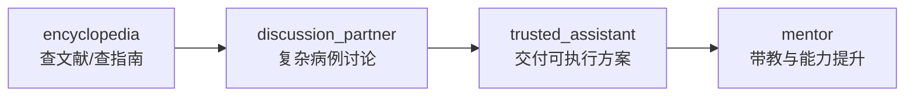
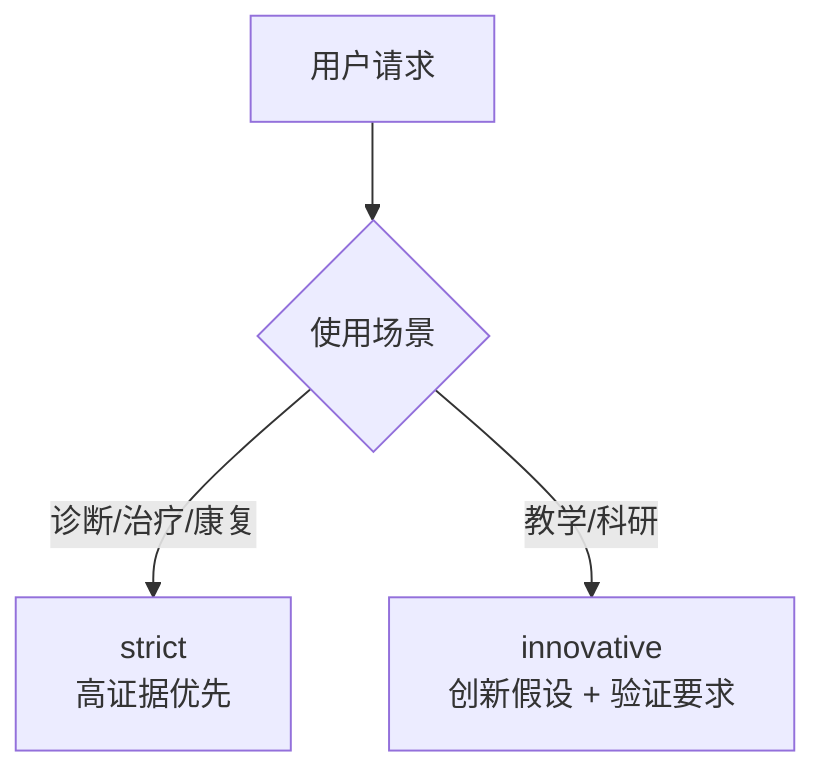
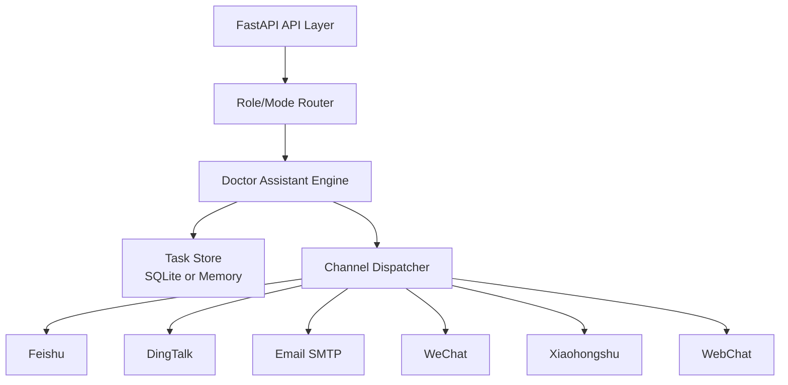
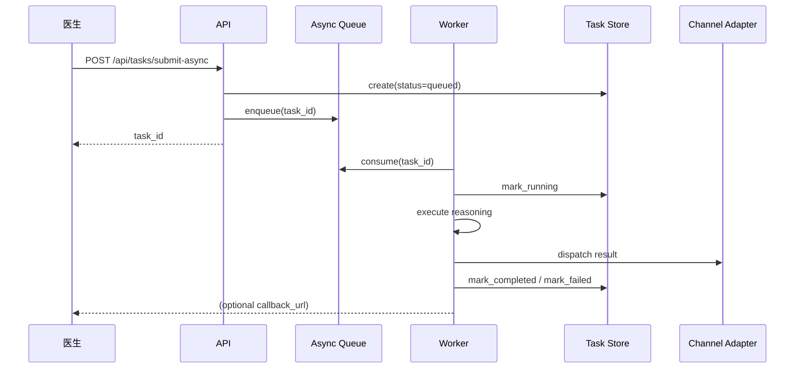

# openclaw-for-doctor

面向医生的 OpenClaw 专业助手：
以临床决策为核心入口，逐步扩展到教学与科研；支持多渠道触达与任务交付回执。

## 产品价值

- 提升临床决策效率：把病例信息转成可执行的鉴别诊断与下一步动作。
- 保持医学严谨性：临床场景默认走 `strict`，明确不确定性与安全边界。
- 保留创新空间：教学/科研场景可走 `innovative`，输出可验证的新假设。
- 打通交付链路：结果可经飞书、钉钉、邮件、微信、小红书或 WebChat 触达。


## 角色与模式





## 典型用例

| 用例 | 输入 | 输出 | 价值 |
|---|---|---|---|
| 复杂临床病例 | 症状、病史、化验、影像摘要 | 鉴别诊断 + 24/72 小时行动计划 + 风险提示 | 缩短决策时间，降低遗漏风险 |
| 规培带教 | 病例主题、教学对象、时长 | 10 页教学骨架 + 提问点 + 常见误区 | 快速形成高质量带教材料 |
| 科研起题 | 研究方向、目标人群、终点 | 文献矩阵草案 + 假设 + 可行性约束 | 降低从 0 到 1 的启动成本 |

## 系统架构



## 异步任务生命周期



## 当前能力清单

- 任务执行模式：同步 + 异步
- 任务控制：取消、重试
- 任务状态：`queued/running/completed/failed/cancelled`
- 可选鉴权：`X-Doctor-Token`
- 存储后端：`sqlite`（默认）/ `memory`
- 交付模式：
  - 默认构建 payload（安全开发态）
  - 可配置开启真实 webhook/SMTP 发送

## 快速开始

```bash
cd /tmp/MedSociety/openclaw-for-doctor
python3 -m venv .venv
source .venv/bin/activate
pip install -r requirements.txt
cp .env.example .env
uvicorn app.main:app --reload --port 8010
```

## 核心配置

- `OPENCLAW_DOCTOR_TASK_STORE=sqlite|memory`
- `OPENCLAW_DOCTOR_DB_PATH=./doctor_tasks.db`
- `OPENCLAW_DOCTOR_API_TOKEN=`
- `OPENCLAW_DOCTOR_ENABLE_OUTBOUND_SEND=true|false`
- `OPENCLAW_DOCTOR_WEBHOOK_TIMEOUT_SECONDS=5`

## API

- `GET /api/health`
- `POST /api/tasks/execute`
- `POST /api/tasks/submit`
- `POST /api/tasks/submit-async`
- `POST /api/tasks/{task_id}/cancel`
- `POST /api/tasks/{task_id}/retry`
- `GET /api/tasks/{task_id}`
- `GET /api/tasks`

同步执行示例：

```bash
curl -s -X POST http://127.0.0.1:8010/api/tasks/execute \
  -H 'Content-Type: application/json' \
  -H 'X-Doctor-Token: your-token-if-configured' \
  -d @examples/task_request.json
```

异步执行示例：

```bash
curl -s -X POST http://127.0.0.1:8010/api/tasks/submit-async \
  -H 'Content-Type: application/json' \
  -H 'X-Doctor-Token: your-token-if-configured' \
  -d '{
    "query":"Need stroke rehab follow-up pathway",
    "channel":"feishu",
    "use_case":"treatment_rehab",
    "callback_url":"https://example.com/task-callback"
  }'
```

## CLI

```bash
python3 scripts/doctor_assistant.py \
  --query "Complex sepsis differential diagnosis with first-line tests" \
  --use-case diagnosis \
  --channel webchat
```

## Docker

```bash
docker compose up --build
```

服务默认启动在 `http://127.0.0.1:8010`。

## OpenClaw 对齐

- 已提供 `SKILL.md`（OpenClaw skill 入口）
- 已提供脚本入口（便于 OpenClaw `exec` 调用）
- 飞书为官方渠道对齐项；其余渠道以自定义适配器方式接入
