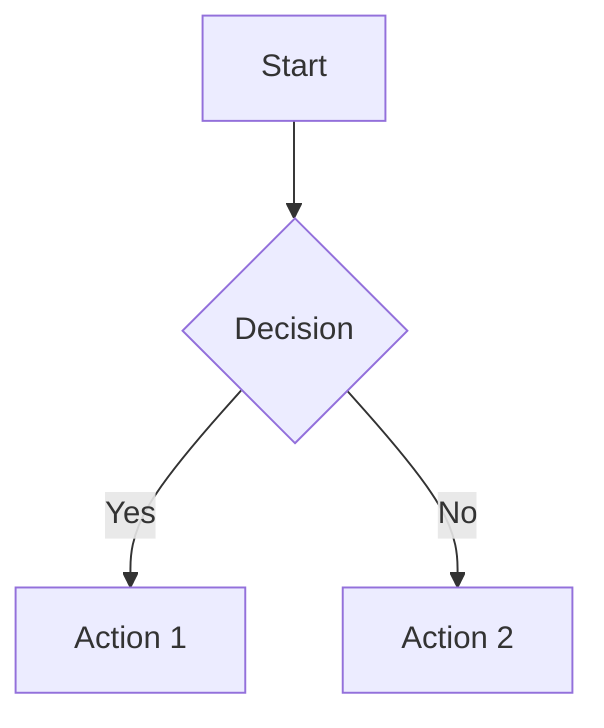

# Wikmd Markdown Reference

Quick reference for Wikmd-specific Markdown features.

## Table of Contents

Add `[TOC]` anywhere in your document to insert an automatically-generated table of contents.

## WikiLinks

Link to other pages in your wiki:

- `[[Page Title]]` - Link to "Page Title"
- `[[Another Page|custom text]]` - Link with custom display text
- `[[Folder/Page]]` - Link to a page in a subfolder

## Standard Markdown

### Headers
```markdown
# H1
## H2
### H3
#### H4
```

### Emphasis
```markdown
*italic*
**bold**
***bold italic***
~~strikethrough~~
```

### Lists
```markdown
- Unordered item
- Another item
  - Nested item

1. Ordered item
2. Another item
```

### Links and Images
```markdown
[External link](https://example.com)
[[Internal wiki link]]

```

### Code Blocks
````markdown
```python
def hello():
    print("Hello, World!")
```
````

### Tables
```markdown
| Header 1 | Header 2 |
|----------|----------|
| Cell 1   | Cell 2   |
| Cell 3   | Cell 4   |
```

## LaTeX Math

Inline math: `$E = mc^2$`

Block math:
```markdown
$$\\frac{a}{b} = \\frac{c}{d}$$
```

## Mermaid Diagrams



## HTML Support

Wikmd allows some HTML for advanced formatting:

```markdown
<div class="alert alert-info">
This is an info box.
</div>
```

## Metadata (Frontmatter)

Optional YAML frontmatter for page metadata:

```markdown
---
title: Custom Page Title
date: 2024-01-15
tags: [project, notes]
---

# Page Content
```

## Best Practices

1. **Use folders** to organize content (e.g., `projects/`, `notes/`, `recipes/`)
2. **Link liberally** - Wikmd shines when pages are connected
3. **Use descriptive filenames** - they become URLs
4. **Commit regularly** - your wiki is version controlled
5. **Add a date** - helps track when information was added/updated
