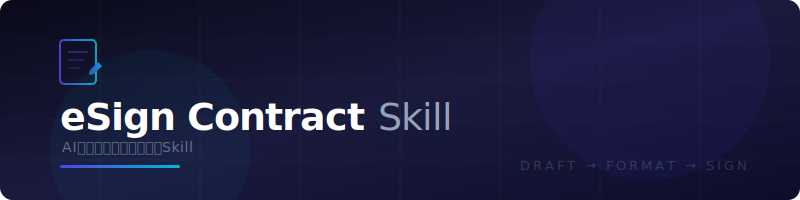

# eSign Contract Skill

<p align="center">
  
</p>

<p align="center">
  <b>一句话，完成完成起草到签署</b><br>
  自然语言生成合同 → 专业 PDF 排版 → e签宝电子签署 → 签署链接直达
</p>

<p align="center">
  <a href="https://www.esign.cn">e签宝官网</a> · <a href="https://open.esign.cn">开放平台</a> · <a href="https://open.esign.cn/doc">API 文档</a>
</p>

---

## Demo

```
你：帮我写一份电子合同软件采购合同，甲方张三，乙方李四，金额9.88万，有效期一年
```

```
📝 正在收集合同要素...
📄 正在排版合同...
📤 正在上传...
🔍 正在定位签章位置...
✍️ 正在创建签署流程...

✅ 签署流程已发起 — 借款合同

---

甲方  张三（138xxxx0001）
🔗 https://h5.esign.cn/sign/xxx

---

乙方  李四（139xxxx0002）
🔗 https://h5.esign.cn/sign/yyy

---

⏳ 请将对应链接发送给签署方，点击即可完成签署
```

## 功能

| | 能力 | 说明 |
|---|---|---|
| 📝 | **智能起草** | 任意类型合同，引导式收集信息，自动校验条款完整性 |
| 📄 | **专业排版** | 双栏布局、金额大小写并列、中文字体、正式 PDF 输出 |
| ✍️ | **电子签署** | 集成 e签宝 V3 API，自动定位签章，个人 & 企业签署 |
| 📋 | **进度管理** | 查询签署状态、撤销流程、下载已签文件 |
| 🔍 | **签名验证** | 校验签名有效性，检测文件是否被篡改 |
| 📎 | **多格式上传** | 支持 PDF / DOC / DOCX，自动转换后发起签署 |

## 快速开始

### 1. 安装 Skill

将 `eSign-contract` 目录放入 Agent 的 Skills 路径：

```bash
# macOS / Linux
cp -r eSign-contract ~/.claude/skills/
cp -r eSign-contract ~/.Codex/skills/
```

### 2. 开始使用

```
帮我写一份租赁合同
起草保密协议
对这个PDF发起签署
查一下签署进度
```

首次运行会自动创建 Python 虚拟环境并安装依赖。

## 使用场景

**起草合同** — "写个借款合同"、"起草租赁协议"、"拟一份保密协议"、"写个股权转让合同"

**上传签署** — "对这个合同发起签署"、"上传文件让双方签字"

**签署管理** — "查一下签署进度"、"撤销签署流程"、"下载已签文件"

**验证签名** — "验证这份合同的电子签名"、"检查文件是否被篡改"

> 支持任意合同类型：借款、租赁、劳动、保密协议（NDA）、股权转让、服务、采购、合作、加盟、知识产权许可……根据场景智能调整条款结构。

## 工作原理

```
用户输入 ──→ AI 起草合同（Markdown）──→ PDF 排版引擎 ──→ e签宝 API
                                                           │
                    ┌──────────────────────────────────────┘
                    │
                    ├── 上传文件，获取 fileId
                    ├── 关键字定位签章坐标
                    ├── 创建签署流程
                    └── 生成各方签署链接
```

## 项目结构

```
eSign-contract/
├── SKILL.md                     # Skill 主文件（流程编排）
├── references/
│   ├── contract-generation.md   # 合同生成规范
│   ├── signing-guide.md         # 签署执行指南
│   └── error-handling.md        # 错误处理参考
└── scripts/
    ├── run.py                   # 统一入口
    ├── esign_api.py             # e签宝接口封装
    ├── contract_formatter.py    # PDF 排版引擎
    └── requirements.txt         # Python 依赖
```


## 相关链接

| 资源 | 链接 |
|---|---|
| e签宝官网 | [esign.cn](https://www.esign.cn) |
| 开放平台 | [open.esign.cn](https://open.esign.cn) |
| API 文档 | [open.esign.cn/doc](https://open.esign.cn/doc) |

---

<p align="center">
  Powered by <a href="https://www.esign.cn">e签宝</a>
</p>
