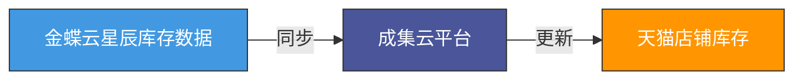
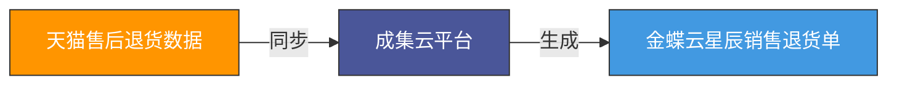

# 天猫（淘宝开放平台）集成金蝶云星辰
## 业务背景

电商企业线上线下数据割裂，天猫店铺前端销售与金蝶云星辰后端供应链、财务数据无法互通，导致**商品信息重复录入、库存不准易超卖、订单发货与售后退货需人工线下录入财务单据**，业务效率低、数据易出错、业财不同步。企业亟需通过天猫与金蝶云星辰的集成，实现商品、库存、订单、售后数据自动同步，打通电商与业财一体化流程。

## 解决方案
> 基于成集云-数据集成平台构建可视化自动同步任务，通过淘宝开放平台与金蝶云星辰开放API对接，实现**商品、库存从金蝶云星辰同步到天猫**，**订单发货、售后退货从天猫同步到金蝶云星辰**，全程自动化、无需人工干预。

## 业务流程
### 1. 商品档案同步流程

### 2. 库存数据同步流程

### 3. 订单发货同步流程

### 4. 售后退货同步流程

## 对接说明
1. 金蝶云星辰商品档案同步至天猫店铺，自动创建/更新线上商品信息
2. 金蝶云星辰实时库存数据同步至天猫店铺，自动更新店铺可售库存
3. 天猫店铺订单发货数据同步至金蝶云星辰，自动生成销售发货单
4. 天猫店铺售后退货数据同步至金蝶云星辰，自动生成销售退货单

## 业务价值
- 消除数据孤岛，实现电商前端与ERP后端数据实时一致
- 取消人工录入商品、库存、发货、退货单据，大幅降低错误率与人力成本
- 库存实时同步，有效避免超卖、漏发、库存不准问题
- 订单发货、售后退货自动生成财务单据，实现业财一体化闭环
- 提升电商运营效率与财务核算准确性，支撑企业高效经营决策

## 接口文档
* [淘宝开放平台API文档](https://open.taobao.com/doc.htm)
* [金蝶云星辰API文档](https://open.jdy.com/#/files/api/detail?index=3&categrayId=3cc8ee9a663e11eda5c84b5d383a2b93)
