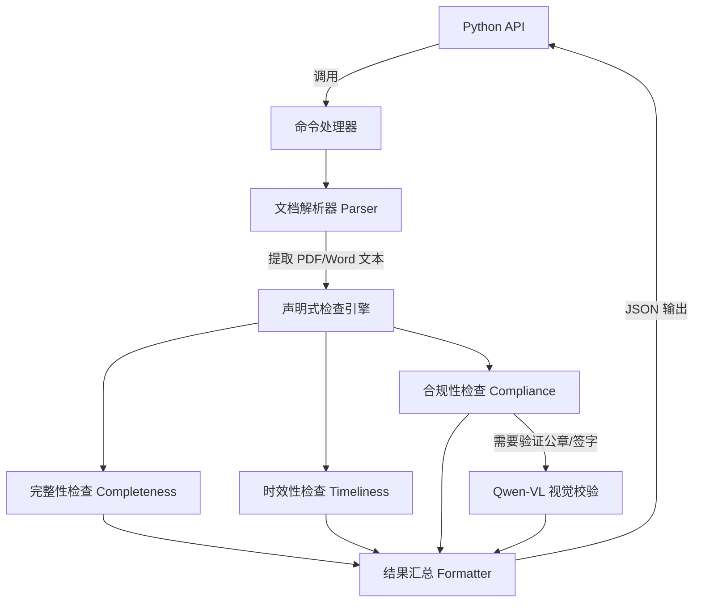

# Compliance Checker

<div align="center">
  
[](https://www.python.org/)
[](https://opensource.org/licenses/MIT)
[](https://help.aliyun.com/zh/dashscope/developer-reference/vl-plus-quick-start)
[](https://github.com/psf/black)

**AI 驱动的文档合规审查 Python 库**

[中文文档](README.md) • [English](README_EN.md)

</div>

## 项目概述

本项目是一个 Python 库，提供文档合规审查能力：
1. **资料完整性核对** - 检查必需文档是否齐全（支持语义匹配）
2. **资料时效性核对** - 验证文件有效期是否覆盖项目周期
3. **基础合规性核对** - 检查公章、签字、文件编号等要素
4. **视觉检测** - 使用 Qwen-VL 识别印章/签名
5. **JSON 输出** - 返回结构化检查结果

## 系统架构

本项目采用高内聚低耦合的声明式检查引擎架构：



## 项目结构

本项目采用 Clean Architecture 五层架构：

```
src/compliance_checker/
├── application/                  # 应用层 - 用例编排
│   ├── commands/                # 命令实现
│   ├── bootstrap.py             # 依赖注入初始化
│   └── formatter.py             # 结果格式化
│
├── domain/                       # 领域层 - 业务逻辑
│   ├── checkers/                # 检查器实现
│   │   ├── completeness.py      # 完整性检查器
│   │   ├── timeliness.py        # 时效性检查器（4步判定规则）
│   │   └── compliance.py        # 合规性/视觉检查器
│   └── engine/
│       └── declarative.py       # 声明式检查引擎
│
├── core/                         # 核心层 - 数据模型与接口
│   ├── interfaces.py            # 抽象接口定义（Protocol）
│   ├── document.py              # Document 数据模型
│   ├── checklist_model.py       # Checklist 数据模型
│   ├── result_model.py          # 结果数据模型
│   ├── checker_base.py          # BaseChecker 抽象基类
│   ├── checker_registry.py      # 检查器注册表
│   ├── exceptions.py            # 统一异常定义
│   └── yaml_compat.py           # YAML 兼容层
│
├── infrastructure/               # 基础设施层 - 外部服务实现
│   ├── parsers/                 # 文档解析器
│   │   ├── pdf_parser.py        # PDF 解析
│   │   ├── docx_parser.py       # Word 解析
│   │   └── image_parser.py      # 图片解析
│   ├── llm/                     # LLM 客户端
│   │   ├── client.py            # OpenAI 兼容客户端
│   │   ├── config.py            # LLM 配置
│   │   └── semantic_matcher.py  # 语义匹配器
│   ├── visual/                  # 视觉检测模块
│   │   ├── qwen_client.py       # Qwen-VL API 封装
│   │   ├── region_detector.py   # 区域检测器
│   │   └── screenshot.py        # 截图工具
│   └── config/                  # 配置管理
│       └── settings.py
│
└── cli.py                       # CLI 入口（可选）
```

## 配置

### SecretRef 配置方式

本库遵循 OpenClaw SecretRef 规范进行密钥管理，**不支持直接读取环境变量**。

配置通过 `CheckerConfig.from_secret_ref()` 方法传入：

```python
from compliance_checker.infrastructure.config import CheckerConfig

# 使用 SecretRef 配置（推荐）
config = CheckerConfig.from_secret_ref(
    secrets={
        "llm_api_key": {"source": "env", "provider": "default", "id": "LLM_API_KEY"},
        "llm_base_url": "https://dashscope.aliyuncs.com/compatible-mode/v1",
        "llm_model": "qwen-max",
    }
)

# 或使用普通字符串值
config = CheckerConfig.from_secret_ref(
    secrets={
        "llm_api_key": "your-api-key",
        "llm_base_url": "https://dashscope.aliyuncs.com/compatible-mode/v1",
        "llm_model": "qwen-max",
    }
)
```

### 配置项说明

| 配置项 | 必需 | 默认值 | 说明 |
|--------|------|--------|------|
| `llm_api_key` | 是 | - | LLM API 密钥 |
| `llm_base_url` | 否 | `https://api.openai.com/v1` | LLM API 端点 |
| `llm_model` | 否 | `gpt-4o` | LLM 模型名称 |
| `llm_timeout` | 否 | `60` | 请求超时（秒） |
| `llm_max_retries` | 否 | `3` | 最大重试次数 |
| `embed_api_key` | 否 | 使用 `llm_api_key` | 嵌入模型 API 密钥 |
| `embed_model` | 否 | `text-embedding-v1` | 嵌入模型名称 |
| `vision_api_key` | 否 | 使用 `llm_api_key` | 视觉模型 API 密钥 |
| `vision_model` | 否 | `qwen3-vl-flash` | 视觉模型名称 |
| `ocr_backend` | 否 | `none` | OCR 后端：`none` / `paddle` / `aliyun` |
| `alibaba_cloud_access_key_id` | 否 | - | 阿里云 Access Key ID |
| `alibaba_cloud_access_key_secret` | 否 | - | 阿里云 Access Key Secret |

### SecretRef 格式

支持 OpenClaw 标准的 SecretRef 格式：

```python
# 从环境变量读取
{"source": "env", "provider": "default", "id": "LLM_API_KEY"}

# 从文件读取（JSON 模式）
{"source": "file", "provider": "filemain", "id": "/providers/openai/apiKey"}

# 从外部命令读取
{"source": "exec", "provider": "vault", "id": "providers/openai/apiKey"}
```

## 安装说明

### 环境要求
- Python 3.10+
- LLM API Key（必需，用于清单生成和语义匹配）
- 视觉模型 API Key（可选，用于印章/签名检测，默认使用 LLM_API_KEY）
- OCR 服务（可选，用于扫描件识别，默认不启用）

### 安装步骤

#### 方式一：使用 pip 安装（推荐）

**步骤 1：创建并激活虚拟环境（venv）**

```bash
# 创建虚拟环境
python -m venv .venv

# Windows PowerShell 激活
.venv\Scripts\activate

# 或 Windows CMD 激活
.venv\Scripts\activate.bat

# 或 Linux/Mac 激活
source .venv/bin/activate
```

**步骤 2：安装依赖**

基础安装（最轻量，无 OCR）：
```bash
pip install -r requirements.txt
```

或使用 pyproject.toml 安装：
```bash
pip install -e .
```

带本地 OCR（PaddleOCR，体积大）：
```bash
pip install -e ".[local-ocr]"
```

带云端 OCR（阿里云，轻量）：
```bash
pip install -e ".[cloud-ocr]"
```

#### 方式二：使用 Docker 构建

支持通过构建参数 `OCR_BACKEND` 选择 OCR 配置：

```bash
# 基础镜像（无 OCR，最小化，推荐）
docker build -t compliance-checker:latest .

# 带本地 OCR（PaddleOCR，处理扫描件无需网络）
docker build --build-arg OCR_BACKEND=local -t compliance-checker:local-ocr .

# 带云端 OCR（阿里云 OCR，轻量需网络）
docker build --build-arg OCR_BACKEND=cloud -t compliance-checker:cloud-ocr .
```

运行容器：
```bash
docker run compliance-checker:latest
```

注意：容器内需要通过 SecretRef 方式传入配置。

#### 运行测试
```bash
python -m pytest tests/ -v
```

## 数据隐私与数据流向

使用本工具时，您的文档数据可能会发送到以下外部服务：

### 视觉检测服务（印章/签名识别）

- **服务提供商**：阿里云 DashScope
- **API 端点**：`https://dashscope.aliyuncs.com/compatible-mode/v1`
- **使用场景**：当执行视觉检查（印章/签名检测）时，文档图片会被发送到该服务
- **数据处理方式**：
  - 图片通过 HTTPS 加密传输
  - 阿里云 DashScope 服务仅用于推理，不存储用户数据
  - 详细隐私政策请参考[阿里云 DashScope 服务条款](https://www.aliyun.com/product/dashscope)

### OCR 服务（可选）

根据配置的 `OCR_BACKEND`，文档可能发送到以下服务：

| 后端 | 服务提供商 | 数据流向 | 说明 |
|------|-----------|---------|------|
| `none`（默认） | 无 | 本地处理 | 不发送任何数据到外部服务 |
| `paddle` | 本地 | 本地处理 | 使用本地 PaddleOCR 模型，数据不离开本机 |
| `aliyun` | 阿里云 | 发送到阿里云 OCR 服务 | 需要配置 `ALIBABA_CLOUD_ACCESS_KEY_ID` 和 `ALIBABA_CLOUD_ACCESS_KEY_SECRET` |

### LLM 服务

- **服务提供商**：阿里云 DashScope（默认）或其他兼容 OpenAI API 的服务
- **使用场景**：
  - 生成合规检查清单
  - 语义匹配文档名称
  - 提取文档中的日期信息
- **数据处理方式**：仅发送文本内容，不包含原始文件

### 数据安全建议

1. **敏感文档处理**：建议在上传前对包含敏感信息的文档进行脱敏处理（如遮盖身份证号、银行卡号等）
2. **本地 OCR**：如需处理高度敏感文档，建议使用 `OCR_BACKEND=paddle` 进行本地 OCR 处理
3. **网络隔离**：企业用户可通过配置私有 LLM 端点实现完全内网部署

### 数据持久化

- 本工具**不会**将您的文档内容持久化存储到本地磁盘
- 检查结果仅输出到控制台或返回给调用方
- 临时文件（如 PDF 转换的中间图片）会在检查完成后自动清理

## 使用方法

### Python API 示例

`Examples/` 目录包含 4 个测试文档，演示不同检查场景：

#### 1. 完整合规检查（立项批复）

**文件**：`01_立项批复_示范智慧城市项目.pdf`

**场景**：检查公章、签字、文件编号、日期等要素是否齐全

**代码**：
```python
from compliance_checker.application.commands.completeness_cmd import run_completeness
from compliance_checker.application.commands.timeliness_cmd import run_timeliness
from compliance_checker.application.commands.visual_cmd import run_visual

# 检查文档完整性
completeness = await run_completeness(
    path="./Examples",
    documents=["立项批复"]
)

# 检查时效性
timeliness = await run_timeliness(
    file="./Examples/01_立项批复_示范智慧城市项目.pdf"
)

# 视觉检查：公章和签字
visual = await run_visual(
    file="./Examples/01_立项批复_示范智慧城市项目.pdf",
    targets=["公章", "法人签字"]
)
```

#### 2. 有效期检查（施工许可证）

**文件**：`03_施工许可证_示范项目.pdf`

**场景**：验证文件有效期是否覆盖项目周期（2025-09 至 2027-08）

**代码**：
```python
# 检查时效性
result = await run_timeliness(
    file="./Examples/03_施工许可证_示范项目.pdf",
    reference_time="2026-06-01"
)

# 以特定日期为基准检查
result = await run_timeliness(
    file="./Examples/03_施工许可证_示范项目.pdf",
    reference_time="2028-01-01"
)
```

#### 3. 时效性失败检查（已过期许可证）

**文件**：`05_安全生产许可证_已过期.docx`

**场景**：演示有效期已过期（2023-04 到期）的检测

**代码**：
```python
# 检查已过期文档
result = await run_timeliness(
    file="./Examples/05_安全生产许可证_已过期.docx"
)

# 指定参考时间检查
result = await run_timeliness(
    file="./Examples/05_安全生产许可证_已过期.docx",
    reference_time="2024-01-01"
)
```

#### 4. 合规性失败检查（缺少公章）

**文件**：`09_无公章批复_测试用.pdf`

**场景**：演示缺少公章和签名的检测

**代码**：
```python
# 视觉检查：公章（应返回未找到）
result = await run_visual(
    file="./Examples/09_无公章批复_测试用.pdf",
    targets=["公章"]
)

# 视觉检查：签字（应返回未找到）
result = await run_visual(
    file="./Examples/09_无公章批复_测试用.pdf",
    targets=["法人签字"]
)

# 同时检查公章和签字
result = await run_visual(
    file="./Examples/09_无公章批复_测试用.pdf",
    targets=["公章", "法人签字"]
)
```

#### 批量检查示例

检查 Examples 目录下所有文档的完整性：
```python
result = await run_completeness(
    path="./Examples",
    documents=["立项批复", "施工许可证", "安全生产许可证"]
)
```

## 核心功能

### 1. 完整性核对

检查必需文档是否齐全：
- **精确匹配**：文件名包含清单名称
- **语义匹配**：使用 LLM 嵌入模型计算相似度（默认阈值 0.75）

### 2. 时效性核对

验证文件有效期：
- 提取签发日期、有效期起止
- 支持多种日期格式
- 判断有效期是否覆盖项目周期
- 支持有效期描述提取（如"有效期一年"）

### 3. 合规性核对

检查基础合规要点：
- **公章**：视觉检测
- **签字**：视觉检测
- **文件编号**：正则匹配
- **日期**：提取验证

### 4. 视觉检测

使用 Qwen-VL 进行视觉确认：
- 自动为印章/签字检查启用视觉检测
- 返回检测结果和置信度
- 无需文本关键词匹配

## 快速测试

```python
import asyncio
from compliance_checker.application.commands.completeness_cmd import run_completeness
from compliance_checker.cli import check_health

async def test():
    # 健康检查
    health = await check_health()
    print(health["status"])
    
    # 测试完整性检查
    result = await run_completeness(
        path="./Examples",
        documents=["立项批复"]
    )
    print(result)

asyncio.run(test())
```

## 技术特点

- **Python API 优先** - 简洁的 Python 接口，直接返回字典
- **LLM 驱动** - 语义匹配使用 LLM 嵌入 API，日期提取使用 LLM
- **视觉优先** - 印章/签名检测使用 Qwen-VL，不依赖文本关键词
- **轻量级** - 默认无 OCR，可选安装 PaddleOCR/阿里云 OCR
- **异步架构** - 所有检查任务并行执行
- **Docker 支持** - 支持构建参数化镜像，灵活配置 OCR 后端

### 注意事项

### 1. OCR 配置
- **默认不启用**（`ocr_backend=none`），仅处理可编辑 PDF
- **本地 OCR**：安装 `[local-ocr]`，配置 `ocr_backend=paddle`
- **云端 OCR**：安装 `[cloud-ocr]`，配置 `ocr_backend=aliyun` + 阿里云密钥

### 2. 日期格式
支持的日期格式：
- `2024年3月15日`
- `2024-03-15`
- `2024/03/15`
- `2024年3月`（自动补全为 3月31日）

### 3. 视觉检测
- 默认使用 `qwen3-vl-flash` 模型，可通过 `vision_model` 配置修改
- 自动复用 `llm_api_key` 和 `llm_base_url`（OpenAI 兼容模式）
- 如需使用不同厂商的视觉模型，可配置 `vision_api_key` 和 `vision_base_url`
- 首次调用可能有延迟

### 4. 语义匹配
- 使用 LLM 嵌入 API（默认 text-embedding-v1）
- 默认相似度阈值：0.75
- 支持备用方案（字符级嵌入）

### 5. LLM 依赖
- 语义匹配使用 LLM 嵌入 API
- 日期提取使用 LLM
- 支持 OpenAI 兼容 API（DashScope、Moonshot 等）

### 6. 配置方式
- **不支持环境变量**：代码中不读取任何环境变量
- **必须使用 SecretRef**：所有敏感配置通过 `CheckerConfig.from_secret_ref()` 传入
- **符合 ClawHub 规范**：通过 OpenClaw SecretRef 机制安全注入密钥

---

**项目状态**: Python API 版本已稳定
**最后更新**: 2026-03-24 (v1.1.6)
**维护者**: evob

## 架构特点

- **Clean Architecture 四层架构**: Application → Domain → Core → Infrastructure
- **依赖倒置**: 内层定义接口，外层实现接口
- **依赖注入**: 通过 `bootstrap.py` 完成所有依赖组装
- **声明式检查引擎**: 根据清单配置自动执行检查
- **时效性 4 步判定**: 提取有效期 → 提取落款日期 → 确定基准时间 → 核心判定矩阵
