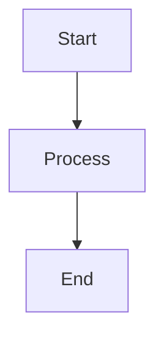

# Markdown Diagram Renderer (OpenClaw SKILL)

Automatically identify architecture/flowchart code blocks in Markdown documents, render them as images, and replace them.

## Features

- **Smart Identification**: Automatically identify Mermaid, Graphviz, and PlantUML diagrams without specific language tags.
- **Multi-backend Rendering**: Supports local rendering and online API fallback.
- **Base64 Inline**: Images are inlined into Markdown as Base64 encoding, version control friendly.
- **Source Preservation**: Optionally keep the original diagram code as comments.

## Supported Diagram Types

| Diagram Type | Language Identifier | Local Renderer | Online Renderer |
|---------|---------|---------|---------|
| Mermaid | `mermaid`, `mmd` | mmdc CLI | mermaid.ink |
| Graphviz | `graphviz`, `dot`, `gv` | graphviz Python | - |
| PlantUML | `plantuml`, `puml` | Java jar | plantuml.com |

## Installation

### 1. Install Python Dependencies (Required for first use)

```bash
pip install -r script/requirements.txt
```

### 2. Install Optional Dependencies (As needed)

**Mermaid Local Rendering:**
```bash
npm install -g @mermaid-js/mermaid-cli
```

**Graphviz:**
```bash
# macOS
brew install graphviz

# Ubuntu/Debian
sudo apt-get install graphviz

# Windows
# Download installer: https://graphviz.org/download/
```

**PlantUML Local Rendering:**
```bash
# Install Java
# Download plantuml.jar
# Set environment variable: PLANTUML_JAR=/path/to/plantuml.jar
```

> **Note**: If local rendering tools are not installed, the system will automatically use online APIs for rendering (requires internet connection).

## Usage

### CLI Command Line

```bash
# Basic usage
python script/main.py document.md

# Specify output file
python script/main.py document.md -o output.md

# Set confidence threshold
python script/main.py document.md --threshold 0.7

# Output SVG format
python script/main.py document.md --format svg

# Do not preserve source code
python script/main.py document.md --no-preserve

# Detailed logs
python script/main.py document.md -v
```

### Calling as OpenClaw SKILL

```python
import sys
sys.path.insert(0, 'script')

from main import create_skill

# Create SKILL instance
config = {
    'confidence_threshold': 0.6,
    'output_format': 'png',
    'preserve_source': True,
}
skill = create_skill(config)

# Execute
result = skill.execute(
    input_file='document.md',
    output_file='output.md'
)

print(result)
```

### Calling via Event

```python
import sys
sys.path.insert(0, 'script')

from main import main

event = {
    'input_file': 'document.md',
    'output_file': 'output.md',
    'config': {
        'confidence_threshold': 0.6,
        'output_format': 'png',
        'preserve_source': True,
    }
}

result = main(event)
```

## Configuration Parameters

| Parameter | Type | Default | Description |
|-----|------|-------|------|
| `confidence_threshold` | float | 0.6 | Diagram identification confidence threshold (0-1) |
| `output_format` | string | png | Output image format (png/svg) |
| `preserve_source` | bool | True | Whether to preserve original diagram code |
| `output_dir` | string | - | Image output directory (leave empty for Base64 inline) |

## Identification Strategy

Uses a multi-stage filter system:

1. **Language Tag Check**: Prioritizes identifying `mermaid`, `graphviz`, `plantuml`, etc.
2. **First Line Keyword Matching**: Checks for typical declarations at the beginning of code blocks.
3. **Keyword Density Analysis**: Counts the frequency of diagram-specific keywords.
4. **Structural Feature Analysis**: Detects structural characteristics of diagrams.

## Output Example

Before processing:
````markdown

````

After processing:
```markdown


<!-- Original diagram code -->
<!--

-->
```

## Directory Structure

```
doc-chart/
├── SKILL.md           # OpenClaw SKILL configuration
├── script/
│   ├── main.py        # Main entry point
│   ├── core.py        # Core logic
│   └── requirements.txt  # Python dependencies
└── README.md          # Usage instructions
```

## Notes

1. **First Use**: Must install Python dependencies first: `pip install -r script/requirements.txt`
2. **Network Dependency**: If local rendering tools are not installed, it will attempt to use online APIs.
3. **File Overwrite**: Defaults to overwriting the original file; recommended to backup or use `-o` to specify an output file.
4. **Performance**: For large documents, local rendering tools are recommended for better performance.

## License

MIT
