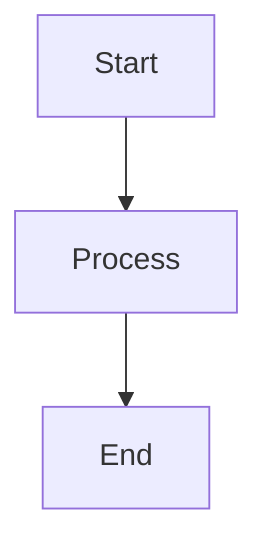

# Markdown Diagram Renderer

Automatically identify architecture/flowchart code blocks in Markdown documents, render them as images, and replace them.

## Features

- **Smart Identification**: Automatically identify Mermaid, Graphviz, and PlantUML diagrams without specific language tags.
- **Multi-backend Rendering**: Supports local rendering and online API fallback.
- **Base64 Inline**: Images are inlined into Markdown as Base64 encoding, version control friendly.
- **Source Preservation**: Optionally keep the original diagram code as comments.

## Supported Diagram Types

| Diagram Type | Language Identifier | Local Renderer | Online Renderer |
|---------|---------|---------|---------|
| Mermaid | `mermaid`, `mmd` | mmdc CLI | mermaid.ink |
| Graphviz | `graphviz`, `dot`, `gv` | graphviz Python | - |
| PlantUML | `plantuml`, `puml` | Java jar | plantuml.com |

## Getting Started

**Before first use, please install Python dependencies:**

```bash
# Install dependencies
pip install -r {baseDir}/script/requirements.txt
```

**Optional dependencies (install as needed):**

```bash
# Mermaid local rendering (recommended)
npm install -g @mermaid-js/mermaid-cli

# Graphviz (for Graphviz diagrams)
# macOS: brew install graphviz
# Ubuntu: sudo apt-get install graphviz

# PlantUML local rendering
# 1. Install Java
# 2. Download plantuml.jar
# 3. Set environment variable: export PLANTUML_JAR=/path/to/plantuml.jar
```

> **Note**: If local rendering tools are not installed, the system will automatically use online APIs for rendering (requires internet connection).
>
> ⚠️ **Privacy Warning**: Online rendering sends diagram source code to third-party services:
> - Mermaid → `mermaid.ink`
> - PlantUML → `plantuml.com`
>
> Do not include sensitive information (e.g., passwords, keys, internal architecture details) in diagrams. It is recommended to install local rendering tools to avoid data leakage.

## Usage

### CLI Command Line

```bash
# Basic usage
python3 {baseDir}/script/main.py document.md

# Specify output file
python3 {baseDir}/script/main.py document.md -o output.md

# Set confidence threshold
python3 {baseDir}/script/main.py document.md --threshold 0.7

# Output SVG format
python3 {baseDir}/script/main.py document.md --format svg

# Do not preserve source code
python3 {baseDir}/script/main.py document.md --no-preserve

# Detailed logs
python3 {baseDir}/script/main.py document.md -v
```

### Calling as a Python Module

```python
import sys
sys.path.insert(0, '{baseDir}/script')

from main import create_skill

# Create SKILL instance
config = {
    'confidence_threshold': 0.6,
    'output_format': 'png',
    'preserve_source': True,
}
skill = create_skill(config)

# Execute
result = skill.execute(
    input_file='document.md',
    output_file='output.md'
)

print(result)
```

## Configuration Parameters

| Parameter | Type | Default | Description |
|-----|------|-------|------|
| `confidence_threshold` | float | 0.6 | Diagram identification confidence threshold (0-1) |
| `output_format` | string | png | Output image format (png/svg) |
| `preserve_source` | bool | True | Whether to preserve original diagram code |

## Identification Strategy

Uses a multi-stage filter system:

1. **Language Tag Check**: Prioritizes identifying `mermaid`, `graphviz`, `plantuml`, etc.
2. **First Line Keyword Matching**: Checks for typical declarations at the beginning of code blocks.
3. **Keyword Density Analysis**: Counts the frequency of diagram-specific keywords.
4. **Structural Feature Analysis**: Detects structural characteristics of diagrams.

## Output Example

Before processing:
````markdown

````

After processing:
```markdown


<!-- Original diagram code -->
<!--

-->
```

## File Structure

```
{baseDir}/
├── SKILL.md           # This file
├── script/
│   ├── main.py        # Main entry point
│   ├── core.py        # Core logic
│   └── requirements.txt  # Python dependencies
└── README.md          # Detailed documentation
```
