# arch-diagrammer（架构制图技能）

用于快速产出**架构图 / 流程图 / 时序图 / 部署图**等可视化交付物，常见输出为 `.svg`（可离线打开）或 `.html`（浏览器直接预览）。

## 安装

适合以“个人 skill 包”的方式分发。

1. 将整个 `arch-diagrammer/` 目录复制到 `~/.cursor/skills/`
2. 确保最终目录为 `~/.cursor/skills/arch-diagrammer/`
3. 如需运行渲染脚本，确保本机可用 `python3`
4. 如需本地 Mermaid CLI 渲染，确保本机可用 Node.js 与 `npx`

安装完成后，skill 目录建议至少包含：

- `SKILL.md`
- `README.md`
- `LICENSE`
- `VERSION`
- `CHANGELOG.md`
- `assets/`
- `references/`
- `scripts/`

## 构建发布包

推荐在发布前先确认版本号已经更新完成：

```bash
python3 scripts/bump_version.py patch
```

如果当前版本号已经正确，也可以跳过这一步。

然后在 `arch-diagrammer` 根目录执行打包：

```bash
python3 scripts/build_release.py
```

如果你当前在仓库根目录，也可以直接执行：

```bash
python3 skills/arch-diagrammer/scripts/build_release.py
```

默认会生成：

- `dist/arch-diagrammer-<version>.zip`

例如当前版本 `1.0.1`，生成产物为：

- `dist/arch-diagrammer-1.0.1.zip`

## 打包步骤

1. 确认 `VERSION`、`CHANGELOG.md` 已更新到准备发布的版本
2. 在 `arch-diagrammer` 根目录执行 `python3 scripts/build_release.py`
3. 检查 `dist/` 目录下是否生成对应版本的 zip 包
4. 将该 zip 包发给使用者，或上传到你们内部制品库 / 文档平台
5. 使用者解压后，将 `arch-diagrammer/` 整个目录复制到 `~/.cursor/skills/`

## 打包说明

- `build_release.py` 会自动读取 `VERSION` 中的版本号作为发布包文件名
- 打包内容默认包含运行所需的 `SKILL.md`、`assets/`、`references/`、`scripts/` 等必要文件
- 打包产物位于 `dist/` 目录，便于持续发布多个版本
- 该打包方式适合“复制到个人 Cursor skills 目录即可使用”的分发模式
- 如果后续版本升级，重新执行打包命令即可生成新的版本包

压缩包解压后目录结构保持为：

- `arch-diagrammer/SKILL.md`
- `arch-diagrammer/README.md`
- `arch-diagrammer/LICENSE`
- `arch-diagrammer/VERSION`
- `arch-diagrammer/CHANGELOG.md`
- `arch-diagrammer/assets/...`
- `arch-diagrammer/references/...`
- `arch-diagrammer/scripts/...`

## 版本管理

- 当前版本：`1.0.1`
- 变更记录：见 `CHANGELOG.md`
- 升级命令：`python3 scripts/bump_version.py patch|minor|major`
- 脚本行为：同步更新版本号并自动插入 `CHANGELOG.md` 新版本模板
- 版本规则：遵循语义化版本，`major` 为不兼容调整，`minor` 为新增能力，`patch` 为修正和小优化

## 选择产出模式

- **模式一：纯 SVG 分层架构图**
  - 适用：系统分层架构、方案全景图、需要精确布局/配色/字体、离线可用
  - 交付：直接输出一份可打开的 `.svg`（不依赖 Kroki/Mermaid CDN）
  - 风格与模板：见 `references/svg-layered-spec.md` 与 `assets/svg-templates/`

- **模式二：Mermaid / PlantUML / Graphviz + Kroki 渲染**
  - 适用：流程图、时序图、C4、依赖关系图等
  - 交付：用 DSL 描述图形，再渲染为 `.svg/.png/.pdf/.html`
  - 语法速查：见 `references/diagram-quickstart.md`

说明：当需求表述为“分层架构图 / svg 分层架构图”时，默认指**模式一**的纯 SVG 分层图。

## 最小输入要素（建议你提供）

- **产出模式**：模式一 / 模式二
- **图类型**：分层架构 / 流程 / 时序 / C4 / 部署（模式二为主）
- **内容结构**：
  - 模式一：层级名称、每层模块列表、需要表达的关键连线（可选）
  - 模式二：DSL 源文件（`.mmd/.puml/.dot`）或其文本内容
- **风格偏好**（模式一）：`blue/cyber/dark/gray/green/handdrawn/mono/morandi/ocean/orange/purple/tailwind`
- **输出**：文件名与格式（`.svg` 或 `.html`）


## 提示词示例

### 纯 SVG 分层架构图（模式一）
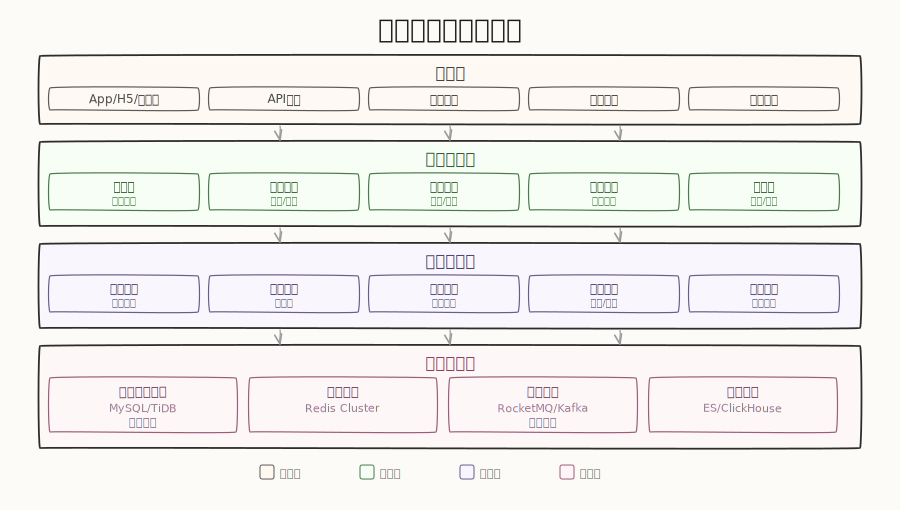

一句话版本（更像口语，复制就能用）：

```
使用 arch-diagrammer 帮我画一个支付系统的分层架构图，包含 4 层结构，使用手绘风格（handdrawn），输出一个可打开的 .svg 文件。
```

同款风格的展开版（写清楚一点更稳）：

```
使用 arch-diagrammer 画“支付系统”的分层架构图，4 层，手绘风格：handdrawn，输出 .svg。
标题：支付系统分层架构图。
分几层（4 层）：接入层 / 交易编排层 / 支付核心层 / 数据与外部依赖层。
每层放哪些模块（你也可以按你项目改名）：
- 接入层：App/H5、商户后台、API Gateway、WAF、限流熔断
- 交易编排层：收银台、订单服务、路由/编排、通知回调（Webhook）
- 支付核心层：支付服务、风控、账务、清结算、对账
- 数据与外部依赖层：MySQL、Redis、MQ(Kafka/RocketMQ)、对象存储(可选)、第三方支付通道(微信/支付宝/银联)
关键链路（只画最重要的）：App/H5 -> API Gateway -> 收银台 -> 支付服务 -> 第三方支付通道；支付服务 -> MQ -> 通知回调；支付服务 -> MySQL/Redis；清结算/对账 -> MySQL。
```

### Mermaid 流程图（模式二）
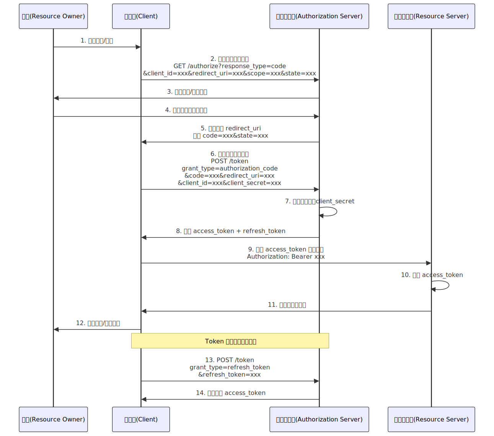

一句话版本：

```
使用 arch-diagrammer 画一个 OAuth 2.0 授权码模式的流程图，用 Mermaid 时序图，输出.svg
```

展开版：

```
使用 arch-diagrammer，用 Mermaid 时序图画 OAuth 2.0 授权码模式（Authorization Code）的完整流程。
参与者：用户(User)、客户端(Client)、授权服务器(Auth Server)、资源服务器(Resource Server)。
流程：
1. User -> Client：点击登录
2. Client -> Auth Server：重定向到授权页（携带 client_id、redirect_uri、scope、state）
3. User -> Auth Server：输入凭证并授权
4. Auth Server -> Client：回调 redirect_uri（携带 authorization_code、state）
5. Client -> Auth Server：用 authorization_code 换取 access_token（携带 client_secret）
6. Auth Server -> Client：返回 access_token + refresh_token
7. Client -> Resource Server：携带 access_token 请求资源
8. Resource Server -> Client：返回受保护资源
输出：.svg。
```

### PlantUML C4（模式二）
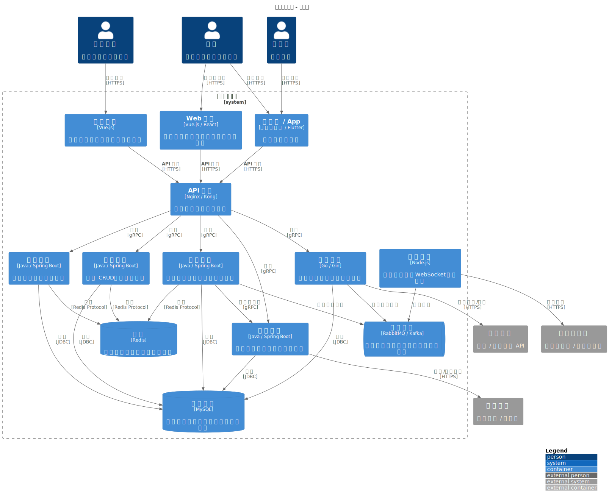

一句话版本：

```
使用 arch-diagrammer，用 PlantUML C4 画一个在线点餐系统的容器图，输出.svg
```

展开版：

```
使用 arch-diagrammer，用 PlantUML（C4-PlantUML）画容器图（Container）。
系统：在线点餐系统。
外部角色：顾客（Mobile App）、门店店员（Store Dashboard）、第三方支付（支付宝/微信支付）。
容器：API Gateway、Order Service、Menu Service、Payment Service、Notification Service、PostgreSQL、Redis、RabbitMQ。
关系：
- 顾客 -> API Gateway(HTTPS)
- 门店店员 -> API Gateway(HTTPS)
- API Gateway -> Order Service(gRPC)
- API Gateway -> Menu Service(gRPC)
- Order Service -> Payment Service(gRPC)
- Payment Service -> 第三方支付(HTTPS 回调)
- Order Service -> RabbitMQ(发布订单事件)
- Notification Service -> RabbitMQ(消费订单事件)
- Order Service -> PostgreSQL(读写)
- Menu Service -> PostgreSQL(读写)
- Order Service -> Redis(缓存)
- Menu Service -> Redis(缓存)
输出：.html，并给出渲染命令。
```


## 分层架构图 (模式一)

### 基础风格模板预览

#### cyber

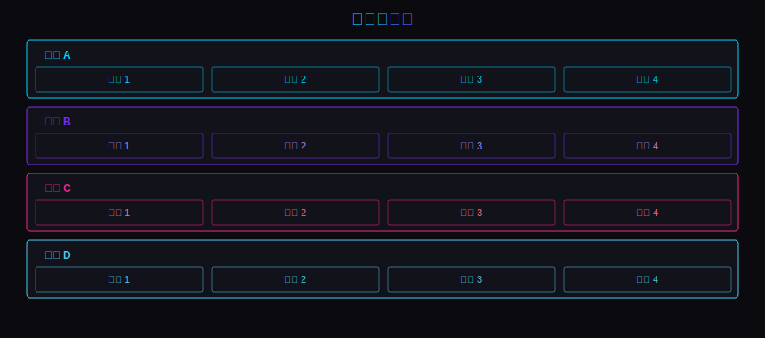

#### gray

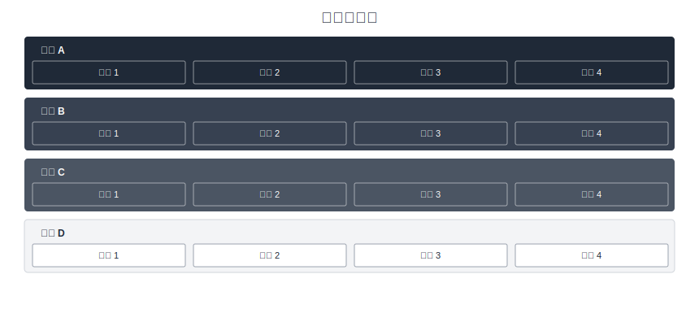

#### green

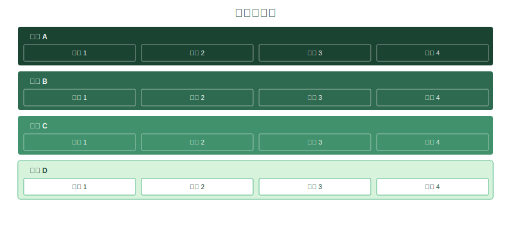

#### mono

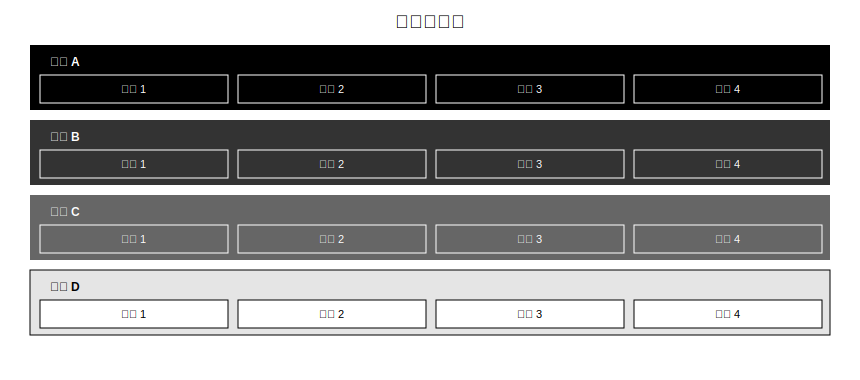

#### morandi

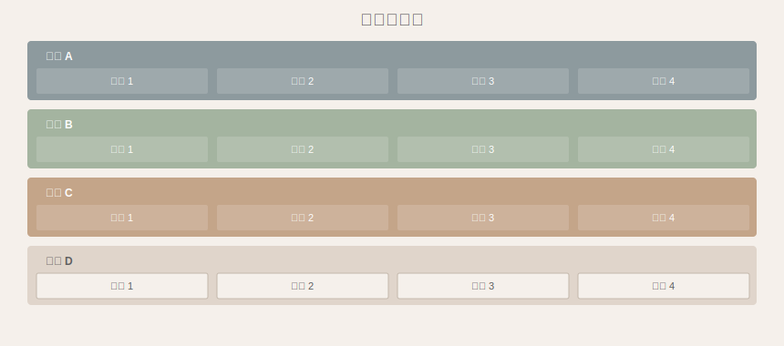

#### ocean

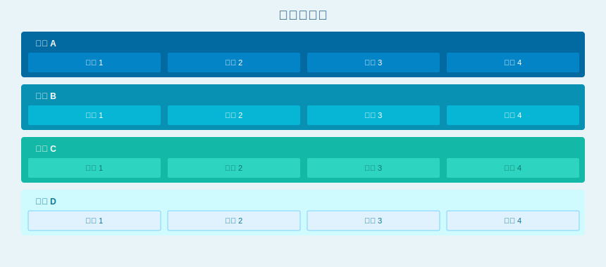

#### orange

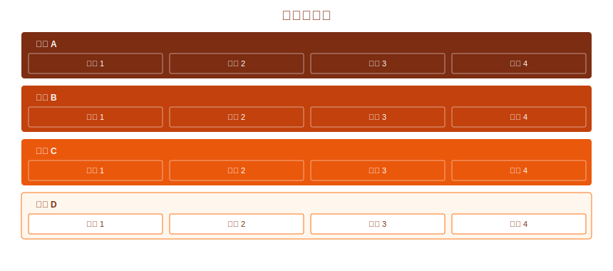

#### purple

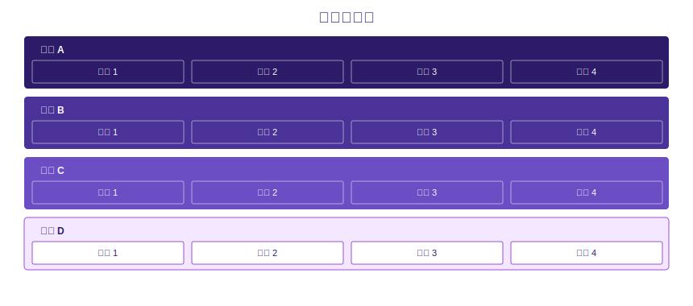

### 分层架构模板

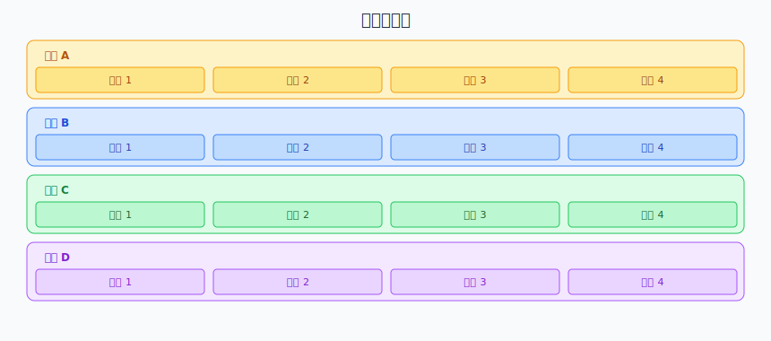

### 电商架构示例

#### blue

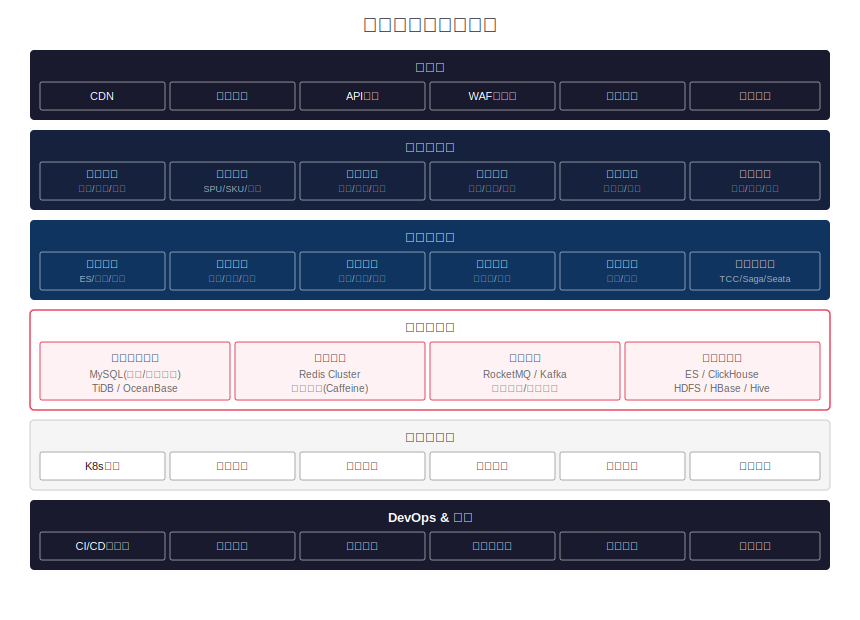

#### dark

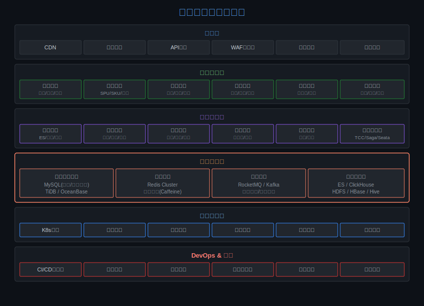

#### handdrawn

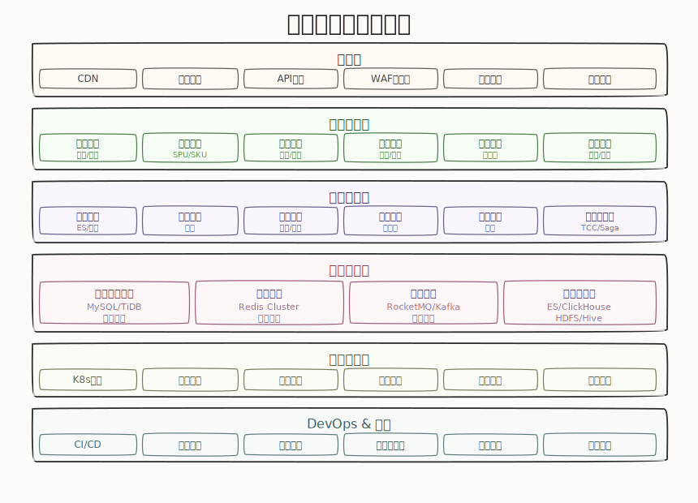

## Kroki 渲染脚本（模式二）

> Kroki 支持的 28 种图类型

### 高频（软件开发常用）

| 类型 | 中文名称 | 说明 | 适用场景 |
|------|----------|------|----------|
| mermaid | Mermaid 图 | Markdown 风格的图形语言，生态最活跃 | 流程图、时序图、甘特图、类图、饼图、Git 图 |
| plantuml | PlantUML 图 | 功能最全面的 UML 图形语言 | 时序图、类图、用例图、活动图、状态图、组件图 |
| c4plantuml | C4 架构图 | 基于 PlantUML 的 C4 模型（Context/Container/Component/Code） | 系统架构设计、方案评审、技术全景 |
| graphviz | 有向/无向图 | DOT 语言，强大的图布局引擎 | 依赖关系图、调用链、组织架构、状态机 |
| d2 | D2 声明式图 | 新一代声明式图形语言，语法简洁、自动布局 | 架构图、流程图、ER 图，追求简洁语法时 |

### 中频（特定领域）

| 类型 | 中文名称 | 说明 | 适用场景 |
|------|----------|------|----------|
| dbml | 数据库标记语言 | 专门描述数据库表结构与关系 | 数据库设计、ER 图、表关系文档 |
| erd | 实体关系图 | 用简洁语法描述实体与关系 | 数据库建模、领域模型设计 |
| structurizr | Structurizr DSL | 基于 C4 模型的架构描述语言 | C4 多层级架构图、架构即代码 |
| bpmn | 业务流程建模 | BPMN 2.0 标准的业务流程图 | 企业业务流程建模、审批流、工单流程 |
| vegalite | Vega-Lite 可视化 | Vega 的简化版，更易上手 | 数据分析图表（柱状图、折线图、散点图、热力图） |
| vega | Vega 可视化 | 声明式数据可视化语法（完整版） | 复杂交互式数据图表、自定义可视化 |

### 低频（专业 / 硬件 / 学术）

| 类型 | 中文名称 | 说明 | 适用场景 |
|------|----------|------|----------|
| actdiag | 活动图 | 用简洁语法描述活动（动作）之间的流转 | 业务活动流程、操作步骤可视化 |
| blockdiag | 块图 | 用方块和连线描述模块间关系 | 系统模块关系、简单架构概览 |
| bytefield | 字节域图 | 展示二进制协议、数据包的字段布局 | 网络协议设计、数据帧/报文格式文档 |
| ditaa | ASCII 转图 | 将 ASCII 字符画转为正式图形 | 快速草图、文本环境下的图形化表达 |
| excalidraw | 手绘风白板图 | Excalidraw JSON 格式，手绘风格 | 头脑风暴、非正式草图、创意设计 |
| nomnoml | UML 草图 | 简洁语法的 UML 风格图 | 快速 UML 类图、对象图草稿 |
| nwdiag | 网络拓扑图 | 描述网络设备与连接拓扑 | 网络架构、机房拓扑、VLAN 规划 |
| packetdiag | 数据包结构图 | 展示网络数据包各字段的位宽布局 | 网络协议字段、数据包格式文档 |
| pikchr | Pikchr 图 | PIC 语法衍生的精确布局图形语言 | 技术文档中的精确示意图、SQLite 项目常用 |
| rackdiag | 机架图 | 描述服务器机架中设备的物理布局 | 数据中心规划、机房设备布局文档 |
| seqdiag | 时序图 | 专注于时序交互的图形语言 | 服务间调用时序、接口交互文档 |
| svgbob | ASCII 转 SVG | 将 ASCII 字符画转为精美 SVG | 文档中的简单示意图、管道/电路图 |
| symbolator | 硬件符号图 | 从 VHDL/Verilog 头文件生成硬件模块符号 | 芯片/FPGA 模块接口文档 |
| tikz | TikZ/LaTeX 图 | LaTeX 的 TikZ 宏包绘图 | 学术论文图表、数学图形、精确科学插图 |
| umlet | UMLet 图 | 轻量 UML 建模工具的格式 | 快速 UML 建模、教学演示 |
| wavedrom | 波形图 | 数字信号时序波形图 | 数字电路时序、总线协议、信号波形文档 |
| wireviz | 线缆接线图 | 描述线缆、连接器与接线关系 | 电气接线图、线束设计、硬件连接文档 |

## Kroki 画图示例

源文件与渲染结果均位于 `assets/kroki-examples/`。

### 示例 1：Mermaid 时序图 — 用户登录流程

提示词（复制到 Cursor）：

```text
请在仓库中使用 arch-diagrammer 生成一张「用户登录流程」的 Mermaid 时序图。

要求：
- 产出为 Mermaid 源码（sequenceDiagram）
- 参与者至少包含：用户、Web/客户端、认证服务、用户服务、数据库
- 覆盖主流程与失败分支：密码错误、账号不存在、验证码/2FA（可选）
- 文字使用中文
输出.svg
```
渲染结果：

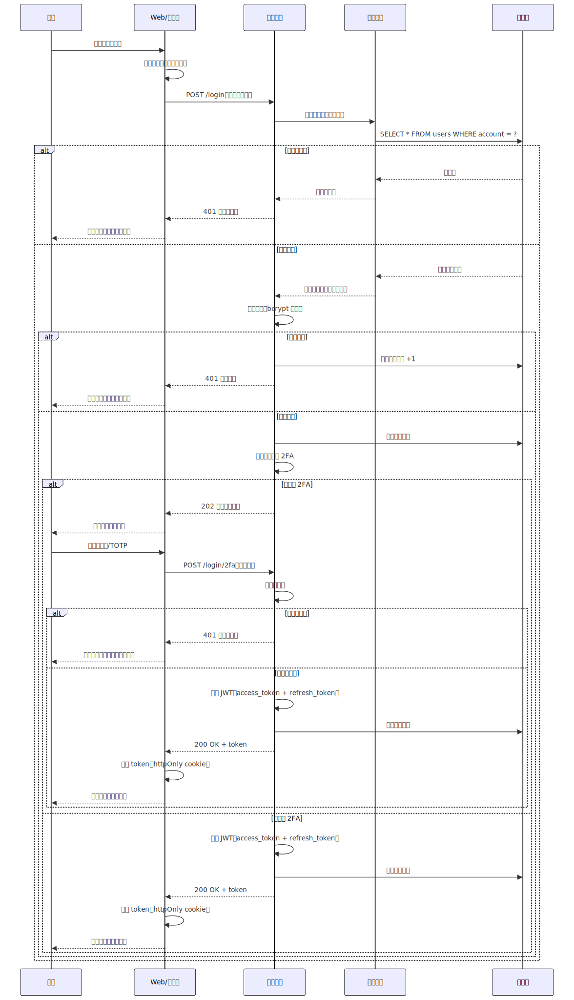

### 示例 2：C4 PlantUML 容器图 — 电商微服务

提示词（复制到 Cursor）：

```text
请使用 arch-diagrammer 生成一张「电商微服务」的 C4-PlantUML 容器图（Container Diagram）。

要求：
- 使用 Kroki 的 c4plantuml（不要写 !includeurl）
- 组件至少包含：Web 前端、API Gateway、订单服务、库存服务、支付服务、消息队列、数据库、第三方支付
- 标注关键关系与协议（HTTP/gRPC/消息）并尽量用中文描述
输出.svg
```

渲染结果：

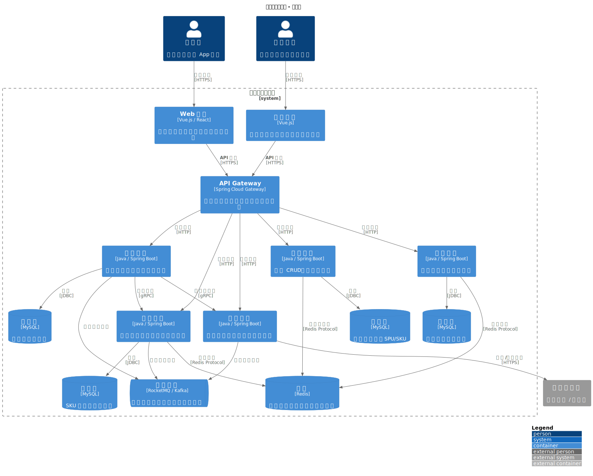

### 示例 3：Graphviz 依赖图 — 服务依赖关系

提示词（复制到 Cursor）：

```text
请使用 arch-diagrammer 生成一张「服务依赖关系」的 Graphviz 依赖图（dot）。

要求：
- 用有向图表示调用/依赖关系
- 节点至少包含：api-gateway、user-service、order-service、inventory-service、payment-service、notification-service、auth-service、mysql、redis、mq
- 将“存储/中间件”（mysql/redis/mq）用不同形状或颜色区分
- 图中尽量用英文 service 名 + 中文说明（可用 label）
输出.svg
```

渲染结果：

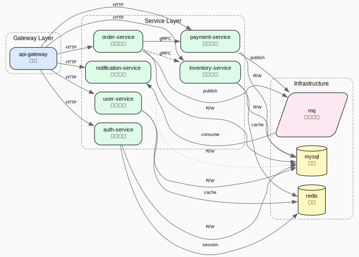

## 参考

- `SKILL.md`：完整工作流与约定
- `references/architecture-checklist.md`：质量自检清单
- `references/svg-layered-spec.md`：纯 SVG 分层图规范与风格模板索引
- `references/diagram-quickstart.md`：Mermaid/PlantUML/Graphviz 语法速查

