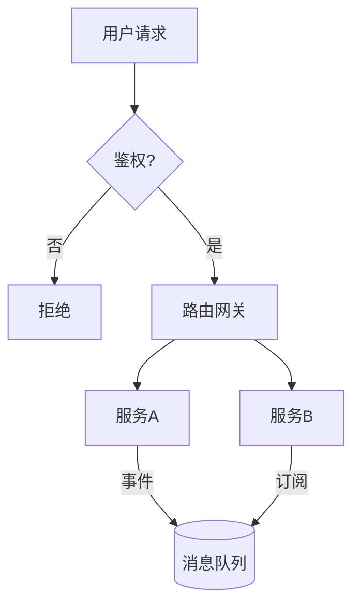
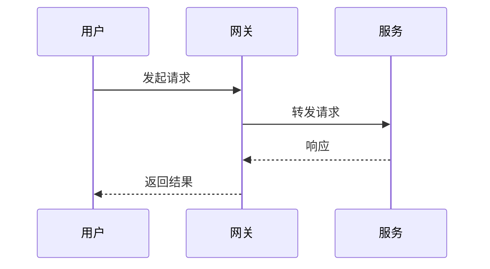
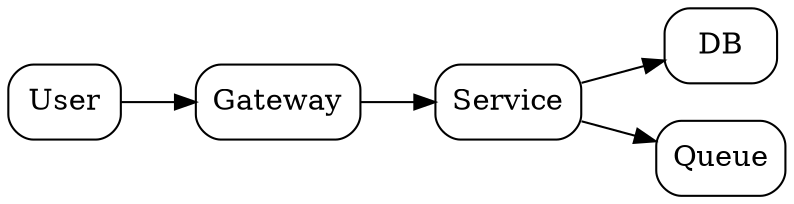

# 制图语法速查与范例

本页提供常用图形语言的最小可用片段与惯用法，便于快速起稿并通过 Kroki 渲染为 SVG/HTML。

## Mermaid

### 流程图（Flowchart）


### 时序图（Sequence Diagram）


## PlantUML（含 C4 模型）

> Kroki 内置 C4-PlantUML 宏支持，使用 `--type c4plantuml`（别名 `c4`）时**不需要** `!includeurl` 引用 C4 库。
> 如果通过本地 PlantUML 渲染（非 Kroki），才需要 `!includeurl` 远程引用。

### C4 上下文图（Context）

渲染命令：`python scripts/render_kroki.py --type c4plantuml --in context.puml --out context.svg`

```plantuml
@startuml
Person(user, "用户", "使用系统的人")
System_Boundary(sys, "系统") {
  System(api, "API 服务", "提供业务能力的服务")
}
System_Ext(pay, "支付平台", "第三方")

Rel(user, api, "调用")
Rel(api, pay, "支付请求")
@enduml
```

### C4 容器图（Container）

渲染命令：`python scripts/render_kroki.py --type c4plantuml --in container.puml --out container.svg`

```plantuml
@startuml
System_Boundary(sys, "系统") {
  Container(gw, "API Gateway", "NGINX/Envoy", "统一入口")
  Container(svc, "业务服务", "Java/Spring", "核心业务逻辑")
  ContainerDb(db, "主库", "MySQL", "事务数据")
  Container(queue, "队列", "Kafka", "异步解耦")
}

Rel(gw, svc, "HTTP")
Rel(svc, db, "JDBC")
Rel(svc, queue, "生产/消费")
@enduml
```

## Graphviz（DOT）


## 渲染提示
- Mermaid 更适合流程/时序；PlantUML 适合 C4/时序/用例；Graphviz 适合结构/依赖关系
- Kroki 支持 28 种图类型（D2、DBML、Ditaa、Erd、BPMN、Excalidraw、Nomnoml 等），用 `--list-types` 查看完整列表
- C4 图用 `--type c4plantuml`（别名 `c4`），Kroki 已内置 C4 宏，源文件无需 `!includeurl`
- 遇到特殊字符渲染失败时加 `--json` 切换为 JSON POST API
- 输出 HTML 时：
  - Mermaid：默认生成包含 CDN 渲染逻辑的独立 HTML（不经过 Kroki）
  - 其他类型：先通过 Kroki 渲染 SVG，再包裹到 HTML

