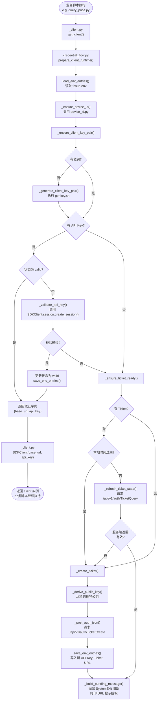

# OpenAPI 开通指引

> ⚠️ 未完全确认，持续更新中

**参考文档：**
- 开通指引：<https://openapi-docs.fosunxcz.com/?spec=guidelines>
- 密钥生成：<https://openapi-docs.fosunxcz.com/?spec=encryption_key>

---

## 角色说明

| 角色 | 说明 |
|------|------|
| 🤖 小龙虾（AI 助手） | 自动执行技术准备工作（生成设备编码、密钥、Ticket 等） |
| 👤 客户 | 负责打开开通页并完成授权 |

---

## 引导流程

### 流程图 (自动凭证状态机与代码调用链路)

### Step 0 — 初始化本地资产

首次进入工作区时，小龙虾先自动准备以下本地资产：

1. **设备唯一编码**
   - 自动生成稳定的 `FSOPENAPI_MAC_ID`
   - 后续重复使用，不读取真实网卡 MAC
2. **客户端密钥对**
   - 若本地缺失私钥，则调用 `genkey.sh` 生成新的 P-384 密钥对
   - 私钥写入 `fosun.env`
   - 公钥用于后续 `TicketCreate`

### Step 1 — 检查 API Key 状态

- **已有 API Key 且本地已标记有效** → 直接进入交易流程
- **已有 API Key 但没有有效标记** → 调用现有 OpenAPI 校验逻辑确认是否生效
- **没有 API Key / 校验未通过** → 继续 Step 2

### Step 2 — 检查 Ticket 状态

- **已有 Ticket 且未过期** → 调用 `TicketQuery`
- **Ticket 仍有效** → 继续保留开通 URL，等待客户完成授权
- **Ticket 过期或不存在** → 继续 Step 3

> 密钥生成详细说明参见 [KEYGEN.md](./KEYGEN.md)。

### Step 3 — 🤖 创建 Ticket 并换取凭证

小龙虾自动调用 `TicketCreate`：

| 请求字段 | 来源 |
|--------|------|
| `macId` | Step 0 生成的稳定设备编码 |
| `clientPubKey` | 由本地私钥导出的客户端公钥 |

接口返回并写入 `fosun.env`：

| 返回字段 | 用途 |
|--------|------|
| `apiKey` | 写入 `FSOPENAPI_API_KEY` |
| `serverPublicKey` | 写入 `FSOPENAPI_SERVER_PUBLIC_KEY` |
| `ticket` | 写入 `FSOPENAPI_TICKET` |
| `expireTime` | 写入 `FSOPENAPI_TICKET_EXPIRE_TIME` |
| `url` | 写入 `FSOPENAPI_OPEN_URL` |

同时更新状态：
- `FSOPENAPI_API_KEY_STATUS=pending`
- `FSOPENAPI_TICKET_STATUS=active`

### Step 4 — 👤 客户完成开通

客户使用 `FSOPENAPI_OPEN_URL` 打开开通页并完成授权。

在 Ticket 有效期内，小龙虾每次发起交易脚本时都会：
- 先校验 API Key 是否已经生效
- 若尚未生效，再调用 `TicketQuery` 确认 Ticket 是否仍有效
- 若 Ticket 已失效，则重新创建新的 Ticket 与 URL

### Step 5 — 🤖 标记为可用

当 API Key 校验通过后，小龙虾自动更新：

| 状态项 | 说明 |
|--------|------|
| `FSOPENAPI_API_KEY_STATUS=valid` | 下次不再重复校验 |
| `FSOPENAPI_API_KEY_VERIFIED_AT` | 最近一次校验成功时间 |

---

## ✅ 配置完成

使用 SDK 进行初始化与握手，即可开始调用接口。

---

## 补充说明

- 密钥算法：ECDH（会话密钥交换）+ HMAC-SHA256（数字签名）+ AES256-GCM（数据加密）
- **备份密钥文件，切勿泄露私钥**
- Ticket 仅作开通过渡态使用，最终是否可交易仍以 API Key 校验通过为准
