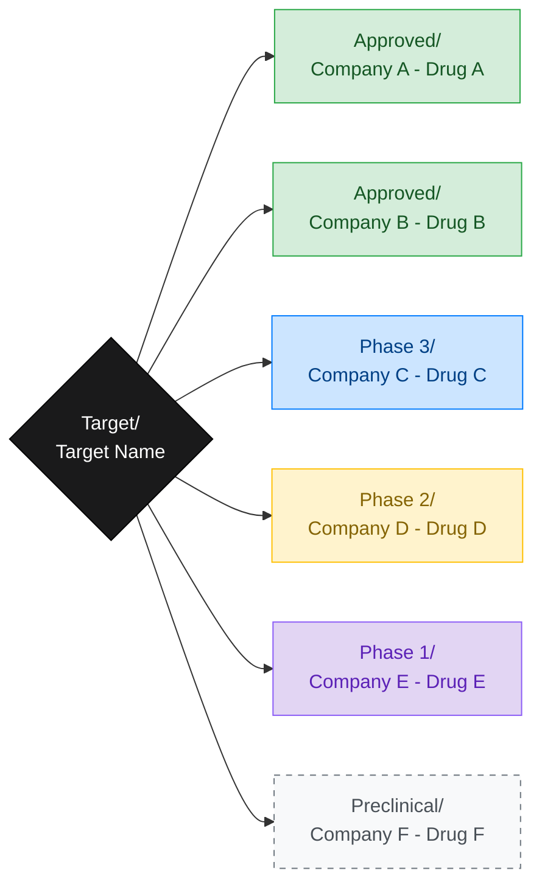
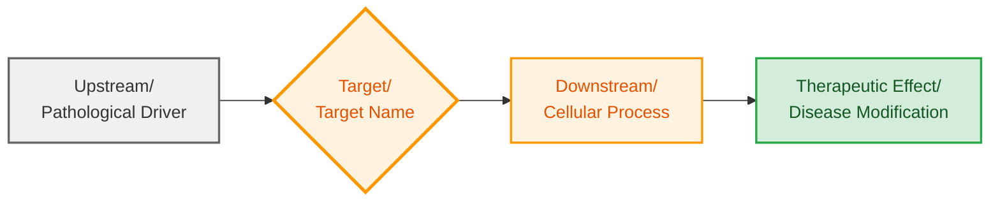
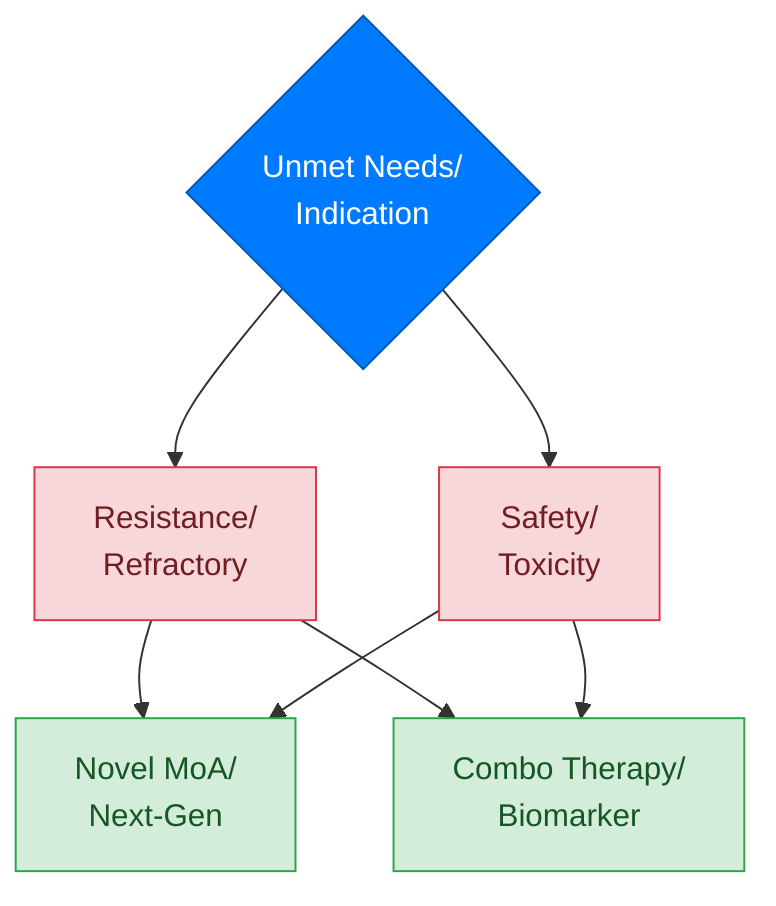
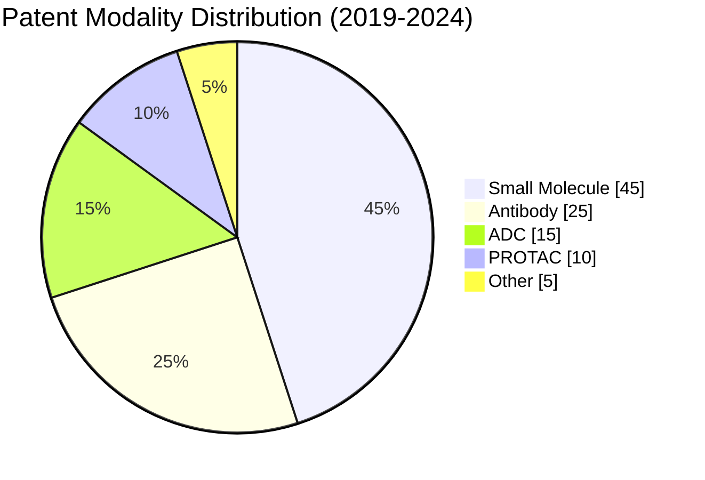
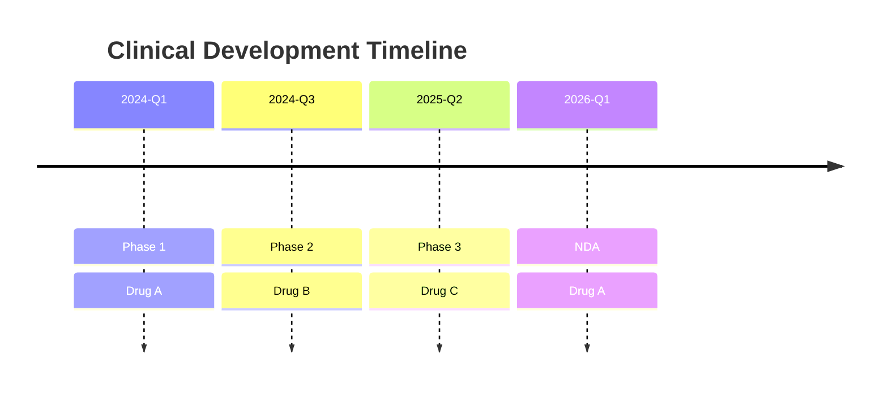
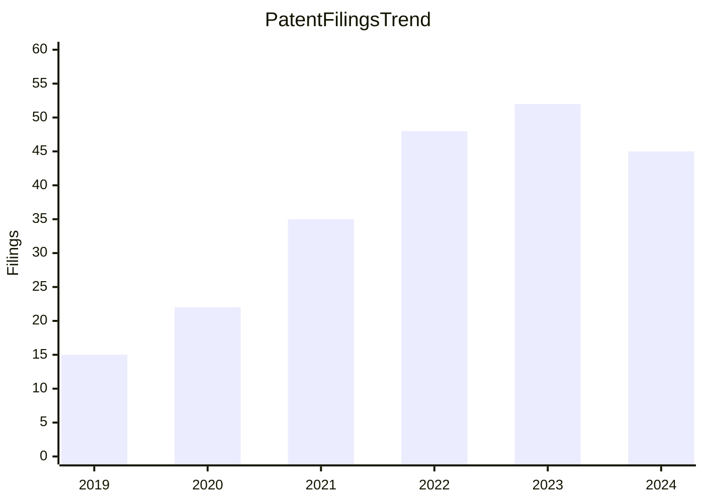

---
AIGC:
    ContentProducer: Minimax Agent AI
    ContentPropagator: Minimax Agent AI
    Label: AIGC
    ProduceID: "00000000000000000000000000000000"
    PropagateID: "00000000000000000000000000000000"
    ReservedCode1: 3045022066d1c8bfb75f743442c5774712cffa5fcc893f09fbe132e49c69e19e89e257af022100cedbba38770e26d45d83097e6529f3c8187dfb83e8abf98c5e2d1acd64f080a3
    ReservedCode2: 3045022100f0764b0cdae0988d78a2fcbe3b975a648aed404694a2c61a4c0972b31d003d1702204db597213d812879bc2cb425ca04a780d53d08a1dd5b6b043060a657fef567e2
---

# Report Templates (v3.2 - Visual-Enhanced)

This version optimizes Mermaid visualizations for professional pharmaceutical intelligence reports. All templates follow the **EUREKA_REPORT** protocol.

## Core Visual Standards
- **Color Strategy**: Professional palette with better contrast
- **Design Logic**: `graph LR` (Left-to-Right) for R&D funnel simulation
- **Simplicity**: Avoid complex subgraph nesting for compatibility

---

## 1. Pipeline Arena Map (Universal Template)

The primary visualization for competitive landscape analysis.

---

## 2. Mechanism Action Chain (Universal Template)

Used for biological rationale and Target-to-Disease mapping.

---

## 3. Competitive Landscape (Cross-Mechanism)

Used for Indication-level reports to compare different drug classes.

---

## 4. Patent Modality Distribution (Universal Template)

---

## 5. Clinical Development Timeline (Universal Template)

---

## 6. Patent Filing Trend (Year-over-Year)

---

## 7. Evidence Hierarchy Reference

| Evidence Level | Definition | Citation Format |
|---------------|------------|-----------------|
| **Level A** | Verified Fact | `<refer e_id="..." e_type="patent" />` |
| **Level B** | Inference | `<refer e_id="..." e_type="inference" />` |
| **Level C** | Open Gap | No citation needed |

---

## Template Metadata
- **Producer**: PatSnap LS Product Team
- **Protocol**: EUREKA_REPORT v3.2
