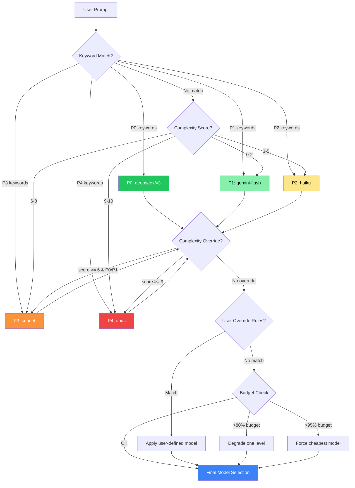

# 💰 Cost Optimizer

> Save 60-80% on your AI token costs. Zero config required.

[](https://openclaw.dev)
[](./openclaw.json)
[](./LICENSE)
[](#compatibility)
[](https://nodejs.org)

---

## The Problem

Running AI-powered dev tools with default settings is **shockingly expensive**:

| Metric | Default (all Opus) |
|--------|-------------------|
| Daily token usage | ~500K tokens |
| **Daily cost** | **~$13.50/day** |
| **Monthly cost** | **~$405/month** |
| Heartbeat alone | $50-100/month |

Most of that spend is wasted — heartbeat checks, file listings, and simple queries don't need a $27/M-token model.

## The Solution

**Cost Optimizer** intelligently routes each task to the cheapest model that can handle it. With the `balanced` preset, you cut costs by **84%** — from $405/month down to ~$64/month.

Five subcommands. One skill. Massive savings.

## Features

| Command | What it does |
|---------|-------------|
| `/cost-route` | Classifies your prompt (P0-P4) and recommends the optimal model |
| `/cost-compress` | Compresses conversation context when it exceeds 50K tokens |
| `/cost-heartbeat` | Optimizes heartbeat interval, content, and model selection |
| `/cost-report` | Generates detailed cost reports with ASCII charts and trends |
| `/cost-config` | Generates optimized configuration with three preset tiers |

## Quick Start

**Install:**

```bash
openclaw install cost-optimizer
```

**Use:**

```bash
# See your current spending
/cost-optimizer report

# Get a routing recommendation for your next prompt
/cost-optimizer route

# Generate optimized config (balanced preset)
/cost-optimizer config
```

That's it. No API keys, no setup, no config files needed.

---

## Commands

### `/cost-route` — Smart Model Routing

Analyzes your prompt across multiple dimensions and recommends the cheapest model that meets quality requirements.

**How it works:**

1. Loads pricing data from `references/model-pricing.md` (falls back to hardcoded `MODEL_PRICING` constant)
2. Extracts classification features: keywords, complexity score (0-10), context length, code ratio
3. Matches against P0-P4 routing rules (see [Model Routing Rules](#model-routing-rules))
4. Applies degradation if needed (rate limits, timeouts, budget thresholds)
5. Outputs a structured recommendation

**Parameters:**

| Parameter | Description | Default |
|-----------|------------|---------|
| *(none)* | Analyzes the current prompt context | — |

**Output example:**

```
## 🔀 Model Routing Recommendation

| Dimension        | Value                       |
|------------------|-----------------------------|
| Task Category    | code_generation             |
| Complexity Score | 5/10                        |
| Context Length   | 12,000 tokens               |
| Recommended      | claude-sonnet-4-6            |
| Estimated Cost   | $0.027/call                 |
| vs Default       | Saves 80%                   |

> Routing basis: Keywords [implement, test], Complexity: 5/10
```

**Custom overrides** — add your own routing rules in `openclaw.json`:

```json
{
  "cost-optimizer": {
    "routing": {
      "overrides": [
        { "pattern": "deploy|发布", "model": "claude-sonnet-4-6", "reason": "Deploy needs reliability, not max intelligence" }
      ]
    }
  }
}
```

---

### `/cost-compress` — Context Compression

Reduces token usage by compressing conversation history while preserving recent context.

**Triggers:**
- **Auto:** When context exceeds 50K tokens
- **Manual:** `/cost-optimizer compress`

**Compression strategies by category:**

| Category | Compression Rate | Strategy |
|----------|-----------------|----------|
| Recent 5 turns | 0% (preserved) | Kept in full |
| Older turns | 80-90% | One-line summaries |
| Tool results | 70-85% | Key output only (path + summary) |
| File contents | 90-95% | Path + line count + function list |
| Code blocks | 50-70% | Signatures + key logic |
| System context | 0% | Never compressed |

**Output example:**

```
## 📦 Context Compression Report

| Metric         | Value                            |
|----------------|----------------------------------|
| Before         | 82,000 tokens (~$0.44)           |
| After          | 24,600 tokens (~$0.13)           |
| Saved          | 57,400 tokens (~$0.31, 70%)      |
| Turns Preserved| Last 5 turns fully retained      |
| Snapshot       | .context-snapshot.md             |
```

---

### `/cost-heartbeat` — Heartbeat Optimization

Default heartbeat burns $50-100/month. This command brings it under $5/month.

**What's wrong with defaults:**

| Problem | Default | Optimized |
|---------|---------|-----------|
| Interval | 15-30 min | 45 min (smart) |
| Content | Full status report | Minimal (3 checks) |
| Model | Default (expensive) | deepseek/v3 ($0.07/M) |
| Monthly cost | $50-100 | **< $5** |

**Smart interval adjustment:**

| Condition | Interval | Icon |
|-----------|----------|------|
| Active development (frequent file changes) | 30 min | 🟢 |
| Normal working hours | 45 min | 🟡 |
| Idle (no changes > 30 min) | 60 min | 🔴 |
| Night hours (23:00-07:00) | 120 min or disabled | 🌙 |

**Minimal checks** (replaces full status report):
- `process_alive` — is the process running?
- `disk_space_critical` — disk space OK?
- `active_tasks_count` — how many tasks in flight?

---

### `/cost-report` — Usage Report

Generates a comprehensive cost breakdown with charts and savings recommendations.

**Data sources:**
- Usage log at `~/.openclaw/usage-log.jsonl`
- Current session estimation (if no log exists)
- Pricing data from `references/model-pricing.md`

**Output includes:**
- Session/daily/weekly/monthly totals
- Cost breakdown by model and task type
- 7-day trend with ASCII bar chart
- Actionable savings recommendations

**ASCII chart example:**

```
03-14  | $12.30 | ████████████░░░░░░░░
03-15  | $ 8.50 | ████████░░░░░░░░░░░░
03-16  | $15.20 | ███████████████░░░░░
03-17  | $ 6.30 | ██████░░░░░░░░░░░░░░
03-18  | $11.00 | ███████████░░░░░░░░░
03-19  | $ 3.20 | ███░░░░░░░░░░░░░░░░░
03-20  | $ 1.50 | █░░░░░░░░░░░░░░░░░░░
       +---------+────────────────────
         Total: $58.00  Avg: $8.29
```

---

### `/cost-config` — Configuration Generator

Generates a complete optimized `openclaw.json` with three preset tiers.

**Presets:**

| Preset | Daily Cost | Monthly Cost | Savings | Best For |
|--------|-----------|-------------|---------|----------|
| `conservative` | $8-12 | $240-360 | ~40% | First-time users, risk-averse |
| **`balanced`** ⭐ | **$4-8** | **$120-240** | **~84%** | **Daily development (recommended)** |
| `aggressive` | $1-4 | $30-120 | ~97% | Budget-constrained, simple tasks |

**Workflow:**
1. Analyzes your current config
2. Generates optimized config with diff preview
3. Shows estimated savings
4. Backs up existing config before applying (`openclaw.json.bak.{timestamp}`)
5. Validates JSON after writing

---

## Cost Comparison

### Three Scenarios (500K tokens/day)

| Metric | No Optimization | Balanced | Aggressive |
|--------|----------------|----------|------------|
| Model allocation | 100% Opus | Mixed routing | Mostly cheap models |
| Daily cost | $13.50 | $2.12 | $0.45 |
| **Monthly cost** | **$405.00** | **$63.60** | **$13.50** |
| **Monthly savings** | — | **$341.40 (84%)** | **$391.50 (97%)** |
| Code quality risk | None | None | ⚠️ Possible degradation |

### Visual Comparison

```
Monthly Cost (500K tokens/day)

No Optimization  $405 |████████████████████████████████████████████████████|
Balanced          $64 |████████                                            |
Aggressive        $14 |██                                                  |
                      +----------------------------------------------------
                      $0              $100             $200             $400
```

### Model Pricing Reference (per 1M tokens, blended 4:1 input/output)

| Model | Blended Price | Relative to Opus | Used For |
|-------|--------------|-------------------|----------|
| deepseek/v3 | $0.084 | 0.3% | Heartbeat, status checks |
| gemini-2.0-flash | $0.16 | 0.6% | Simple queries, file lists |
| claude-haiku-4-5 | $1.44 | 5.3% | File reads, code completion |
| claude-sonnet-4-6 | $5.40 | 20.0% | Code generation, debugging |
| claude-opus-4-6 | $27.00 | 100.0% | Complex architecture (use sparingly) |

---

## Model Routing Rules

### P0-P4 Classification Table

| Priority | Condition | Target Model | Cost/1M tokens | Example Prompts |
|----------|-----------|-------------|----------------|-----------------|
| **P0** | Heartbeat, status, cron, ping | `deepseek/v3` | $0.084 | "heartbeat check", "ping" |
| **P1** | Simple queries (complexity 0-2) | `gemini-2.0-flash` | $0.16 | "find all .tsx files", "list components" |
| **P2** | File reads, completion, lint | `claude-haiku-4-5` | $1.44 | "read page.tsx", "fix eslint error" |
| **P3** | Code generation, debug, test | `claude-sonnet-4-6` | $5.40 | "implement login component", "write tests" |
| **P4** | Architecture, multi-file refactor | `claude-opus-4-6` | $27.00 | "design microservice architecture" |

### Routing Decision Flow



### Degradation Chain

When errors occur, the system automatically falls back:

```
claude-opus-4-6 → claude-sonnet-4-6 → claude-haiku-4-5 → gemini-2.0-flash → deepseek/v3
```

| Trigger | Action |
|---------|--------|
| HTTP 429 (rate limit) | Degrade one level, retry after cooldown |
| HTTP 503 (unavailable) | Degrade one level, probe every 5 min |
| Response > 30s | Degrade one level for session |
| Cost > 80% budget | Force degrade one level |
| Cost > 95% budget | Force cheapest model |

---

## Configuration Presets

### Conservative — Safe first optimization

```json
{
  "model_routing": { "default_model": "claude-sonnet-4-6" },
  "heartbeat": { "base_interval_minutes": 30, "model": "gemini-2.0-flash" },
  "cost_limits": { "daily_budget_usd": 12.00 }
}
```
Best for: teams new to cost optimization, production-critical workflows.

### Balanced (Recommended) — Best cost/quality ratio

```json
{
  "model_routing": { "default_model": "claude-sonnet-4-6", "enabled": true },
  "heartbeat": { "base_interval_minutes": 45, "model": "deepseek/v3" },
  "context": { "auto_compress_threshold": 50000 },
  "cost_limits": { "daily_budget_usd": 10.00 }
}
```
Best for: daily development, individual developers, most use cases.

### Aggressive — Maximum savings

```json
{
  "model_routing": { "default_model": "claude-haiku-4-5" },
  "heartbeat": { "base_interval_minutes": 60, "model": "deepseek/v3" },
  "cost_limits": { "daily_budget_usd": 3.00 }
}
```
Best for: budget-constrained projects, simple task workloads. ⚠️ May reduce code quality for complex tasks.

---

## Architecture

The skill is built around a shared utility library (`index.ts`) with the following core functions:

| Function | Signature | Description |
|----------|-----------|-------------|
| `classifyTask` | `(prompt: string) → TaskCategory` | Multi-dimensional task classification (keywords + complexity scoring), returns P0-P4 priority |
| `estimateTokens` | `(text: string) → number` | Fast token estimation with Chinese/English/code-aware heuristics |
| `routeModel` | `(category, contextSize) → ModelChoice` | Selects cheapest model meeting quality requirements, with context-size override |
| `compressContext` | `(messages[], budget) → CompressedContext` | Compresses conversation history: summarizes old turns, extracts key decisions, preserves recent context |
| `parseUsageLog` | `(rawContent: string) → ParseResult` | Safely parses JSONL usage logs, skipping corrupted lines |
| `generateUsageReport` | `(entries[]) → UsageReport` | Aggregates usage data by model/task/day with recommendations |
| `calculateSavings` | `(entries[]) → SavingsEstimate` | Simulates routing on historical data to estimate potential savings |
| `renderAsciiBarChart` | `(daily[], width?) → string` | Renders daily cost data as an ASCII bar chart |

**Key types:** `TaskPriority` (P0-P4), `ModelId` (5 supported models), `ModelChoice`, `CompressedContext`, `UsageReport`, `SavingsEstimate`.

**Error handling philosophy:**
- Read failure → degrade to defaults (never abort)
- Write failure → fall back to stdout
- Parse failure → skip bad lines, report count
- Config write → backup first; if backup fails, refuse to write

---

## Compatibility

| Feature | OpenClaw | Claude Code |
|---------|----------|-------------|
| Model routing | ✅ Full support | ✅ Via `/model` switch suggestion |
| Context compression | ✅ Full support | ✅ Generates snapshot file |
| Heartbeat optimization | ✅ Full support | ⚠️ Requires manual cron config |
| Usage reporting | ✅ Reads JSONL log | ✅ Session-based estimation |
| Config generation | ✅ `openclaw.json` | ✅ `settings.json` |

**Requirements:**
- Runtime: Node.js
- Platforms: macOS, Linux, Windows (WSL)

---

## Contributing

1. Fork this repository
2. Create a feature branch: `git checkout -b feature/my-improvement`
3. Make your changes and test
4. Submit a pull request

Please follow the existing code style and include tests for new functionality.

## License

[MIT](./LICENSE) — OpenClaw Community

---

## 中文说明

### 概述

Cost Optimizer 是 OpenClaw/Claude Code 的成本优化工具包，通过三大核心策略将 AI token 开销降低 60-80%：

1. **智能模型路由** — 将任务分为 P0-P4 五个等级，自动匹配最经济的模型。心跳检查用 deepseek/v3（$0.084/M），日常编码用 sonnet（$5.40/M），仅复杂架构任务使用 opus（$27.00/M）。

2. **上下文压缩** — 当对话上下文超过 50K tokens 时自动压缩：保留最近 5 轮完整对话，历史部分生成一句话摘要，工具调用结果仅保留关键输出。压缩率 70-90%。

3. **Heartbeat 优化** — 默认心跳每月消耗 $50-100。优化后：延长间隔（45分钟基线 + 智能调整）、精简检查内容（仅 3 项必要检查）、使用最便宜模型，月成本降至 $5 以下。

### 核心数据

| 方案 | 日均成本 | 月均成本 | 节省 |
|------|---------|---------|------|
| 无优化（全 Opus） | $13.50 | $405 | — |
| **Balanced（推荐）** | **$2.12** | **$64** | **84%** |
| Aggressive | $0.45 | $14 | 97% |

### 快速使用

```bash
# 安装
openclaw install cost-optimizer

# 查看消耗报告
/cost-optimizer report

# 生成优化配置
/cost-optimizer config

# 获取路由建议
/cost-optimizer route

# 压缩上下文
/cost-optimizer compress

# 优化心跳
/cost-optimizer heartbeat
```

### 五个子命令

| 命令 | 功能 |
|------|------|
| `/cost-route` | 分析 prompt，推荐最优模型（P0-P4 五级分类） |
| `/cost-compress` | 压缩对话上下文，生成 `.context-snapshot.md` |
| `/cost-heartbeat` | 优化心跳配置（间隔/内容/模型），月省 $45-95 |
| `/cost-report` | 生成消耗报告（按模型/任务/日期聚合 + ASCII 图表） |
| `/cost-config` | 一键生成优化配置（conservative / balanced / aggressive 三档） |
