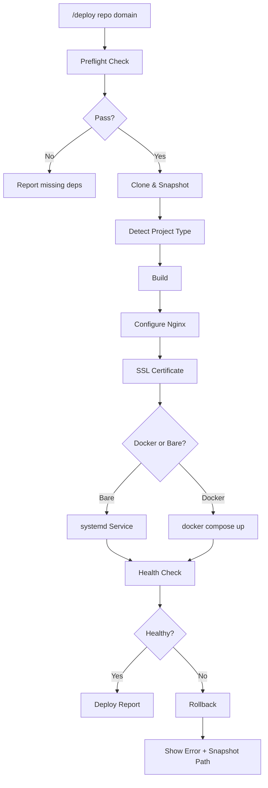

# DevOps Agent

> Your on-call DevOps assistant. Deploy, monitor, backup, diagnose — all with safety guardrails.

[](https://github.com/anthropics/claude-code)
[](LICENSE)
[]()
[]()

## Overview

DevOps Agent turns tedious operational tasks into single-line commands. Clone a repo, build it, configure Nginx with SSL, set up systemd — all from one `/devops-agent deploy` call. Need monitoring? One command stands up Prometheus + Grafana with pre-built dashboards and alert rules. Every action is logged, snapshotted, and reversible.

## Features

- **Deploy** — Clone, build, configure reverse proxy + SSL, and launch as a system service
- **Monitor** — Install Prometheus + Grafana, wire up exporters, import dashboards, configure alerts
- **Backup** — Automated database/directory backups with cron scheduling, encryption, and retention policies
- **Diagnose** — Intelligent fault detection with keyword-driven diagnostic routing and structured reports

## Quick Start

```bash
# Deploy a project to a domain
/devops-agent deploy https://github.com/user/app example.com

# Set up monitoring for a service
/devops-agent monitor my-api

# Configure daily PostgreSQL backups to S3
/devops-agent backup postgresql s3://my-bucket

# Diagnose why a site is down
/devops-agent diagnose "website returns 502"
```

All commands support `--dry-run` to preview actions without executing them.

## Commands

### `/deploy [repo-url] [domain]`

Full deployment pipeline: environment preflight, git clone, auto-detect project type, build, Nginx reverse proxy, SSL via Let's Encrypt, systemd/Docker service, and health check.

**Syntax:**
```
/devops-agent deploy <repo-url> <domain> [--docker|--bare] [--dry-run] [--port PORT]
```

**Examples:**
```bash
# Deploy a Node.js app with auto-detection
/devops-agent deploy https://github.com/user/nextjs-app example.com

# Force Docker mode on a custom port
/devops-agent deploy https://github.com/user/api api.example.com --docker --port 8080

# Preview what would happen without executing
/devops-agent deploy https://github.com/user/app example.com --dry-run
```

**Auto-detected project types:**

| File | Type | Build Command |
|------|------|--------------|
| `package.json` | Node.js | `npm ci && npm run build` |
| `requirements.txt` / `pyproject.toml` | Python | venv + pip install |
| `go.mod` | Go | `go build -o app .` |
| `Cargo.toml` | Rust | `cargo build --release` |
| `Dockerfile` | Docker | `docker build -t <app> .` |
| `docker-compose.yml` | Docker Compose | `docker compose up -d` |

**Deployment flow:**



After deployment, a `deploy-report.md` is generated with service status, rollback commands, and next-step suggestions.

---

### `/monitor [service-name]`

Stands up a full Prometheus + Grafana monitoring stack, installs the right exporters for your service, imports pre-built dashboards, and configures alert rules.

**Syntax:**
```
/devops-agent monitor <service-name> [--dry-run] [--alert-telegram|--alert-slack|--alert-email]
```

**Examples:**
```bash
# Monitor a web API with Slack alerts
/devops-agent monitor my-api --alert-slack

# Monitor PostgreSQL with Telegram notifications
/devops-agent monitor postgresql --alert-telegram
```

**Supported exporters:**

| Service | Exporter | Default Port |
|---------|----------|-------------|
| System | node_exporter | 9100 |
| Node.js | prom-client (integration guide) | app/metrics |
| PostgreSQL | postgres_exporter | 9187 |
| MySQL | mysqld_exporter | 9104 |
| MongoDB | mongodb_exporter | 9216 |
| Nginx | nginx-prometheus-exporter | 9113 |
| Redis | redis_exporter | 9121 |
| Docker | cAdvisor | 8080 |

**Pre-configured alert rules:** CPU > 80%, Memory > 90%, Disk > 85%, Service Down — all with configurable thresholds.

**Alert channels:** Telegram, Slack, Email — credentials are prompted at setup, never hardcoded.

---

### `/backup [target] [destination]`

Generates and schedules automated backup scripts with integrity verification, encryption, and multi-tier retention.

**Syntax:**
```
/devops-agent backup <target> <destination> [--schedule CRON] [--encrypt] [--retain DAYS] [--dry-run]
```

**Examples:**
```bash
# Daily PostgreSQL backup to S3, encrypted, keep 60 days
/devops-agent backup postgresql s3://my-bucket --encrypt --retain 60

# MySQL backup to local path with custom schedule (every 6 hours)
/devops-agent backup mysql /var/backups --schedule "0 */6 * * *"

# Directory backup via rsync
/devops-agent backup /opt/app-data rsync://backup-host/data
```

**Supported backup targets:**

| Target | Method |
|--------|--------|
| PostgreSQL | `pg_dumpall` |
| MySQL | `mysqldump --single-transaction` |
| MongoDB | `mongodump --gzip` |
| Directory | `tar czf` |

**Supported destinations:** Local path, `s3://`, `oss://`, `rsync://`

**Retention policy:** Daily (7 days) / Weekly (4 weeks) / Monthly (12 months) — automatically rotated.

---

### `/diagnose [problem description]`

Intelligent fault diagnosis with keyword-driven routing. Collects system baselines, runs targeted checks, analyzes logs, and outputs a severity-ranked diagnosis report.

**Syntax:**
```
/devops-agent diagnose <problem-description> [--deep] [--dry-run]
```

**Examples:**
```bash
# Website returning errors
/devops-agent diagnose "502 bad gateway on example.com"

# Performance issues
/devops-agent diagnose "server response time over 5 seconds"

# Storage problems
/devops-agent diagnose "disk full on /var"

# Database connectivity
/devops-agent diagnose "postgresql connection refused"
```

**Diagnostic routing:**

| Keywords | Checks Performed |
|----------|-----------------|
| 502, site down, can't access | Nginx config, ports, upstream services, DNS, SSL, firewall |
| slow, performance, lag | CPU/IO profiling, connection counts, DB slow queries, OOM killer |
| disk full, no space | Large file scan, directory usage, log rotation, Docker disk |
| connection refused, DB error | Service status, connection limits, auth config, listen addresses |
| *(other)* | Full-spectrum system check |

Outputs a structured `diagnosis-report.md` with findings ranked by severity (Critical / Warning / Info), evidence, and actionable fix commands.

---

## Safety First

Safety is the core design principle. Every operation follows six safety guarantees:

### 1. Destructive Operation Confirmation
Commands like `rm -rf`, `DROP DATABASE`, `systemctl stop`, `docker rm`, and firewall changes **always** require explicit user approval before execution. The exact command is shown for review.

### 2. Dry-Run Mode
Every command supports `--dry-run`. When enabled, the agent outputs the full list of commands it *would* execute without running any of them. Review first, execute after.

### 3. Snapshot & Rollback
Before any modification, the agent:
- Snapshots existing files to `~/.devops-agent/snapshots/<timestamp>/`
- Records current service state
- Generates executable rollback commands

Rollback is one command: `bash scripts/rollback.sh <snapshot-dir>`

### 4. Operation Logging
Every critical action is logged with timestamps:
```
[2026-03-21 14:30:00] [DEPLOY] [ACTION] cloned repo to /opt/apps/myapp
```
Log location: `/var/log/devops-agent.log` (falls back to `~/devops-agent.log`)

### 5. Secret Redaction
Passwords, API keys, and tokens are **never** printed in logs, reports, or terminal output. Configuration files reference secrets via environment variables, not hardcoded values.

### 6. Permission Transparency
Any operation requiring `sudo` is flagged in advance with an explanation of *why* elevated privileges are needed. The agent waits for confirmation before proceeding.

## Included Templates

The `references/` directory contains ready-to-use configuration templates:

| File | Contents |
|------|----------|
| `references/nginx-templates.md` | Nginx reverse proxy configs — static sites, Node.js, Python, WebSocket support |
| `references/systemd-templates.md` | systemd unit files for various application types |
| `references/grafana-dashboards.md` | Grafana dashboard JSON — system overview, Node.js, database metrics |

Templates are automatically selected and customized based on the detected project type during deployment.

## Scripts

| Script | Purpose |
|--------|---------|
| `scripts/preflight-check.sh` | Pre-flight environment validator — checks OS, architecture, required tools, network, disk space, and permissions. Runs automatically before every command. |
| `scripts/rollback.sh` | Deployment rollback — restores files and service state from a snapshot directory. Supports `--dry-run`. |
| `scripts/backup-generator.sh` | Backup script generator — produces customized backup shell scripts based on target type, destination, schedule, encryption, and retention settings. |

## Compatibility

| Component | Supported |
|-----------|-----------|
| **OS** | Ubuntu 20.04+, Ubuntu 22.04+, Debian 11+, CentOS 8+, macOS 12+ |
| **Architecture** | x86_64 (amd64), arm64 (aarch64) |
| **Shell** | Bash 4.0+, Zsh 5.0+ |

macOS compatibility is built in — commands automatically use platform-appropriate alternatives (e.g., `vm_stat` instead of `free -h`).

## Contributing

1. Fork the repository
2. Create a feature branch (`git checkout -b feature/my-feature`)
3. Commit your changes
4. Push and open a Pull Request

## License

[MIT](LICENSE)

---

## 中文说明

### 概述

DevOps Agent 是一个 OpenClaw 技能，把繁琐的运维任务变成一句话命令。部署、监控、备份、诊断，全部内置安全护栏。

### 核心命令

| 命令 | 功能 | 示例 |
|------|------|------|
| `deploy` | 一键部署：克隆 → 构建 → Nginx → SSL → 服务管理 | `/devops-agent deploy https://github.com/user/app example.com` |
| `monitor` | 监控搭建：Prometheus + Grafana + 告警 | `/devops-agent monitor my-api --alert-slack` |
| `backup` | 定时备份：数据库/目录 + 加密 + 轮转保留 | `/devops-agent backup postgresql s3://bucket --encrypt` |
| `diagnose` | 故障诊断：智能路由 + 日志分析 + 修复建议 | `/devops-agent diagnose "网站打不开"` |

### 安全机制

这是 DevOps Agent 最核心的设计理念：

1. **破坏性操作确认** — `rm -rf`、`DROP DATABASE`、`systemctl stop` 等操作必须用户明确批准
2. **dry-run 模式** — 所有命令支持 `--dry-run`，先看再做
3. **快照回滚** — 每次修改前自动快照到 `~/.devops-agent/snapshots/`，一条命令回滚
4. **操作日志** — 每个关键操作带时间戳记录到日志文件
5. **密钥脱敏** — 密码/密钥/token 永远不会出现在日志或终端输出中
6. **权限提醒** — 需要 sudo 时提前说明原因，等待确认

### 支持的环境

- **操作系统**：Ubuntu 20.04+、Debian 11+、CentOS 8+、macOS 12+
- **架构**：x86_64、arm64
- **Shell**：Bash 4.0+、Zsh 5.0+

### 许可证

[MIT](LICENSE)
