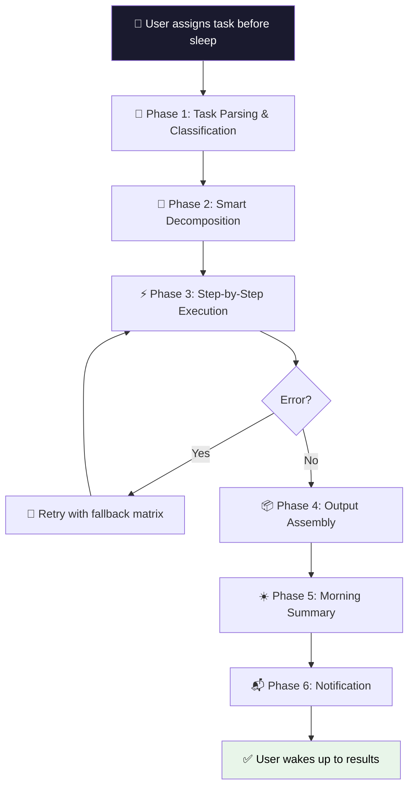

# 🌙 Overnight Worker

> Assign tasks before sleep. Get structured results by morning.

[](LICENSE)
[](https://clawhub.dev/skills/overnight-worker)
[](https://github.com/anthropics/claude-code)

## Overview

Overnight Worker is an autonomous agent skill that turns your sleep hours into productive work time. Give it a task before bed — research, writing, data processing, or code review — and wake up to a structured morning summary with all deliverables ready. It features intelligent task decomposition, multi-format output (Markdown/CSV/JSON), progress logging, automatic error recovery, token budget management, and multi-channel notifications (Telegram/macOS/Webhook).

## Features

- 🧠 **Smart Task Classification** — Keyword-based classifier auto-detects task type (research, writing, data, code-review, or hybrid)
- 📋 **Intelligent Decomposition** — Breaks tasks into 3-10 dependent sub-steps with token budget allocation
- 🔍 **Autonomous Research** — Web search with multi-angle querying, source verification, and automatic retry
- ✍️ **Structured Writing** — Outline-first approach with format-aware content generation
- 📊 **Data Processing** — Collection, cleaning, deduplication, and multi-format output (CSV/JSON/Markdown)
- 🔒 **Code Review** — Security-first audit with severity ratings (🔴 Critical / 🟡 Warning / 🟢 Suggestion)
- ☀️ **Morning Summary** — High-density summary with completion status, key findings, and action items
- 📬 **Multi-Channel Notifications** — Telegram Bot, macOS native, Webhook, with auto-detection fallback
- 💰 **Token Budget Management** — Real-time monitoring with automatic economy mode when budget runs low
- 🛡️ **Safety Contracts** — Write-only to output directory, no file deletion, no arbitrary code execution
- ♻️ **Error Recovery** — Structured retry matrix with graceful degradation per error type
- 📁 **Idempotent Execution** — Timestamped work directories ensure runs never overwrite each other

## Quick Start

### Installation

```bash
# Via ClawHub (recommended)
clawhub install overnight-worker

# Manual installation
git clone https://github.com/fullstackcrew/openclaw-skills.git
cp -r openclaw-skills/overnight-worker ~/.claude/skills/
```

### Basic Usage

```bash
# Simple research task
/overnight-worker 调研 2024 年 AI Agent 框架的技术趋势，对比主流框架的优劣

# Writing task with specific format
/overnight-worker 写一份 SaaS 产品 PRD 文档 --type writing --format md

# Data collection with JSON output
/overnight-worker 收集 Top 20 开源 LLM 的参数量、许可证和性能数据 --type data --format json

# Code review with Telegram notification
/overnight-worker 审查 src/ 目录的安全性和代码质量 --type code-review --notify telegram

# Custom token budget
/overnight-worker 深度分析竞品定价策略 --budget 150000
```

## How It Works



**Execution Phases:**

1. **Task Parsing** — Extracts task type, output format, notification channel, and token budget from user input. Runs keyword-based classifier script for strategy recommendation.
2. **Smart Decomposition** — Breaks task into 3-10 sub-steps using type-specific templates. Creates `PLAN.md` and initializes `progress.log` in a timestamped work directory.
3. **Step-by-Step Execution** — Executes sub-steps in dependency order. Each step has pre-checks (dependencies, budget), type-specific strategy, and post-execution logging.
4. **Output Assembly** — Merges intermediate files into final deliverables. Moves raw files to `.raw/` subdirectory for debugging.
5. **Morning Summary** — Generates `morning-summary.md` with completion stats, key findings, action items, and resource usage.
6. **Notification** — Pushes completion alert via configured channel with completion percentage and output path.

## Commands

```
/overnight-worker <task description> [options]
```

| Option | Values | Default | Description |
|--------|--------|---------|-------------|
| `--type` | `research`, `writing`, `data`, `code-review` | Auto-detected | Force task type (overrides classifier) |
| `--budget` | Integer (token count) | `200000` | Maximum token budget for the session |
| `--format` | `md`, `csv`, `json` | `md` | Output file format |
| `--notify` | `telegram`, `macos`, `webhook`, `auto` | `macos` | Notification channel |

## Output Structure

Each run creates a timestamped, isolated work directory:

```
~/overnight-output/
└── 2024-03-15/
    └── 231045/                    # HHmmss timestamp
        ├── PLAN.md                # Execution plan with step statuses
        ├── progress.log           # Timestamped progress log
        ├── morning-summary.md     # ☀️ Read this first
        ├── report-{topic}.md      # Research/writing deliverable
        ├── data-{topic}.csv       # Data deliverable (if --format csv)
        ├── data-{topic}.json      # Data deliverable (if --format json)
        ├── review-report.md       # Code review deliverable
        ├── index.md               # Index file (for mixed-type tasks)
        └── .raw/                  # Intermediate files (for debugging)
            ├── step-1-raw.md
            ├── step-2-raw.md
            └── ...
```

## Configuration

### Notification Setup

#### macOS Native (Default)

Works out of the box on macOS. Uses `terminal-notifier` if installed, falls back to `osascript`.

```bash
# Optional: install terminal-notifier for richer notifications
brew install terminal-notifier
```

#### Telegram Bot

```bash
# Set environment variables
export TELEGRAM_BOT_TOKEN="your-bot-token"
export TELEGRAM_CHAT_ID="your-chat-id"

# Use Telegram notifications
/overnight-worker <task> --notify telegram
```

**Setup steps:**
1. Message [@BotFather](https://t.me/BotFather) on Telegram to create a bot and get your token
2. Send a message to your bot, then use the Telegram API to get your chat ID
3. Export both values as environment variables

#### Webhook (Generic HTTP POST)

```bash
# Set webhook URL
export WEBHOOK_URL="https://your-endpoint.com/notify"

# Use webhook notifications
/overnight-worker <task> --notify webhook
```

The webhook receives a JSON payload:

```json
{
  "title": "🌙 夜间任务完成",
  "body": "完成度: 5/5 步骤 | 产出: 3 个文件 | 详见: ~/overnight-output/...",
  "timestamp": "2024-03-15T07:30:00Z",
  "source": "overnight-worker"
}
```

#### Auto-Detection

Use `--notify auto` to try all available channels in order: macOS → Telegram → Webhook → stdout fallback.

## Supported Task Types

| Type | Use Cases | Strategy | Output |
|------|-----------|----------|--------|
| **research** | Competitor analysis, market research, tech benchmarks | Multi-angle web search, source verification, comparative analysis | `report-{topic}.md` |
| **writing** | Technical docs, blog posts, PRDs, proposals | Outline → draft → revision pipeline | `report-{topic}.md` |
| **data** | Data cleaning, format conversion, aggregation | Batch processing with validation | `data-{topic}.csv/json` |
| **code-review** | PR review, security audit, tech debt assessment | Directory scan → module-level deep review | `review-report.md` |
| **hybrid** (auto-detected) | "Research competitors and write a report" | Primary type gets full template, secondary type condensed | Multiple files + `index.md` |

## Error Handling

The skill uses a structured retry matrix for resilient execution:

| Error Type | 1st Retry | 2nd Retry | Final Fallback |
|------------|-----------|-----------|----------------|
| WebSearch no results | Change keywords | Change search angle | Mark "needs manual follow-up" |
| WebFetch rejected (403/429) | Wait 5s and retry | Try alternative URL | Use search snippet instead |
| WebFetch empty content | Try alternative source | — | Mark "needs manual follow-up" |
| File write failure | Check directory permissions | Write to `/tmp` backup | Log error and continue |
| Token budget exceeded | Enter economy mode | Simplify remaining steps | Skip non-essential steps |

**Abnormal termination** is also handled gracefully — all completed deliverables are saved, a partial morning summary is generated, and a warning notification is sent.

## Token Efficiency

The skill enforces token conservation rules throughout execution:

- **Immediate filtering** — Only top 3-5 search results proceed to the next step
- **Content extraction** — Web pages are distilled to 500-1000 key characters immediately after fetch; full HTML is discarded
- **File-based intermediates** — Large intermediate data is written to files rather than kept in conversation context
- **Real-time monitoring** — Token usage is estimated after each step; economy mode activates at 80% budget usage
- **No duplicate searches** — Similar queries reuse previous results

**Economy mode** (activated when budget is tight):
- Search results limited to top 3 (normally 5)
- WebFetch truncated to first 2000 characters
- Non-essential steps (formatting, extra comparisons) are skipped
- All economy-mode actions logged in `progress.log`

## Examples

### Example 1: Competitive Research

```bash
/overnight-worker 调研 2024 年主流 AI 代码助手工具（Cursor、GitHub Copilot、Cody 等），\
  从功能、定价、用户评价三个维度对比，输出对比报告 \
  --type research --notify telegram
```

**Expected output:**
- `report-ai-code-assistants.md` — Full comparative report with tables and key findings
- `morning-summary.md` — Quick overview with top 5 insights
- Telegram notification on completion

### Example 2: Code Security Audit

```bash
/overnight-worker 对 src/api/ 目录做安全审查，重点关注 OWASP Top 10 漏洞 \
  --type code-review --budget 100000
```

**Expected output:**
- `review-report.md` — Findings sorted by severity (🔴🟡🟢) with fix suggestions and code snippets
- `morning-summary.md` — Count of critical/warning/suggestion issues

### Example 3: Data Collection

```bash
/overnight-worker 收集 GitHub 上 star 数 Top 30 的 Python Web 框架，\
  整理名称、star 数、最近更新时间、许可证类型 \
  --type data --format csv
```

**Expected output:**
- `data-python-web-frameworks.csv` — Structured CSV with all fields
- `data-python-web-frameworks-meta.md` — Field definitions and data source notes
- `morning-summary.md` — Record count and data quality summary

## Compatibility

| Platform | Support |
|----------|---------|
| **OpenClaw** | ✅ Full support |
| **Claude Code** | ✅ Full support |
| **macOS** | ✅ Native notifications |
| **Linux** | ✅ Runs (notifications via Telegram/Webhook) |

**Required tools:** `Bash`, `Read`, `Write`, `Edit`, `Grep`, `Glob`, `WebSearch`, `WebFetch`, `Task`, `Agent`

## Contributing

Contributions are welcome! Here's how:

1. Fork the repository
2. Create a feature branch (`git checkout -b feature/my-feature`)
3. Make your changes and test with a real overnight task
4. Submit a pull request

**Areas for contribution:**
- Additional task type templates
- New notification channels (Slack, Discord, email)
- Output format support (XLSX, HTML)
- Localization improvements

## License

[MIT](LICENSE) — use it freely, sleep soundly.

---

## 中文说明

### 功能概述

Overnight Worker 是一个夜间自主工作 Agent 技能。睡前给它一条任务，它会自动完成调研、写作、数据整理或代码审查，早晨生成结构化的晨间摘要和完整产出物。

**核心能力：**
- 智能任务分类与拆解（3-10 个子步骤）
- 多格式输出（Markdown / CSV / JSON）
- 多渠道通知（Telegram / macOS / Webhook）
- Token 预算管理与节约模式
- 结构化错误恢复
- 安全隔离（仅写入专属工作目录）

### 安装

```bash
# ClawHub 安装
clawhub install overnight-worker

# 手动安装
cp -r overnight-worker ~/.claude/skills/
```

### 使用示例

```bash
# 调研任务
/overnight-worker 调研主流 AI 框架的优劣对比

# 写作任务（指定格式）
/overnight-worker 写一份技术方案文档 --type writing --format md

# 数据整理（JSON 输出 + Telegram 通知）
/overnight-worker 收集开源 LLM 数据 --type data --format json --notify telegram

# 代码审查
/overnight-worker 审查 src/ 目录安全性 --type code-review
```

### 输出位置

所有产出物保存在 `~/overnight-output/YYYY-MM-DD/HHMMSS/` 目录下。早晨先看 `morning-summary.md` 获取全局概览。

### 通知配置

- **macOS**：开箱即用，支持 `terminal-notifier` 和 `osascript`
- **Telegram**：设置 `TELEGRAM_BOT_TOKEN` 和 `TELEGRAM_CHAT_ID` 环境变量
- **Webhook**：设置 `WEBHOOK_URL` 环境变量
