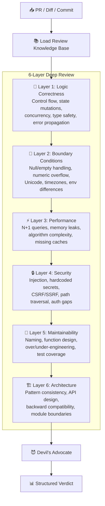
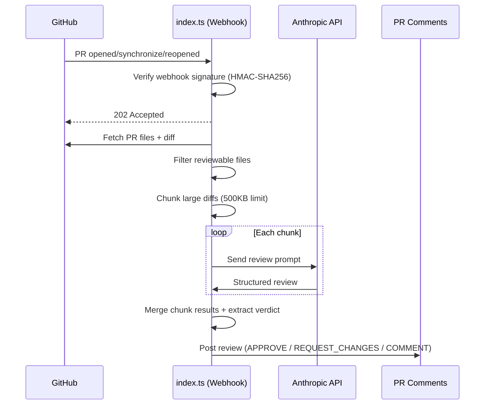

# 🔍 Smart PR Review

> An AI code reviewer with opinions. Not a yes-machine.

[](https://openclaw.dev)
[](LICENSE)
[](https://www.typescriptlang.org/)
[](SKILL.md)

---

## Why Another Code Review Tool?

Most AI code review tools are **yes-machines** — they surface linting issues, suggest minor refactors, and approve everything else. Smart PR Review is different: it acts like a **Staff Engineer who's seen production meltdowns** and won't let your code ship until the hard questions are answered.

| Feature | GitHub Copilot Code Review | Smart PR Review |
|---|---|---|
| **Review stance** | Suggests | **Judges** |
| **Says "this approach is wrong"** | Rarely | **Yes, in the Summary** |
| **Review depth** | Line-level suggestions | **6-layer deep analysis** |
| **Devil's Advocate mode** | No | **Built-in** |
| **Architectural review** | Limited | **Dedicated layer** |
| **Output format** | Inline comments | **Structured report (paste-ready)** |
| **Security audit** | Basic | **Dedicated layer with OWASP checks** |
| **Severity discipline** | Flat suggestions | **MUST FIX / SHOULD FIX / SUGGESTION** |
| **Webhook automation** | Built-in | **Self-hosted via `index.ts`** |
| **Language-specific checks** | Generic | **TS/JS, Python, Go, Rust specific** |

---

## Overview

Smart PR Review is an opinionated AI code reviewer that performs **6-layer deep analysis** with a **Devil's Advocate mechanism** — it actively challenges your assumptions and stress-tests your code against real-world failure modes.

It doesn't just check *if* your code works. It asks: *what happens when it doesn't?*

**Core values:**
- **Direct** — "This approach is wrong" beats "This is an interesting choice"
- **Actionable** — Every issue comes with replacement code, not vague advice
- **Prioritized** — Clear severity levels that map to merge decisions
- **Holistic** — Reviews architecture, not just syntax

---

## Features

- **6-layer review** — Logic → Boundaries → Performance → Security → Maintainability → Architecture
- **Devil's Advocate mode** — Forces worst-case thinking on every critical change
- **Structured output** — MUST FIX / SHOULD FIX / SUGGESTION / What's Good / Verdict
- **4 input modes** — PR URL, local diff, commit hash, file path
- **Webhook integration** — Auto-review PRs via GitHub webhooks
- **Language-aware** — TypeScript/JS, Python, Go, Rust with language-specific checks
- **Large PR handling** — Automatic diff chunking for PRs > 1000 lines
- **Strict mode** — Raises severity thresholds for critical codebases

---

## Quick Start

### As a Claude Code Skill (CLI)

```bash
# Install the skill
openclaw install smart-pr-review

# Review a GitHub PR
/review https://github.com/your-org/repo/pull/123

# Review your staged changes
/review --diff

# Review a specific commit
/review --commit=abc1234

# Review with security focus in strict mode
/review https://github.com/your-org/repo/pull/123 --focus=security --strict
```

### As a Webhook Service

```bash
# Set environment variables
export GITHUB_TOKEN="ghp_..."
export GITHUB_WEBHOOK_SECRET="your-secret"
export ANTHROPIC_API_KEY="sk-ant-..."

# Install dependencies & start
npm install hono @hono/node-server
npx tsx index.ts

# 🔍 Smart PR Review webhook started: http://localhost:3000
```

---

## Commands

### `/review [PR-URL]`

Review a GitHub Pull Request by URL.

```bash
/review https://github.com/acme/api/pull/42
/review https://github.com/acme/api/pull/42 --focus=security
/review https://github.com/acme/api/pull/42 --strict --lang=en
```

**Requires:** `gh` CLI installed and authenticated.

### `/review --diff`

Review local uncommitted changes (staged → unstaged → last commit fallback).

```bash
/review --diff
/review --diff --focus=performance
```

### `/review --commit=<hash>`

Review a specific commit.

```bash
/review --commit=a1b2c3d
/review a1b2c3d              # shorthand
```

### Parameters

| Parameter | Values | Default | Description |
|---|---|---|---|
| `--focus` | `security`, `performance`, `logic`, `all` | `all` | Focus on a specific review dimension |
| `--strict` | flag | off | Lower tolerance thresholds (see Strict Mode) |
| `--lang` | `zh`, `en` | `zh` | Output language |
| `--commit` | `<hash>` | — | Review a specific commit |

---

## The 6-Layer Review

Every review systematically walks through six dimensions, from correctness to architecture:



### Layer 1: Logic Correctness 🧠
Control flow completeness, state mutation consistency, race conditions, type safety, error propagation chains.

### Layer 2: Boundary Conditions 🔲
Null/undefined/nil handling, empty collections, integer overflow, floating-point precision, Unicode edge cases, timezone & daylight saving, cross-platform path differences.

### Layer 3: Performance ⚡
N+1 queries, unnecessary re-renders (React), memory leaks (listeners, timers, closures), O(n²) on large datasets, missing database indexes, redundant network requests.

### Layer 4: Security 🔒
Hardcoded secrets, SQL/XSS/command injection, CSRF/SSRF, unsafe deserialization, path traversal, missing auth checks, sensitive data in logs, vulnerable dependencies.

### Layer 5: Maintainability 🔧
Naming clarity, single responsibility, over/under-abstraction, magic numbers, meaningful error handling, test coverage for new logic.

### Layer 6: Architecture 🏗️
Consistency with existing patterns, dependency coherence, API design conventions, backward compatibility, module boundary violations, circular dependencies.

---

## Devil's Advocate Mode

This is the core differentiator. Even when code *looks* fine, the reviewer forces itself through five stress tests:

| Question | What it catches |
|---|---|
| **What if traffic is 100x current?** | Scaling bottlenecks, connection pool exhaustion |
| **What if input is maliciously crafted?** | Injection attacks, DoS vectors |
| **What if this needs to change in 6 months?** | Rigid coupling, poor extensibility |
| **What if a dependency goes down?** | Missing fallbacks, cascading failures |
| **What if a junior dev maintains this?** | Implicit knowledge, unclear control flow |

Only when all five questions have satisfactory answers does the reviewer give `APPROVE`.

---

## Output Format

Every review produces a structured, GitHub-pasteable report:

```markdown
## 🔍 Code Review: PR #247 — Add user search API endpoint

### Summary
New user search API with name/email fuzzy matching. **The approach has security risks**:
the search endpoint has no auth and contains a SQL injection vulnerability. Must fix before merge.

---

### 🚨 MUST FIX (2 issues)

**[MF-1] SQL Injection Vulnerability**
📍 `src/routes/users.ts:45`
```typescript
const results = await db.query(
  `SELECT * FROM users WHERE name LIKE '%${req.query.q}%'`
);
```
**Problem**: User input directly concatenated into SQL. An attacker can craft
`q=%'; DROP TABLE users; --` to destroy the database.
**Impact**: P0 security vulnerability — arbitrary database read/write.
**Suggested fix**:
```typescript
const results = await db.query(
  "SELECT id, name, email FROM users WHERE name LIKE $1",
  [`%${req.query.q}%`]
);
```

**[MF-2] Search endpoint missing authentication**
📍 `src/routes/users.ts:38`
**Problem**: No `authMiddleware` — anyone can search user data including emails.
**Impact**: Privacy violation, potential GDPR non-compliance.

---

### ⚠️ SHOULD FIX (2 issues)

**[SF-1] Returns unnecessary user fields**
📍 `src/routes/users.ts:45`
**Problem**: `SELECT *` exposes `password_hash`, `reset_token`.
**Suggestion**: Explicitly select `id, name, email, avatar_url`.

**[SF-2] No pagination — OOM risk at scale**
📍 `src/routes/users.ts:45-48`
**Suggestion**: Add `LIMIT $2 OFFSET $3`, default 20 results per page.

---

### 💡 SUGGESTION (1 issue)

**[SG-1] Add minimum search length**
📍 `src/routes/users.ts:40`
**Suggestion**: `if (q.length < 2) return res.status(400)...` to prevent single-char queries.

---

### ✅ What's Good
- Clean route organization following existing `src/routes/` patterns
- Proper async/await usage, good readability

---

### 📊 Verdict

**[x] REQUEST CHANGES** — Must fix critical issues

> Two P0 security issues (SQL injection + missing auth) must be resolved before merge.
```

### Severity Rules

| Tag | Meaning | Merge Impact |
|---|---|---|
| 🚨 **MUST FIX** | Bugs, security holes, data loss risk | **Blocks merge** |
| ⚠️ **SHOULD FIX** | Performance, maintainability, missing tests | Strongly recommended |
| 💡 **SUGGESTION** | Style, naming, better practices | Non-blocking |

### Strict Mode (`--strict`)

When `--strict` is enabled:
- Missing tests → **MUST FIX** (normally SHOULD FIX)
- Any `any` type usage → **SHOULD FIX**
- Missing error handling → **MUST FIX**
- Complex logic without comments → **SHOULD FIX**

---

## Webhook Integration (OpenClaw)

The `index.ts` webhook server enables **automatic PR review** — every PR opened or updated gets reviewed without manual invocation.

### Architecture



### Setup

**1. Start the webhook server:**

```bash
export GITHUB_TOKEN="ghp_..."
export GITHUB_WEBHOOK_SECRET="your-webhook-secret"
export ANTHROPIC_API_KEY="sk-ant-..."
export REVIEW_MODEL="claude-sonnet-4-20250514"   # optional
export PORT=3000                                  # optional

npm install hono @hono/node-server
npx tsx index.ts
```

**2. Configure GitHub repository:**

1. Go to **Settings → Webhooks → Add webhook**
2. **Payload URL:** `https://your-server:3000/webhook/github`
3. **Content type:** `application/json`
4. **Secret:** same as `GITHUB_WEBHOOK_SECRET`
5. **Events:** select **Pull requests**

### Environment Variables

| Variable | Required | Default | Description |
|---|---|---|---|
| `GITHUB_TOKEN` | Yes | — | GitHub token with `repo` scope |
| `GITHUB_WEBHOOK_SECRET` | Yes | — | Webhook signature secret |
| `ANTHROPIC_API_KEY` | Yes | — | Anthropic API key |
| `REVIEW_MODEL` | No | `claude-sonnet-4-20250514` | Model for review |
| `PORT` | No | `3000` | Server port |
| `MAX_DIFF_SIZE` | No | `512000` (500KB) | Max diff chunk size in bytes |
| `REVIEW_LANGUAGE` | No | `zh` | Output language (`zh`/`en`) |
| `REVIEW_MAX_TOKENS` | No | `4096` | Max tokens per review chunk |

### Endpoints

| Method | Path | Description |
|---|---|---|
| `GET` | `/health` | Health check |
| `POST` | `/webhook/github` | GitHub webhook receiver |

---

## Supported Languages

| Language | Specific Checks |
|---|---|
| **TypeScript / JavaScript** | `any` abuse, unhandled Promise rejections, React `useEffect` dependency arrays, stale closures, ESM/CJS mixing |
| **Python** | Mutable default arguments, bare `except:`, missing context managers, GIL concurrency traps, type annotation consistency |
| **Go** | Unchecked errors, goroutine leaks, interface pollution, concurrent slice/map access, `defer` in loops |
| **Rust** | Unnecessary `.clone()`, `unwrap()`/`expect()` in non-test code, lifetime annotations, unnecessary `unsafe`, Error type design |
| **All languages** | Hardcoded config, missing observability, inconsistent error handling, stale comments |

---

## vs GitHub Copilot Code Review

| Dimension | Copilot Code Review | Smart PR Review |
|---|---|---|
| **Personality** | Neutral, suggestive | Opinionated, decisive |
| **Will say "this is wrong"** | No | **Yes** |
| **Review depth** | Line-level | 6-layer (logic → architecture) |
| **Direction check** | No | **Flags wrong approaches in Summary** |
| **Devil's Advocate** | No | **5-question stress test** |
| **Output format** | Inline suggestions | Structured report with severity |
| **Severity discipline** | Flat | MUST FIX / SHOULD FIX / SUGGESTION |
| **Merge verdict** | No explicit verdict | APPROVE / REQUEST_CHANGES / COMMENT |
| **Replacement code** | Sometimes | **Always for MUST FIX** |
| **Large PR handling** | Per-file | Automatic chunking with merge |
| **Anti-pattern library** | Built-in rules | **Extensible `references/` knowledge base** |
| **Self-hosted webhook** | No (GitHub native) | Yes (`index.ts`) |
| **Customizable focus** | No | `--focus=security\|performance\|logic` |
| **Strict mode** | No | `--strict` raises severity thresholds |

---

## Architecture

Smart PR Review operates in two complementary modes:

```
┌─────────────────────────────────────────────────────┐
│                  Smart PR Review                     │
├──────────────────────┬──────────────────────────────┤
│   CLI Mode           │   Webhook Mode               │
│   (SKILL.md)         │   (index.ts)                 │
├──────────────────────┼──────────────────────────────┤
│ • Manual invocation  │ • Auto on PR events          │
│ • /review command    │ • Hono HTTP server            │
│ • Full project       │ • Diff-only context          │
│   context access     │ • Anthropic API direct       │
│ • Claude Code tools  │ • GitHub Review API          │
│ • Terminal output    │ • Async processing           │
├──────────────────────┴──────────────────────────────┤
│              Shared Knowledge Base                   │
│  references/review-checklist.md — per-language checks│
│  references/anti-patterns.md   — pattern library     │
│  references/review-examples.md — output templates    │
└─────────────────────────────────────────────────────┘
```

**Recommended workflow:** Use webhook mode for automatic first-pass review on every PR, then use CLI mode for deep-dive reviews on critical changes.

---

## Contributing

1. Fork this repository
2. Add checks to `references/review-checklist.md` for new patterns
3. Add anti-patterns to `references/anti-patterns.md`
4. Submit a PR (and yes, it will be reviewed by Smart PR Review 😈)

## License

[MIT](LICENSE)

---

## 中文说明

### 简介

Smart PR Review 是一个**有立场的 AI 代码审查工具** — 它不是无脑点头的橡皮图章，而是像一个有 10 年经验的 Staff Engineer 那样审查你的代码。

### 核心差异

- **直言不讳**：发现问题直接说"这个方案有问题"，不说"这也是一种方式"
- **有判断力**：能区分"必须修"和"建议改"，不把所有问题都列为 nit
- **给方案**：每个 MUST FIX 都附带可执行的替代代码
- **主动反对**：即使代码看起来没问题，也会强制进行 5 个维度的压力测试

### 6 层审查维度

1. **🧠 逻辑正确性** — 控制流、状态变更、并发竞态、类型安全
2. **🔲 边界条件** — 空值、空集合、数值溢出、Unicode、时区
3. **⚡ 性能影响** — N+1 查询、内存泄漏、算法复杂度、缺少缓存
4. **🔒 安全风险** — 注入攻击、硬编码密钥、CSRF/SSRF、路径遍历
5. **🔧 可维护性** — 命名、函数设计、过度工程化、测试覆盖
6. **🏗️ 架构一致性** — 模式一致性、API 设计、向后兼容、模块边界

### 使用方式

```bash
# 审查 GitHub PR
/review https://github.com/owner/repo/pull/123

# 审查本地变更
/review --diff

# 审查特定 commit
/review --commit=abc1234

# 聚焦安全审查 + 严格模式
/review https://github.com/owner/repo/pull/123 --focus=security --strict

# 英文输出
/review --diff --lang=en
```

### 双模式架构

- **CLI 模式**（SKILL.md）— 手动调用 `/review`，可访问完整项目上下文，适合深度审查
- **Webhook 模式**（index.ts）— GitHub PR 事件自动触发，仅基于 diff 审查，适合 CI/CD 集成

**推荐搭配使用**：Webhook 自动捕获每个 PR 做初步审查，开发者对重要 PR 再用 CLI 做深度审查。
