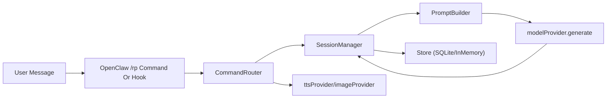

# OpenClaw RP Plugin Architecture

[中文版本](./ARCHITECTURE.zh-CN.md)

This document explains the implementation architecture, module boundaries, and extension points of the OpenClaw RP plugin for contributors.

## 1. Design Goals

- SillyTavern asset compatibility (Card/Preset/Lorebook)
- Minimal-intrusion integration into OpenClaw plugin runtime
- Stable session control (state machine + mutex + retry)
- Multimodal output and long-memory support (summary + embedding recall)

## 2. Top-Level Modules

- `src/openclaw/register.js`
  - Native OpenClaw registration entry
  - Registers `/rp` command and hooks: `message:preprocessed`, `message_received`, `before_prompt_build`, `llm_output`
  - Resolves provider config and initializes SQLite store
- `src/plugin.js`
  - Generic plugin factory: `createRPPlugin()`
  - Composes `CommandRouter`, `SessionManager`, and Store
- `src/core/commandRouter.js`
  - Parses/routes `/rp` commands
  - Handles import, session lifecycle, retry, multimodal commands
- `src/core/sessionManager.js`
  - Main dialogue pipeline
  - Session mutex, summary trigger, prompt preparation, memory indexing and recall
- `src/core/promptBuilder.js`
  - Deterministic prompt assembly order
  - Token budget allocation and truncation
- `src/store/sqliteStore.js` / `src/store/inMemoryStore.js`
  - Persistence and test store implementations
- `src/importers/*.js`
  - ST asset parsing/mapping
- `src/providers/*.js`
  - OpenAI-compatible and Gemini provider adapters

## 3. Runtime Flow

### 3.1 Command Path (`/rp`)

1. `parseRpCommand()` parses command and options.
2. `CommandRouter` dispatches subcommands:
   - `import-*`: parse/map/store assets
   - `start/session/pause/resume/end`: session lifecycle
   - `retry`: rollback latest assistant turn and regenerate
   - `speak/image`: multimodal branches
3. Returns normalized response envelope: `{ ok, code, message, data }`.

### 3.2 Dialogue Path (non-command message)

1. `message_received` enters `SessionManager.processDialogue()`.
2. Session is resolved via `channel_session_key`.
3. Per-session mutex serializes processing.
4. User turn is appended; summarization may trigger.
5. Prompt is prepared and model config resolved.
6. `modelProvider.generate()` is invoked.
7. Assistant turn is appended and embedding index is updated.

### 3.3 Native OpenClaw Hook Injection Path

`register.js` additionally supports native OpenClaw message flow:

- `message_received`: append user turn to RP session and keep routing context
- `before_prompt_build`: inject RP prompt into OpenClaw main model request
- `llm_output`: persist model output as assistant turn

This enables RP behavior to cooperate with OpenClaw’s core LLM pipeline, not only `/rp` command responses.

## 4. Prompt Assembly Strategy

`buildPrompt()` default order:

1. `system_prompt`
2. Character core block (name/description/personality/scenario)
3. Matched lorebook entries
4. Example dialogue
5. Summary
6. Memory recall (`Relevant Memory Recall`)
7. Recent turns
8. `post_history_instructions`

Default budgets (configurable):

- `maxPromptTokens = 8000`
- `lorebook = 2000`
- `example = 1000`
- `summary = 1000`
- `memory = 900`

## 5. Long Memory Implementation

### 5.1 Indexing

- User/assistant turns can be persisted in `rp_turn_embeddings`
- Language tag is heuristically detected (`detectLanguageTag()`)
- Embedding source:
  - external provider (OpenAI/Gemini)
  - built-in fallback (`hashed-multilingual-*`)

### 5.2 Retrieval

- Entry point: `searchTurnEmbeddings()`
- Uses SQLite vector distance function when extension is available
- Falls back to JS cosine similarity otherwise
- Results are deduplicated and injected into prompt memory section

## 6. Session and Consistency Controls

- Session key format: `{channel_type}:{platform_context_id}:{channel_id}:{user_id}`
- Session states: `active / paused / summarizing / ended`
- Concurrency: `SessionMutex`
- Error model: `RPError` + unified `RP_*` error codes
- Retry policy:
  - dialogue generation with backoff retry
  - independent summary retry config
  - independent multimodal timeout/retry

## 7. Data Model (SQLite)

Core tables (`src/store/schema.js`):

- Assets: `rp_assets`, `rp_cards`, `rp_presets`, `rp_lorebooks`
- Sessions: `rp_sessions`, `rp_session_lorebooks`
- Dialogue: `rp_turns`, `rp_summaries`
- Memory vectors: `rp_turn_embeddings`

Key constraints:

- Partial unique index on active session statuses in `rp_sessions`
- FK cascade to preserve referential consistency

## 8. Provider Abstraction

`createRPPlugin()` uses DI-style provider contracts:

- `modelProvider.generate/summarize`
- `ttsProvider.synthesize`
- `imageProvider.generate`
- `embeddingProvider.embed`

In native OpenClaw mode, `register.js` resolves providers from `api.config`, `provider.json`, and env vars, then selects OpenAI-compatible or Gemini stacks.

## 9. Extension Points and Contribution Guidance

### Practical Extension Points

- New model backend: add provider adapter and inject
- New import format: add parser under `src/importers/`
- New context policy: tune/extend `contextPolicy`
- New channel integration: add adapter normalization/send mapping

### Contribution Guidance

- Add/adjust tests before behavior changes (`tests/` covers core paths)
- Keep response envelope backward compatible (`ok/code/message/data`)
- Avoid mixing storage details into router layer; keep boundaries explicit

## 10. Known Boundaries

- Vector retrieval quality depends on runtime availability of SQLite vector extension
- Native install entry naming may differ by OpenClaw version (command-based vs UI-based)
- Current UX is still command-first (no dedicated Web management console yet)
