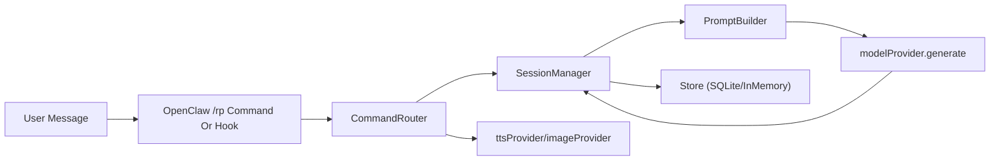

# OpenClaw RP Plugin 架构文档

[English version](./ARCHITECTURE.md)

本文档面向开发者，解释 OpenClaw RP 插件的技术实现、模块边界与扩展点，便于社区协作开发。

## 1. 设计目标

- 兼容 SillyTavern 资产格式（Card/Preset/Lorebook）
- 在 OpenClaw 插件体系中最小侵入集成
- 提供稳定的会话控制（状态机 + 并发互斥 + 重试）
- 支持多模态（TTS/图像）与长记忆（摘要 + embedding 召回）

## 2. 顶层模块

- `src/openclaw/register.js`
  - OpenClaw 原生插件注册入口
  - 注册 `/rp` 命令与 `message:preprocessed`、`message_received`、`before_prompt_build`、`llm_output` hooks
  - 负责 provider 配置解析与 sqlite 初始化
- `src/plugin.js`
  - 通用插件工厂 `createRPPlugin()`
  - 组装 `CommandRouter` + `SessionManager` + Store
- `src/core/commandRouter.js`
  - `/rp` 命令解析与分发
  - 资产导入、会话生命周期、重试、多模态入口
- `src/core/sessionManager.js`
  - 普通对话主链路
  - 会话互斥锁、摘要触发、Prompt 准备、记忆索引与召回
- `src/core/promptBuilder.js`
  - 按固定顺序组装 Prompt
  - 执行 token 预算分配和截断
- `src/store/sqliteStore.js` / `src/store/inMemoryStore.js`
  - 持久化与测试存储实现
- `src/importers/*.js`
  - ST 资产解析与字段映射
- `src/providers/*.js`
  - OpenAI-compatible 与 Gemini provider 适配

## 3. 运行时数据流

### 3.1 命令路径（`/rp`）

1. `parseRpCommand()` 解析命令与参数。
2. `CommandRouter` 根据子命令分发：
   - `import-*`：导入并落库资产
   - `start/session/pause/resume/end`：会话控制
   - `retry`：删除最后 assistant turn 并重生
   - `speak/image`：多模态分支
3. 返回统一响应结构：`{ ok, code, message, data }`。

### 3.2 普通消息路径（会话内对话）

1. `message_received` 进入 `SessionManager.processDialogue()`。
2. 按 `channel_session_key` 查找会话。
3. per-session mutex 加锁，保证同会话串行处理。
4. 写入用户 turn，必要时触发摘要。
5. 构建 Prompt、解析模型参数，调用 `modelProvider.generate()`。
6. 写入 assistant turn，并异步写入 embedding。

### 3.3 OpenClaw 原生 Hook 注入路径

`register.js` 额外支持原生消息链路：

- `message_received`：把用户消息追加到 RP 会话并缓存上下文
- `before_prompt_build`：将 RP prompt 注入 OpenClaw 主模型请求
- `llm_output`：把模型输出写回 RP turn

这使 RP 能与 OpenClaw 主链路协同，而不仅是 `/rp` 命令式调用。

## 4. Prompt 组装策略

`buildPrompt()` 默认顺序：

1. `system_prompt`
2. 角色卡核心信息（name/description/personality/scenario）
3. 命中 lorebook
4. 示例对话
5. 摘要
6. 检索记忆（Relevant Memory Recall）
7. 最近对话 turns
8. `post_history_instructions`

预算默认值（可配置）：

- `maxPromptTokens = 8000`
- `lorebook = 2000`
- `example = 1000`
- `summary = 1000`
- `memory = 900`

## 5. 长记忆实现

### 5.1 写入

- 每轮 user/assistant turn 可写入 `rp_turn_embeddings`
- 语言标签由 `detectLanguageTag()` 粗分（zh/ja/ko/ar/cyrillic/...）
- embedding 来源：
  - 外部 provider（OpenAI/Gemini embedding）
  - 或内置 `hashed-multilingual` 向量（默认兜底）

### 5.2 检索

- 检索入口：`searchTurnEmbeddings()`
- 优先走 SQLite 向量函数（若扩展可用）
- 否则回退 JS `cosineSimilarity` 计算
- 结果去重后按分数注入 Prompt

## 6. 会话与一致性控制

- 会话键：`{channel_type}:{platform_context_id}:{channel_id}:{user_id}`
- 状态：`active / paused / summarizing / ended`
- 并发控制：`SessionMutex`
- 错误模型：`RPError` + 统一错误码（`RP_*`）
- 重试策略：
  - 文本生成：指数退避重试
  - 摘要：独立 `summaryRetryConfig`
  - 多模态：独立重试与超时

## 7. 数据模型（SQLite）

核心表（`src/store/schema.js`）：

- 资产：`rp_assets`, `rp_cards`, `rp_presets`, `rp_lorebooks`
- 会话：`rp_sessions`, `rp_session_lorebooks`
- 对话：`rp_turns`, `rp_summaries`
- 记忆向量：`rp_turn_embeddings`

关键约束：

- `rp_sessions` 对活跃状态会话有唯一索引，避免同会话键并行活跃
- 外键级联删除确保资产/会话关联完整性

## 8. Provider 抽象层

`createRPPlugin()` 通过依赖注入解耦模型后端：

- `modelProvider.generate/summarize`
- `ttsProvider.synthesize`
- `imageProvider.generate`
- `embeddingProvider.embed`

在 OpenClaw 原生模式下，`register.js` 会自动根据 `api.config`、`provider.json`、环境变量选择 OpenAI-compatible 或 Gemini providers。

## 9. 扩展点与协作建议

### 可直接扩展的点

- 新模型后端：新增 provider 适配并注入
- 新导入格式：在 `src/importers/` 增加解析器
- 新会话策略：调整 `contextPolicy`
- 新渠道：实现 message normalize/send adapter

### 协作建议

- 优先补测试再改行为（`tests/` 已覆盖核心链路）
- 对命令输出结构保持向后兼容（`ok/code/message/data`）
- 不在 router 层混入存储细节，保持模块边界清晰

## 10. 已知边界

- 向量检索能力依赖部署环境是否可加载 SQLite 向量扩展
- 原生安装入口名称在不同 OpenClaw 版本可能不同（命令式/界面式）
- 当前仍以命令驱动交互为主，尚无专门 Web 管理台
