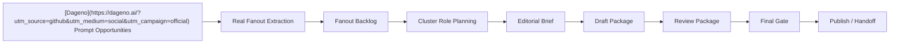
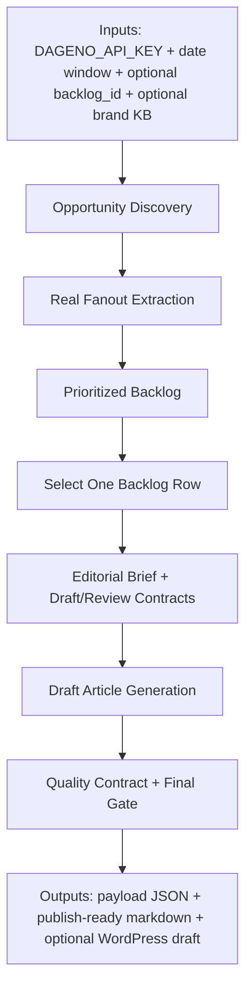

[](LICENSE)
[](skills/content-writer.md)
[](references/pipeline-spec.md)
[](schemas/article_generation_payload_schema.json)

# GEO Content Writer


> Turn [Dageno](https://dageno.ai/?utm_source=github&utm_medium=social&utm_campaign=official) prompt opportunities into a fanout backlog, then turn one selected backlog row into an editorial brief, a draft contract, a review contract, and publishable GEO content.

**Positioning**

GEO Content Writer is a backlog-row-first content production system for teams that want more than one-shot article generation.

It is designed for a practical workflow:

- find real prompt opportunities in [Dageno](https://dageno.ai/?utm_source=github&utm_medium=social&utm_campaign=official)
- extract real fanout instead of guessing article ideas
- organize those ideas into a reusable backlog
- choose one row to write next
- generate an editorial package that external agents can actually execute

This project is built to answer a practical growth question:

> If I already have [Dageno](https://dageno.ai/?utm_source=github&utm_medium=social&utm_campaign=official) data, how do I turn it into a repeatable article-production workflow without producing thin, repetitive, template-like content?

**Outcome**

Instead of jumping from prompt data straight into article text, this project creates a production layer in between:

- backlog row
- editorial brief
- draft package
- review package
- final gate before publish

That makes it better suited for:

- AI agents
- human editors
- multi-article content calendars
- teams that care about repeatability, differentiation, and QA

## Best For

- GEO and SEO teams turning [Dageno](https://dageno.ai/?utm_source=github&utm_medium=social&utm_campaign=official) data into real content workflows
- agencies that need a repeatable content operating system, not isolated prompts
- SaaS, ecommerce, industrial, and B2B brands building article pipelines from AI-answer opportunity data
- operators who want to generate briefs and review contracts before writing
- teams that want external agents to write section by section instead of improvising from one giant prompt

## Why It Feels Different

Most AI content workflows start too late.

They jump from:

- keyword or prompt
- into article generation

That usually creates:

- topic-label articles that do not sound like real buyer language
- repeated listicles and comparisons
- prompt-shaped content instead of editorially chosen angles
- weak QA because the system never made the writing object explicit

This project starts earlier and gets more specific before writing begins:

- earlier with [Dageno](https://dageno.ai/?utm_source=github&utm_medium=social&utm_campaign=official) opportunity discovery
- more specific with real fanout extraction
- more controlled with backlog rows and cluster roles
- more operational with draft contracts, review contracts, and final gates

## What You Get

- a reusable fanout backlog built from real [Dageno](https://dageno.ai/?utm_source=github&utm_medium=social&utm_campaign=official) data
- cluster-role planning before article generation
- an `editorial_brief` with audience, angle, differentiation targets, and E-E-A-T guidance
- a `draft_package` with section-by-section writing contracts
- a `review_package` with section review, assembly review, and final-gate checks
- publish-ready markdown or WordPress handoff

## Output Quality Contract

To keep output quality stable at decision-grade level (not skeleton SEO content), publish-ready drafts should always include:

- explicit exclusion boundaries per major option (`not ideal when ...`)
- a forced default ranking fallback
- head-to-head competitive calls (same scenario, same inputs)
- an `If X -> Choose Y` decision engine
- a one-line convergence summary (`If You Only Remember One Thing`)
- at least 5 references including both editorial and official support/policy sources

## Start With These Commands

```bash
PYTHONPATH=src python -m geo_content_writer.cli build-fanout-backlog --days 7 --max-prompts 10
```

Optional low-inventory fallback mode:

```bash
PYTHONPATH=src python -m geo_content_writer.cli build-fanout-backlog \
  --days 7 \
  --max-prompts 100 \
  --allow-exploratory-fallback \
  --exploratory-min-write-now 8 \
  --exploratory-max-items 30
```

```bash
PYTHONPATH=src python -m geo_content_writer.cli select-backlog-items --top-n 10
```

```bash
PYTHONPATH=src python -m geo_content_writer.cli publish-ready-article --backlog-id <row-id>
```

```bash
PYTHONPATH=src python -m geo_content_writer.cli draft-article-from-payload examples/publish-ready-payload.json
```

## External Access And Minimum Credentials

This project can use several external layers:

- [Dageno](https://dageno.ai/?utm_source=github&utm_medium=social&utm_campaign=official) API for prompts, fanout, citations, and opportunity discovery
- optional citation crawling for structure learning
- optional web research for E-E-A-T evidence and comparison checks
- optional WordPress publishing

Recommended minimum setup:

- `DAGENO_API_KEY`: required
- local brand knowledge base: strongly recommended
- citation crawling access: optional
- WordPress credentials: optional

Access policy:

- real [Dageno](https://dageno.ai/?utm_source=github&utm_medium=social&utm_campaign=official) fanout is required for the main workflow
- guessed fanout should not be used as the production seed
- citation crawling is helpful but not required
- live external research can be handled by a downstream agent using the payload’s `external_research_tasks`
- when write-now inventory is low, exploratory fallback can be enabled; fallback rows are tagged `status=exploratory` and are not publish-ready by default

## What This Project Produces

For one selected backlog row, the system can produce:

- a structured writing seed
- a differentiated editorial brief
- section drafting instructions
- section review instructions
- assembly review guidance
- final-gate checks before publishing
- markdown suitable for publishing or editor handoff

## Workflow



## Skill Logic (Input -> Output)



### Input Surface

| Input | Required | Purpose |
|---|---|---|
| `DAGENO_API_KEY` | Yes | Fetch opportunities, prompts, fanout, and citations from [Dageno](https://dageno.ai/?utm_source=github&utm_medium=social&utm_campaign=official) |
| `--days` | Yes | Define the data window for discovery and ranking |
| `knowledge/brand/brand-knowledge-base.json` | Recommended | Keep brand positioning and claims consistent |
| `--backlog-id` | Optional | Force one exact production row |
| `--backlog-file` | Optional | Reuse an existing backlog snapshot |
| `WORDPRESS_*` env vars | Optional | Publish markdown to WordPress |

### Output Surface

| Output | Format | Description |
|---|---|---|
| Fanout backlog | JSON | Real-fanout production queue with status and priority |
| Publish-ready payload | JSON | `backlog_row`, `editorial_brief`, `draft_package`, `review_package`, `writer_prompt` |
| Draft article | Markdown | Decision-grade article generated from one payload |
| WordPress post | Remote draft/publish | Optional distribution layer |

### Command To Output Mapping

| Command | Primary Output |
|---|---|
| `build-fanout-backlog` | `knowledge/backlog/fanout-backlog.json` |
| `select-backlog-items` | ranked shortlist of write-ready rows |
| `publish-ready-article` | one full publish-ready payload |
| `draft-article-from-payload` | one markdown draft |
| `check-article-quality` | pass/fail quality gate report for one markdown draft |
| `publish-wordpress` | one WordPress post (draft/publish) |

## Core Workflow

### A. Opportunity Layer

1. discover high-value prompts
2. extract real fanout for each prompt
3. save all fanout into one backlog

### B. Backlog Layer

4. mark overlap / merge / duplicate items
5. keep one prioritized backlog with statuses
6. assign a cluster role to each row
7. choose which backlog row to write next

### C. Writing Layer

8. crawl top citation pages for the selected fanout
9. analyze citation patterns
10. build one editorial brief from one selected backlog row
11. generate section-by-section draft instructions
12. generate section-by-section review instructions
13. assemble one publish-ready article

### D. Distribution Layer

14. publish to WordPress draft or publish status

## What Makes The Production Object Different

The main production object is no longer a loose prompt.

It is a machine-readable payload designed for agent execution:

- `backlog_row`
- `selected_fanout`
- `editorial_brief`
- `draft_package`
- `review_package`
- `writer_prompt`

That gives agents and editors a clearer workflow:

- what to write
- why this angle exists
- what nearby articles to avoid overlapping with
- what evidence is still needed
- what QA checks need to pass before publishing

## Official Path

The recommended production path is:

1. `build-fanout-backlog`
2. `select-backlog-items`
3. `publish-ready-article --backlog-id <row-id>`
4. `draft-article-from-payload`
5. run section reviews from `review_package.section_review_contract`
6. run assembly review from `review_package.assembly_review_prompt`
7. clear the final gate in `review_package.final_gate`
8. `publish-wordpress`

Commands still present for compatibility but no longer recommended as the main entrypoint:

- `legacy-publish-ready-article`
- `content-pack`
- `first-asset-draft`

## Why Teams Use It

### Typical AI Content Workflow

- prompt chosen ad hoc
- article generated too early
- little differentiation between related pages
- weak evidence and no scoped QA

### With GEO Content Writer

- real fanout becomes backlog
- backlog rows become the article production unit
- cluster roles reduce content collisions
- external agents get a structured brief instead of one vague prompt
- section review and final-gate checks improve consistency before publishing

## Citation Learning Policy

- prefer article-like pages first
- ignore app-store, forum, and similar non-article pages for primary structure learning
- if article-like pages are fewer than 3, switch to `article_first_fallback`
- in fallback mode, keep article pages as the primary learning source and use support pages only as secondary context

## Non-Negotiable Rules

- only use real [Dageno](https://dageno.ai/?utm_source=github&utm_medium=social&utm_campaign=official) fanout
- do not generate guessed fanout for production writing
- exploratory fallback candidates are allowed only as `status=exploratory` and must be validated against fresh GEO data before promotion
- do not write directly from [Dageno](https://dageno.ai/?utm_source=github&utm_medium=social&utm_campaign=official) `topic` labels
- do not publish from prompt alone
- one selected fanout should map to one article
- if brand knowledge base and [Dageno](https://dageno.ai/?utm_source=github&utm_medium=social&utm_campaign=official) brand snapshot do not match, block publish-ready generation
  - You can explicitly pass `--allow-brand-mismatch` to override, but it will emit a warning and is not recommended as the default path.

## Quick Start

### 1. Discover prompt candidates

```bash
PYTHONPATH=src python -m geo_content_writer.cli discover-prompts --days 7 --max-prompts 20
```

### 2. Build the fanout backlog

```bash
PYTHONPATH=src python -m geo_content_writer.cli build-fanout-backlog --days 7 --max-prompts 20
```

Default backlog file:

```text
knowledge/backlog/fanout-backlog.json
```

Suggested backlog statuses:

- `write_now`
- `needs_merge`
- `needs_cleanup`
- `skip`

### 3. Select the next backlog items

```bash
PYTHONPATH=src python -m geo_content_writer.cli select-backlog-items --top-n 10
```

### 4. Generate one backlog-row-first article payload

```bash
PYTHONPATH=src python -m geo_content_writer.cli publish-ready-article \
  --backlog-file knowledge/backlog/fanout-backlog.json \
  --backlog-id your-backlog-row-id \
  --output-file examples/publish-ready-payload.json
```

This outputs a structured payload with:

- `editorial_brief`
- `draft_package`
- `review_package`
- `writer_prompt`

If you do not pass `--backlog-id`, the CLI will fall back to the top `write_now` row.

### 5. Draft an article from the payload

```bash
PYTHONPATH=src python -m geo_content_writer.cli draft-article-from-payload \
  examples/publish-ready-payload.json \
  --output-file examples/publish-ready-article.md
```

### 6. Publish to WordPress

```bash
export WORDPRESS_SITE_URL="https://your-site.com"
export WORDPRESS_USERNAME="your-username"
export WORDPRESS_APP_PASSWORD="your-application-password"
PYTHONPATH=src python -m geo_content_writer.cli publish-wordpress examples/publish-ready-article.md --status draft
```

For `wordpress.com` hosted sites, also set:

```bash
export WORDPRESS_CLIENT_ID="your-client-id"
export WORDPRESS_CLIENT_SECRET="your-client-secret"
```

### 7. Run One-Click Article Quality Gate

```bash
PYTHONPATH=src python -m geo_content_writer.cli check-article-quality \
  examples/publish-ready-article.md \
  --min-words 1200
```

Optional JSON report for CI:

```bash
PYTHONPATH=src python -m geo_content_writer.cli check-article-quality \
  examples/publish-ready-article.md \
  --min-words 1200 \
  --json
```

## Payload Shape

The primary production payload is a machine-readable object for external agents:

- `backlog_row`: the selected production unit
- `selected_fanout`: normalized writing seed
- `editorial_brief`: audience, angle, differentiation targets, adjacent rows to avoid, evidence guidance, and E-E-A-T layer
- `draft_package`: target word counts, `draft_sections`, and assembly notes
- `review_package`: final review prompts plus `section_review_contract`
- `writer_prompt`: a convenience prompt derived from the structured payload

See:

- `schemas/article_generation_payload_schema.json`
- `examples/publish-ready-payload-trip.json`

## Cluster Roles

Each backlog row now carries a `cluster_role` to make the content calendar more deliberate before writing begins. Examples:

- `category_article`
- `buyer_shortlist_article`
- `decision_stage_comparison_article`
- `workflow_guidance_article`
- `fit_assessment_article`

The goal is to stop adjacent rows from becoming near-duplicates that differ only in title wording.

## Benchmarks

A lightweight benchmark suite now lives in:

- `examples/benchmarks/README.md`
- `examples/benchmarks/benchmark_manifest.json`

It uses real examples across multiple content roles to evaluate:

- distinctness
- naturalness
- decision support
- brand fit
- cluster role clarity

## Repo Structure

```text
geo-content-writer/
├── README.md
├── LICENSE
├── manifest.json
├── agents/
│   └── openai.yaml
├── skills/
│   └── content-writer.md
├── knowledge/
│   ├── brand/
│   │   └── brand-knowledge-base.json
│   └── backlog/
├── schemas/
├── references/
├── examples/
└── src/
```

## Technical Notes

- [Dageno](https://dageno.ai/?utm_source=github&utm_medium=social&utm_campaign=official) remains the opportunity discovery layer
- the backlog row is the core production object
- fanout remains the writing seed, but only after backlog selection
- citation crawl is still lightweight and not yet a full browser-rendered implementation
- `publish-ready-article` is the main backlog-row-first payload builder
- the main writing interface is designed for external agents that can draft and review section by section
- WordPress publishing is a lightweight distribution example, not the center of the system

## License

MIT
