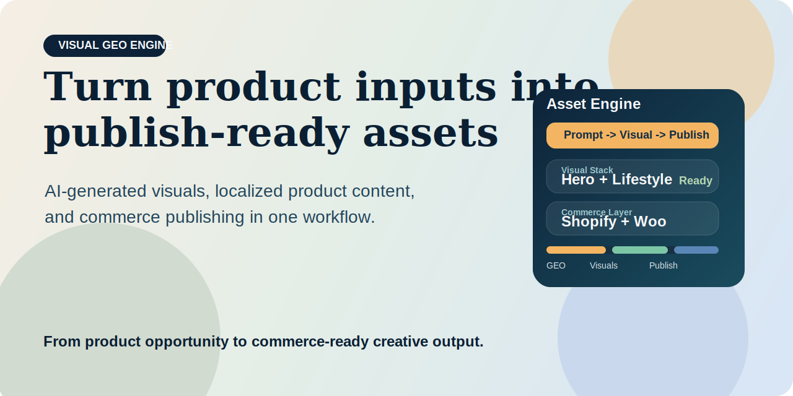

[](LICENSE)
[](requirements.txt)
[](SKILL.md)

# GEO Visual Content Engine



> Turn GEO opportunities into AI-generated product visuals, localized content, and export-ready commerce assets.

**Positioning**

GEO Visual Content Engine is built for commerce teams that want to move from product input to export-ready AI-native marketing assets in one flow.

It is designed to turn a product and keyword opportunity into:

- GEO-aware opportunity framing
- AI-generated product visuals
- localized content assets
- structured product data
- export-ready outputs for commerce platforms

This project helps answer a practical commerce question:

> How do you turn product opportunities into visual and content assets fast enough for AI-native discovery and commerce execution?

**Outcome**

Instead of splitting research, asset creation, product data generation, and store preparation into disconnected tools, this project combines them into one execution workflow.

**About Dageno.ai**

[Dageno.ai](https://dageno.ai) is an AI SEO platform for brands, DTC teams, agencies, and AI-search growth teams that want to connect product visibility, content generation, and AI-native commerce execution.

## Why It Feels Different

Most product content workflows break in the middle.

Teams often have:

- one process for product data
- another for image generation
- another for localization
- another for marketplace or store publishing

This project connects those layers so the workflow can end with assets that are ready to export or hand off, not just drafts that still need manual cleanup.

## What You Get

- one product-to-asset pipeline
- one structure for GEO opportunity analysis
- one system for AI-generated visuals
- one path to Shopify and WooCommerce asset packaging

## Who This Is For

- Shopify and DTC brands generating product assets at scale
- AI-first commerce operators launching search-ready product content
- agencies managing visual content workflows across markets or brands
- growth teams testing product narratives for AI-search and commerce channels

## Workflow


## What The System Produces

For one product and keyword input, the workflow can produce:

- GEO opportunity analysis
- product image prompts
- AI-generated product visuals
- titles, descriptions, SKU, pricing fields
- localized content variants
- export-ready outputs for Shopify and WooCommerce

## External Access And Minimum Credentials

This workflow can use three external systems:

- Google Gemini / Nano Banana 2 for image generation
- Shopify for optional direct export
- WooCommerce for optional direct export

Minimum credentials by action:

- `GOOGLE_API_KEY`: required for image generation
- `SHOPIFY_STORE_URL` + `SHOPIFY_ACCESS_TOKEN`: only required for direct Shopify export
- `WOOCOMMERCE_STORE_URL` + `WOOCOMMERCE_CONSUMER_KEY` + `WOOCOMMERCE_CONSUMER_SECRET`: only required for direct WooCommerce export

If store credentials are absent, the workflow should stop at analysis, visuals, product-data output, and export packaging instead of claiming live store access.

Access policy:

- image generation can run without any commerce credentials
- Shopify and WooCommerce direct export are optional, not required
- the workflow should not assume live store write access by default
- if direct export is not explicitly enabled, stop at asset, product-data, and export-package output

## Example Input

```json
{
  "brand": "AcmeWatch",
  "product": "Acme DivePro 5",
  "core_keyword": "smartwatch water resistance",
  "country": "us",
  "language": "en",
  "publish_to_shopify": false,
  "publish_to_woocommerce": false
}
```

## Example Output

```text
Opportunity Layer
- GEO opportunity identified around durability and water-resistance use cases

Asset Layer
- white-background product image
- lifestyle image
- hero image

Commerce Layer
- generated title
- generated description
- SKU and pricing fields
- publishing result for Shopify / WooCommerce
```

## Why Teams Use It

### Traditional Commerce Asset Workflow

- product data prepared manually
- visuals generated in a separate tool
- localization handled later
- publishing is still manual

### With GEO Visual Opportunity Engine

- research, assets, copy, and publishing live in one workflow
- the system starts with opportunity framing and ends with deployable outputs

## Entry Points

Core files:

- [`SKILL.md`](SKILL.md)
- [`src/main.py`](src/main.py)

Use this project when you want a product content workflow that connects GEO thinking with visual production and commerce execution.

## Repo Structure

```text
geo-visual-content-engine/
├── README.md
├── SKILL.md
├── assets/
│   └── cover.svg
├── src/
├── schemas/
├── prompts/
└── examples/
```

## Recommended Use Cases

- AI-generated product launch assets
- localized commerce content generation
- Shopify and WooCommerce publishing workflows
- GEO-driven visual experimentation for product pages

## License

MIT
