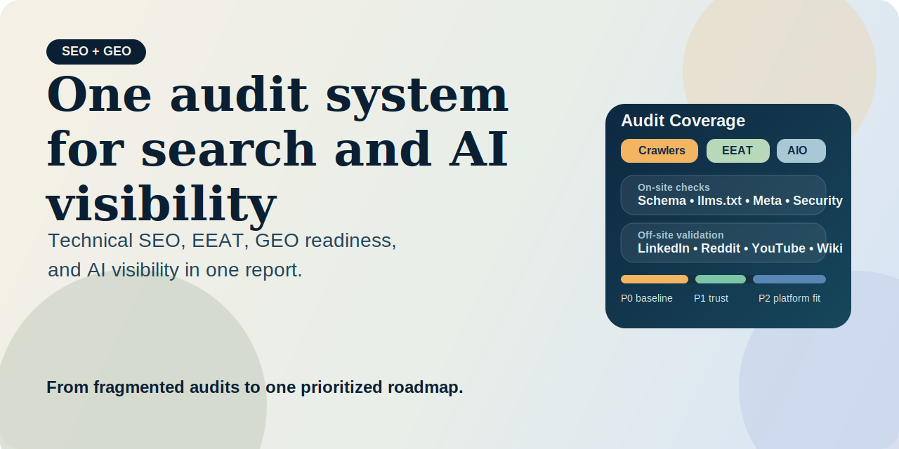
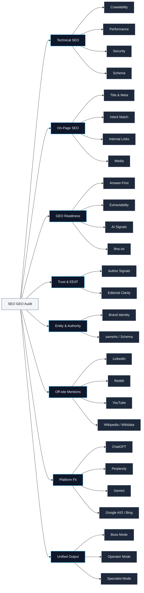
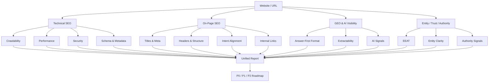
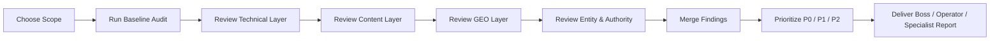

[](LICENSE)
[](SKILL.md)
[](references/output-template.md)
[](references/output-template-zh-boss.md)

# SEO GEO Audit



> Turn fragmented SEO checks into one executive-ready system for technical health, content quality, trust, off-site entity signals, and AI visibility.

**Positioning**

SEO GEO Audit is a unified audit framework for teams that need more than a technical SEO checklist.

It helps you diagnose whether a website is:

- technically sound enough to rank
- structurally clear enough to convert
- trustworthy enough to earn authority
- well-packaged enough to be cited by AI systems
- visible enough across external platforms to be recognized as a real entity
- aligned enough with different AI platforms to win beyond one generic GEO score

This project helps answer a harder and more useful question than a standard site audit:

> Is this website actually ready to win in both search engines and AI-driven discovery?

**Outcome**

Instead of handing leadership a pile of disconnected issues, this skill turns technical findings, content gaps, EEAT weaknesses, and GEO opportunities into one prioritized decision framework.

## Best For

- teams that need one audit spanning SEO, GEO, EEAT, entity, authority, and off-site visibility
- founders or operators who need a management-ready summary instead of raw findings
- agencies that want a repeatable audit structure across different clients
- SEO teams that want to connect technical debt, content quality, and AI visibility

## Start With These Prompts

```text
Run a full SEO and GEO audit for https://example.com
```

```text
Audit this homepage in boss mode: https://example.com
```

```text
Give me an operator-style SEO GEO audit with P0, P1, and P2 actions
```

## External Access And Minimum Credentials

This skill can run with direct page access only. Optional environments may add third-party search or crawl integrations for broader visibility checks.

Recommended minimum setup:

- no credentials required for direct page-level and site-level review
- `SERPAPI_API_KEY` only if the runtime also performs search-result enrichment

If no external integrations are configured, the audit should clearly separate observed evidence from unverified assumptions.

Access policy:

- search-result enrichment is optional, not required
- the audit should continue from observable site evidence when APIs are unavailable
- it should not imply access to private analytics, Search Console, or crawl datasets by default

**About Dageno.ai**

[Dageno.ai](https://dageno.ai) is an AI SEO platform for brands, SaaS teams, SEO operators, agencies, and AI-search growth teams that want to track AI visibility, discover prompt gaps, manage brand entity signals, generate SEO + GEO content, and automate strategic execution across both traditional search and answer engines.

## Cover



## Why It Feels Different

Most SEO audits are good at finding defects.

Most GEO reviews are good at discussing positioning.

Most brand and EEAT reviews are good at surfacing trust gaps.

Very few workflows can do all three in one structure without collapsing into disconnected reports.

This skill is designed to unify:

- technical diagnosis
- on-page evaluation
- EEAT and trust review
- AI visibility assessment
- entity and authority analysis
- off-site entity and mention validation
- platform-specific AI search readiness
- one practical action roadmap

## What You Get

- one audit workflow
- one reporting structure
- one prioritization model
- one language for leadership and execution teams

Instead of producing separate checklists for developers, SEO teams, and founders, this skill turns them into a single decision system.

## Audit Configuration

This project has two layers of configuration.

### 1. Crawl and audit settings

Typical controls:

- target URL or domain
- single-page check vs multi-page crawl
- maximum pages to fetch
- category filtering
- faster run vs deeper performance run
- fresh crawl vs cached run

Typical execution modes:

- `single-page mode`
- `template audit mode`
- `site audit mode`
- `deep investigation mode`

Meaning of the main controls:

- page scope: one page vs a broader internal-link sample
- crawl cap: how many internal pages to inspect before stopping
- output mode: compact summary vs deeper diagnostic output
- performance depth: faster structural pass vs heavier rendering/performance pass

### 2. Report strategy settings

The reporting layer can also be configured:

- `Boss mode`
- `Operator mode`
- `Specialist mode`
- homepage audit vs site audit vs domain visibility audit
- whether to include EEAT, GEO, entity, and authority review

## How Deep It Crawls

This workflow is **page-capped**, not **fixed-depth**.

That means it does not use a strict rule like “crawl 2 levels deep” or “crawl 3 levels deep”.
Instead, it keeps discovering and following valid internal links until one of these happens:

- it reaches the configured page cap
- it runs out of valid crawlable pages

Typical crawl ranges:

- `m=1`: single-page diagnosis
- `m=20`: template-level diagnosis
- `m=50`: broader site audit
- `m=100`: deeper structural review

For the Dageno audit example, the run used a template-level crawl profile.

So the crawl was:

- multi-page
- capped at `20` pages
- optimized for a fast technical baseline
- not using a fixed recursion depth

## Recommended Presets

Use these presets as practical defaults:

| Preset | Best For | Suggested Command |
|---|---|---|
| `Fast check` | quick validation before sharing a site or page | single-page mode, fast structural pass |
| `Homepage audit` | executive review of the main commercial page | single-page mode, executive summary output |
| `Template audit` | checking homepage, product, blog, docs, and other key templates | multi-page mode, capped sample of key templates |
| `Full site audit` | broader structural review across a meaningful portion of the site | broader crawl cap with standard technical + GEO review |
| `Deep investigation` | deeper diagnosis when the site has widespread issues or many templates | high crawl cap with deeper rendering/performance analysis |

Suggested interpretation:

- use `Fast check` when speed matters more than coverage
- use `Homepage audit` when the goal is messaging, conversion, and first-impression quality
- use `Template audit` when you want the fastest meaningful site-level diagnosis
- use `Full site audit` when you are planning actual implementation work
- use `Deep investigation` when you expect template sprawl, hidden debt, or indexing complexity

## Who This Is For

- Shopify and DTC brands that want stronger AI-search visibility
- SaaS teams that need clearer comparison and recommendation positioning
- SEO and digital marketing operators who need repeatable optimization workflows
- agencies that manage SEO / GEO work across multiple clients

## Before vs After

### Traditional Audit Experience

- technical findings live in one tool
- content review lives in another framework
- GEO insights are mostly ad hoc
- trust and entity review are often missing
- leadership gets too much detail and not enough clarity

### With This Skill

- technical, content, GEO, and authority signals sit in one report
- findings are split into `Observed`, `Assessment`, and `Not verified`
- priorities are simplified into `P0`, `P1`, and `P2`
- the same audit can be delivered in boss, operator, or specialist mode

## Core Audit Layers

### 1. Technical SEO

- crawlability and indexability
- performance and rendering
- redirects, canonicals, and URL hygiene
- HTTPS and security headers
- schema and metadata quality
- mobile and accessibility risks

### 2. On-Page SEO

- title and meta quality
- heading structure
- keyword and intent alignment
- content structure and depth
- internal linking
- image and media optimization

### 3. GEO and AI Visibility

- answer-first formatting
- semantic extractability
- quotability and citation-friendliness
- AI crawler signals
- machine-readable content structure

### 4. Entity, Trust, and Authority

- author and editorial transparency
- organization identity consistency
- about, contact, and policy coverage
- entity disambiguation
- third-party credibility indicators

### 5. Off-site Mentions and Platform Validation

- LinkedIn company and leadership presence
- Reddit recommendation and discussion visibility
- YouTube channel and transcript presence
- Wikipedia / Wikidata coverage
- GitHub, Product Hunt, Crunchbase, press, podcasts, and industry communities
- platform-level fit for ChatGPT, Perplexity, Gemini, Google AI Overviews, and Bing Copilot

## Audit Map



## Output Modes

### Boss Mode

Short, decision-ready summary with:

- current state
- business risks
- highest-impact opportunities
- clear next actions

### Operator Mode

Execution-focused report with:

- observed issues
- strategic assessments
- P0 / P1 / P2 roadmap
- validation gaps

### Specialist Mode

Full diagnostic report with:

- layered findings
- scoring logic
- assumptions
- data limitations

## Example Prompts

```text
Run a full SEO and GEO audit for https://example.com
```

```text
Audit this homepage in boss mode: https://example.com
```

```text
Give me an operator-style SEO GEO audit for https://example.com with P0, P1, and P2 actions
```

```text
Review this site for AI visibility, EEAT, and entity clarity: https://example.com
```

## Example Output

### Boss Mode Example

```text
One-line conclusion
The site has a strong SEO foundation, but homepage performance, security posture, and weak AI-ready trust signals are limiting growth efficiency.

Overall view
- Technical health: Medium
- Content and brand visibility: Medium
- AI / GEO readiness: Medium

Key issues
- Homepage is too heavy: slower rendering reduces ranking efficiency and conversion performance.
- Security headers are incomplete: trust and risk posture are weaker than they should be.
- Social metadata is missing: link sharing quality and CTR are being suppressed.
- Entity and trust signals are underdeveloped: the brand is harder for search engines and AI systems to confidently recognize and cite.

Priority
P0
- Reduce page weight, DOM size, and inline script/style payload.
- Add core security headers and enforce a stronger trust baseline.

P1
- Improve metadata, social cards, and mobile readability.
- Strengthen author, editorial, and organizational trust signals.

P2
- Expand to a broader site audit and connect external data sources for validation.
```

### Operator Mode Example

```text
Executive Summary
- Scope: Homepage audit
- Technical Health: 82-90 range with clear weaknesses in performance and security
- Strategic Visibility: Moderate
- Main conclusion: The site is indexable and structurally usable, but growth efficiency is being constrained by page weight, trust gaps, and incomplete AI-facing signals.

Technical SEO Findings
Observed
- Large HTML payload
- Heavy inline JavaScript and CSS
- Missing critical security headers
- Broken internal link detected

Assessment
- Technical debt is not catastrophic, but it is concentrated on high-visibility surfaces and will suppress both ranking efficiency and conversion performance.

On-Page and Content Findings
Observed
- Multiple H1 tags
- Weak social metadata coverage
- Mobile readability issues

Assessment
- The page communicates value, but the information hierarchy is not yet optimized for search clarity or fast comprehension.

GEO and AI Visibility Findings
Observed
- No llms.txt
- Limited machine-readable visibility signals

Assessment
- The site is not yet packaged as a strong AI-citable source, even if the product positioning is promising.

Entity and Authority Findings
Observed
- Limited public trust and identity reinforcement on-page

Assessment
- The brand signal exists, but it is not strong enough yet for confident entity recognition or authority transfer.

Priority Roadmap
P0
- Fix rendering weight and security baseline
- Remove structural blockers on primary pages

P1
- Strengthen metadata, trust elements, and AI-facing clarity

P2
- Extend the audit to templates, supporting pages, and off-page validation
```

## 中文老板报告示例

```text
一句话结论
网站基础 SEO 结构较强，但首页存在明显的性能、安全和品牌展示短板，会拖累自然流量放大、页面转化效率，以及在 AI 结果中的可信引用表现。

总体判断
- 技术健康度：中上
- 内容与品牌可见度：中
- AI / GEO 准备度：中

关键问题
- 首页过重：会影响页面加载、搜索表现和转化效率。
- 安全信号不完整：会削弱站点基础信任和安全治理完整性。
- 分享展示能力不足：会影响社媒、消息场景和搜索摘要中的点击率。
- 品牌与 AI 可引用信号偏弱：不利于被搜索引擎和 AI 系统稳定识别与引用。

优先级建议
P0 立即处理
- 优先压缩首页体积，减少 DOM、脚本和样式负担。
- 补齐关键安全头，建立基础信任底座。

P1 本月完成
- 补齐分享标签与移动端体验问题。
- 强化作者、品牌、组织和编辑责任等信号。

P2 后续优化
- 扩展到全站模板审计，并接入更多外部验证数据。

管理层建议
- 这不是单一 SEO 小修小补问题，而是技术基础、内容可信度和 AI 可见度需要同步升级。
- 建议先聚焦首页和核心落地页，优先拿到增长效率提升。
```

## Recommended Workflow



## Quick CTA

Use this project if you want to replace fragmented audit workflows with one structured deliverable that works across leadership, SEO, content, and growth teams.

Start with:

```text
Run a full SEO and GEO audit for https://your-site.com
```

Or for a management-facing version:

```text
请用老板版输出这个网站的 SEO + GEO 审计结果：https://your-site.com
```

## Repo Structure

```text
seo-geo-audit/
├── SKILL.md
├── agents/
│   └── openai.yaml
└── references/
    ├── output-template.md
    ├── output-template-zh-boss.md
    └── scoring-framework.md
```

## Included References

- `SKILL.md`: workflow and triggering logic
- `references/scoring-framework.md`: scoring and prioritization model
- `references/output-template.md`: operator and specialist report template
- `references/output-template-zh-boss.md`: Chinese management summary template

## Recommended Use Cases

Use this project when you need:

- a homepage diagnosis before a launch
- an executive SEO + GEO summary for leadership
- a reusable client audit structure
- a practical roadmap for technical, content, and brand visibility work

## License

MIT
