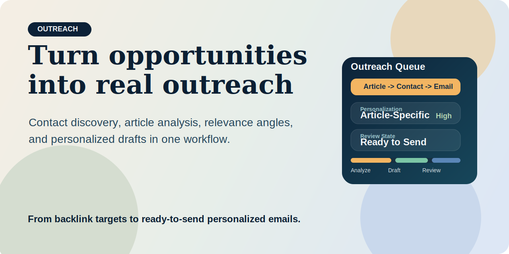
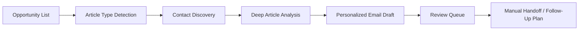

[](LICENSE)
[](skills/email-outreach.md)
[](skills/email-outreach.md)

# SEO Outreach Skill



> Turn backlink opportunities into personalized outreach workflows with article analysis, contact discovery, and send-ready drafts.

**Positioning**

SEO Outreach Skill is built for teams that want to scale link building without falling back to generic spammy templates.

It is designed to turn a raw outreach opportunity into:

- the right contact path
- article-specific context
- a relevance angle
- a personalized email draft
- a reviewable send queue

This project helps answer a practical outreach question:

> How do you scale backlink outreach without sending emails that look machine-generated?

**Outcome**

Instead of treating contact discovery, article analysis, and email writing as separate tasks, this skill combines them into one structured workflow.

## Best For

- SEO teams running link-building campaigns that need higher reply quality
- SaaS teams trying to earn placements in listicles, comparisons, and resource pages
- agencies that want repeatable outreach without mass-template language
- operators who want contact discovery, angle analysis, and draft writing in one place

## Start With These Prompts

```text
Setup outreach — my product is https://yourproduct.com, my audience is SEO teams, my name is Jane, my title is Founder
```

```text
Prepare outreach drafts
```

```text
Prepare outreach drafts for https://example.com/best-seo-tools
```

## External Access And Minimum Credentials

This skill can touch three external layers:

- an opportunity source such as Google Sheets
- web/search access for article and contact research
- Gmail if the user wants to actually send or monitor replies

Recommended minimum setup:

- `GOOGLE_SHEETS_TRACKER_URL`: read-only or exported CSV source
- `SERPAPI_API_KEY`: search-driven research
- no mail credentials are required for research and draft generation

If credentials are missing, the workflow should stop at research and draft generation instead of pretending it can send mail or read private data.

Access policy:

- opportunity trackers are optional, not required
- direct sending should be handled by a separate approved sender workflow
- inbox monitoring should be handled by a separate approved workflow
- the workflow should not assume private spreadsheet or inbox access unless explicitly configured

**About Dageno.ai**

[Dageno.ai](https://dageno.ai) is an AI SEO platform for brands, SaaS teams, SEO operators, agencies, and AI-search growth teams that want to scale authority building, discover visibility gaps, and support search + AI growth execution.

## Why It Feels Different

Most outreach tools optimize for volume first.

That usually leads to:

- generic compliments
- irrelevant pitches
- poor contact targeting
- low reply quality

This skill optimizes for relevance first.

Its job is not just to generate more emails. Its job is to generate emails that sound like they could only have been written for that exact article.

## What You Get

- one outreach workflow
- one structure for article analysis
- one contact discovery path
- one personalized email draft per opportunity
- one review table before sending

## Who This Is For

- SEO and digital marketing operators running link-building campaigns
- SaaS teams that need placement in comparison and recommendation content
- agencies that manage outreach across multiple clients or campaigns
- growth teams that want better reply quality, not just more volume

## Workflow



## What The System Produces

For each outreach target, the workflow can produce:

- article classification
- contact source and confidence
- analysis card with relevance angle
- personalized email draft
- review-ready output table
- follow-up workflow guidance

## Example Prompts

```text
Setup outreach — my product is https://yourproduct.com, my audience is SEO teams, my name is Jane, my title is Founder
```

```text
Run outreach
```

```text
Run outreach on https://example.com/best-seo-tools
```

```text
Check for replies
```

## Example Output

```text
Target URL
- https://example.com/best-seo-tools

Article Type
- Best / Top List

Contact
- john@example.com
- Source: Contact page
- Confidence: High

Analysis Card
- Key reference: article mentions 24-hour backlink lag as a major pain point
- Gap identified: no AI visibility tracking tools included
- Relevance statement: our product helps readers monitor ranking changes across both search and AI surfaces

Email Draft
- Short personalized intro
- Clear relevance angle
- Simple CTA

Status
- Ready for review
```

## Why Teams Use It

### Traditional Outreach Workflow

- opportunity list in a spreadsheet
- contact hunting done manually
- article reading done inconsistently
- email writing starts from a generic template
- follow-up logic is disconnected

### With Outreach Skill

- contact discovery, analysis, and draft writing live in one pipeline
- each email is grounded in article-specific context
- outreach can scale without sounding mass-produced

## Skill Entry Point

The core workflow lives here:

- [`skills/email-outreach.md`](skills/email-outreach.md)

Use it when you want to turn outreach opportunities into personalized drafts and structured send workflows.

## Repo Structure

```text
seo-outreach-skill/
├── README.md
├── LICENSE
├── assets/
│   └── cover.svg
└── skills/
    └── email-outreach.md
```

## Recommended Use Cases

- backlink outreach campaigns
- guest post and resource page outreach
- personalized author contact workflows
- batch processing of outreach targets from spreadsheets

## License

MIT
