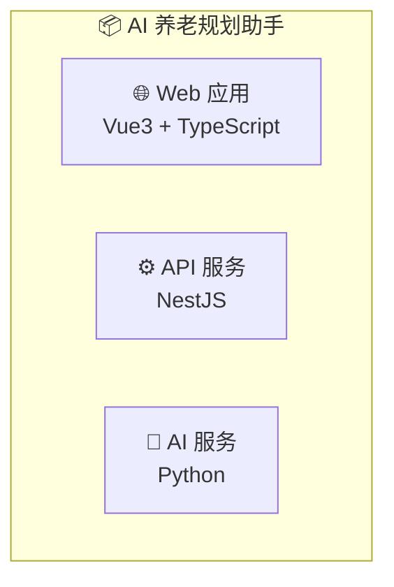
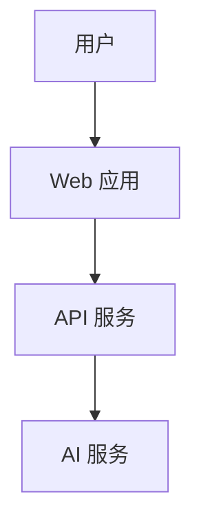

# mermaid-flow 路由指南

**核心原则**: 根据用户需求灵活选择，不是一刀切！

---

## 🎯 决策树

```
用户需要画图
    ↓
是什么类型的图？
    ↓
├─ 架构图
│   ↓
│   需要 C4 模型吗？
│   ↓
│   ├─ 是 → C4Context (c4_generator.py)
│   │   ├─ 系统上下文 → --level context
│   │   ├─ 技术架构 → --level container
│   │   └─ 模块组件 → --level component
│   │
│   └─ 否 → 普通流程图 (flowchart)
│       └─ 简单的框框箭头图
│
├─ 业务流程图 → 普通流程图 (flowchart)
├─ 时序图 → sequenceDiagram
├─ ER 图 → erDiagram
├─ 状态图 → stateDiagram
├─ 甘特图 → gantt
└─ 泳道图 → flowchart-draw (main_v4.py)
```

---

## 📋 详细规则

### 1️⃣ 架构图 - 选择 C4 还是普通？

**用 C4 的场景** (30%):
- ✅ 需要展示系统层次结构
- ✅ 需要展示技术栈
- ✅ 需要展示模块组件关系
- ✅ 正式的架构文档
- ✅ 技术评审会议

**用普通流程图的场景** (70%):
- ✅ 简单的框框箭头图
- ✅ 快速草图
- ✅ 非正式沟通
- ✅ 不需要 C4 的严格层次

---

### 2️⃣ 对比示例

**C4 Container (正式)**:

- ✅ 有 subgraph 边界
- ✅ 有技术栈说明
- ✅ 有 emoji 图标
- ✅ 样式统一

**普通流程图 (简单)**:

- ✅ 简单直接
- ✅ 快速绘制
- ✅ 容易修改

---

### 3️⃣ 使用建议

**推荐 C4**:
- PRD 文档中的架构图
- 技术评审 PPT
- 系统边界定义
- 技术栈展示

**推荐普通流程图**:
- 快速沟通
- 简单流程
- 草稿阶段
- 非正式文档

---

## ✅ 命令对比

### C4 Container
```bash
python c4_generator.py \
  --level container \
  -o arch_container.mmd \
  --title "技术架构图"
```

### 普通流程图
```bash
cat > simple_flow.mmd << 'MMD'
flowchart TD
    A[用户] --> B[Web 应用]
    B --> C[API 服务]
MMD
```

---

## 🎯 灵活选择

**不要为了用 C4 而用 C4！**

- 如果用户说"画个架构图" → 问清楚是否需要 C4
- 如果用户说"简单的框框图" → 用普通流程图
- 如果用户说"技术架构" → 用 C4 Container
- 如果用户说"系统边界" → 用 C4 Context
- 如果用户说"模块关系" → 用 C4 Component

---

## 📊 使用比例建议

| 类型 | 比例 | 说明 |
|------|------|------|
| 普通流程图 | 60% | 日常沟通、简单流程 |
| C4 架构图 | 25% | 正式文档、技术评审 |
| 时序图/ER 图 | 15% | 特定场景 |

---

## ✅ 验证清单

画图前问自己：
- [ ] 用户真的需要 C4 吗？
- [ ] 还是普通流程图就够了？
- [ ] 是否过度设计了？
- [ ] 是否符合用户需求？

**记住**: 合适 > 复杂！
