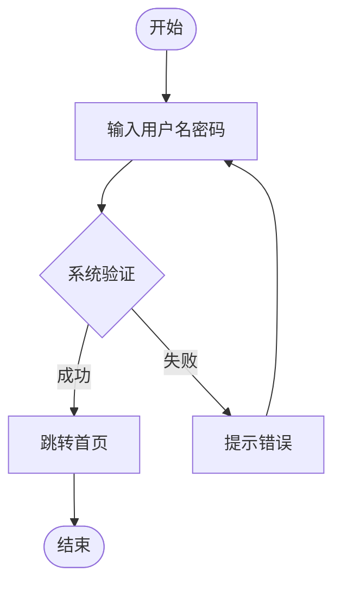
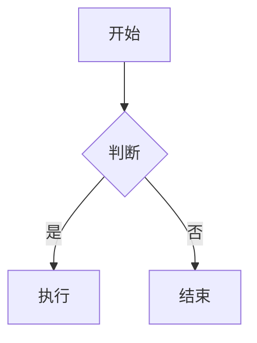
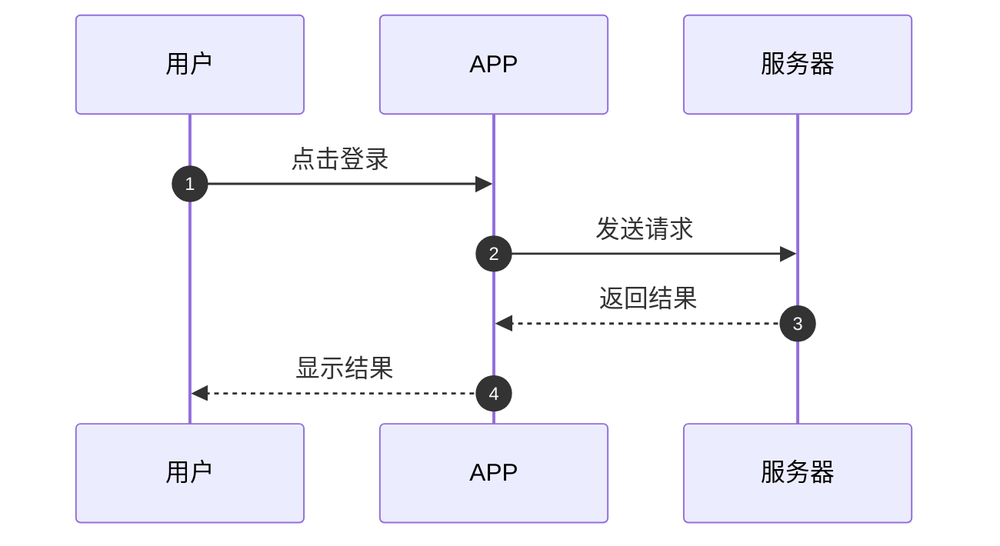
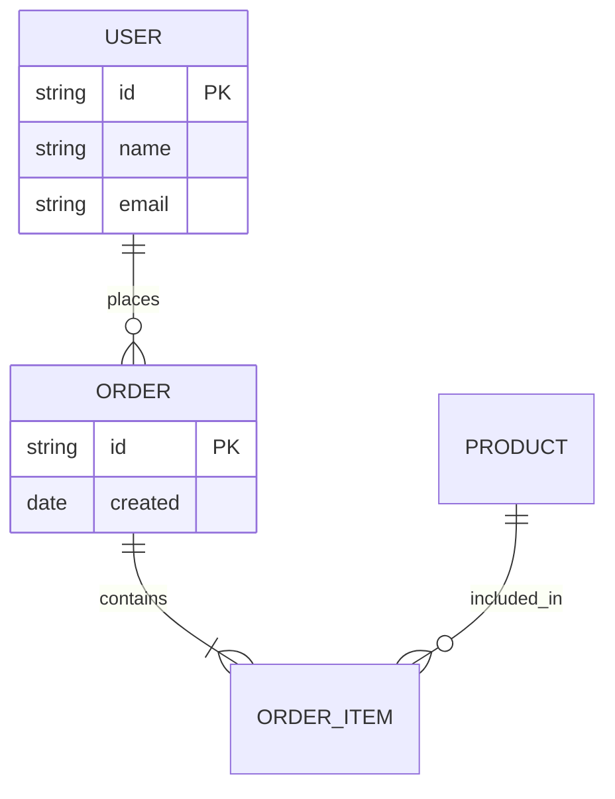
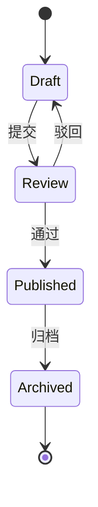
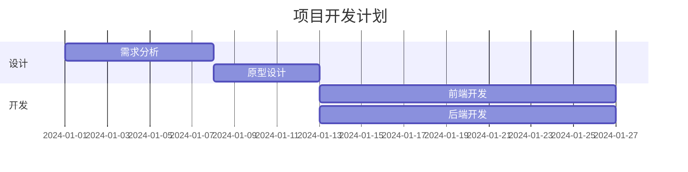

# Mermaid Flow - Mermaid 流程图自动生成

## 快速开始

### ⭐ 标准流程（先确认后生成）

**Step 1：用户描述图表**
```
帮我画一个用户登录流程图：
用户打开 APP → 输入用户名密码 → 系统验证 → 成功则跳转首页 → 失败则提示错误
```

**Step 2：AI 分析并确认** 📋
```
📋 Mermaid 图表确认
============================================================
类型：flowchart（流程图）
方向：TD（从上到下）

节点列表：
1. [开始] 用户打开 APP
2. [处理] 输入用户名密码
3. [判断] 系统验证
4. [成功] 跳转首页
5. [失败] 提示错误
6. [结束]

Mermaid 代码预览：

============================================================
✅ 请确认以上流程是否正确？回复「确认」开始生成
```

**Step 3：用户确认**
```
确认 / yes / 没问题
```

**Step 4：生成并导出** 🎨
```
✅ Mermaid 图表已生成！
📄 源文件：user-login-flow.mmd
🖼️ 预览图：user-login-flow.png (56KB, 1400x900)
```

---

## 支持的图表类型

### 1. 流程图 (flowchart)
**适用**: 业务流程、决策流程、操作步骤



**节点形状**:
- `[矩形]` - 处理步骤
- `{菱形}` - 判断节点
- `([圆形])` - 开始/结束
- `[/平行四边形/]` - 输入/输出

---

### 2. 时序图 (sequenceDiagram)
**适用**: 系统交互、消息传递、API 调用



---

### 3. ER 图 (erDiagram)
**适用**: 数据库设计、数据关系



---

### 4. 状态图 (stateDiagram-v2)
**适用**: 状态流转、生命周期



---

### 5. 甘特图 (gantt)
**适用**: 项目计划、时间安排



---

## 使用方式

### 方式 1: 对话描述
```
帮我画一个订单处理流程图：
用户提交订单 → 系统创建订单 → 用户支付 → 系统通知商家 → 商家发货 → 用户确认收货
```

### 方式 2: 提供 Mermaid 代码
```
帮我渲染这个 mermaid 图：
flowchart TD
    A[开始] --> B[处理]
    B --> C{判断}
    C -->|是 | D[执行]
    C -->|否 | E[结束]
```

### 方式 3: 读取文件
```
读取 order-flow.mmd 并导出为 PNG
```

---

## 脚本说明

### scripts/mermaid_render.py

**功能**: 封装 mermaid-cli 调用，支持批量导出

```bash
# 渲染单个文件
python mermaid_render.py -i flowchart.mmd -o flowchart.png

# 批量渲染目录
python mermaid_render.py -i ./diagrams/ -o ./output/ --batch

# 指定宽度和质量
python mermaid_render.py -i flow.mmd -o flow.png -w 1600 -b transparent
```

**参数**:
- `-i, --input`: 输入 .mmd 文件或目录
- `-o, --output`: 输出 .png 文件或目录
- `-w, --width`: 宽度 (默认 1400)
- `-b, --background`: 背景色 (默认 transparent)
- `--batch`: 批量模式

**环境要求**:
- ✅ mermaid-cli 已安装 (`mmdc` 命令)
- ✅ Puppeteer 可用 (使用系统 Chrome)
- ✅ `PUPPETEER_EXECUTABLE_PATH` 已配置

---

## 配置说明

### Puppeteer 配置

**使用系统 Chrome** (推荐):
```bash
export PUPPETEER_EXECUTABLE_PATH="/Applications/Google Chrome.app/Contents/MacOS/Google Chrome"
```

**或使用下载的 Chromium**:
```bash
# mermaid-cli 会自动下载
npx puppeteer browsers install chrome
```

### 导出质量

| 参数 | 推荐值 | 说明 |
|------|--------|------|
| width | 1400-1600 | PRD 文档用 1600，预览用 1400 |
| background | transparent | 透明背景，方便插入文档 |
| scale | 2 | 高清导出用 2，普通用 1 |

---

## 最佳实践

### 1. 流程图设计

**✅ 推荐**:
- 使用 `flowchart TD` (从上到下)
- 判断节点用 `{菱形}`
- 连线标签用 `-->|是 |`
- 开始/结束用 `([圆形])`

**❌ 避免**:
- 超过 50 个节点（太复杂）
- 过多交叉连线
- 长文本节点（用简短描述）

---

### 2. 时序图设计

**✅ 推荐**:
- 使用 `autonumber` 自动编号
- 参与者用简短名称
- 消息描述简洁明了

**❌ 避免**:
- 超过 10 个参与者
- 消息文本过长
- 复杂的条件分支

---

### 3. ER 图设计

**✅ 推荐**:
- 明确主键 (PK) 和外键 (FK)
- 使用标准关系符号 (`||--o{`, `||--|{`)
- 字段类型清晰

**❌ 避免**:
- 超过 20 张表（拆分）
- 循环依赖
- 未标注关系类型

---

## 输出文件规范

### 文件命名
```
{图表名称}_{日期}.mmd    # 源文件
{图表名称}_{日期}.png    # 预览图
```

### 文件保存位置
```
~/.openclaw/workspace/diagrams/
├── 2026-03-09/
│   ├── user-login-flow.mmd
│   └── user-login-flow.png
```

### 质量要求
- PNG 宽度：1400-1600px
- 背景：透明
- 字体：支持中文

---

## 错误处理

### mermaid-cli 未安装
```
❌ 错误：未找到 mmdc 命令
解决方案：npm install -g @mermaid-js/mermaid-cli
```

### Puppeteer 未配置
```
❌ 错误：Could not find Chrome
解决方案：export PUPPETEER_EXECUTABLE_PATH="/Applications/Google Chrome.app/Contents/MacOS/Google Chrome"
```

### 语法错误
```
❌ 错误：Parse error on line X
解决方案：检查 mermaid 语法，常见错误：
- subgraph 标签需要用双引号
- 中文括号可能导致解析错误
- 特殊字符需要转义
```

---

## 示例

### 示例 1: 业务流程图

**输入**:
```
帮我画一个请假审批流程：
员工提交请假申请 → 部门经理审批 → 如果同意则 HR 备案 → 如果拒绝则返回员工 → 员工收到通知
```

**输出**:
- 📄 leave-approval-flow.mmd
- 🖼️ leave-approval-flow.png

---

### 示例 2: 系统时序图

**输入**:
```
画一个登录时序图：
用户输入账号密码 → APP 发送请求 → 服务器验证 → 返回 Token → APP 保存并跳转
```

**输出**:
- 📄 login-sequence.mmd
- 🖼️ login-sequence.png

---

### 示例 3: 数据库 ER 图

**输入**:
```
生成用户订单系统的 ER 图：
用户有订单，订单包含订单项，产品被订单项引用
```

**输出**:
- 📄 user-order-er.mmd
- 🖼️ user-order-er.png

---

## 与 flowchart-draw 的区别

| 维度 | mermaid-flow | flowchart-draw |
|------|-------------|---------------|
| **渲染引擎** | mermaid-cli | draw.io 桌面版 |
| **布局方式** | 自动布局 | 手动/模板布局 |
| **文件格式** | 文本 (.mmd) | XML (.drawio) |
| **版本控制** | ✅ 文本 diff | ⚠️ XML 难 diff |
| **学习成本** | ✅ 5 分钟 | ⚠️ 需学习 UI |
| **适用场景** | 流程图/时序图/ER 图 | 架构图/泳道图 |

**选择建议**:
- 流程图/时序图/ER 图 → mermaid-flow
- 架构图/泳道图/精确布局 → flowchart-draw

---

## 依赖检查

使用前确保：
- ✅ mermaid-cli 已安装 (`mmdc --version`)
- ✅ Puppeteer 可用 (系统 Chrome 或 Chromium)
- ✅ `PUPPETEER_EXECUTABLE_PATH` 已配置 (macOS)
- ✅ 输出目录有写入权限

---

## 快速安装

```bash
# 1. 安装 mermaid-cli
npm install -g @mermaid-js/mermaid-cli

# 2. 配置 Puppeteer (macOS)
export PUPPETEER_EXECUTABLE_PATH="/Applications/Google Chrome.app/Contents/MacOS/Google Chrome"

# 3. 测试
mmdc --version
```

---

**版本**: 1.0  
**最后更新**: 2026-03-09

---

## 🆕 v2.0 C4Context 支持 (2026-03-10)

### c4_generator.py - C4 模型架构图生成器

**位置**: `scripts/c4_generator.py`

**功能**: 生成 C4 模型架构图（Context/Container/Component）

---

### C4 模型说明

C4 模型是软件架构的四层抽象模型：

| 级别 | 英文 | 说明 | 适用场景 |
|------|------|------|---------|
| **L1** | Context | 系统上下文图 | 最高级别，显示系统和外部依赖 |
| **L2** | Container | 容器图 | 应用级别，显示应用和技术栈 |
| **L3** | Component | 组件图 | 模块级别，显示内部组件 |
| L4 | Code | 代码图 | 类级别（通常用 UML 类图） |

---

### 使用方式

#### 1. C4 上下文图（L1）

**适用场景**:
- 系统边界定义
- 外部依赖展示
- 技术决策说明

**命令**:
```bash
python c4_generator.py \
  --level context \
  -o c4_context.mmd \
  --title "系统上下文图" \
  --system-name "AI 养老规划助手"
```

**输出**:
- 用户（理财经理）
- 系统（AI 养老规划助手）
- 外部依赖（企业微信、阿里云百炼、产品数据库）

---

#### 2. C4 容器图（L2）

**适用场景**:
- 技术栈展示
- 应用架构说明
- 部署架构说明

**命令**:
```bash
python c4_generator.py \
  --level container \
  -o c4_container.mmd \
  --title "容器图"
```

**输出**:
- Web 应用（Vue3 + TypeScript）
- API 服务（NestJS）
- AI 服务（Python）
- 数据库（MySQL + MongoDB）

---

#### 3. C4 组件图（L3）

**适用场景**:
- 模块内部结构
- 组件交互说明
- 代码组织说明

**命令**:
```bash
python c4_generator.py \
  --level component \
  -o c4_component.mmd \
  --title "组件图"
```

**输出**:
- 认证模块（JWT）
- 规划引擎（Python）
- 推荐引擎（ML）
- 报告生成（PDF）

---

### 渲染为 PNG

```bash
# 渲染 C4 图
python mermaid_render.py \
  -i c4_context.mmd \
  -o c4_context.png \
  -w 1600 \
  -b white
```

---

### 完整工作流

```bash
# 1. 生成 C4 三层图
python c4_generator.py --level context -o 01_context.mmd
python c4_generator.py --level container -o 02_container.mmd
python c4_generator.py --level component -o 03_component.mmd

# 2. 渲染为 PNG
python mermaid_render.py -i 01_context.mmd -o 01_context.png -w 1600 -b white
python mermaid_render.py -i 02_container.mmd -o 02_container.png -w 1600 -b white
python mermaid_render.py -i 03_component.mmd -o 03_component.png -w 1600 -b white

# 3. 插入 PRD 文档
# 使用 word-docx-enhanced 技能插入图片
```

---

### 对比 flowchart-draw

| 特性 | mermaid-flow (C4) | flowchart-draw |
|------|-----------------|---------------|
| **语法** | Mermaid 文本 | draw.io XML |
| **布局** | 自动布局 | 精确控制 |
| **适用** | 架构图/流程图 | 架构图/泳道图 |
| **版本控制** | ✅ 友好 | ❌ 二进制 |
| **自定义** | 中等 | 高 |
| **C4 支持** | ✅ 原生 | ❌ 需手动 |

**推荐使用**:
- C4 架构图 → mermaid-flow (c4_generator.py)
- 分层架构图 → flowchart-draw (arch_generator_v4.py)
- 业务流程图 → mermaid-flow (flowchart)
- 泳道图 → flowchart-draw (main_v4.py)

---

### 示例输出

**C4 Context**:
```
👤 用户 → 📦 系统 → 💬 企业微信
                    → ☁️ 阿里云百炼
                    → 🗄️ 产品数据库
```

**C4 Container**:
```
👤 用户 → 🌐 Web 应用 → ⚙️ API 服务 → 🤖 AI 服务 → ☁️ 百炼
                              → 💾 数据库
```

**C4 Component**:
```
⚙️ API 服务
  ├─ 🔐 认证模块
  ├─ 📊 规划引擎
  ├─ 🎯 推荐引擎
  └─ 📄 报告生成
```

---
