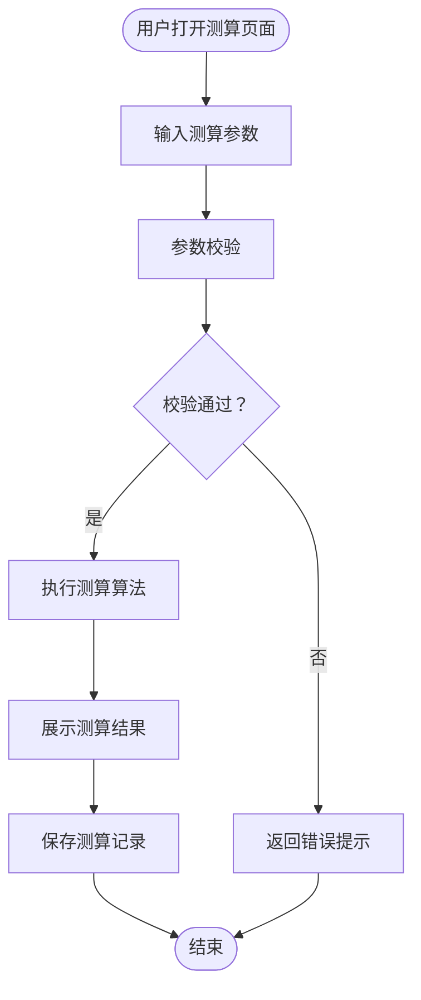
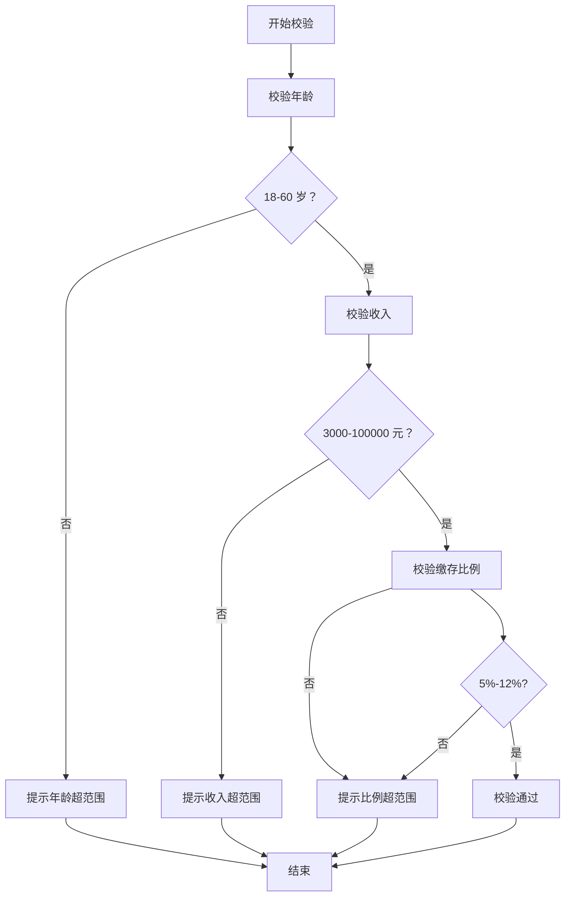
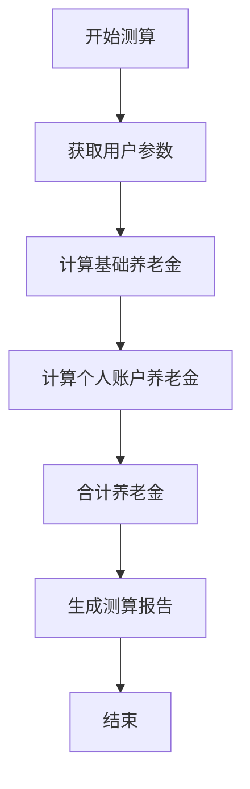
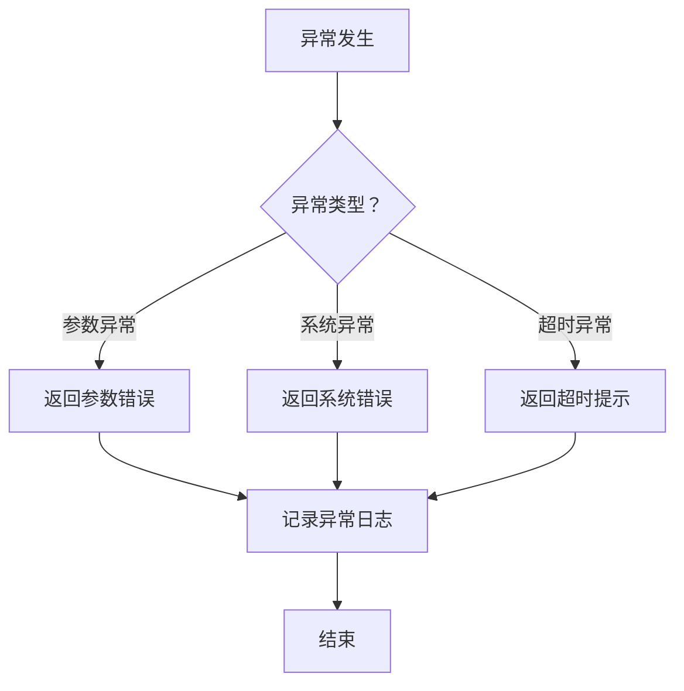
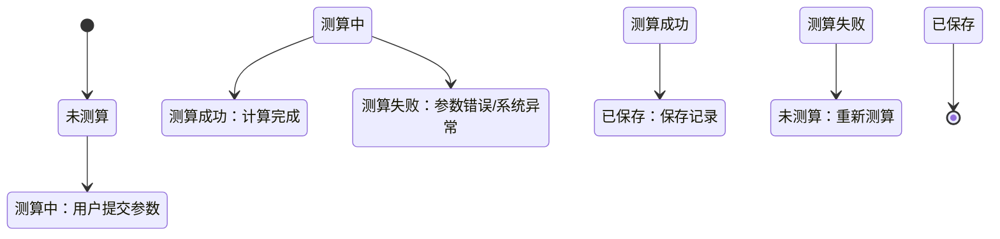

# PRD 文档模板 - [产品名称]

**文档版本**: v1.0  
**创建日期**: 2026-04-01  
**最后更新**: 2026-04-01  
**产品负责人**: [姓名]  
**状态**: 草稿/评审中/已批准

---

## 📋 文档变更记录

| 版本 | 日期 | 变更内容 | 变更人 | 审核状态 |
|------|------|---------|--------|---------|
| v1.0 | 2026-04-01 | 初始版本 | [姓名] | 草稿 |
| | | | | |

---

## 1. 需求背景

### 1.1 产品定位
> 一句话描述产品的核心价值和市场定位

**示例**：
> 养老金测算工具是一款面向 35-50 岁中产阶层的在线测算工具，帮助用户准确计算退休后每月可领取的养老金金额，为养老规划提供数据支持。

---

### 1.2 目标用户
| 用户类型 | 年龄段 | 收入水平 | 核心痛点 | 使用场景 |
|---------|-------|---------|---------|---------|
| 主要用户 | 35-50 岁 | 年收入 30-100 万 | 不清楚退休后能领多少养老金 | 退休规划、财务规划 |
| 次要用户 | 25-35 岁 | 年收入 15-30 万 | 想提前了解养老政策 | 学习了解、早期规划 |

---

### 1.3 业务目标
| 目标类型 | 目标描述 | 衡量指标 | 目标值 |
|---------|---------|---------|-------|
| 用户目标 | 帮助用户准确测算养老金 | 测算准确率 | ≥95% |
| 业务目标 | 提升用户养老规划意识 | 用户使用率 | 月活 10 万 + |
| 体验目标 | 简化测算流程 | 用户操作步骤 | ≤3 步 |

---

### 1.4 竞品分析（可选）
| 竞品名称 | 核心功能 | 优势 | 劣势 | 我们的差异化 |
|---------|---------|------|------|------------|
| 竞品 A | 养老金测算 | 品牌知名度高 | 功能单一 | 我们提供更详细的测算报告 |
| 竞品 B | 理财规划 | 功能全面 | 操作复杂 | 我们更简单易用 |

---

## 2. 用户场景

### 2.1 用户画像
**姓名**: 张先生  
**年龄**: 35 岁  
**职业**: 互联网从业者  
**收入**: 月收入 20000 元  
**特征**:
- 有养老规划意识
- 对养老金政策不了解
- 希望提前规划退休生活
- 习惯使用手机 APP

**使用目标**:
- 了解退休后每月能领多少养老金
- 评估当前缴存比例是否合理
- 为退休生活做准备

---

### 2.2 核心场景

#### 场景 1：首次测算
**用户**: 张先生，35 岁，首次使用  
**目标**: 了解自己的养老金测算结果  
**操作流程**:
1. 打开养老金测算页面
2. 输入年龄、月收入、缴存比例
3. 点击"开始测算"
4. 查看测算结果

**期望结果**:
- 操作简单，3 分钟内完成
- 结果清晰易懂
- 提供详细的测算说明

---

#### 场景 2：调整参数对比
**用户**: 张先生，已测算过一次  
**目标**: 对比不同缴存比例的影响  
**操作流程**:
1. 查看历史测算记录
2. 调整缴存比例（从 8% 调到 12%）
3. 重新测算
4. 对比两次结果

**期望结果**:
- 支持历史记录的查看和对比
- 参数调整方便
- 结果对比清晰

---

### 2.3 用户旅程地图

```
认知 → 了解 → 使用 → 分享
  ↓      ↓      ↓      ↓
看到广告 → 了解功能 → 输入信息 → 分享结果
         → 查看案例 → 测算结果 → 推荐朋友
         → 产生兴趣 → 保存报告
```

**关键触点**:
- 触点 1：广告/推荐 → 认知产品
- 触点 2：功能介绍 → 产生兴趣
- 触点 3：测算页面 → 完成操作
- 触点 4：结果页面 → 满意分享

**痛点与机会**:
| 阶段 | 痛点 | 机会 |
|------|------|------|
| 认知 | 不知道产品存在 | 加强推广 |
| 了解 | 不了解测算准确性 | 提供案例展示 |
| 使用 | 操作复杂 | 简化流程 |
| 分享 | 没有分享动力 | 提供分享激励 |

---

## 3. 业务流程 ⭐

### 3.1 主业务流程图



---

### 3.2 子流程 1：参数校验流程



---

### 3.3 子流程 2：核心处理流程（测算算法）



---

### 3.4 子流程 3：异常处理流程



---

### 3.5 状态流转图



---

### 3.6 流程说明表 ⭐

| 节点编号 | 节点名称 | 节点说明 | 输入 | 输出 | 异常处理 | 负责人 |
|---------|---------|---------|------|------|---------|-------|
| Step1 | 输入测算参数 | 用户填写年龄、收入、缴存比例 | 无 | 年龄、收入、缴存比例 | 用户取消输入 | 前端 |
| Step2 | 参数校验 | 校验输入参数是否合法 | 年龄、收入、缴存比例 | 校验结果 | 参数超范围 | 前端 + 后端 |
| Step3 | 执行测算算法 | 根据公式计算养老金 | 校验通过的参数 | 测算结果 | 算法异常 | 后端 |
| Step4 | 展示测算结果 | 向用户展示测算结果 | 测算结果 | 结果页面 | 展示异常 | 前端 |
| Step5 | 保存测算记录 | 保存用户测算历史 | 测算结果、用户 ID | 保存结果 | 存储异常 | 后端 |

---

### 3.7 数据流向图

```
用户输入 → 前端校验 → 后端校验 → 测算算法 → 结果展示
              ↓           ↓          ↓          ↓
          错误提示   错误提示   异常处理   保存记录
```

---

## 4. 功能需求 ⭐

### 4.1 养老金测算功能

#### 4.1.1 功能描述
根据用户输入的年龄、收入、缴存比例等信息，测算退休后每月可领取的养老金金额，并提供详细的测算报告。

**优先级**: P0  
**预计工时**: 5 人天  
**依赖关系**: 无

---

#### 4.1.2 业务规则 ⭐

**规则 1：年龄限制**
- 年龄范围：18-60 岁
- 低于 18 岁：提示"年龄未满 18 岁，无法测算"
- 高于 60 岁：提示"年龄已超过 60 岁，无法测算"

**规则 2：收入限制**
- 收入范围：3000-100000 元/月
- 低于 3000 元：提示"月收入低于最低标准"
- 高于 100000 元：提示"月收入高于最高标准"

**规则 3：缴存比例**
- 比例范围：5%-12%
- 默认值：8%
- 步进值：0.5%

**规则 4：测算公式**
```
基础养老金 = (当地上年度在岗职工月平均工资 + 本人指数化月平均缴费工资) ÷ 2 × 缴费年限 × 1%
个人账户养老金 = 个人账户储存额 ÷ 计发月数
每月养老金 = 基础养老金 + 个人账户养老金
```

**规则 5：测算结果有效期**
- 测算结果仅供参考
- 有效期：测算当天
- 政策变化时需重新测算

---

#### 4.1.3 输入定义 ⭐

| 字段名 | 字段类型 | 必填 | 默认值 | 说明 | 校验规则 | 错误提示 |
|-------|---------|------|-------|------|---------|---------|
| 年龄 | 整数 | 是 | 无 | 用户当前年龄 | 18 ≤ age ≤ 60 | 年龄必须在 18-60 岁之间 |
| 月收入 | 数字 (2 位小数) | 是 | 无 | 用户月收入（元） | 3000 ≤ income ≤ 100000 | 月收入必须在 3000-100000 元之间 |
| 缴存比例 | 百分比 (1 位小数) | 是 | 8.0% | 公积金缴存比例 | 5% ≤ ratio ≤ 12% | 缴存比例必须在 5%-12% 之间 |
| 当前余额 | 数字 (2 位小数) | 否 | 0 | 个人账户当前余额（元） | balance ≥ 0 | 当前余额不能为负数 |
| 退休年龄 | 整数 | 否 | 60 | 预计退休年龄 | 50 ≤ retirement ≤ 70 | 退休年龄必须在 50-70 岁之间 |

**输入示例**：
```json
{
  "age": 35,
  "monthlyIncome": 20000.00,
  "contributionRatio": 8.0,
  "currentBalance": 50000.00,
  "retirementAge": 60
}
```

---

#### 4.1.4 输出定义 ⭐

| 字段名 | 字段类型 | 说明 | 示例 |
|-------|---------|------|------|
| monthlyPension | 数字 (2 位小数) | 每月可领取养老金（元） | 8500.00 |
| totalPension | 数字 (2 位小数) | 预计领取总额（元） | 2040000.00 |
| basicPension | 数字 (2 位小数) | 基础养老金（元） | 5000.00 |
| personalPension | 数字 (2 位小数) | 个人账户养老金（元） | 3500.00 |
| calculationDate | 日期时间 | 测算日期 | 2026-04-01 10:30:00 |
| validUntil | 日期 | 结果有效期 | 2026-04-01 |
| details | 对象 | 测算详情 | 见下方 |

**输出示例**：
```json
{
  "monthlyPension": 8500.00,
  "totalPension": 2040000.00,
  "basicPension": 5000.00,
  "personalPension": 3500.00,
  "calculationDate": "2026-04-01 10:30:00",
  "validUntil": "2026-04-01",
  "details": {
    "contributionYears": 25,
    "averageSalary": 10000.00,
    "personalAccountBalance": 120000.00
  }
}
```

---

#### 4.1.5 异常处理

| 异常类型 | 触发条件 | 错误码 | 错误提示 | 处理方式 |
|---------|---------|-------|---------|---------|
| 参数校验失败 | 年龄/收入/比例超范围 | PARAM_ERROR | "参数校验失败，请检查输入" | 前端提示，阻止提交 |
| 算法执行异常 | 测算算法异常 | ALGO_ERROR | "测算失败，请稍后重试" | 后端捕获，返回错误 |
| 超时异常 | 响应时间>30 秒 | TIMEOUT_ERROR | "测算超时，请稍后重试" | 前端超时提示 |
| 系统异常 | 服务器错误 | SYSTEM_ERROR | "系统繁忙，请稍后重试" | 后端捕获，返回错误 |

---

#### 4.1.6 验收标准 ⭐

**功能验收**：
- [ ] 输入年龄 35 岁、月收入 20000 元、缴存比例 8%，测算结果正确
- [ ] 输入年龄 18 岁（边界值），正常测算
- [ ] 输入年龄 60 岁（边界值），正常测算
- [ ] 输入年龄 17 岁（超范围），提示"年龄必须在 18-60 岁之间"
- [ ] 输入年龄 61 岁（超范围），提示"年龄必须在 18-60 岁之间"
- [ ] 输入月收入 3000 元（边界值），正常测算
- [ ] 输入月收入 100000 元（边界值），正常测算
- [ ] 输入缴存比例 5%（边界值），正常测算
- [ ] 输入缴存比例 12%（边界值），正常测算
- [ ] 测算结果保留 2 位小数
- [ ] 测算结果包含基础养老金和个人账户养老金明细

**性能验收**：
- [ ] 响应时间 < 2 秒（95% 请求）
- [ ] 支持并发 1000 用户
- [ ] 服务器 CPU 占用 < 70%

**兼容性验收**：
- [ ] iOS 12+ 正常显示
- [ ] Android 8+ 正常显示
- [ ] 微信浏览器正常显示

---

### 4.2 历史记录功能

#### 4.2.1 功能描述
查看用户历史测算记录，支持对比不同参数的测算结果。

**优先级**: P1  
**预计工时**: 3 人天

---

#### 4.2.2 业务规则
- 每个用户最多保存 10 条历史记录
- 历史记录保存 30 天
- 支持删除单条记录
- 支持清空所有记录

---

#### 4.2.3 输入定义
| 字段名 | 字段类型 | 必填 | 说明 |
|-------|---------|------|------|
| userId | 字符串 | 是 | 用户 ID |
| page | 整数 | 否 | 页码，默认 1 |
| pageSize | 整数 | 否 | 每页数量，默认 10 |

---

#### 4.2.4 输出定义
| 字段名 | 字段类型 | 说明 |
|-------|---------|------|
| records | 数组 | 历史记录列表 |
| total | 整数 | 总记录数 |
| page | 整数 | 当前页码 |

---

#### 4.2.5 验收标准
- [ ] 查看历史记录列表正常
- [ ] 删除单条记录正常
- [ ] 清空所有记录正常
- [ ] 超过 10 条记录时，只显示最新 10 条
- [ ] 超过 30 天的记录自动删除

---

## 5. 用户故事

### 5.1 用户故事列表

| 编号 | 用户故事 | 优先级 | 验收标准 |
|------|---------|-------|---------|
| US-001 | 作为用户，我希望输入年龄、收入、缴存比例就能测算养老金，以便了解退休后能领多少钱 | P0 | 3 步内完成测算，结果清晰展示 |
| US-002 | 作为用户，我希望调整参数后能立即看到新的测算结果，以便对比不同方案 | P1 | 参数调整后 1 秒内更新结果 |
| US-003 | 作为用户，我希望查看历史测算记录，以便回顾之前的测算结果 | P1 | 历史记录列表正常显示 |
| US-004 | 作为用户，我希望保存测算报告，以便分享给家人或朋友 | P2 | 支持生成图片/链接分享 |
| US-005 | 作为用户，我希望了解测算公式和假设条件，以便理解结果是如何计算的 | P2 | 提供详细的测算说明 |

---

### 5.2 优先级排序

**P0（必须做）**:
- US-001: 养老金测算

**P1（应该做）**:
- US-002: 参数调整对比
- US-003: 历史记录

**P2（可以做）**:
- US-004: 保存分享
- US-005: 测算说明

---

## 6. 验收标准

### 6.1 功能验收清单

| 功能 | 验收项 | 验收结果 | 验收人 | 日期 |
|------|-------|---------|-------|------|
| 养老金测算 | 输入参数校验 | □通过 □失败 | | |
| 养老金测算 | 测算结果准确性 | □通过 □失败 | | |
| 养老金测算 | 异常处理 | □通过 □失败 | | |
| 历史记录 | 列表展示 | □通过 □失败 | | |
| 历史记录 | 删除功能 | □通过 □失败 | | |

---

### 6.2 性能验收标准

| 指标 | 目标值 | 实测值 | 验收结果 |
|------|-------|-------|---------|
| 响应时间（P95） | < 2 秒 | | □通过 □失败 |
| 并发用户数 | ≥ 1000 | | □通过 □失败 |
| 系统可用性 | ≥ 99.9% | | □通过 □失败 |

---

### 6.3 兼容性验收标准

| 平台 | 版本 | 验收结果 |
|------|------|---------|
| iOS | 12+ | □通过 □失败 |
| Android | 8+ | □通过 □失败 |
| 微信浏览器 | 最新版 | □通过 □失败 |
| Chrome | 最新版 | □通过 □失败 |

---

## 7. 非功能需求

### 7.1 性能要求

| 指标 | 要求 | 说明 |
|------|------|------|
| 响应时间 | < 2 秒 | 95% 的请求响应时间 |
| 并发用户 | ≥ 1000 | 同时在线用户数 |
| TPS | ≥ 500 | 每秒事务处理量 |
| 数据库查询 | < 500ms | 复杂查询响应时间 |

---

### 7.2 安全要求

| 要求 | 说明 |
|------|------|
| 数据加密 | 用户输入数据加密传输（HTTPS） |
| 权限控制 | 用户只能查看自己的历史记录 |
| 防刷机制 | 单用户每分钟最多测算 10 次 |
| 日志审计 | 记录所有测算操作日志 |

---

### 7.3 兼容性要求

| 类型 | 要求 |
|------|------|
| 浏览器 | Chrome 80+、Safari 12+、微信浏览器 |
| 操作系统 | iOS 12+、Android 8+ |
| 屏幕分辨率 | 支持 375x667 到 1920x1080 |
| 网络环境 | 支持 4G/5G/WiFi |

---

### 7.4 可用性要求

| 指标 | 要求 |
|------|------|
| 系统可用性 | ≥ 99.9% |
| 故障恢复时间 | < 30 分钟 |
| 数据备份 | 每日自动备份 |
| 监控告警 | 关键指标异常自动告警 |

---

## 8. 原型设计 ⭐

### 8.1 页面列表

| 页面编号 | 页面名称 | 说明 | 优先级 | 原型文件 |
|---------|---------|------|-------|---------|
| P01 | 养老金测算页 | 主测算页面 | P0 | prototypes/pension-calculation.html |
| P02 | 测算结果页 | 展示测算结果 | P0 | prototypes/pension-result.html |
| P03 | 历史记录页 | 查看历史测算 | P1 | prototypes/history.html |

---

### 8.2 P01 养老金测算页

#### 页面布局
```
┌─────────────────────────────────────────┐
│  ← 返回     养老金测算                  │
├─────────────────────────────────────────┤
│                                         │
│  年龄                                   │
│  [____] 岁                              │
│  * 请输入 18-60 岁                       │
│                                         │
│  月收入                                 │
│  [____] 元                              │
│  * 请输入 3000-100000 元                 │
│                                         │
│  缴存比例                               │
│  [====●====] 8.0%                       │
│   5%          12%                       │
│                                         │
│  当前余额（可选）                        │
│  [____] 元                              │
│                                         │
├─────────────────────────────────────────┤
│                                         │
│         [ 开始测算 ]                     │
│                                         │
└─────────────────────────────────────────┘
```

---

#### 交互说明

| 元素 | 交互类型 | 交互说明 |
|------|---------|---------|
| 年龄输入框 | 数字键盘 | 仅允许输入数字，实时校验 18-60 |
| 月收入输入框 | 数字键盘 | 带千分位显示，实时校验范围 |
| 缴存比例滑块 | 滑块选择 | 5%-12%，步进 0.5%，显示当前值 |
| 当前余额输入框 | 数字键盘 | 可选，仅允许输入数字 |
| 开始测算按钮 | 点击 | 校验通过后跳转结果页，校验失败提示错误 |

---

#### 校验规则

| 字段 | 校验规则 | 错误提示 |
|------|---------|---------|
| 年龄 | 18-60 的整数 | "年龄必须在 18-60 岁之间" |
| 月收入 | 3000-100000 的数字 | "月收入必须在 3000-100000 元之间" |
| 缴存比例 | 5%-12% 的百分比 | "缴存比例必须在 5%-12% 之间" |
| 当前余额 | ≥0 的数字 | "当前余额不能为负数" |

---

#### 原型文件
- HTML 原型：`prototypes/pension-calculation.html`
- PNG 截图：`prototypes/pension-calculation.png`

---

### 8.3 P02 测算结果页

#### 页面布局
```
┌─────────────────────────────────────────┐
│  ← 返回     测算结果                    │
├─────────────────────────────────────────┤
│                                         │
│  您退休后每月可领取                      │
│                                         │
│  ¥ 8,500.00                            │
│  每月养老金                             │
│                                         │
├─────────────────────────────────────────┤
│                                         │
│  测算详情                               │
│  ┌─────────────────────────────────┐   │
│  │ 基础养老金      ¥ 5,000.00      │   │
│  │ 个人账户养老金  ¥ 3,500.00      │   │
│  │                                 │   │
│  │ 缴费年限        25 年            │   │
│  │ 个人账户余额    ¥ 120,000.00    │   │
│  └─────────────────────────────────┘   │
│                                         │
│  [ 重新测算 ]  [ 保存报告 ]  [ 分享 ]   │
│                                         │
└─────────────────────────────────────────┘
```

---

#### 交互说明

| 元素 | 交互类型 | 交互说明 |
|------|---------|---------|
| 重新测算 | 点击 | 返回测算页，保留上次输入 |
| 保存报告 | 点击 | 保存测算结果到历史记录 |
| 分享 | 点击 | 生成分享图片/链接 |

---

#### 原型文件
- HTML 原型：`prototypes/pension-result.html`
- PNG 截图：`prototypes/pension-result.png`

---

## 9. 数据定义（业务视角）⭐

### 9.1 核心业务数据

| 数据项 | 说明 | 来源 | 用途 | 更新频率 |
|--------|------|------|------|---------|
| 用户年龄 | 用户当前年龄 | 用户输入 | 测算参数 | 每次测算 |
| 月收入 | 用户月收入 | 用户输入 | 测算参数 | 每次测算 |
| 缴存比例 | 公积金缴存比例 | 用户输入 | 测算参数 | 每次测算 |
| 测算结果 | 养老金测算结果 | 系统计算 | 展示给用户 | 每次测算 |
| 历史记录 | 用户测算历史 | 系统保存 | 查看对比 | 每次测算 |

---

### 9.2 数据字典

| 字段名 | 业务含义 | 数据类型 | 取值范围 | 说明 |
|-------|---------|---------|---------|------|
| age | 用户年龄 | 整数 | 18-60 | 用户当前年龄（周岁） |
| monthlyIncome | 月收入 | 数字 | 3000-100000 | 用户月收入（元，税前） |
| contributionRatio | 缴存比例 | 百分比 | 5%-12% | 公积金缴存比例 |
| monthlyPension | 每月养老金 | 数字 | ≥0 | 退休后每月可领取金额（元） |
| totalPension | 总养老金 | 数字 | ≥0 | 预计领取总额（元） |
| basicPension | 基础养老金 | 数字 | ≥0 | 基础养老金部分（元） |
| personalPension | 个人账户养老金 | 数字 | ≥0 | 个人账户养老金部分（元） |

---

### 9.3 业务术语

| 术语 | 定义 | 说明 |
|------|------|------|
| 基础养老金 | 根据社会平均工资和个人缴费情况计算的部分 | 公式：(社平工资 + 指数化工资) ÷ 2 × 年限 × 1% |
| 个人账户养老金 | 个人账户储存额除以计发月数 | 公式：账户余额 ÷ 计发月数 |
| 计发月数 | 根据退休年龄确定的月数 | 60 岁退休为 139 个月 |
| 缴费年限 | 从当前年龄到退休年龄的年数 | 退休年龄 - 当前年龄 |

---

## 10. 附录

### 10.1 术语表

| 术语 | 英文 | 定义 |
|------|------|------|
| PRD | Product Requirement Document | 产品需求文档 |
| P0/P1/P2 | Priority 0/1/2 | 优先级 0/1/2 |
| TPS | Transactions Per Second | 每秒事务处理量 |
| HTTPS | Hyper Text Transfer Protocol Secure | 超文本传输安全协议 |

---

### 10.2 参考资料

- 《养老保险政策解读》- 人社部
- 《养老金测算公式详解》- 社保局
- 《用户体验设计指南》- NNGroup

---

### 10.3 变更记录

| 版本 | 日期 | 变更内容 | 变更人 | 审核人 |
|------|------|---------|-------|-------|
| v1.0 | 2026-04-01 | 初始版本 | [姓名] | [待审核] |
| | | | | |

---

## ✅ PRD 审核清单

**产品负责人审核**：
- [ ] 需求背景清晰
- [ ] 用户场景完整
- [ ] 业务流程正确
- [ ] 功能需求详细
- [ ] 业务规则明确
- [ ] 输入输出定义清晰
- [ ] 验收标准具体
- [ ] 原型设计合理

**技术负责人审核**：
- [ ] 技术可行性
- [ ] 性能要求合理
- [ ] 安全要求明确

**测试负责人审核**：
- [ ] 验收标准可测试
- [ ] 测试用例可编写

**最终批准**：
- [ ] 产品负责人签字：__________ 日期：__________
- [ ] 技术负责人签字：__________ 日期：__________

---

**文档结束**
