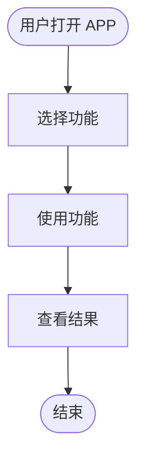
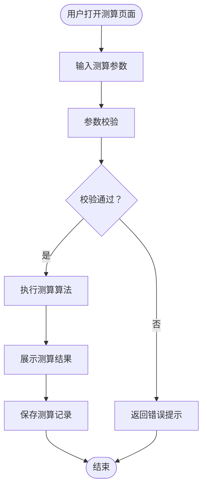
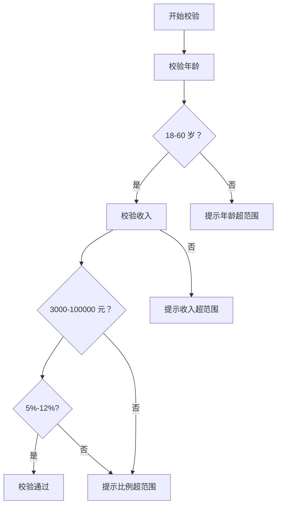
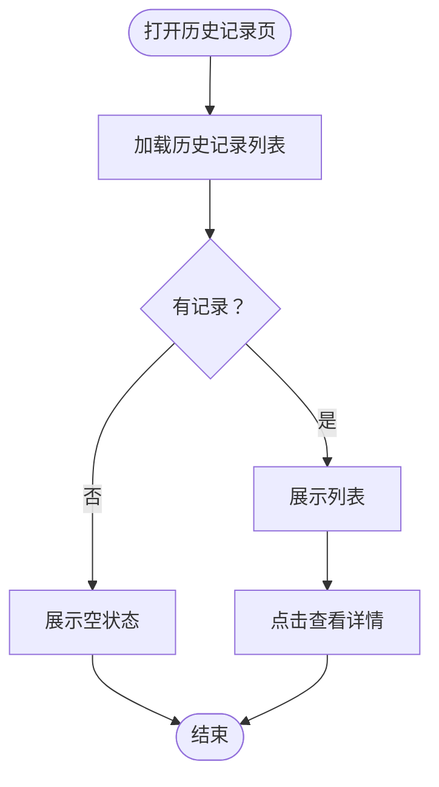

# PRD 文档模板 - [产品名称]

**文档版本**: v1.0  
**创建日期**: 2026-04-01  
**产品负责人**: [姓名]  
**状态**: 草稿/评审中/已批准

---

## 📋 文档变更记录

| 版本 | 日期 | 变更内容 | 变更人 | 审核状态 |
|------|------|---------|--------|---------|
| v1.0 | 2026-04-01 | 初始版本 | [姓名] | 草稿 |

---

## 1. 需求概述

### 1.1 产品定位
> 一句话描述产品的核心价值和市场定位

**示例**：
> 养老金测算工具是一款面向 35-50 岁中产阶层的在线测算工具，帮助用户准确计算退休后每月可领取的养老金金额。

---

### 1.2 目标用户
| 用户类型 | 年龄段 | 收入水平 | 核心痛点 |
|---------|-------|---------|---------|
| 主要用户 | 35-50 岁 | 年收入 30-100 万 | 不清楚退休后能领多少养老金 |
| 次要用户 | 25-35 岁 | 年收入 15-30 万 | 想提前了解养老政策 |

---

### 1.3 业务目标
| 目标类型 | 目标描述 | 衡量指标 | 目标值 |
|---------|---------|---------|-------|
| 用户目标 | 帮助用户准确测算养老金 | 测算准确率 | ≥95% |
| 业务目标 | 提升用户养老规划意识 | 用户使用率 | 月活 10 万 + |

---

### 1.4 功能列表
| 功能编号 | 功能名称 | 优先级 | 预计工时 | 状态 |
|---------|---------|-------|---------|------|
| F01 | 养老金测算 | P0 | 5 人天 | 待开发 |
| F02 | 历史记录 | P1 | 3 人天 | 待开发 |
| F03 | 结果分享 | P2 | 2 人天 | 待开发 |

---

## 2. 全局业务流程

### 2.1 主业务流程图



---

### 2.2 全局业务规则

| 规则编号 | 规则名称 | 规则描述 | 适用范围 |
|---------|---------|---------|---------|
| GR-001 | 年龄限制 | 用户年龄必须在 18-60 岁之间 | 所有测算功能 |
| GR-002 | 数据有效期 | 测算结果仅当天有效 | 所有测算功能 |
| GR-003 | 次数限制 | 单用户每分钟最多测算 10 次 | 所有测算功能 |

---

### 2.3 全局数据定义

| 数据项 | 类型 | 说明 | 取值范围 |
|-------|------|------|---------|
| 年龄 | 整数 | 用户当前年龄 | 18-60 |
| 月收入 | 数字 | 用户月收入（元） | 3000-100000 |
| 缴存比例 | 百分比 | 公积金缴存比例 | 5%-12% |

---

## 3. 功能 1：养老金测算 ⭐

### 3.1 功能概述

| 属性 | 说明 |
|------|------|
| **功能编号** | F01 |
| **功能名称** | 养老金测算 |
| **优先级** | P0 |
| **预计工时** | 5 人天 |
| **负责人** | [产品经理] |
| **开发负责人** | [开发] |
| **测试负责人** | [测试] |

---

### 3.2 用户场景

#### 场景 1：首次测算
**用户**: 张先生，35 岁，首次使用  
**目标**: 了解自己的养老金测算结果  

**操作流程**:
1. 打开养老金测算页面
2. 输入年龄、月收入、缴存比例
3. 点击"开始测算"
4. 查看测算结果

**期望结果**:
- 操作简单，3 分钟内完成
- 结果清晰易懂
- 提供详细的测算说明

---

#### 场景 2：调整参数对比
**用户**: 张先生，已测算过一次  
**目标**: 对比不同缴存比例的影响  

**操作流程**:
1. 调整缴存比例（从 8% 调到 12%）
2. 重新测算
3. 对比两次结果

**期望结果**:
- 参数调整方便
- 结果对比清晰

---

### 3.3 业务流程

#### 3.3.1 主流程图



---

#### 3.3.2 子流程：参数校验流程



---

#### 3.3.3 流程说明表

| 节点编号 | 节点名称 | 节点说明 | 输入 | 输出 | 异常处理 |
|---------|---------|---------|------|------|---------|
| Step1 | 输入测算参数 | 用户填写年龄、收入、缴存比例 | 无 | 年龄、收入、缴存比例 | 用户取消输入 |
| Step2 | 参数校验 | 校验输入参数是否合法 | 年龄、收入、缴存比例 | 校验结果 | 参数超范围 |
| Step3 | 执行测算算法 | 根据公式计算养老金 | 校验通过的参数 | 测算结果 | 算法异常 |
| Step4 | 展示测算结果 | 向用户展示测算结果 | 测算结果 | 结果页面 | 展示异常 |

---

### 3.4 业务规则

| 规则编号 | 规则名称 | 规则描述 | 校验逻辑 | 错误提示 |
|---------|---------|---------|---------|---------|
| BR-001 | 年龄限制 | 年龄必须在 18-60 岁之间 | 18 ≤ age ≤ 60 | 年龄必须在 18-60 岁之间 |
| BR-002 | 收入限制 | 月收入必须在 3000-100000 元之间 | 3000 ≤ income ≤ 100000 | 月收入必须在 3000-100000 元之间 |
| BR-003 | 缴存比例 | 缴存比例必须在 5%-12% 之间 | 0.05 ≤ ratio ≤ 0.12 | 缴存比例必须在 5%-12% 之间 |
| BR-004 | 测算公式 | 养老金 = 基础养老金 + 个人账户养老金 | 按公式计算 | - |
| BR-005 | 结果有效期 | 测算结果仅当天有效 | 有效期 = 测算当天 | - |

---

### 3.5 输入输出定义

#### 3.5.1 输入定义

| 字段名 | 字段类型 | 必填 | 默认值 | 说明 | 校验规则 | 错误提示 |
|-------|---------|------|-------|------|---------|---------|
| 年龄 | 整数 | 是 | 无 | 用户当前年龄 | 18 ≤ age ≤ 60 | 年龄必须在 18-60 岁之间 |
| 月收入 | 数字 (2 位小数) | 是 | 无 | 用户月收入（元） | 3000 ≤ income ≤ 100000 | 月收入必须在 3000-100000 元之间 |
| 缴存比例 | 百分比 (1 位小数) | 是 | 8.0% | 公积金缴存比例 | 5% ≤ ratio ≤ 12% | 缴存比例必须在 5%-12% 之间 |
| 当前余额 | 数字 (2 位小数) | 否 | 0 | 个人账户当前余额（元） | balance ≥ 0 | 当前余额不能为负数 |

**输入示例**：
```json
{
  "age": 35,
  "monthlyIncome": 20000.00,
  "contributionRatio": 8.0,
  "currentBalance": 50000.00
}
```

---

#### 3.5.2 输出定义

| 字段名 | 字段类型 | 说明 | 示例 |
|-------|---------|------|------|
| monthlyPension | 数字 (2 位小数) | 每月可领取养老金（元） | 8500.00 |
| totalPension | 数字 (2 位小数) | 预计领取总额（元） | 2040000.00 |
| basicPension | 数字 (2 位小数) | 基础养老金（元） | 5000.00 |
| personalPension | 数字 (2 位小数) | 个人账户养老金（元） | 3500.00 |
| calculationDate | 日期时间 | 测算日期 | 2026-04-01 10:30:00 |

**输出示例**：
```json
{
  "monthlyPension": 8500.00,
  "totalPension": 2040000.00,
  "basicPension": 5000.00,
  "personalPension": 3500.00,
  "calculationDate": "2026-04-01 10:30:00"
}
```

---

### 3.6 用户故事

| 故事编号 | 用户故事 | 优先级 | 验收标准 |
|---------|---------|-------|---------|
| US-001 | 作为用户，我希望输入年龄、收入、缴存比例就能测算养老金，以便了解退休后能领多少钱 | P0 | 3 步内完成测算，结果清晰展示 |
| US-002 | 作为用户，我希望调整参数后能立即看到新的测算结果，以便对比不同方案 | P1 | 参数调整后 1 秒内更新结果 |
| US-003 | 作为用户，我希望了解测算公式和假设条件，以便理解结果是如何计算的 | P2 | 提供详细的测算说明 |

---

### 3.7 验收标准

#### 3.7.1 功能验收

| 验收项 | 验收方法 | 预期结果 | 验收结果 |
|-------|---------|---------|---------|
| 年龄校验 | 输入 17 岁、18 岁、60 岁、61 岁 | 18-60 岁通过，其他提示错误 | □通过 □失败 |
| 收入校验 | 输入 2999、3000、100000、100001 | 3000-100000 通过，其他提示错误 | □通过 □失败 |
| 比例校验 | 输入 4%、5%、12%、13% | 5%-12% 通过，其他提示错误 | □通过 □失败 |
| 测算准确性 | 输入标准参数，对比手工计算结果 | 结果一致 | □通过 □失败 |
| 响应时间 | 测算 100 次，统计响应时间 | 95% < 2 秒 | □通过 □失败 |

#### 3.7.2 性能验收

| 指标 | 目标值 | 实测值 | 验收结果 |
|------|-------|-------|---------|
| 响应时间（P95） | < 2 秒 | | □通过 □失败 |
| 并发用户数 | ≥ 1000 | | □通过 □失败 |

#### 3.7.3 兼容性验收

| 平台 | 版本 | 验收结果 |
|------|------|---------|
| iOS | 12+ | □通过 □失败 |
| Android | 8+ | □通过 □失败 |
| 微信浏览器 | 最新版 | □通过 □失败 |

---

### 3.8 原型设计

#### 3.8.1 页面布局

```
┌─────────────────────────────────────────┐
│  ← 返回     养老金测算                  │
├─────────────────────────────────────────┤
│                                         │
│  年龄                                   │
│  [____] 岁                              │
│  * 请输入 18-60 岁                       │
│                                         │
│  月收入                                 │
│  [____] 元                              │
│  * 请输入 3000-100000 元                 │
│                                         │
│  缴存比例                               │
│  [====●====] 8.0%                       │
│   5%          12%                       │
│                                         │
├─────────────────────────────────────────┤
│         [ 开始测算 ]                     │
└─────────────────────────────────────────┘
```

---

#### 3.8.2 交互说明

| 元素 | 交互类型 | 交互说明 |
|------|---------|---------|
| 年龄输入框 | 数字键盘 | 仅允许输入数字，实时校验 18-60 |
| 月收入输入框 | 数字键盘 | 带千分位显示，实时校验范围 |
| 缴存比例滑块 | 滑块选择 | 5%-12%，步进 0.5%，显示当前值 |
| 开始测算按钮 | 点击 | 校验通过后跳转结果页，校验失败提示错误 |

---

#### 3.8.3 校验规则

| 字段 | 校验规则 | 错误提示 |
|------|---------|---------|
| 年龄 | 18-60 的整数 | "年龄必须在 18-60 岁之间" |
| 月收入 | 3000-100000 的数字 | "月收入必须在 3000-100000 元之间" |
| 缴存比例 | 5%-12% 的百分比 | "缴存比例必须在 5%-12% 之间" |

---

#### 3.8.4 原型文件
- HTML 原型：`prototypes/pension-calculation.html`
- PNG 截图：`prototypes/pension-calculation.png`

---

### 3.9 异常处理

| 异常类型 | 触发条件 | 错误码 | 错误提示 | 处理方式 |
|---------|---------|-------|---------|---------|
| 参数校验失败 | 年龄/收入/比例超范围 | PARAM_ERROR | "参数校验失败，请检查输入" | 前端提示，阻止提交 |
| 算法执行异常 | 测算算法异常 | ALGO_ERROR | "测算失败，请稍后重试" | 后端捕获，返回错误 |
| 超时异常 | 响应时间>30 秒 | TIMEOUT_ERROR | "测算超时，请稍后重试" | 前端超时提示 |
| 系统异常 | 服务器错误 | SYSTEM_ERROR | "系统繁忙，请稍后重试" | 后端捕获，返回错误 |

---

## 4. 功能 2：历史记录

### 4.1 功能概述

| 属性 | 说明 |
|------|------|
| **功能编号** | F02 |
| **功能名称** | 历史记录 |
| **优先级** | P1 |
| **预计工时** | 3 人天 |

---

### 4.2 用户场景

#### 场景 1：查看历史记录
**用户**: 张先生，已测算过 3 次  
**目标**: 查看之前的测算记录  

**操作流程**:
1. 打开历史记录页面
2. 查看历史测算列表
3. 点击某条记录查看详情

---

### 4.3 业务流程



---

### 4.4 业务规则

| 规则编号 | 规则名称 | 规则描述 |
|---------|---------|---------|
| BR-001 | 记录数量 | 每个用户最多保存 10 条历史记录 |
| BR-002 | 保存期限 | 历史记录保存 30 天 |
| BR-003 | 排序规则 | 按测算时间倒序排列 |

---

### 4.5 输入输出定义

#### 4.5.1 输入定义
| 字段名 | 字段类型 | 必填 | 说明 |
|-------|---------|------|------|
| userId | 字符串 | 是 | 用户 ID |
| page | 整数 | 否 | 页码，默认 1 |
| pageSize | 整数 | 否 | 每页数量，默认 10 |

#### 4.5.2 输出定义
| 字段名 | 字段类型 | 说明 |
|-------|---------|------|
| records | 数组 | 历史记录列表 |
| total | 整数 | 总记录数 |
| page | 整数 | 当前页码 |

---

### 4.6 用户故事

| 故事编号 | 用户故事 | 优先级 |
|---------|---------|-------|
| US-001 | 作为用户，我希望查看历史测算记录，以便回顾之前的测算结果 | P1 |
| US-002 | 作为用户，我希望删除不需要的历史记录，以便保持列表整洁 | P2 |

---

### 4.7 验收标准

| 验收项 | 验收方法 | 预期结果 | 验收结果 |
|-------|---------|---------|---------|
| 列表展示 | 查看有记录和无记录两种状态 | 正常展示列表或空状态 | □通过 □失败 |
| 删除功能 | 删除单条记录 | 记录从列表消失 | □通过 □失败 |
| 数量限制 | 创建 11 条记录 | 只显示最新 10 条 | □通过 □失败 |

---

### 4.8 原型设计

#### 4.8.1 页面布局
```
┌─────────────────────────────────────────┐
│  ← 返回     历史记录                    │
├─────────────────────────────────────────┤
│                                         │
│  2026-04-01 10:30                       │
│  年龄：35 岁  月收入：20000 元            │
│  每月养老金：¥8,500.00                  │
│  [查看详情] [删除]                       │
│                                         │
│  2026-04-01 09:15                       │
│  年龄：35 岁  月收入：15000 元            │
│  每月养老金：¥6,800.00                  │
│  [查看详情] [删除]                       │
│                                         │
└─────────────────────────────────────────┘
```

---

### 4.9 异常处理

| 异常类型 | 触发条件 | 错误提示 | 处理方式 |
|---------|---------|---------|---------|
| 无历史记录 | 用户首次使用 | "暂无历史记录" | 展示空状态 |
| 加载失败 | 网络异常 | "加载失败，请稍后重试" | 支持重试 |

---

## 5. 非功能需求

### 5.1 性能要求

| 指标 | 要求 | 说明 |
|------|------|------|
| 响应时间 | < 2 秒 | 95% 的请求响应时间 |
| 并发用户 | ≥ 1000 | 同时在线用户数 |
| TPS | ≥ 500 | 每秒事务处理量 |

---

### 5.2 安全要求

| 要求 | 说明 |
|------|------|
| 数据加密 | 用户输入数据加密传输（HTTPS） |
| 权限控制 | 用户只能查看自己的历史记录 |
| 防刷机制 | 单用户每分钟最多测算 10 次 |

---

### 5.3 兼容性要求

| 类型 | 要求 |
|------|------|
| 浏览器 | Chrome 80+、Safari 12+、微信浏览器 |
| 操作系统 | iOS 12+、Android 8+ |
| 屏幕分辨率 | 支持 375x667 到 1920x1080 |

---

### 5.4 可用性要求

| 指标 | 要求 |
|------|------|
| 系统可用性 | ≥ 99.9% |
| 故障恢复时间 | < 30 分钟 |
| 监控告警 | 关键指标异常自动告警 |

---

## 6. 附录

### 6.1 术语表

| 术语 | 定义 |
|------|------|
| 基础养老金 | 根据社会平均工资和个人缴费情况计算的部分 |
| 个人账户养老金 | 个人账户储存额除以计发月数 |
| 计发月数 | 根据退休年龄确定的月数（60 岁退休为 139 个月） |

---

### 6.2 参考资料

- 《养老保险政策解读》- 人社部
- 《养老金测算公式详解》- 社保局

---

### 6.3 审核签字

| 角色 | 姓名 | 签字 | 日期 |
|------|------|------|------|
| 产品负责人 | | | |
| 开发负责人 | | | |
| 测试负责人 | | | |

---

**文档结束**
