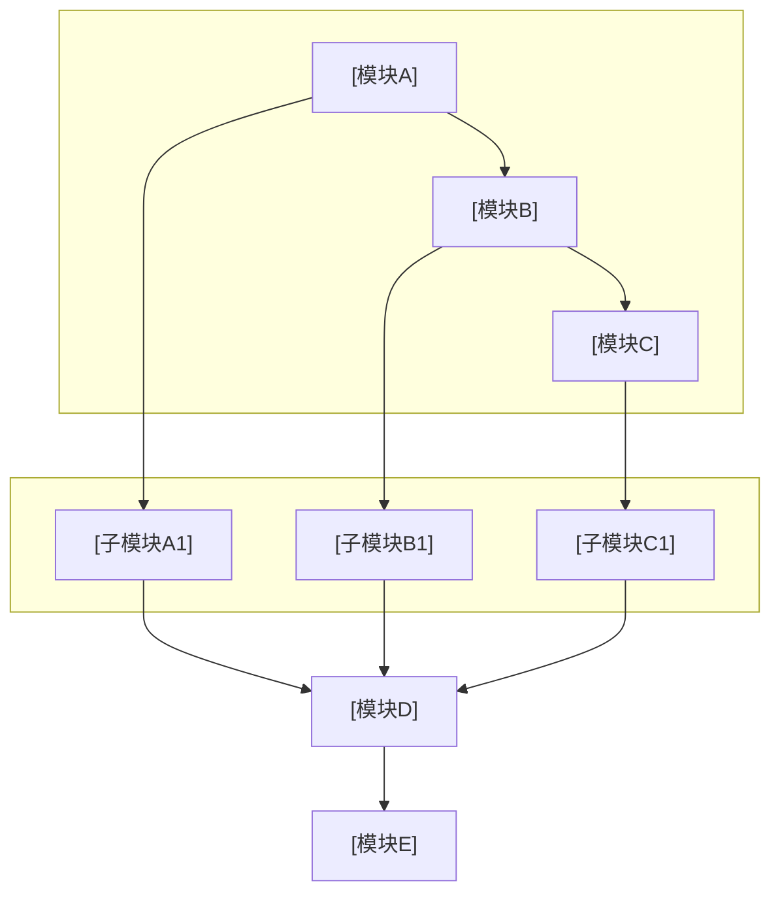

# 专利交底书模版参考（脱敏版）

本文档为技术交底书格式与章节要点参考，内容已脱敏，适用于多领域专利撰写。由 `disclosure_builder.md` 引用。

---

## 文档头部

```markdown
# 技术交底书

**案件名称**：[待填写]一种XXX方法及系统

**技术联系人**：
- 姓名：[待填写]
- 电话：[待填写]
- 邮箱：[待填写]

**专利类型**：发明

---

## 注意事项

（1）交底书应使代理人能看懂，尤其是背景技术和详细技术方案，一定要写得全面、清楚、完整；
（2）技术的公开程度，应以本领域普通技术人员不需付出创造性劳动即可进行实施为准。
（3）在与代理人沟通时，对于代理人咨询的技术问题，应给予回答并认真讲解，并且按要求及时正确地补充相应技术材料。
```

在用户产出目录保存时，**`.md` / `.docx` 主文件名**应为 **`{案件名称规范化}_{YYYYMMDDHHmmss}`**（占位去掉、非法字符、过长截断及时间戳规则见 `disclosure_builder.md` **§7.3**，**凡交付均须时间戳**），避免与标题无关的固定名。

---

## 一、技术背景与现有技术

### 1.1 现有技术

- 检索渠道、链接格式与禁止事项以 Step 5 **`prior_art_search.md`** 为准（不在此重复）。
- 按**技术方向**分类列举（如：单标签方法、多标签方法、聚类策略等）
- 每条现有技术需包含：专利号 / 文献标识、申请方（或来源机构）、技术方案、应用场景、**局限性**、**公开源 URL（必填）**
  - **国知局 `abstract`**：若 Step 5 JSON 含 **`abstract`**，该条「技术方案」等叙述**必须先充分理解摘要后**再概括（见 **`prior_art_search.md`**）；交底书正文勿大段粘贴官方摘要全文。
  - **URL 要求**：与 `prior_art_search.md` 一致——每条**至少一个**可公开访问链接，**写入前验证**有效且与著录项一致；**禁止虚构链接**。
  - **正文呈现建议**：在每条方向下可用「**来源链接**：…」单独一行，或表格增列「链接」。
- 结尾总结：检索总结、**本发明与现有技术的本质区别**

### 1.2 现有技术存在的缺点

- 分点列举，与 1.1 的局限性呼应
- 突出**核心缺陷**：现有技术无法解决的问题

---

## 二、本发明所要解决的技术问题

- 对应一中的缺点，逐条说明本发明的解决思路
- 简明扼要，为第三章详细方案做铺垫

---

## 三、技术方案详细阐述

### 3.1 背景

- 应用场景的通用描述（脱敏：用分类A/B/C、场景X等）
- 本发明针对的问题与核心创新点概述
- 若有人工环节，说明前提条件（如：样本需具有可区分显著特征）

### 3.2 系统框图

- 使用 **fenced mermaid**（推荐 `flowchart TB` / `LR` + `subgraph` 分层）；模块名抽象通用，避免业务术语
- 定稿交付前经 **`tools/mermaid_render.py`** 转为 PNG 并**默认**生成 Word；**不需要**再附 ASCII 文字框图（Word 中以图为准）
- 布局宜层次清晰；复杂时可拆多张 mermaid 图

**mermaid 系统框图模版**（替换标题与模块名、连线；与 3.4 相同为 `` ```mermaid`` 围栏）：



### 3.3 模块功能说明

**重点**：各模块的**作用**和**模块间关联关系**，专利不强调输入输出。

- 作用：该模块在整体方案中的角色
- 关联关系：上下游依赖、数据流/控制流、闭环关系

### 3.4 系统流程说明

#### 流程图

- 使用 **fenced mermaid** 代码块；**不要** ASCII 文字/箭头流程图。
- 定稿交付前用仓库 **`tools/mermaid_render.py`**（本地 `mmdc`）转为 PNG 并**默认**生成 Word；失败时按终端提示用 **`md_to_docx.py`** 手动转换。

#### 流程说明

- 用文字简要说明各步骤或与图中节点的对应关系（**不替代**流程图图示）
- 核心创新点可单独设子节（如 3.4.1）

### 3.5 关键技术参数

- 置信度/阈值类：含义、取值范围
- 算法参数：公式、约束条件
- 确保与正文公式、实施例数值一致

---

## 四、与现有技术相比的优点

- 先概括性观点，再分点详述
- 与第二章解决的问题、第五章保护点呼应
- 技术细节以第三章为准，本章以论点为主

---

## 五、技术关键点和欲保护点

- 列出核心创新点，每点简明定义
- 详细技术方案引用第三章（如「具体实现见 3.4.1」）
- 避免与第三章重复大段技术细节

---

## 六、其它

### 实施例

- 应用场景（脱敏）
- 已知类别、无标签数据规模（脱敏）
- 系统流程简述
- **技术效果**：量化或定性说明
- **参数设置示例**：注明「不作为权利要求限制」

---

## 脱敏检查表

| 检查项 | 脱敏方式 |
|--------|----------|
| 业务/行业名称 | 抽象为通用描述 |
| 具体分类标签 | 分类A、分类B、分类C 等 |
| 具体数值 | 用「一定规模」「预设值」等 |
| 公司/产品名 | 删除或「某系统」 |

---

## 交付正文禁忌（勿写入交底书）

- **禁止**在全文任意位置（尤其**文末**）加入技能仓库、示例仓库、`patent-disclosure-skill`、`examples/` 路径、「教学/虚构示例」「不构成法律或技术承诺」等**元脚注**；交付物视为正式技术交底书文稿，**止于业务章节**。

## 公式与参数一致性检查

- 全文公式表述统一（如：置信度权重、密度调整系数）
- 阈值范围一致（如 0.5–1.5、0.8–1.2）
- 参数命名统一（避免同义不同名混用）
- 实施例数值与 3.5 节对应
