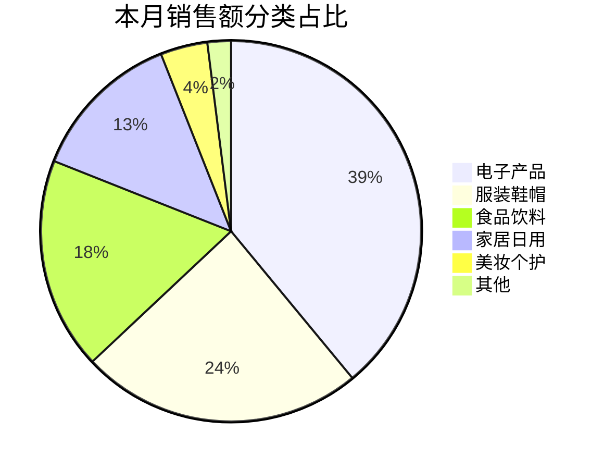
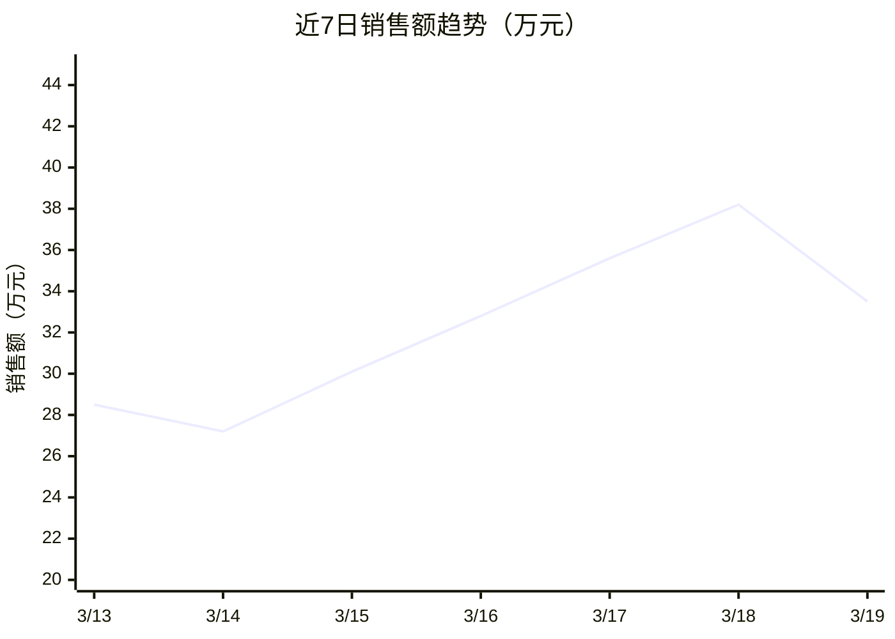
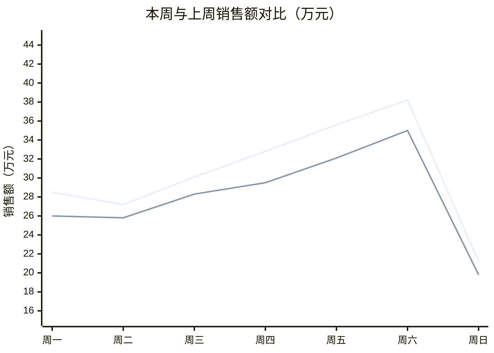
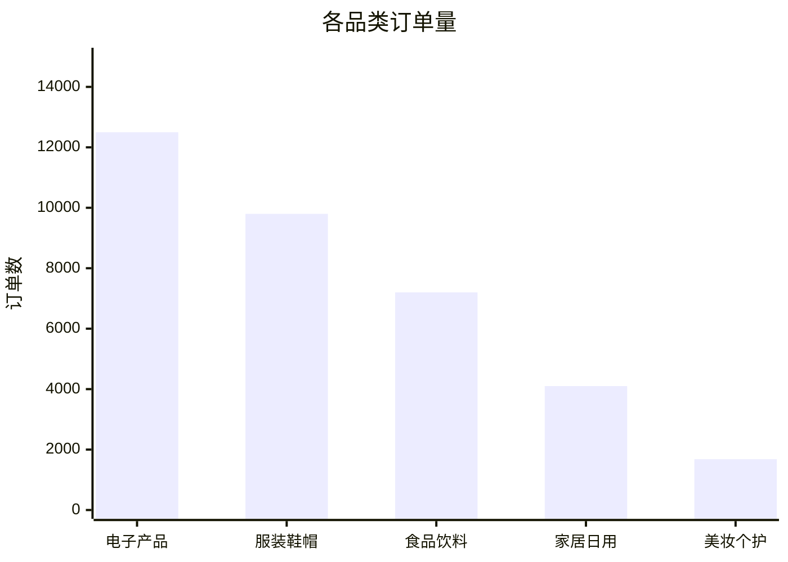
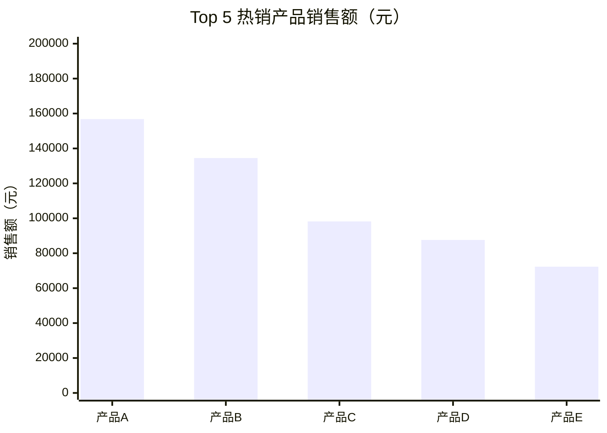
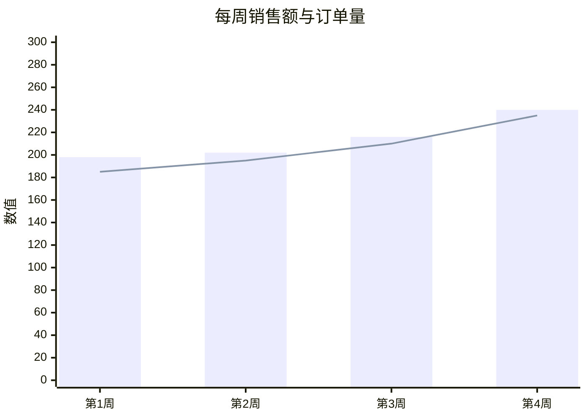
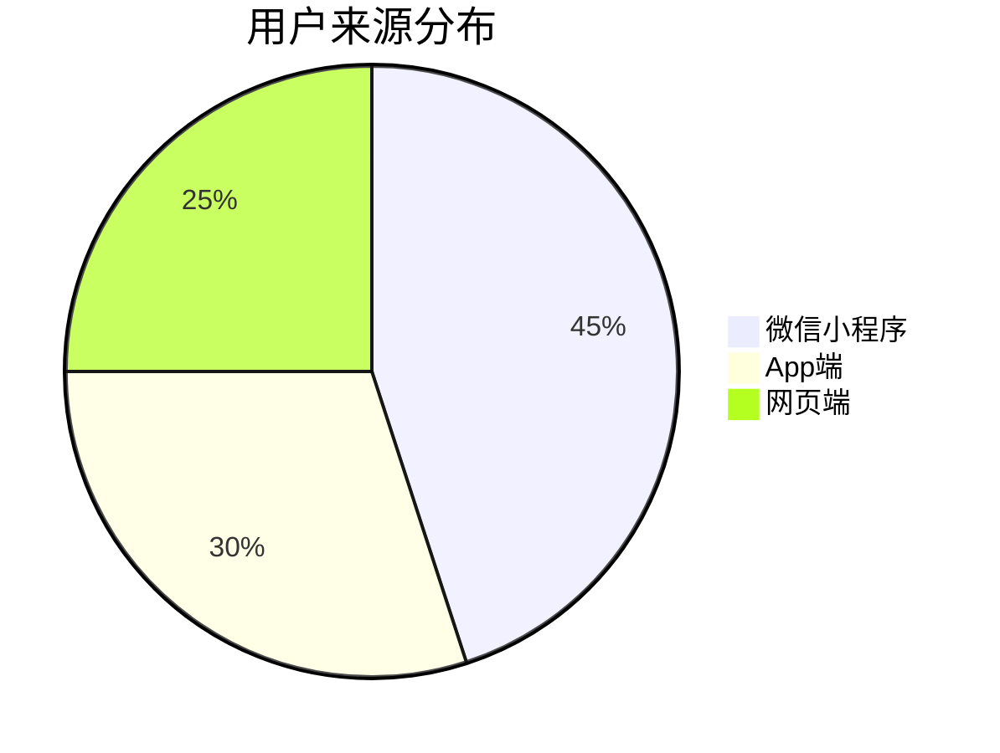
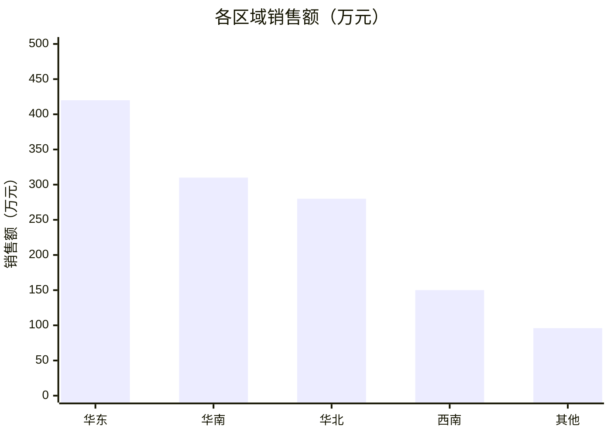
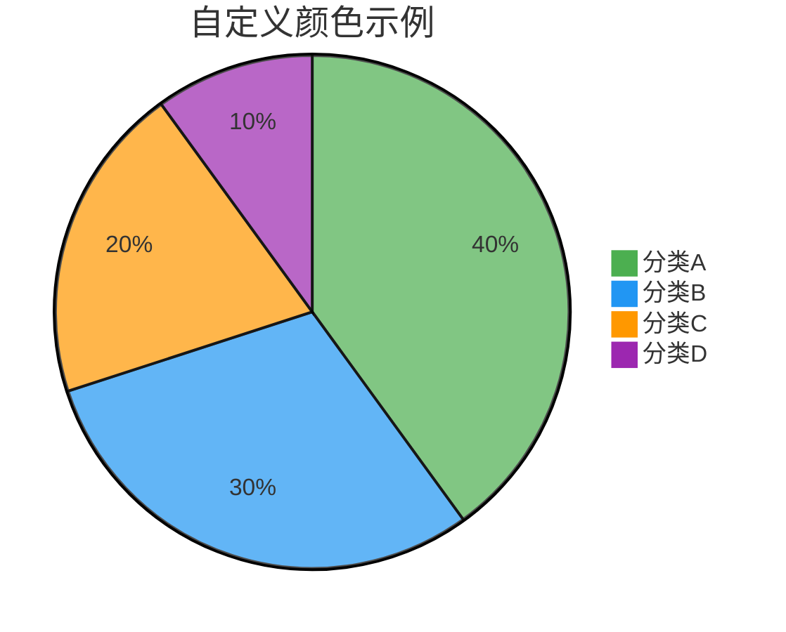
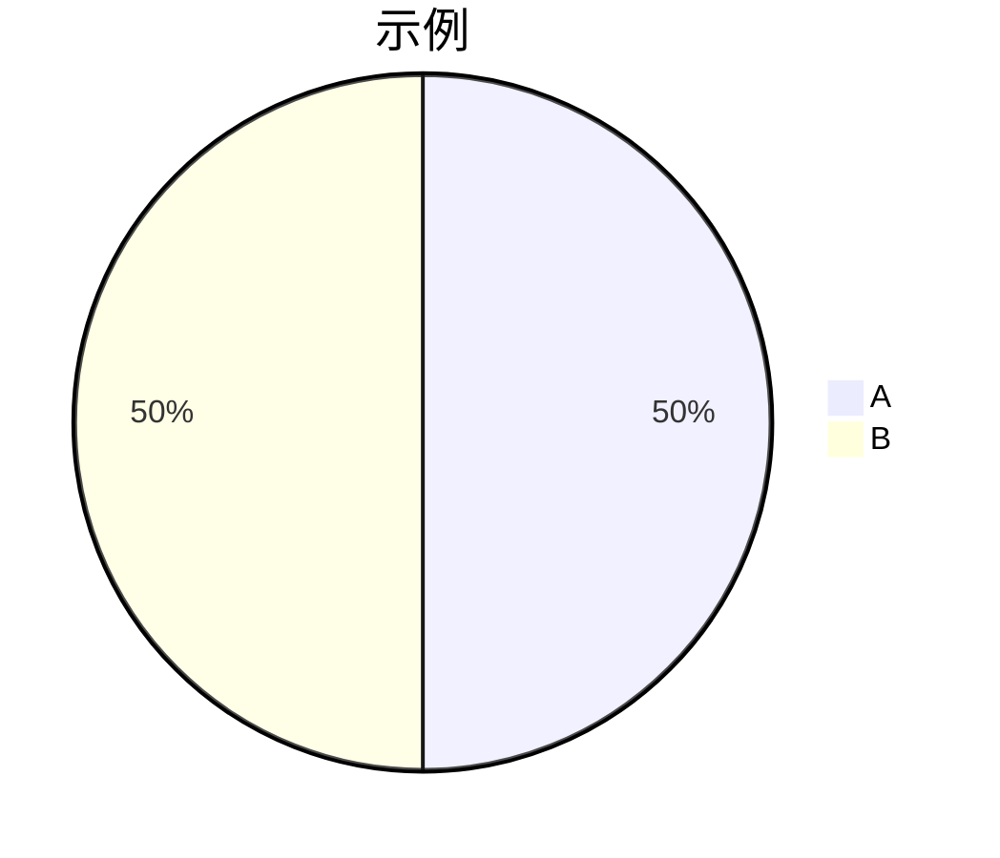

# Mermaid 图表语法参考

本文档是 `biz-data-insight` Skill 支持的 Mermaid 图表类型的快速参考。报告生成器使用这些语法生成内嵌在 Markdown 报告中的可视化图表。

---

## 1. 饼图（Pie Chart）

饼图用于展示各分类的占比关系，适合品类分布、渠道占比等场景。

### 基础语法

```
pie title 图表标题
    "标签1" : 数值1
    "标签2" : 数值2
    "标签3" : 数值3
```

### 完整示例



### 注意事项

- 数值会自动计算为百分比，无需手动换算
- 标签必须用英文双引号 `"` 包裹
- 建议分类不超过 **7 个**，过多会导致图表难以阅读
- 占比过小的分类（< 3%）建议合并为"其他"

---

## 2. 折线图（Line Chart）

折线图用于展示趋势变化，适合销售额走势、用户增长趋势等场景。基于 `xychart-beta` 语法。

### 基础语法

```
xychart-beta
    title "图表标题"
    x-axis ["标签1", "标签2", "标签3"]
    y-axis "Y轴标题" 最小值 --> 最大值
    line [数值1, 数值2, 数值3]
```

### 完整示例



### 多条折线



---

## 3. 柱状图（Bar Chart）

柱状图用于展示各类别或各时间段的数值对比，适合订单量对比、产品排名等场景。同样基于 `xychart-beta` 语法。

### 基础语法

```
xychart-beta
    title "图表标题"
    x-axis ["标签1", "标签2", "标签3"]
    y-axis "Y轴标题" 最小值 --> 最大值
    bar [数值1, 数值2, 数值3]
```

### 完整示例



### 排名展示



---

## 4. 组合图（柱状图 + 折线图）

在同一图表中同时展示柱状图和折线图，适合展示"量"与"趋势"的关系，例如订单量（柱）与客单价（线）。

### 基础语法

```
xychart-beta
    title "图表标题"
    x-axis ["标签1", "标签2", "标签3"]
    y-axis "Y轴标题" 最小值 --> 最大值
    bar [数值1, 数值2, 数值3]
    line [数值1, 数值2, 数值3]
```

### 完整示例



### 使用场景

- **柱状 = 实际值，折线 = 目标值**：展示达成情况
- **柱状 = 本期，折线 = 上期**：展示同比/环比趋势
- **柱状 = 销售额，折线 = 增长率**：展示增长动态（需注意 Y 轴刻度统一问题）

---

## 中文标签支持

Mermaid 完整支持中文标签，但需注意以下几点：

### 正确用法





### 需要注意的点

- 饼图标签必须用英文双引号 `"` 包裹，不要使用中文引号
- `xychart-beta` 的 `title` 值必须用英文双引号包裹
- X 轴标签必须用英文方括号 `[]` 包裹，每个标签用英文双引号
- 中文字符在某些渲染器中可能导致标签过宽而重叠，建议标签保持在 **4 个汉字以内**

---

## 颜色自定义

Mermaid 的 `xychart-beta` 和 `pie` 图表可以通过 `%%` 指令或主题配置自定义颜色。

### 使用主题

在 Markdown 文件头部或 Mermaid 代码块开头指定主题：



### 可用主题

| 主题名 | 说明 |
|--------|------|
| `default` | 默认主题，适合大多数场景 |
| `dark` | 深色背景，适合暗色 IDE |
| `forest` | 绿色系，适合环保/健康类数据 |
| `base` | 基础主题，搭配 `themeVariables` 做完全自定义 |

### 建议

报告生成时默认使用 `default` 主题，无需额外配置。仅在用户有明确品牌色需求时使用自定义颜色。

---

## 数据格式要求

### 数值精度

- 整数直接使用，如 `1283`
- 小数最多保留 **1 位**，如 `28.5`
- 不要在数值中使用千分位逗号（`1,283` 会导致解析错误，应写为 `1283`）
- 百分比在饼图中直接使用数值，不加 `%` 符号

### Y 轴范围

- `y-axis` 的最小值和最大值应留出 **10%-20%** 的余量
- 示例：数据范围 100-500，建议设为 `80 --> 550`
- 最小值可以为 0，但不能为负数（`xychart-beta` 不支持负值）

### 数据点数量

- 饼图：建议 **3-7 个**分类
- 折线图/柱状图：建议 **5-31 个**数据点
- 超过 31 个数据点时标签会严重重叠，建议按周聚合或仅显示日期数字

---

## 常见问题与排错

### 问题1：图表不渲染，显示为代码块

**原因**：渲染环境不支持 Mermaid，或代码块标记不正确。

**解决**：确保使用三个反引号加 `mermaid` 标识：

````

````

### 问题2：标签显示为乱码

**原因**：文件编码不是 UTF-8。

**解决**：确保 Markdown 文件以 UTF-8 编码保存。`report_generator.py` 默认以 UTF-8 输出。

### 问题3：X 轴标签重叠无法阅读

**原因**：数据点过多或标签文字过长。

**解决方案**：
- 减少数据点数量，按周/旬聚合
- 缩短标签文字，如用 `"3/19"` 代替 `"2026年3月19日"`
- 对于月度数据（31天），使用纯数字标签：`["1","2","3",...,"31"]`

### 问题4：饼图标签中含有特殊字符

**原因**：标签中包含 `:`、`#`、`%` 等 Mermaid 保留字符。

**解决**：避免在标签中使用这些字符，用中文替代。例如用 `"占比35"` 代替 `"35%"`。

### 问题5：xychart-beta 语法报错

**原因**：`xychart-beta` 是较新语法，部分旧版 Mermaid 渲染器不支持。

**解决**：确保渲染环境的 Mermaid 版本 >= **10.6.0**。GitHub 和最新版 VS Code Mermaid 插件均已支持。

---

## 报告生成器使用的图表类型速查

| 报告类型 | 使用的图表 |
|----------|-----------|
| 日报（付费版） | 饼图（分类占比） |
| 周报（付费版） | 饼图 + 折线图（趋势） + 柱状图（每日对比） |
| 月报（付费版） | 饼图 + 折线图 + 柱状图 + 组合图 |
| 交互式查询 | 根据问题自动选择最合适的图表类型 |

---

*语法参考版本 v1.0 | 基于 Mermaid v10.6+ | 适用于 biz-data-insight Skill*
