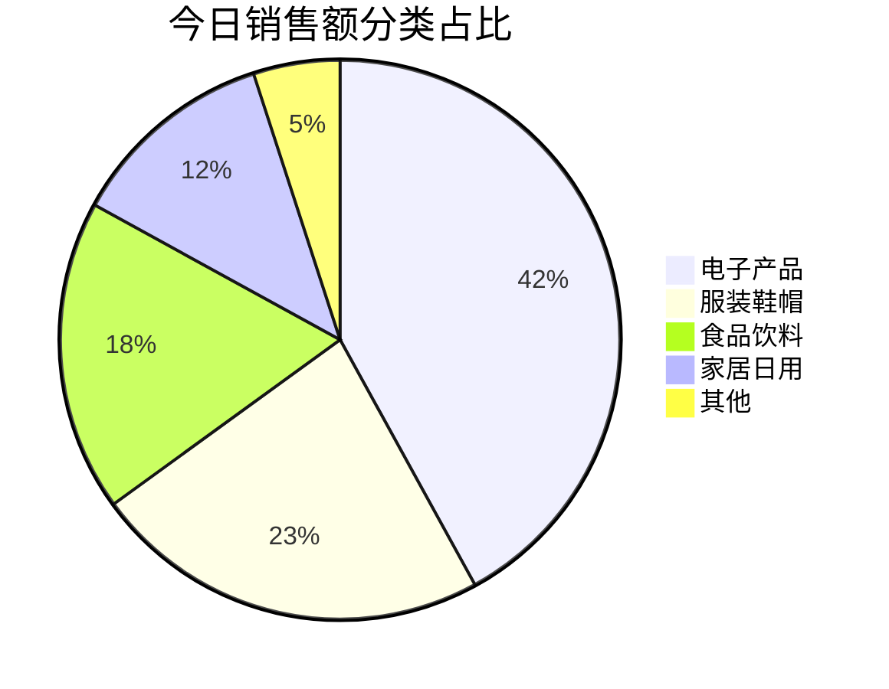
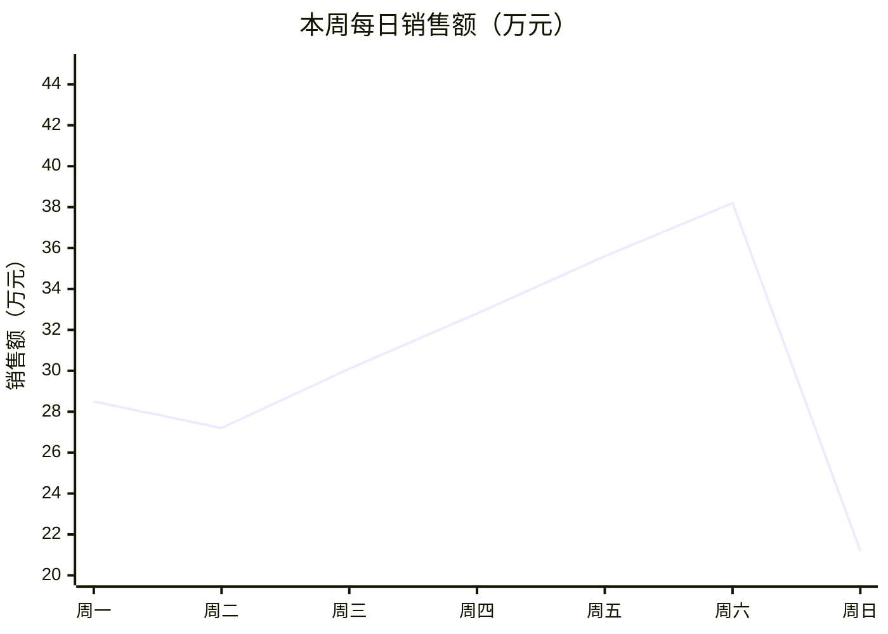
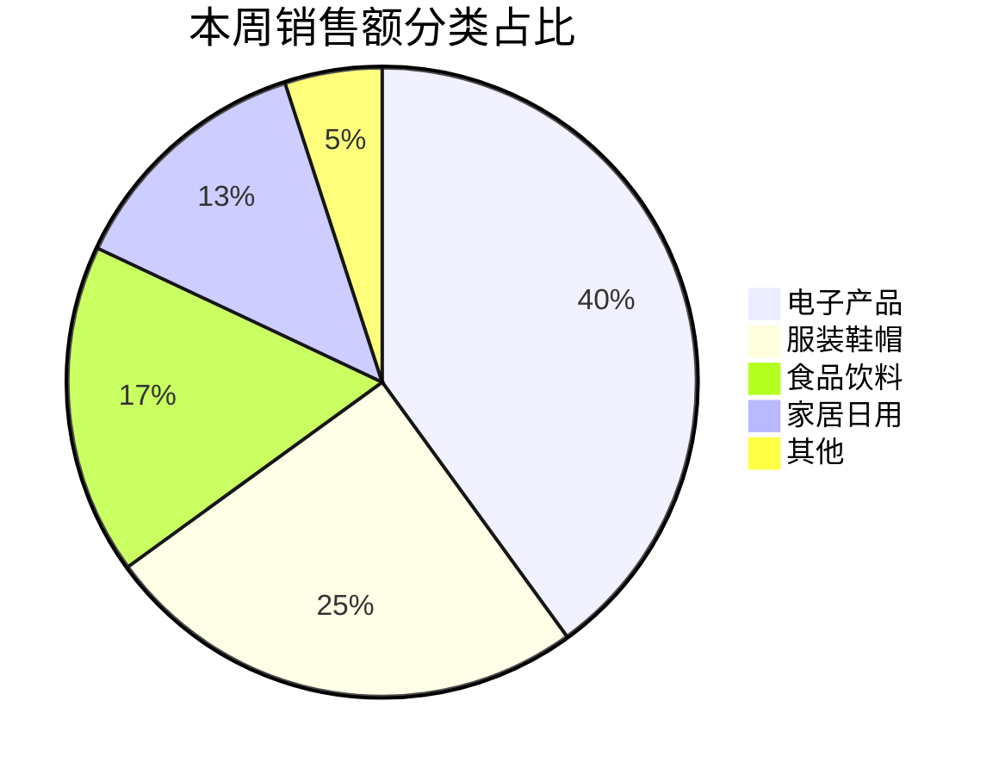
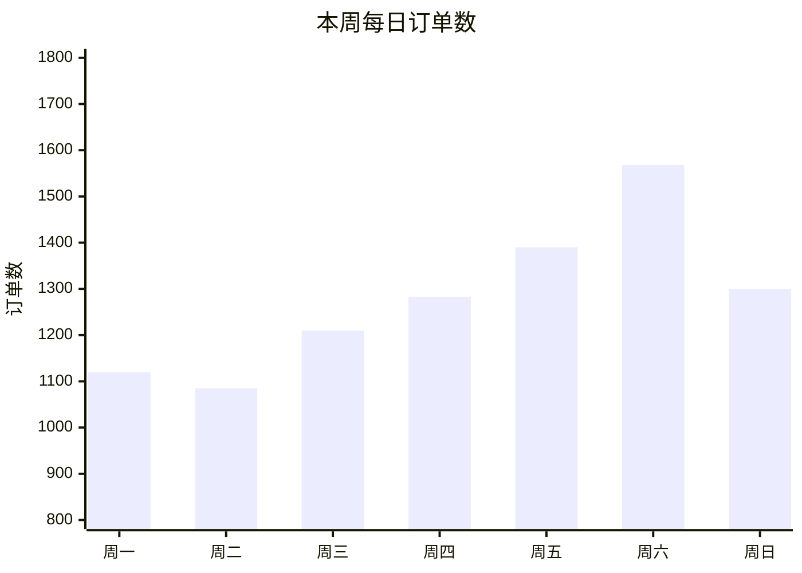
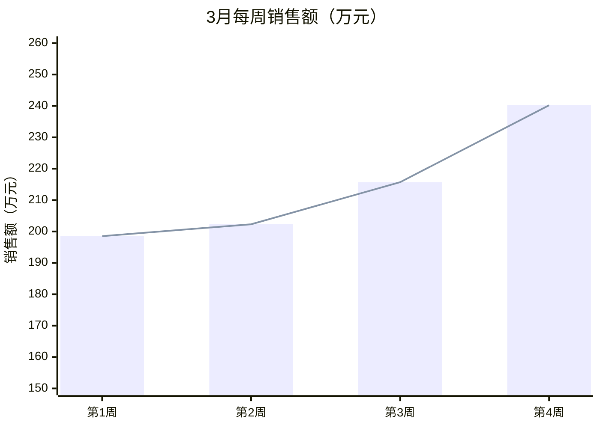
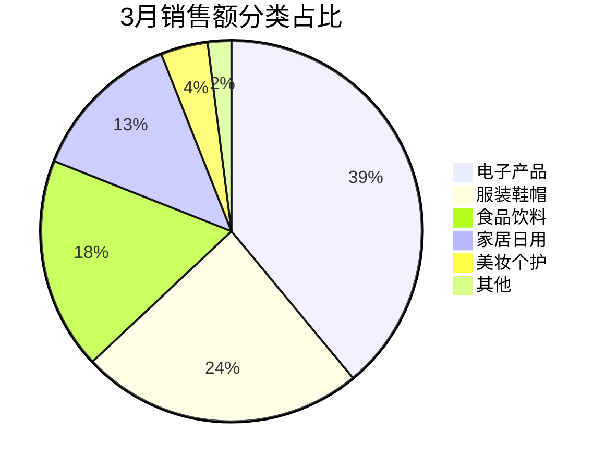
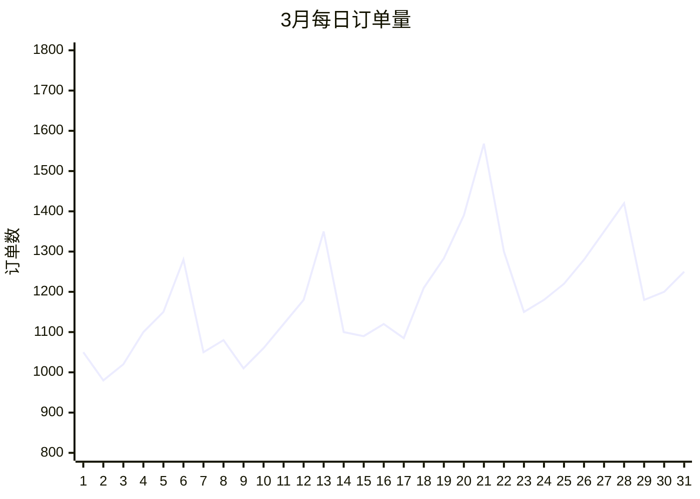
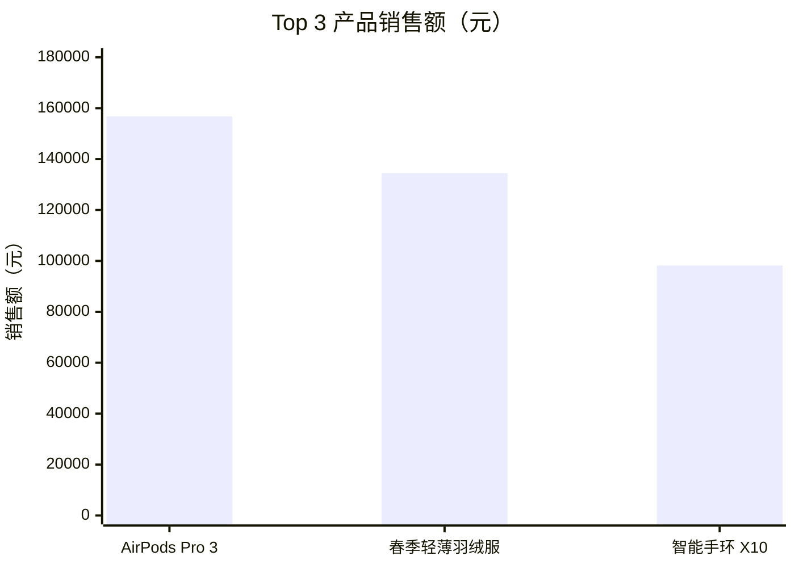

# 报告模板参考

本文档包含 `biz-data-insight` 所有报告类型的完整 Markdown 输出模板。`report_generator.py` 根据查询结果填充这些模板，最终生成可交付的报告文件。

---

## 1. 日报模板

日报聚焦当日核心指标，与前一日进行环比对比。免费版仅包含指标表格，付费版额外包含图表和智能洞察。

### 完整输出示例

```markdown
# 📊 业务日报 — 2026-03-19（周四）

数据源：业务主库 | 统计周期：2026-03-19 00:00 ~ 23:59

---

## 核心指标

| 指标 | 今日 | 昨日 | 日环比 |
|------|-----:|-----:|-------:|
| 订单数 | 1,283 | 1,195 | +7.4% |
| 销售额（元） | 328,450 | 301,200 | +9.0% |
| 客单价（元） | 256 | 252 | +1.6% |
| 活跃用户数 | 5,672 | 5,410 | +4.8% |
| 新增注册 | 342 | 298 | +14.8% |
| 退货率 | 2.1% | 2.3% | -0.2pp |

## 分类销售占比



## 今日洞察

- **销售额增长 9.0%**：主要受"春季促销"活动拉动，电子产品类目贡献最大
- **新增注册用户增长 14.8%**：高于近7日平均值（310），推广渠道表现良好
- **退货率下降至 2.1%**：连续3日下降，处于健康区间（阈值 < 3%）

## ⚠️ 异常提醒

| 指标 | 当前值 | 正常范围 | 说明 |
|------|-------:|---------|------|
| 华东区订单延迟率 | 8.2% | < 5% | 物流合作方反馈仓储系统升级中，预计明日恢复 |

---

*报告由 biz-data-insight 自动生成 | 2026-03-19 23:59*
```

---

## 2. 周报模板

周报提供整周汇总，包含周环比对比、趋势图和分类占比分析。

### 完整输出示例

```markdown
# 📊 业务周报 — 第12周（2026-03-16 至 2026-03-22）

数据源：业务主库 | 报告生成时间：2026-03-23 08:00

---

## 本周概览

| 指标 | 本周 | 上周 | 周环比 |
|------|-----:|-----:|-------:|
| 订单总数 | 8,956 | 8,230 | +8.8% |
| 销售总额（元） | 2,156,800 | 1,987,500 | +8.5% |
| 日均订单数 | 1,279 | 1,176 | +8.8% |
| 日均销售额（元） | 308,114 | 283,929 | +8.5% |
| 平均客单价（元） | 241 | 241 | +0.0% |
| 活跃用户数 | 12,450 | 11,800 | +5.5% |
| 新增注册 | 2,180 | 1,950 | +11.8% |
| 退货率 | 2.3% | 2.5% | -0.2pp |

## 每日销售额趋势



## 分类销售占比



## 每日订单数趋势



## 本周洞察

### 增长亮点
- 订单数和销售额连续第3周增长，周环比增速稳定在 8% 以上
- 周六订单数达到 1,568，为近30天单日最高，周末促销策略效果显著
- 新增注册用户 2,180，较上周增长 11.8%，主要来自社交媒体渠道

### 需关注项
- 客单价连续两周持平于 241 元，可考虑搭配销售或提升高价值品类曝光
- 周日销售额明显回落至 21.2 万元，低于工作日平均水平

### 环比分析
- 销售额增长主要由订单量驱动（+8.8%），客单价未变化
- 电子产品类目占比从上周 38% 提升至 40%，为增长主力

## ⚠️ 异常检测

| 指标 | 日期 | 异常值 | 正常范围 | 分析 |
|------|------|-------:|---------|------|
| 页面跳出率 | 周三 | 62% | < 50% | 当日首页 Banner 加载缓慢，已修复 |
| 支付失败率 | 周五 | 3.8% | < 2% | 第三方支付通道短暂故障，持续约30分钟 |

---

*报告由 biz-data-insight 自动生成 | 2026-03-23 08:00*
```

---

## 3. 月报模板

月报是最全面的报告类型，包含管理层摘要、多维度分析、多种图表和完整的异常检测结果。仅付费版可用。

### 完整输出示例

```markdown
# 📊 业务月报 — 2026年3月

数据源：业务主库 | 报告生成时间：2026-04-01 08:00

---

## 管理层摘要

3月整体表现优于预期。销售额达到 **856.7万元**，同比增长 **15.2%**，环比增长 **6.8%**。订单量突破 **3.5万单**，客单价稳定在 **245元** 左右。新增注册用户 **8,420人**，用户活跃度稳步提升。需关注华东区物流延迟问题以及周中客单价偏低的趋势。

---

## 核心指标总览

| 指标 | 本月 | 上月 | 环比 | 去年同期 | 同比 |
|------|-----:|-----:|-----:|--------:|-----:|
| 订单总数 | 35,280 | 33,100 | +6.6% | 30,500 | +15.7% |
| 销售总额（万元） | 856.7 | 802.1 | +6.8% | 743.5 | +15.2% |
| 平均客单价（元） | 243 | 242 | +0.4% | 244 | -0.4% |
| 活跃用户数 | 48,200 | 45,600 | +5.7% | 38,900 | +23.9% |
| 新增注册 | 8,420 | 7,650 | +10.1% | 6,200 | +35.8% |
| 退货率 | 2.4% | 2.6% | -0.2pp | 2.8% | -0.4pp |
| 复购率 | 34.5% | 33.2% | +1.3pp | 29.8% | +4.7pp |

## 每周销售额趋势



## 分类销售分析



### 各品类详细数据

| 品类 | 销售额（万元） | 占比 | 环比 | 同比 |
|------|-------------:|-----:|-----:|-----:|
| 电子产品 | 334.1 | 39.0% | +8.2% | +18.5% |
| 服装鞋帽 | 205.6 | 24.0% | +5.1% | +12.3% |
| 食品饮料 | 154.2 | 18.0% | +4.5% | +10.8% |
| 家居日用 | 111.4 | 13.0% | +7.3% | +16.2% |
| 美妆个护 | 34.3 | 4.0% | +9.8% | +22.1% |
| 其他 | 17.1 | 2.0% | +3.2% | +8.5% |

## 每日订单量趋势



## 用户分析

| 指标 | 数值 | 趋势 |
|------|-----:|------|
| 月活跃用户（MAU） | 48,200 | 连续6个月增长 |
| 日均活跃用户（DAU） | 5,830 | 较上月 +5.2% |
| DAU/MAU 比率 | 12.1% | 稳定 |
| 新用户首单转化率 | 28.3% | 较上月 +2.1pp |
| 30日留存率 | 41.2% | 较上月 +1.8pp |

## ⚠️ 异常检测报告

### 严重异常

| 日期 | 指标 | 异常值 | 正常范围 | 根因分析 |
|------|------|-------:|---------|---------|
| 3月15日 | 支付失败率 | 5.2% | < 2% | 支付网关升级导致部分交易失败，持续2小时 |
| 3月22日 | 华东区配送延迟率 | 12.3% | < 5% | 合作物流仓储系统升级，影响约800单 |

### 轻度异常

| 日期 | 指标 | 异常值 | 正常范围 | 说明 |
|------|------|-------:|---------|------|
| 3月2日 | 周日订单量 | 980 | > 1,000 | 正常周末波动，无需关注 |
| 3月10日 | 页面响应时间 | 3.2s | < 2s | CDN节点故障，已自动切换 |

## 关键洞察与建议

### 增长驱动因素
1. **促销活动效果显著**：周末促销带动周六订单数屡创新高，建议持续优化活动节奏
2. **新用户获取加速**：社交媒体渠道贡献了 62% 的新增注册，ROI 为 3.8
3. **电子产品持续领跑**：同比增长 18.5%，春季新品发布带动了品类增长

### 改进建议
1. **提升客单价**：连续两月持平，建议通过搭配推荐和满减策略提升
2. **优化周中转化**：周二、周三订单量偏低，可考虑定向推送
3. **物流稳定性**：华东区延迟问题需与物流方制定改进计划

---

*报告由 biz-data-insight 自动生成 | 2026-04-01 08:00*
```

---

## 4. 交互式查询结果模板

当用户通过 `/biz-data-insight ask` 提问时，返回简洁的分析结果。

### 完整输出示例

**用户提问**：`上周销售额最高的3个产品是什么？`

```markdown
## 🔍 查询结果

**问题**：上周销售额最高的3个产品是什么？

**统计周期**：2026-03-16 至 2026-03-22

### 结果

| 排名 | 产品名称 | 销售额（元） | 销量（件） | 占比 |
|:----:|---------|------------:|----------:|-----:|
| 1 | AirPods Pro 3 | 156,800 | 523 | 7.3% |
| 2 | 春季轻薄羽绒服 | 134,500 | 897 | 6.2% |
| 3 | 智能手环 X10 | 98,200 | 1,312 | 4.6% |

### 销售额对比



### 补充说明

- AirPods Pro 3 客单价最高（300元/件），主要购买群体为 25-35 岁用户
- 春季轻薄羽绒服受季节因素驱动，较上周增长 32%
- 智能手环 X10 销量最大但客单价最低（75元/件），适合作为引流产品

---

*数据来源：业务主库 | 查询耗时：2.3秒*
```

---

## 模板变量说明

报告模板中使用以下变量，由 `report_generator.py` 在运行时填充：

| 变量 | 说明 | 示例 |
|------|------|------|
| `{date}` | 报告日期 | 2026-03-19 |
| `{weekday}` | 星期几 | 周四 |
| `{week_number}` | 年内周数 | 12 |
| `{month}` | 月份 | 2026年3月 |
| `{datasource_name}` | 数据源名称 | 业务主库 |
| `{period_start}` | 统计周期开始 | 2026-03-16 |
| `{period_end}` | 统计周期结束 | 2026-03-22 |
| `{generated_at}` | 报告生成时间 | 2026-03-23 08:00 |
| `{metrics_table}` | 核心指标表格 | Markdown 表格 |
| `{charts}` | Mermaid 图表区域 | Mermaid 代码块 |
| `{insights}` | AI 洞察内容 | 结构化分析文本 |
| `{anomalies}` | 异常检测结果 | Markdown 表格 |

---

*模板版本 v1.0 | 适用于 biz-data-insight Skill*
