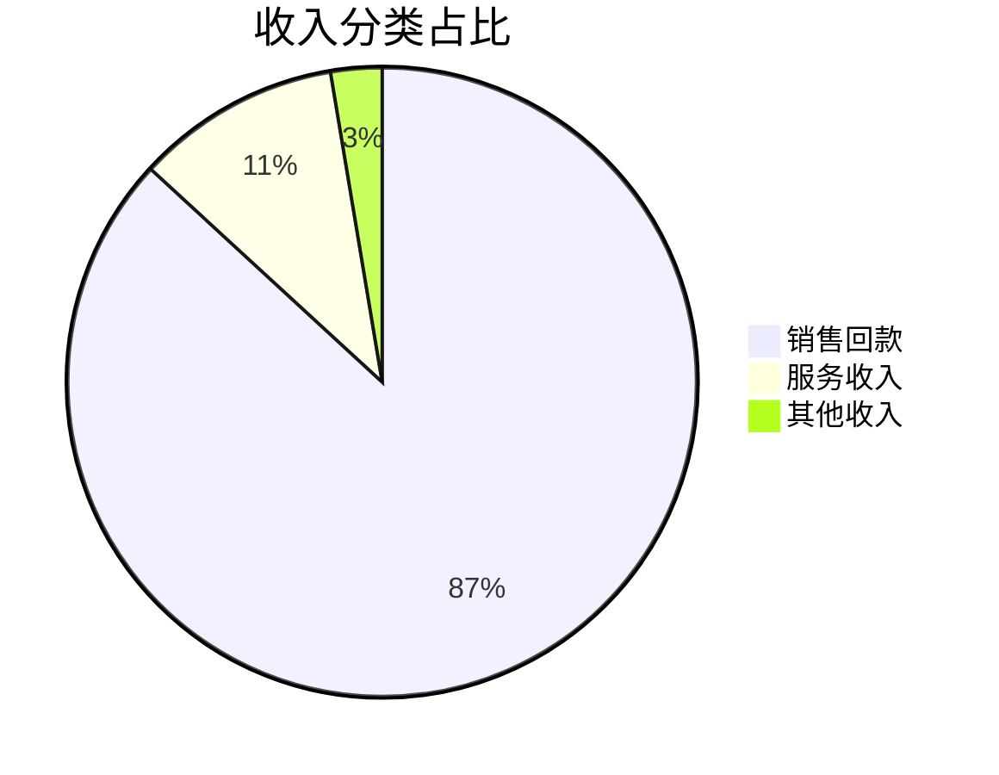
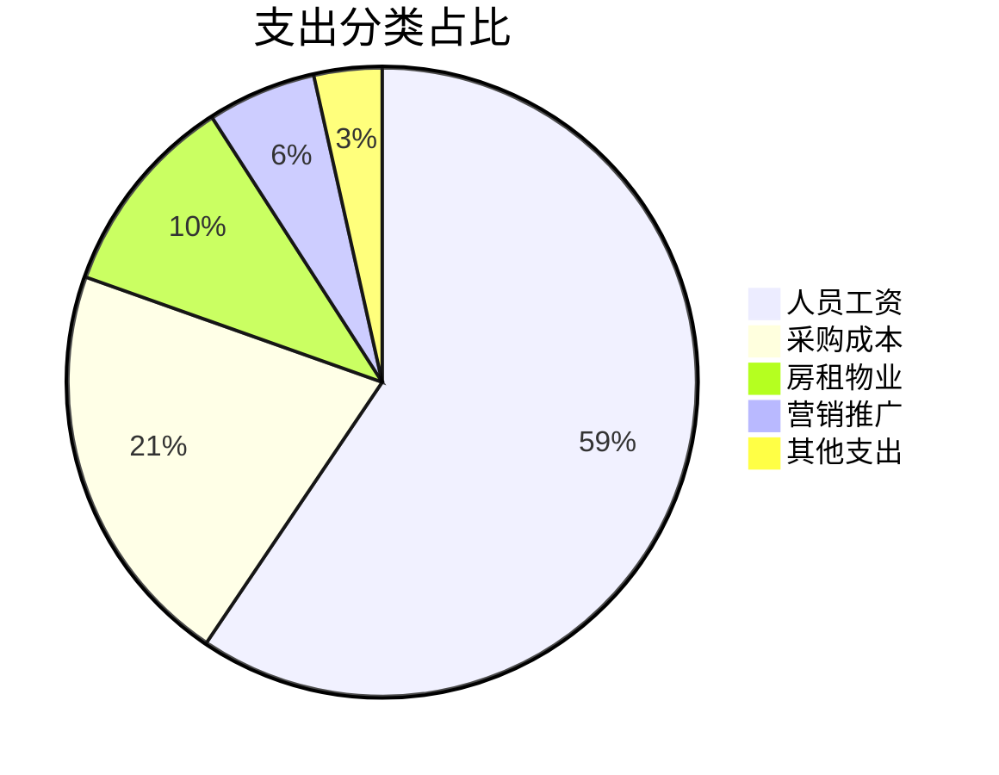
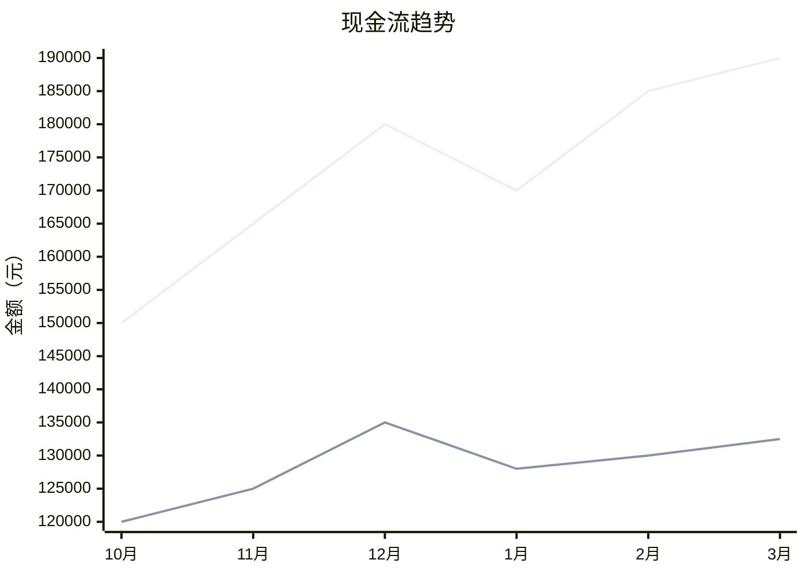
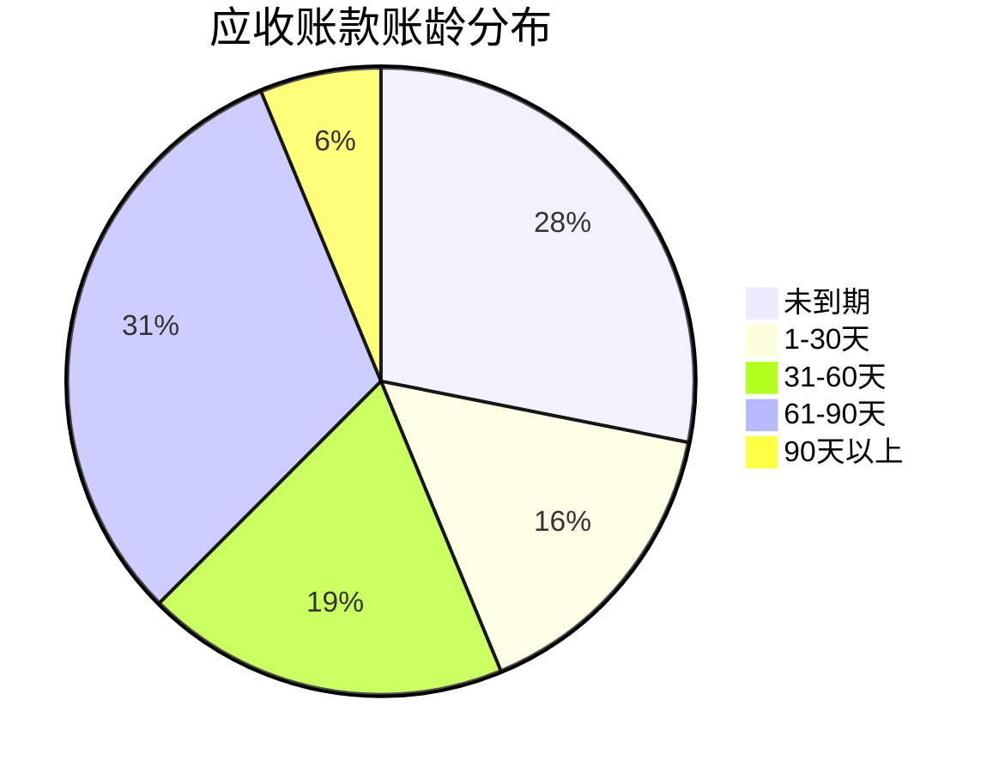
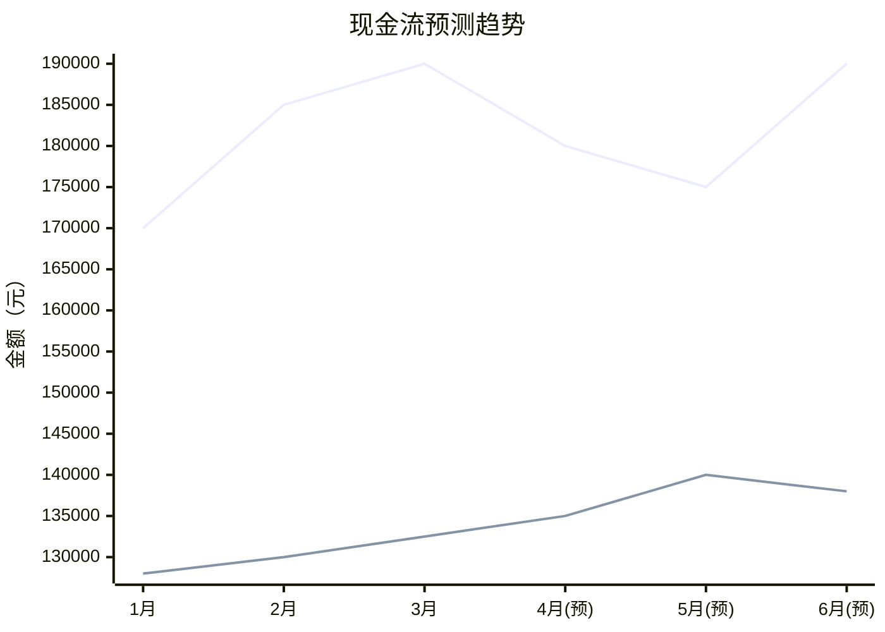

# 现金流报告模板

本文档提供 cashflow-pilot 各类报告的标准模板和示例。

---

## 一、月度现金流报告

### 1.1 基础版（免费版）

```markdown
# 现金流月报 — YYYY年M月

统计记录数：XX 条

## 核心指标

| 指标 | 金额 |
|------|-----:|
| 总收入 | ¥XXX,XXX.XX |
| 总支出 | ¥XXX,XXX.XX |
| 净现金流 | ¥XXX,XXX.XX |
| 收入笔数 | XX |
| 支出笔数 | XX |

## 收入明细

| 收入分类 | 金额 | 占比 |
|----------|-----:|-----:|
| 销售回款 | ¥XXX,XXX.XX | XX.X% |
| 服务收入 | ¥XX,XXX.XX | XX.X% |
| 其他收入 | ¥X,XXX.XX | XX.X% |
| **合计** | **¥XXX,XXX.XX** | **100.0%** |

## 支出明细

| 支出分类 | 金额 | 占比 |
|----------|-----:|-----:|
| 人员工资 | ¥XX,XXX.XX | XX.X% |
| 采购成本 | ¥XX,XXX.XX | XX.X% |
| 房租物业 | ¥XX,XXX.XX | XX.X% |
| 其他支出 | ¥X,XXX.XX | XX.X% |
| **合计** | **¥XXX,XXX.XX** | **100.0%** |

---
*报告由 cashflow-pilot 自动生成*
```

### 1.2 完整版（付费版）

```markdown
# 现金流月报 — YYYY年M月

统计记录数：XX 条 | 数据源：XX

## 核心指标

| 指标 | 本月 | 上月 | 环比 |
|------|-----:|-----:|-----:|
| 总收入 | ¥XXX,XXX | ¥XXX,XXX | +X.X% |
| 总支出 | ¥XXX,XXX | ¥XXX,XXX | -X.X% |
| 净现金流 | ¥XX,XXX | ¥XX,XXX | +XX.X% |

## 收入分类占比

（此处插入收入分类占比表格，同基础版）



## 支出分类占比

（此处插入支出分类占比表格，同基础版）



## 现金流趋势（近6个月）



## 异常告警

- 「营销推广」本月支出 ¥8,000.00，是过去6月均值（¥3,500.00）的 2.3 倍，请关注。

## 洞察与建议

1. 本月净现金流为正（¥57,500.00），现金留存率 30.3%。
2. 最大支出类别为「人员工资」，占总支出 64.2%，金额 ¥85,000.00。
3. 收入高度集中于「销售回款」（占比 86.8%），建议拓展收入来源以降低风险。

---
*报告由 cashflow-pilot 自动生成*
```

---

## 二、应收账款账龄分析报告

```markdown
# 应收账款账龄分析 — YYYY-MM-DD

## 概览

| 账龄区间 | 笔数 | 金额 | 占比 |
|----------|-----:|-----:|-----:|
| 未到期 | X | ¥XX,XXX | XX.X% |
| 逾期 1-30 天 | X | ¥XX,XXX | XX.X% |
| 逾期 31-60 天 | X | ¥XX,XXX | XX.X% |
| 逾期 61-90 天 | X | ¥XX,XXX | XX.X% |
| 逾期 90 天以上 | X | ¥XX,XXX | XX.X% |
| **合计** | **XX** | **¥XXX,XXX** | **100.0%** |

## 逾期明细（按逾期天数排序）

| 客户 | 金额 | 发票号 | 到期日 | 逾期天数 |
|------|-----:|--------|--------|--------:|
| 客户A | ¥50,000 | INV-2026-001 | 2026-01-15 | 63 |
| 客户B | ¥30,000 | INV-2026-005 | 2026-02-01 | 46 |
| 客户C | ¥20,000 | INV-2026-012 | 2026-02-28 | 19 |

## 账龄分布图



## 建议

1. 重点关注逾期超过60天的应收款（共 ¥60,000），建议主动联系客户催收。
2. 考虑对长期逾期客户调整信用政策。
3. 定期更新应收账款状态，保持数据准确。

---
*报告由 cashflow-pilot 自动生成*
```

---

## 三、现金流预测报告（仅付费版）

```markdown
# 现金流预测报告（未来3个月）

基于近 6 个月历史数据，使用移动平均+线性回归加权模型预测。

## 预测概览

| 月份 | 预测收入 | 预测支出 | 预测净现金流 |
|------|--------:|--------:|-----------:|
| YYYY-MM | ¥XXX,XXX | ¥XXX,XXX | ¥XX,XXX |
| YYYY-MM | ¥XXX,XXX | ¥XXX,XXX | ¥XX,XXX |
| YYYY-MM | ¥XXX,XXX | ¥XXX,XXX | ¥XX,XXX |

## 趋势预测图



## 风险预警

- [!! 中风险] 支出连续3个月增长，累计增幅 15.2%。建议审视支出结构，控制非必要开支。
- [! 低风险] 收入波动较大（变异系数 0.25），建议建立至少2个月支出的现金储备。

## 风险评估总结

| 风险维度 | 评估 | 说明 |
|----------|------|------|
| 现金流断裂风险 | 低 | 未来3个月预测净现金流均为正 |
| 支出失控风险 | 中 | 支出持续增长，需关注 |
| 收入波动风险 | 中 | 建议拓宽收入渠道 |

## 建议

1. 维持至少 ¥270,000 的现金储备（约2个月支出）。
2. 关注支出增长趋势，特别是「营销推广」类目。
3. 加快应收账款催收，改善现金回流速度。

---
*预测由 cashflow-pilot 基于历史数据生成，仅供参考*
```

---

## 四、Mermaid 图表使用指南

### 饼图（分类占比）


### 折线图（趋势/预测）

```mermaid
xychart-beta
    title "图表标题"
    x-axis ["标签1", "标签2", "标签3"]
    y-axis "Y轴标题"
    line [数值1, 数值2, 数值3]
```

### 柱状图（对比）

```mermaid
xychart-beta
    title "收支对比"
    x-axis ["1月", "2月", "3月"]
    y-axis "金额（元）"
    bar [150000, 165000, 180000]
    bar [120000, 125000, 135000]
```



> 注意：Mermaid 图表仅在付费版报告中使用。免费版报告使用纯文本表格展示数据。
