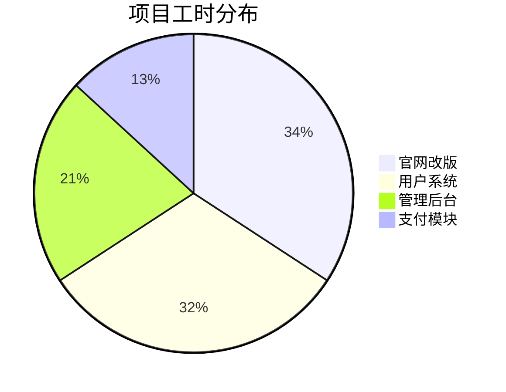
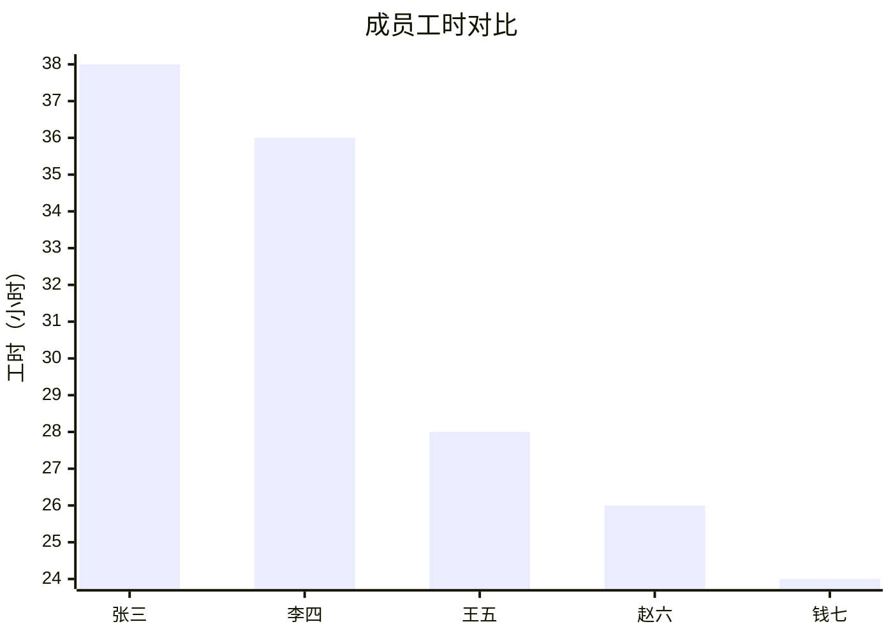
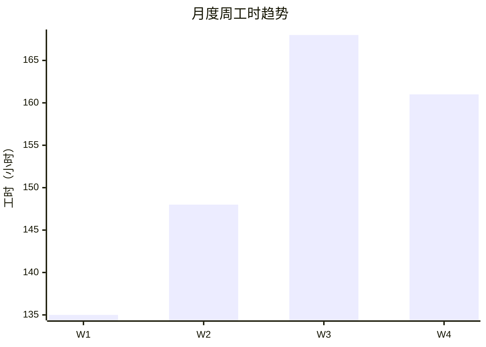
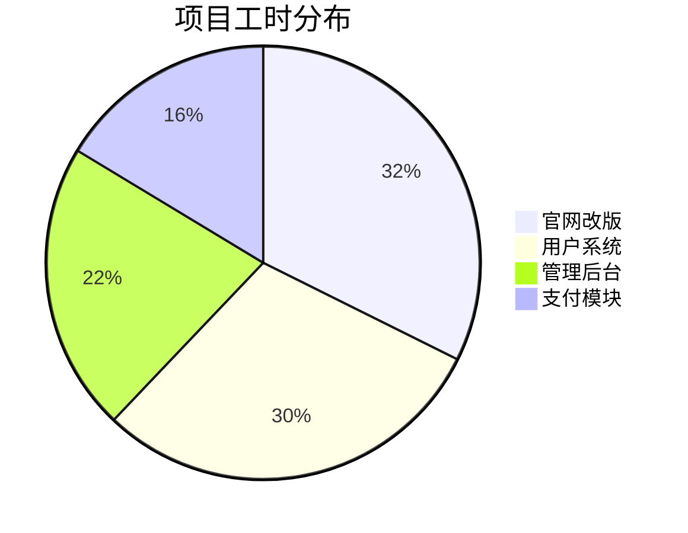
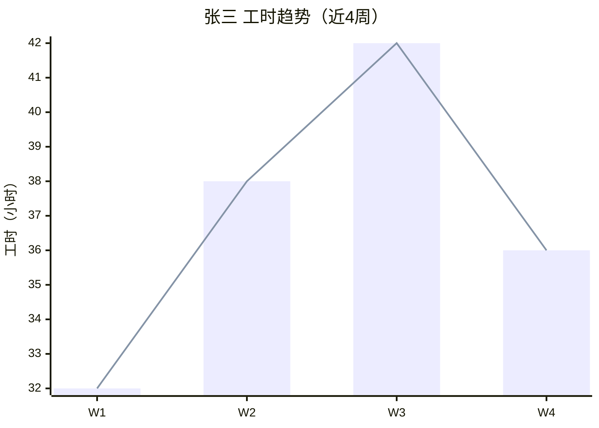
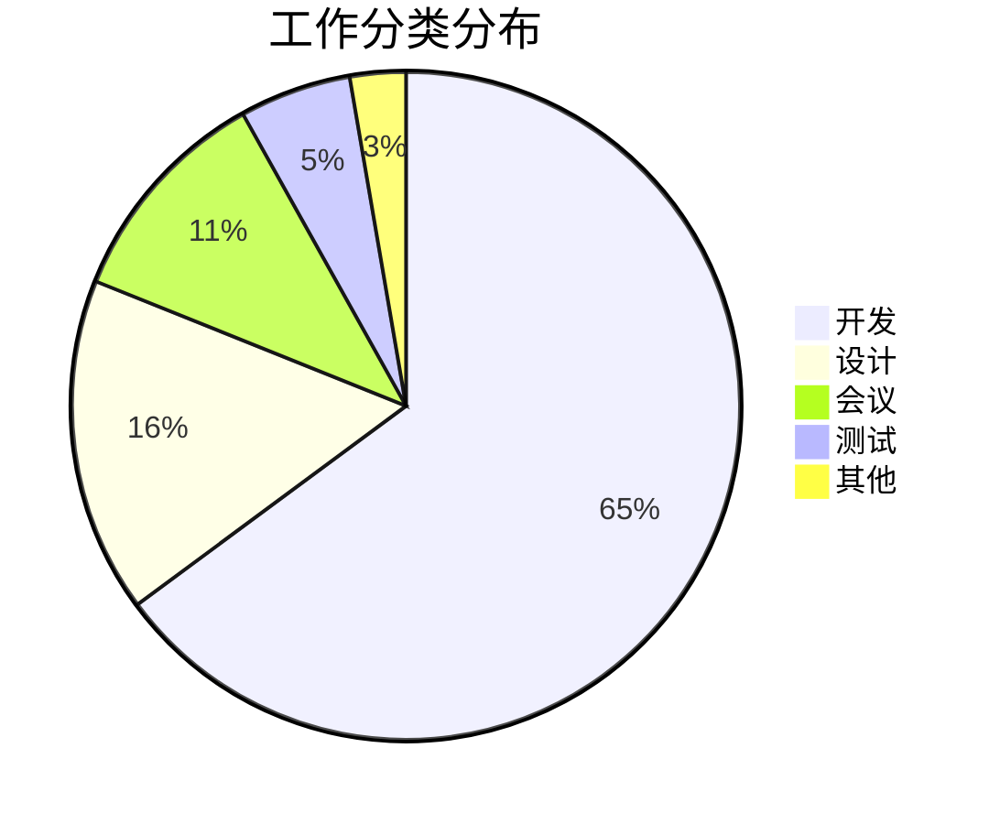
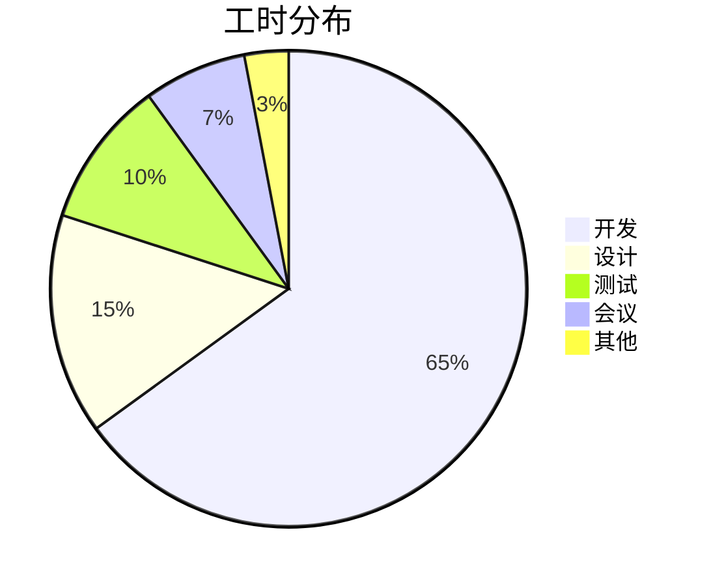
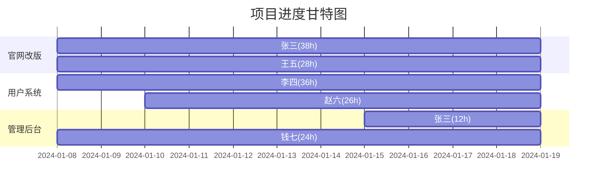
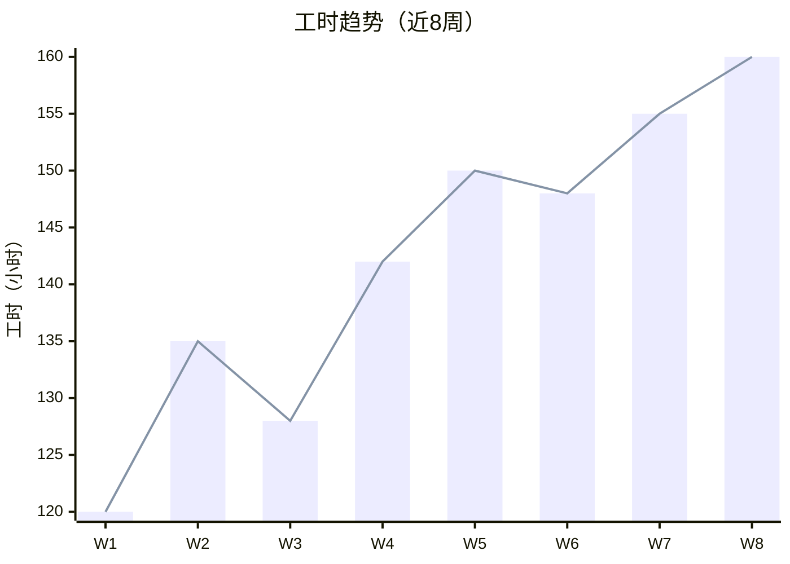

# 周报模板参考

## 模板一：基础周报（免费版）

```markdown
# [团队名称] 周报

**报告周期**: YYYY-MM-DD ~ YYYY-MM-DD
**生成时间**: YYYY-MM-DD HH:MM:SS

## 概览

| 指标 | 数值 |
|------|------|
| 参与人数 | X |
| 任务总数 | X |
| 总工时 | Xh |
| 涉及项目 | X |

## 成员工作汇总

| 成员 | 任务数 | 工时 | 涉及项目 |
|------|--------|------|----------|
| 张三 | 5 | 32h | 官网改版, 管理后台 |
| 李四 | 4 | 28h | 用户系统 |
| 王五 | 3 | 24h | 官网改版 |

## 项目进展

| 项目 | 任务数 | 工时 | 参与成员 |
|------|--------|------|----------|
| 官网改版 | 5 | 36h | 张三, 王五 |
| 用户系统 | 4 | 28h | 李四 |
| 管理后台 | 3 | 20h | 张三 |

## 详细工作记录

### 张三

| 日期 | 任务 | 项目 | 分类 | 工时 |
|------|------|------|------|------|
| 01-15 | 首页设计稿完成 | 官网改版 | 设计 | 6h |
| 01-16 | 首页前端开发 | 官网改版 | 开发 | 8h |
| 01-17 | 后台列表页开发 | 管理后台 | 开发 | 8h |
| 01-18 | 后台搜索功能 | 管理后台 | 开发 | 6h |
| 01-19 | Code Review | 管理后台 | 其他 | 4h |

### 李四
...
```

---

## 模板二：增强周报（付费版）

```markdown
# [团队名称] 周报

**报告周期**: YYYY-MM-DD ~ YYYY-MM-DD
**生成时间**: YYYY-MM-DD HH:MM:SS

## 概览

| 指标 | 数值 |
|------|------|
| 参与人数 | 5 |
| 任务总数 | 23 |
| 总工时 | 152h |
| 涉及项目 | 4 |

## 成员工作汇总

| 成员 | 任务数 | 工时 | 占比 | 涉及项目 |
|------|--------|------|------|----------|
| 张三 | 7 | 38h | 25.0% | 官网改版, 管理后台 |
| 李四 | 6 | 36h | 23.7% | 用户系统, 支付模块 |
| 王五 | 4 | 28h | 18.4% | 官网改版 |
| 赵六 | 3 | 26h | 17.1% | 用户系统 |
| 钱七 | 3 | 24h | 15.8% | 管理后台 |

## 项目进展

| 项目 | 任务数 | 工时 | 占比 | 参与成员 |
|------|--------|------|------|----------|
| 官网改版 | 8 | 52h | 34.2% | 张三, 王五 |
| 用户系统 | 7 | 48h | 31.6% | 李四, 赵六 |
| 管理后台 | 5 | 32h | 21.1% | 张三, 钱七 |
| 支付模块 | 3 | 20h | 13.2% | 李四 |

## 工时分布图

### 项目工时分布



### 成员工时对比



## 详细工作记录

### 张三
...

## 洞察与建议

- 本周工时最多的成员是 **张三**，共 38h，完成 7 项任务。
- 项目 **官网改版** 占据 34.2% 工时，为本周核心项目。
- 人均工时 30.4h，工作强度适中。
- **赵六** 和 **钱七** 工时偏低，建议关注任务分配均衡性。
```

---

## 模板三：月度汇总报告（付费版）

```markdown
# [团队名称] 月报

**报告月份**: YYYY年M月
**报告周期**: YYYY-MM-DD ~ YYYY-MM-DD
**生成时间**: YYYY-MM-DD HH:MM:SS

## 执行摘要

本月团队共 **5** 人参与工作，完成 **89** 项任务，累计工时 **612h**，涉及 **4** 个项目。

## 核心指标

| 指标 | 数值 |
|------|------|
| 参与人数 | 5 |
| 任务总数 | 89 |
| 总工时 | 612h |
| 人均工时 | 122.4h |
| 涉及项目 | 4 |
| 覆盖周数 | 4 |

## 周度趋势

| 周 | 日期范围 | 任务数 | 工时 |
|----|----------|--------|------|
| W1 | 01-01~01-07 | 18 | 135h |
| W2 | 01-08~01-14 | 22 | 148h |
| W3 | 01-15~01-21 | 25 | 168h |
| W4 | 01-22~01-28 | 24 | 161h |



## 成员工作汇总

| 成员 | 任务数 | 工时 | 占比 | 涉及项目 |
|------|--------|------|------|----------|
| 张三 | 25 | 148h | 24.2% | 官网改版, 管理后台 |
| 李四 | 22 | 140h | 22.9% | 用户系统, 支付模块 |
| ...  | ... | ... | ... | ... |

## 项目工时分布



## 洞察与建议

- 本月工时呈上升趋势，团队工作量在增加。
- 项目 **官网改版** 占据 32.4% 工时，为本月核心项目。
- 成员工时差异较大，建议优化任务分配。
```

---

## 模板四：个人绩效报告（付费版）

```markdown
# [成员姓名] 绩效分析报告

**分析周期**: 近 4 周
**生成时间**: YYYY-MM-DD HH:MM:SS

## 个人概览

- 总工时: 148h
- 任务数: 25
- 工作天数: 20
- 日均工时: 7.4h
- 涉及项目: 官网改版, 管理后台

## 周度趋势



## 工作分类分布



## 效率评估

- 工时保持**稳定**。
- 周均工时: **37h**
- 开发占比最高 (64.9%)，为团队核心开发力量。
```

---

## Mermaid 图表示例

### 饼图 — 工时分布



### 柱状图 — 成员对比


### 甘特图 — 项目进度



### 趋势折线图


