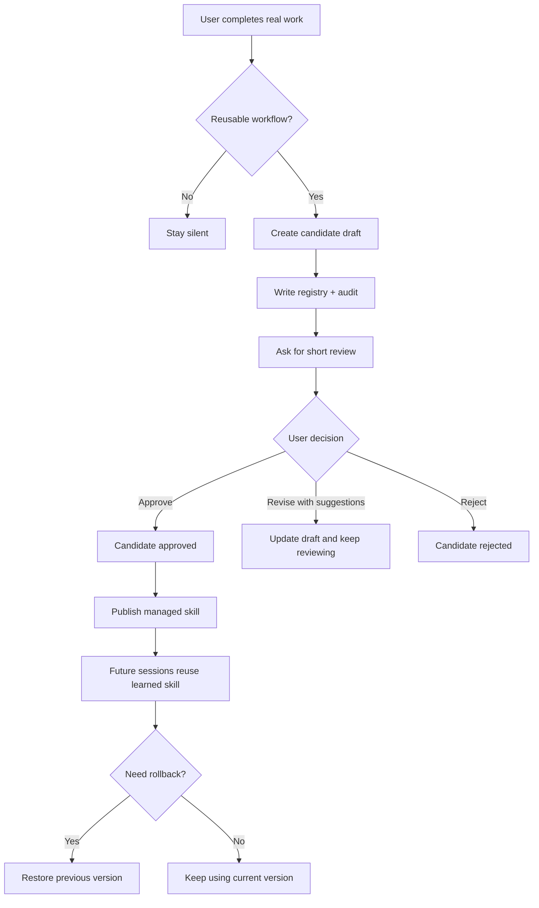

<div align="center">

# TrustLoop Core (`skill-evolver`)

<p><a href="./README.zh-CN.md">中文说明</a></p>

<p>
  
  
  
  
</p>

<p>Most self-improving agent demos optimize for autonomy. <code>skill-evolver</code> optimizes for trust.</p>

<h3>Teach your agent once. Review what it learns. Keep the final say.</h3>

<p><code>skill-evolver</code> is the core TrustLoop skill for OpenClaw. It watches for repeatable workflows, turns them into <strong>managed skill candidates</strong>, lets the user <strong>review, revise, approve, or reject</strong> them, and evolves through <strong>manual, assisted, or autonomous</strong> modes with clear safety boundaries.</p>

<p>This is not "auto-modify everything and hope for the best". It is <strong>review-first skill evolution</strong> for real users who need trust, visibility, and rollback.</p>

</div>

## Quick Deploy

### Recommended: full TrustLoop experience

Install the TrustLoop plugin package:

```bash
openclaw plugins install clawhub:openclaw-trustloop
```

After install:

- restart Gateway or restart OpenClaw so plugin changes are loaded
- start a new session
- TrustLoop is ready with the bundled `skill-evolver` skill and the native `skill_manage_managed` tool

### Standalone fallback: skill-only

If you want to try the workflow without the native managed-skill tool, install the skill directly:

```bash
openclaw skills install trustloop-skill-evolver
```

This path is useful for quick evaluation, but the plugin-backed install is the recommended setup.

## At A Glance

- Quietly learns repeatable workflows instead of interrupting every successful task.
- Gives users a real review loop, not a black-box self-modifying system.
- Keeps changes workspace-scoped, auditable, and rollback-friendly.
- Prefers patching or merging over spraying new `learned-*` skills everywhere.

## Why Teams Care

- Fewer repeated instructions across similar tasks
- Less fear of uncontrolled self-modification
- Cleaner long-term skill libraries
- Clearer risk boundaries when autonomy is enabled

## Install Paths

TrustLoop supports two ways to ship:

### 1. Skill-only install from ClawHub

Users can install `skill-evolver` directly as a skill.

That path still works without the plugin:

- the skill can run in pure skill mode
- it uses built-in file tools and the bundled policy files
- users still get the review-first workflow

### 2. Plugin-backed install from ClawHub

Users can also install the TrustLoop plugin package.

That path is the fuller experience:

- the plugin bundles the `skill-evolver` skill
- the plugin registers the native `skill_manage_managed` tool
- candidate review, publish, rollback, and mode changes become safer and more reliable

In other words:

- install the skill if you want the workflow
- install the plugin if you want the workflow plus the native managed-skill tool

The skill should never become unusable just because the plugin is missing.

## Why This Exists

Most self-improving agent demos optimize for autonomy.

Most users optimize for trust.

`skill-evolver` is built around that second reality:

- learn quietly
- interrupt rarely
- explain clearly
- ask for approval before changing behavior
- let the user suggest improvements during review
- keep rollback easy

## Modes

`skill-evolver` supports three operating modes:

| Mode | What it does | Best for |
| --- | --- | --- |
| `manual` | Creates candidates and waits for human approval before publishing | Teams that want maximum control |
| `assisted` | Auto-approves low-risk updates but still keeps publishing manual | Teams that want less busywork without giving up review |
| `autonomous` | Auto-publishes low-risk patches to `main` and low-risk new skills to `canary` | Teams that want fast iteration with strict low-risk boundaries |

Default mode: `manual`.

Even in `autonomous`, medium- and high-risk changes stay in review.

## What The User Experience Feels Like

The best version of this skill feels almost invisible until it has something useful to offer.

### 1. The user works normally

The user just asks OpenClaw to do real work.

No new commands are required to benefit from the skill.

### 2. The skill notices reusable patterns

It only creates a candidate when the workflow is actually worth learning, for example:

- a task succeeded after multiple meaningful tool calls
- the user corrected the approach
- the same pattern appeared repeatedly
- a failed path was recovered into a stable repeatable workflow

It should stay silent for one-off or trivial actions.

### 3. The skill asks for review at the right moment

It does **not** interrupt the middle of the task just to say it learned something.

Instead, after the task is done, it raises one short review prompt like this:

```text
I found a reusable workflow and created candidate candidate-20260409-review-loop
for learned-review-loop.

Next:
- approve candidate candidate-20260409-review-loop
- revise candidate candidate-20260409-review-loop with suggestions: narrow the trigger, make rollback clearer
- reject candidate candidate-20260409-review-loop
```

### 4. The user can improve the candidate

This is an important part of the UX.

Users should not be forced into a binary "approve or reject" choice.

They can say:

```text
revise candidate candidate-20260409-review-loop with suggestions:
- make it only trigger after multi-step tasks
- shorten the publish message
- keep shell usage read-only unless I confirm
```

The candidate stays alive, the suggestions are recorded, and the draft is updated for another review pass.

### 5. The skill publishes according to the current mode

In `manual`, the draft only becomes a managed skill after approval.

In `assisted`, low-risk updates may be auto-approved, but publish still stays manual.

In `autonomous`, low-risk patches can publish directly and low-risk new skills can go out as canaries.

Published managed skills live under:

```text
./skills/learned-<slug>/SKILL.md
```

Before that, it only lives as a candidate.

### 6. The user can always roll back

If the new skill feels wrong, too broad, or too noisy, the user can roll it back.

That makes the whole learning loop feel safer and more reversible.

## Workflow



## UX Principles

These principles matter as much as the lifecycle itself:

- **Quiet by default**: no candidate, no interruption.
- **Ask late, not early**: review only after the task is done.
- **Keep prompts short**: what was learned, where it would live, what the user can do next.
- **Make revision easy**: suggestions should feel like collaboration, not failure.
- **Explain merges**: when a candidate is deduped into an older skill, say that clearly.
- **Never trap the user**: rollback must be easy and explicit.

## Commands

The skill supports direct commands and natural-language equivalents.

### Show mode

```text
show skill-evolver mode
```

Shows the current autonomy mode and a short behavior summary.

### Set mode

```text
set skill-evolver mode <manual|assisted|autonomous>
```

Updates the current workspace mode.


### Review

```text
review skill candidates
```

Shows pending or approved candidates with a short summary.

### Approve

```text
approve candidate <id>
```

Marks the candidate as approved, but does not publish yet.

### Revise

```text
revise candidate <id> with suggestions: <feedback>
```

Keeps the candidate in the review loop and records the user's improvement suggestions.

### Reject

```text
reject candidate <id>
```

Rejects the candidate without changing published skills.

### Publish

```text
publish candidate <id> as <name>
```

Publishes the approved candidate into `./skills/learned-<slug>/SKILL.md`.

### Rollback

```text
rollback skill <name>
```

Restores the latest backup for a managed skill.

## Dedupe And Merge

Without dedupe, `learned-*` skills would explode into a messy pile.

`skill-evolver` avoids that by checking existing managed skills and open candidates before creating anything new.

It prefers:

- patching an existing managed skill
- merging into an already-open candidate
- creating a new skill only when the workflow is materially different

This keeps the skill library understandable for users.

## Structured Audit

Every meaningful lifecycle action can be written to:

```text
./.skill-evolver/audit/
```

Audit events are meant to answer:

- Which mode created or promoted this change?

- Why was this learned?
- Why was it merged instead of created?
- What rules were matched?
- What changed?
- Why was it rejected?
- What happened when it was published?

This matters for trust, debugging, and future analytics.

## File Layout

### Runtime state

```text
./.skill-evolver/
  candidates/
  backups/
  audit/
  registry.json
  config.json
```

### Published managed skills

```text
./skills/
  learned-<slug>/
    SKILL.md
```

## Safety Model

`skill-evolver` is intentionally narrow.

It refuses to:

- modify bundled skills
- modify third-party installed skills
- modify user-authored skills without the `managed-by: skill-evolver` marker
- auto-publish outside the current mode's low-risk policy
- introduce dangerous commands, sensitive path access, or exfiltration behavior

## Pure Skill Mode vs Native Tool Mode

### Pure skill mode

Works today using OpenClaw's normal file-editing capabilities.

Good for:

- rapid iteration
- validating UX
- shipping a v0 quickly

### Native tool mode

Better when you want:

- stronger safety guarantees
- cleaner dedupe and merge logic
- atomic publish + backup + audit updates
- lower token cost for lifecycle operations

The optional next step is a dedicated tool named:

```text
skill_manage_managed
```

In this workspace, there is already a minimal companion plugin skeleton for that tool:

```text
../openclaw-skill-manage-managed-plugin/
```

## Repository Layout

```text
skill-evolver/
  SKILL.md
  README.md
  references/
    evolution-rules.md
    review-policy.md
    skill-manage-managed-tool.md
  templates/
    candidate-record-template.md
    managed-skill-template.md
```

## Example Review Conversation

```text
User: Help me clean up this repeated publish workflow.

OpenClaw: [does the work]

OpenClaw: I found a reusable workflow and created candidate
candidate-20260409-review-loop for learned-review-loop.
Publish it?

User: revise candidate candidate-20260409-review-loop with suggestions:
- make it more conservative
- only trigger after 2+ meaningful tool calls
- keep the publish summary under 3 lines

OpenClaw: Updated the candidate with your suggestions.
It is ready for review again.

User: approve candidate candidate-20260409-review-loop

User: publish candidate candidate-20260409-review-loop as review-loop

OpenClaw: Published learned-review-loop v1.
```

## What This Is Not

This project is not trying to be:

- background autonomous self-rewrite
- online model fine-tuning
- unrestricted skill mutation
- a replacement for product judgment

It is a practical middle path:

**let the system learn, but keep the human in control.**
