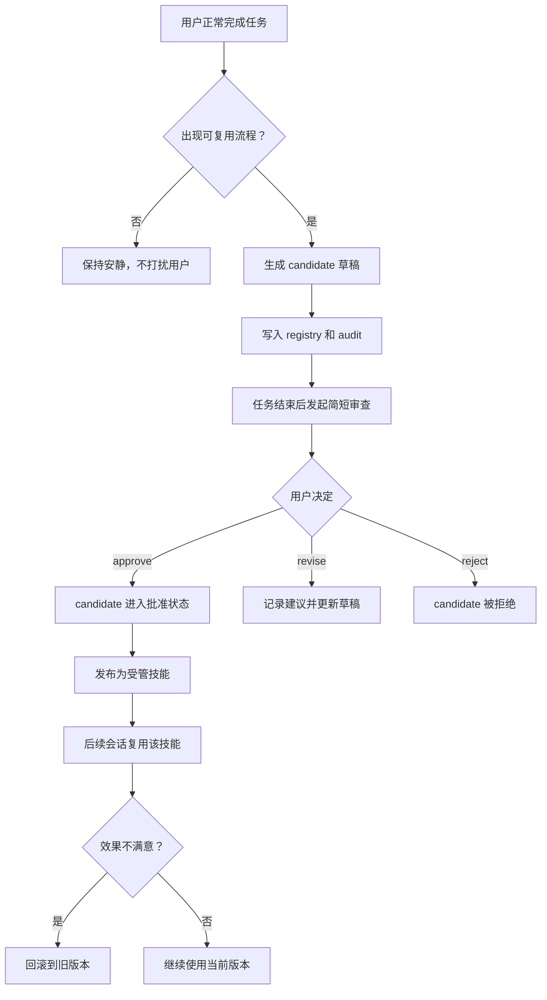

<div align="center">

# TrustLoop Core (`skill-evolver`)

<p><a href="./README.md">English</a></p>

<p>
  
  
  
  
</p>

<p>很多“会自我进化的 agent”演示，更强调自治；<code>skill-evolver</code> 更强调信任。</p>

<h3>教会 agent 一次。审查它学到的东西。最终决定权始终在你手里。</h3>

<p><code>skill-evolver</code> 是 TrustLoop 在 OpenClaw 上的核心 skill。它会在合适的时候识别可复用工作流，把它们沉淀成 <strong>skill candidate</strong>，允许用户 <strong>审查、提修改建议、批准、拒绝、再发布</strong>，并通过 <strong>manual / assisted / autonomous</strong> 三档模式控制进化速度和风险边界。</p>

<p>这不是“让 agent 随便改自己”，而是一套面向真实使用场景的 <strong>审核式技能进化闭环</strong>。</p>

</div>

## 快速部署

### 推荐：完整 TrustLoop 体验

直接安装 TrustLoop plugin：

```bash
openclaw plugins install clawhub:openclaw-trustloop
```

安装完成后：

- 重启 Gateway 或重开 OpenClaw，让插件变更生效
- 开一个新的会话
- 这时就能同时拿到内置的 `skill-evolver` skill 和原生 `skill_manage_managed` 工具

### 兼容模式：只安装 skill

如果你只是想先体验工作流，而不依赖原生 managed-skill 工具，也可以直接安装 skill：

```bash
openclaw skills install trustloop-skill-evolver
```

这条路径适合快速试用，但如果你想拿到更完整、更稳定的能力，还是推荐安装 plugin 版本。

## 一眼看懂

- 它会安静地学习，而不是每完成一次任务都来打断用户。
- 它提供的是 review loop，而不是黑盒自我改写。
- 它把改动限制在工作区内，并且支持审计和回滚。
- 它优先 patch / merge，而不是无限生成新的 `learned-*` 技能。

## 为什么团队会在意它

- 可以减少重复提示和重复操作
- 更容易接受“系统会学习”这件事
- 技能库长期更清晰、更可维护
- 开启自治时仍然有明确边界

## 安装方式

TrustLoop 现在支持两种分发方式：

### 1. 只安装 skill

用户可以直接从 ClawHub 安装 `skill-evolver`。

这条路径不依赖插件，也能工作：

- skill 可以走纯 skill 模式
- 使用 OpenClaw 自带文件工具和技能目录里的规则文件
- 仍然保留 review-first 的完整工作流

### 2. 安装带原生工具的 plugin

用户也可以安装 TrustLoop 的 plugin 包。

这条路径会带来更完整的体验：

- plugin 会把 `skill-evolver` 一起打包进去
- plugin 会注册原生 `skill_manage_managed` 工具
- candidate 审查、发布、回滚、模式切换会更安全、更稳定

换句话说：

- 想先用起来，装 skill 就够
- 想拿到完整体验和原生工具能力，再装 plugin

不应该因为插件没装，这个 skill 就不能用。

## 为什么要做这个

很多“自进化 agent”的演示，更强调自动化和炫技。

但真实用户更在乎的是：

- 先把事做完
- 不要频繁打断
- 改动前要先告知
- 改得不满意可以继续提意见
- 出问题能快速回滚

`skill-evolver` 的出发点就是这个。

它更像是：

- 安静地学习
- 在合适的时候提出建议
- 把决定权交回给用户

## 模式说明

`skill-evolver` 支持三种工作模式：

| 模式 | 行为 | 适合谁 |
| --- | --- | --- |
| `manual` | 生成 candidate 后进入人工审查，再决定是否发布 | 最重视可控性的团队 |
| `assisted` | 自动批准低风险更新，但发布仍需人工确认 | 想减少重复审批、但仍保留发布把关的团队 |
| `autonomous` | 低风险 patch 直接发布到 `main`，低风险新技能先发到 `canary` | 想提高迭代速度、同时保留风险边界的团队 |

默认模式是 `manual`。

即使在 `autonomous` 模式下，中高风险改动也仍然要进入人工审查。

## 用户实际会怎么体验

一个好的自进化 skill，不应该让用户觉得“系统老是在学一些我不想管的东西”，而应该让用户觉得“它会在合适的时候帮我沉淀经验，而且我能控制它”。

### 1. 用户正常使用 OpenClaw

用户不需要先学一堆新命令，也不需要先进入某个特殊模式。

先正常干活就行。

### 2. `skill-evolver` 在后台识别“值不值得学”

只有当流程真的值得沉淀时，它才会创建 candidate，例如：

- 一个任务经过多步工具调用后成功完成
- 用户明确纠正了做法
- 同类请求重复出现
- 失败路径最终被修复成稳定流程

如果只是一次性的小动作、单步命令、或明显不安全的流程，它就应该保持安静。

### 3. 它会在任务结束后再发起审查

用户体验上，这一点非常关键。

它不应该在任务做到一半时跳出来说“我学到了一个东西”。

更合理的方式是：等任务完成后，再用一条简短信息告诉用户：

```text
我发现了一个可复用流程，已经生成 candidate：
candidate-20260409-review-loop

目标技能：learned-review-loop

你可以：
- approve candidate candidate-20260409-review-loop
- revise candidate candidate-20260409-review-loop with suggestions: 收窄触发条件，强调回滚
- reject candidate candidate-20260409-review-loop
```

重点是：

- 提示要短
- 信息要够用
- 不要把用户拉进一段很长的内部推理

### 4. 用户不只可以“同意/拒绝”，还可以“继续优化”

真实用户看到 candidate 时，很多时候并不是想直接拒绝，而是会说：

- 这个方向对，但范围太大了
- 这个规则还不够保守
- 文案太长了
- 不要默认 shell 写入

所以 review 阶段不能只有二选一。

用户应该可以直接说：

```text
revise candidate candidate-20260409-review-loop with suggestions:
- 只在多步任务后触发
- 发布提示控制在 3 行以内
- shell 默认只读
```

系统收到这种输入后，应该把它当作“继续共同打磨”，而不是“失败”。

### 5. 发布行为取决于当前模式

在 `manual` 模式下，candidate 在用户明确同意之前都只是草稿。

在 `assisted` 模式下，低风险更新可以自动批准，但发布仍然需要人工确认。

在 `autonomous` 模式下，低风险 patch 可以直接发布，低风险新技能会先走 `canary`。

真正发布后，会进入：

```text
./skills/learned-<slug>/SKILL.md
```

这能显著提升用户的安全感和掌控感。

### 6. 不满意时可以回滚

如果一个新技能虽然发布了，但后面表现得过于激进、过于啰嗦、或覆盖范围不对，用户应该能直接回滚。

这让“愿意尝试进化”这件事本身变得更轻松。

## 工作流程



## 这套流程为什么更适合真实用户

### 1. 它尽量少打扰

没有 candidate 就不说话。

不是所有成功任务都值得沉淀成技能。

### 2. 它把“审查”设计成轻量动作

用户看到的不是一大段内部机制，而是一个简单选择：

- 同意
- 修改建议
- 拒绝

### 3. 它允许“协作式进化”

很多时候最好的技能不是 agent 一次写出来的，而是用户给几条边界和偏好后，双方一起收敛出来的。

### 4. 它默认保守

先 candidate，后 approval，再 publish。

不会一边学一边偷偷改线上技能。

### 5. 它可解释、可追踪、可回滚

这三点合在一起，才会让用户愿意长期打开自进化能力。

## 支持的命令

除了自然语言触发，也支持这些显式命令。

### 查看当前模式

```text
show skill-evolver mode
```

显示当前工作区模式和一句简短说明。

### 切换模式

```text
set skill-evolver mode <manual|assisted|autonomous>
```

更新当前工作区的自进化模式。


### 查看 candidate

```text
review skill candidates
```

列出待审查或已批准的 candidate。

### 批准

```text
approve candidate <id>
```

把 candidate 标记为批准，但暂不发布。

### 修改建议

```text
revise candidate <id> with suggestions: <反馈内容>
```

把用户建议记入 candidate，并继续迭代草稿。

### 拒绝

```text
reject candidate <id>
```

拒绝该 candidate，不影响已发布技能。

### 发布

```text
publish candidate <id> as <name>
```

把已批准 candidate 发布到 `./skills/learned-<slug>/SKILL.md`。

### 回滚

```text
rollback skill <name>
```

恢复该受管技能的最新备份版本。

## 去重与合并

如果没有去重，`learned-*` 技能会很快膨胀，最后谁都看不懂。

所以 `skill-evolver` 在创建 candidate 之前，会优先检查：

- 有没有现成的受管技能可以直接 patch
- 有没有待审 candidate 可以直接 merge
- 这次是不是只是旧技能的小改动，而不是一个全新技能

它会优先选择：

- patch 已有技能
- merge 进已有 candidate
- 只有在差异足够大时才创建新 skill

这能让最终的技能库更清晰、更好维护，也更符合用户心智。

## 结构化审计

所有关键生命周期动作都可以写入：

```text
./.skill-evolver/audit/
```

这些审计记录重点回答这些问题：

- 这次改动是在什么模式下产生或晋升的？

- 为什么学到了这个技能？
- 为什么是 patch / merge，而不是新建？
- 命中了哪些规则？
- 改动摘要是什么？
- 为什么被拒绝？
- 发布后产生了什么结果？

这对用户信任、问题排查、后续分析都很重要。

## 文件结构

### 运行时状态

```text
./.skill-evolver/
  candidates/
  backups/
  audit/
  registry.json
  config.json
```

### 已发布技能

```text
./skills/
  learned-<slug>/
    SKILL.md
```

## 安全边界

`skill-evolver` 故意把边界收得很窄。

它拒绝：

- 修改 bundled skills
- 修改第三方安装技能
- 修改没有 `managed-by: skill-evolver` 标记的用户技能
- 超出当前模式低风险边界的自动发布
- 引入危险命令、敏感路径访问、密钥处理或外传行为

## 纯 Skill 模式 vs 原生 Tool 模式

### 纯 Skill 模式

它现在就能工作，依赖 OpenClaw 现有文件工具即可。

适合：

- 快速验证体验
- 先把 workflow 跑通
- 先上线一个 v0

### 原生 Tool 模式

如果你想要更稳的去重、审计、原子发布和回滚，下一步更推荐接入一个专用工具：

```text
skill_manage_managed
```

这个 workspace 里已经有一个最小 companion plugin 骨架：

```text
../openclaw-skill-manage-managed-plugin/
```

它的作用是把这些“高可靠性动作”收口到工具里，例如：

- create_candidate
- merge_candidate
- review_candidate
- publish_candidate
- rollback_skill

这样做的好处是：

- 更安全
- 更省 token
- 行为更稳定
- 更接近 Hermes 的原生技能管理能力

## 仓库结构

```text
skill-evolver/
  SKILL.md
  README.md
  README.zh-CN.md
  references/
    evolution-rules.md
    review-policy.md
    skill-manage-managed-tool.md
  templates/
    candidate-record-template.md
    managed-skill-template.md
```

## 一个典型的使用示例

```text
用户：帮我把这个重复出现的发布流程整理一下。

OpenClaw：[先完成任务]

OpenClaw：我发现了一个可复用流程，已生成 candidate：
candidate-20260409-review-loop

目标技能：learned-review-loop
要不要继续审查？

用户：revise candidate candidate-20260409-review-loop with suggestions:
- 收窄触发范围
- shell 默认只读
- 发布提示短一点

OpenClaw：我已经按你的建议更新 candidate，可以继续审查。

用户：approve candidate candidate-20260409-review-loop

用户：publish candidate candidate-20260409-review-loop as review-loop

OpenClaw：已发布 learned-review-loop v1。
```

## 这不是一个什么项目

这个项目不是：

- 后台无限自治改写自己
- 在线训练模型参数
- 不受控的技能自我扩张
- 用“智能”替代用户判断

它更像是一条实际可落地的中间路线：

**让系统持续学习，但始终把控制权交给用户。**
