# Mermaid Diagram 画图技能

> 使用 Mermaid 语法生成各类图表（流程图、时序图、甘特图、饼图等），支持 PNG 和 HTML 两种输出格式。

---

## 输出格式

### 格式一：PNG 图片（推荐用于分享/嵌入）

```bash
mmdc -i input.mmd -o output.png -w <宽度> -H <高度> -b <背景色> -t <主题>
```

| 参数 | 说明 | 默认值 |
|------|------|--------|
| `-i` | 输入 `.mmd` 文件 | 必填 |
| `-o` | 输出文件（`.png` / `.svg` / `.pdf`） | 必填 |
| `-w` | 页面宽度（像素） | 800 |
| `-H` | 页面高度（像素） | 600 |
| `-b` | 背景色（`transparent`, `white`, `#F0F0F0`） | `white` |
| `-t` | 主题（`default`, `forest`, `dark`, `neutral`） | `default` |
| `-s` | 缩放比例 | 1 |
| `-c` | JSON 配置文件 | 无 |

**工作流程：**
1. 将 mermaid 代码写入 `.mmd` 文件
2. 执行 `mmdc` 命令生成 PNG
3. 检查输出图片尺寸和宽高比

### 格式二：HTML 文件（推荐用于交互/修改）

```html
<!DOCTYPE html>
<html>
<head>
  <meta charset="UTF-8">
  <title>Mermaid Diagram</title>
  <script type="module">
    import mermaid from 'https://cdn.jsdelivr.net/npm/mermaid@11/dist/mermaid.esm.min.mjs';
    mermaid.initialize({ startOnLoad: true, theme: 'default' });
  </script>
</head>
<body>
  <pre class="mermaid">
    <!-- 在此处粘贴 mermaid 代码 -->
  </pre>
</body>
</html>
```

---

## ❗ 布局与排版规范（必读）

### 宽高比控制原则

| 原则 | 说明 |
|------|------|
| **避免极端比例** | 宽高比不超过 3:1 或 1:3 |
| **流程图方向选择** | 节点 ≤6 个横向用 `LR`，≥7 个纵向用 `TD` |
| **控制单层节点数** | 同一层级不超过 5-6 个节点 |
| **复杂图表拆分** | 超过 15 个节点考虑拆成多张图 |

### 方向选择指南

| 方向 | 关键字 | 适用场景 |
|------|--------|----------|
| 上→下 | `TD` / `TB` | 层级结构、决策树、组织架构 |
| 左→右 | `LR` | 流程/管道、时间线式流程 |
| 下→上 | `BT` | 自底向上的构建过程 |
| 右→左 | `RL` | 回溯/反向流程 |

### 各图表推荐画布尺寸

| 图表类型 | 推荐宽度 | 推荐高度 | 说明 |
|----------|----------|----------|------|
| Flowchart (TD, ≤8 节点) | 800 | 600 | 标准 4:3 |
| Flowchart (LR, ≤6 节点) | 1000 | 500 | 横向 2:1 |
| Flowchart (大型 >10 节点) | 1200 | 800 | 加大画布 |
| Sequence Diagram (≤5 参与者) | 800 | 600 | 标准 |
| Sequence Diagram (>5 参与者) | 1200 | 600 | 加宽 |
| Class Diagram | 1000 | 700 | 略宽 |
| State Diagram | 800 | 600 | 标准 |
| ER Diagram | 1000 | 700 | 略宽 |
| Gantt Chart (≤10 任务) | 1000 | 500 | 横向 2:1 |
| Gantt Chart (>10 任务) | 1200 | 700 | 加高 |
| Pie Chart | 700 | 700 | 1:1 正方形 |
| Mindmap | 1000 | 700 | 略宽 |
| Timeline (≤5 时期) | 1000 | 500 | 横向 |
| Timeline (>5 时期) | 1200 | 600 | 加宽 |
| Git Graph | 1000 | 500 | 横向 |
| Sankey Diagram | 1000 | 600 | 略宽 |
| XY Chart | 800 | 600 | 标准 4:3 |
| Quadrant Chart | 700 | 700 | 1:1 正方形 |
| User Journey | 1000 | 500 | 横向 |
| Block Diagram | 800 | 600 | 标准 |

---

## 图表类型详解

---

### 1. Flowchart（流程图）

**使用场景：** 业务流程、决策树、系统架构、算法步骤

**语法模板：**
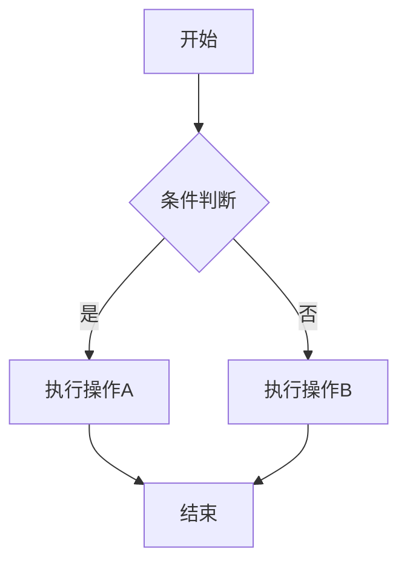
```mermaid
flowchart TD
    A[开始] --> B{条件判断}
    B -->|是| C[执行操作A]
    B -->|否| D[执行操作B]
    C --> E[结束]
    D --> E
```

**节点形状：**
| 语法 | 形状 | 用途 |
|------|------|------|
| `A[文本]` | 矩形 | 普通步骤 |
| `A(文本)` | 圆角矩形 | 普通步骤（柔和） |
| `A{文本}` | 菱形 | 条件判断 |
| `A((文本))` | 圆形 | 起止点 |
| `A([文本])` | 体育场形 | 起止点（替代） |
| `A[[文本]]` | 子程序 | 子流程调用 |
| `A[(文本)]` | 圆柱体 | 数据库 |
| `A>文本]` | 旗帜形 | 标记/信号 |
| `A{{文本}}` | 六边形 | 准备/条件 |
| `A[/文本/]` | 平行四边形 | 输入/输出 |

**连线类型：**
| 语法 | 说明 |
|------|------|
| `-->` | 带箭头实线 |
| `---` | 无箭头实线 |
| `-.->` | 带箭头虚线 |
| `==>` | 带箭头粗线 |
| `--文字-->` | 带标签的线 |
| `-->|文字|` | 带标签的线（另一种写法） |

**完整示例：**
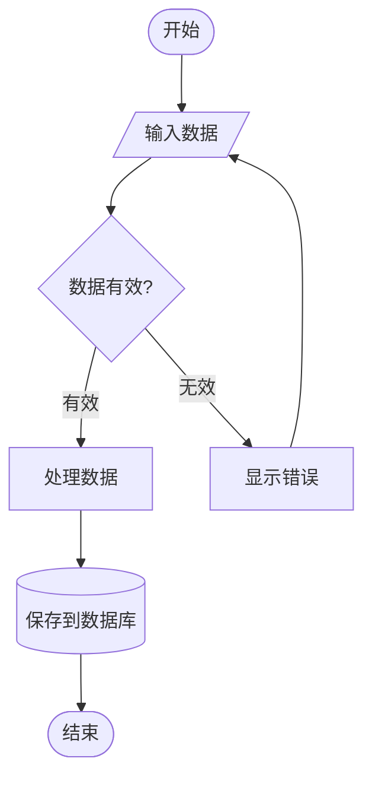
```mermaid
flowchart TD
    A([开始]) --> B[/输入数据/]
    B --> C{数据有效?}
    C -->|有效| D[处理数据]
    C -->|无效| E[显示错误]
    E --> B
    D --> F[(保存到数据库)]
    F --> G([结束])
```

**推荐尺寸：** `-w 800 -H 600`（TD 方向），`-w 1000 -H 500`（LR 方向）

**⚠️ 常见陷阱：**
- `end` 是保留字，作为节点文字需用引号包裹：`A["end"]`
- 节点 ID 不要用中文，文字标签可以用中文
- 嵌套节点可能导致解析错误

---

### 2. Sequence Diagram（时序图）

**使用场景：** API 调用流程、微服务交互、协议握手、系统通信

**语法模板：**
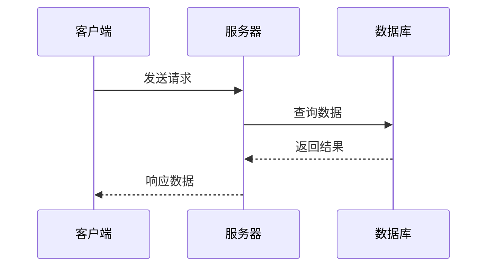
```mermaid
sequenceDiagram
    participant A as 客户端
    participant B as 服务器
    participant C as 数据库
    A->>B: 发送请求
    B->>C: 查询数据
    C-->>B: 返回结果
    B-->>A: 响应数据
```

**消息类型：**
| 语法 | 说明 |
|------|------|
| `->` | 无箭头实线 |
| `-->` | 无箭头虚线 |
| `->>` | 带箭头实线 |
| `-->>` | 带箭头虚线 |
| `-x` | 带叉实线（失败） |
| `--x` | 带叉虚线 |
| `-)` | 带开放箭头实线（异步） |
| `--)` | 带开放箭头虚线 |

**高级功能：**
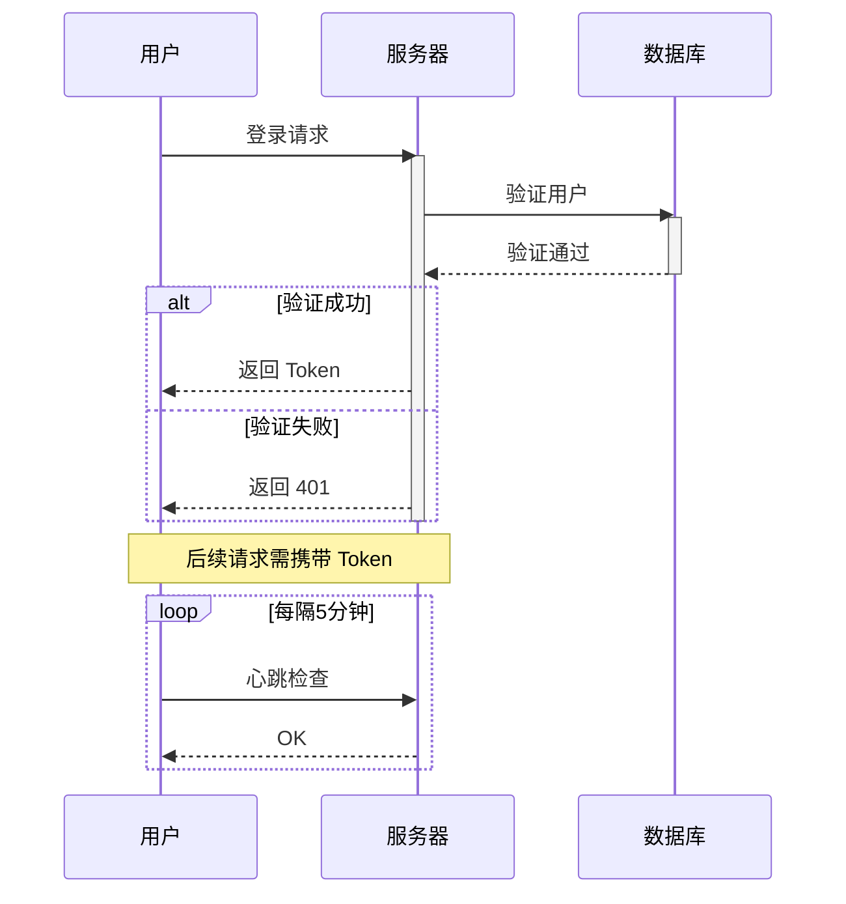
```mermaid
sequenceDiagram
    participant U as 用户
    participant S as 服务器
    participant DB as 数据库

    U->>S: 登录请求
    activate S
    S->>DB: 验证用户
    activate DB
    DB-->>S: 验证通过
    deactivate DB

    alt 验证成功
        S-->>U: 返回 Token
    else 验证失败
        S-->>U: 返回 401
    end
    deactivate S

    Note over U,S: 后续请求需携带 Token

    loop 每隔5分钟
        U->>S: 心跳检查
        S-->>U: OK
    end
```

**关键语法：**
- `activate/deactivate` — 激活条（显示处理中）
- `alt/else/end` — 条件分支
- `loop/end` — 循环
- `par/and/end` — 并行处理
- `Note over A,B:` — 跨参与者的备注
- `rect rgb(200,220,255)/end` — 高亮区域

**推荐尺寸：** `-w 800 -H 600`（≤5 参与者），`-w 1200 -H 600`（>5 参与者）

**⚠️ 常见陷阱：**
- `end` 是保留字，用引号包裹：`participant E as "End Service"`
- 参与者过多（>8）会导致横向过宽，考虑拆分

---

### 3. Class Diagram（类图）

**使用场景：** 面向对象设计、系统架构、数据模型

**语法模板：**
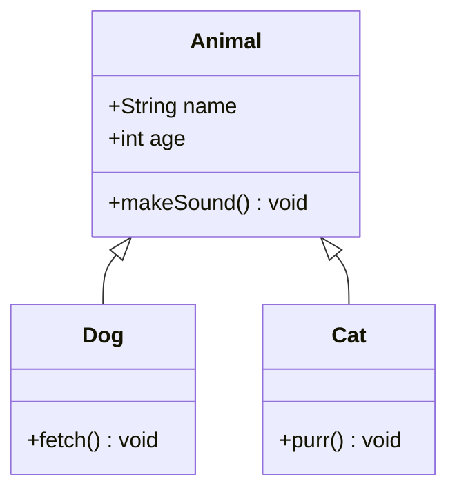
```mermaid
classDiagram
    class Animal {
        +String name
        +int age
        +makeSound() void
    }
    class Dog {
        +fetch() void
    }
    class Cat {
        +purr() void
    }
    Animal <|-- Dog
    Animal <|-- Cat
```

**关系类型：**
| 语法 | 关系 | 说明 |
|------|------|------|
| `<\|--` | 继承 | 实线三角箭头 |
| `*--` | 组合 | 实线实心菱形 |
| `o--` | 聚合 | 实线空心菱形 |
| `-->` | 关联 | 实线箭头 |
| `..>` | 依赖 | 虚线箭头 |
| `<\|..` | 实现 | 虚线三角箭头 |
| `--` | 链接 | 实线 |

**可见性修饰符：**
| 符号 | 含义 |
|------|------|
| `+` | public |
| `-` | private |
| `#` | protected |
| `~` | package/internal |

**完整示例：**
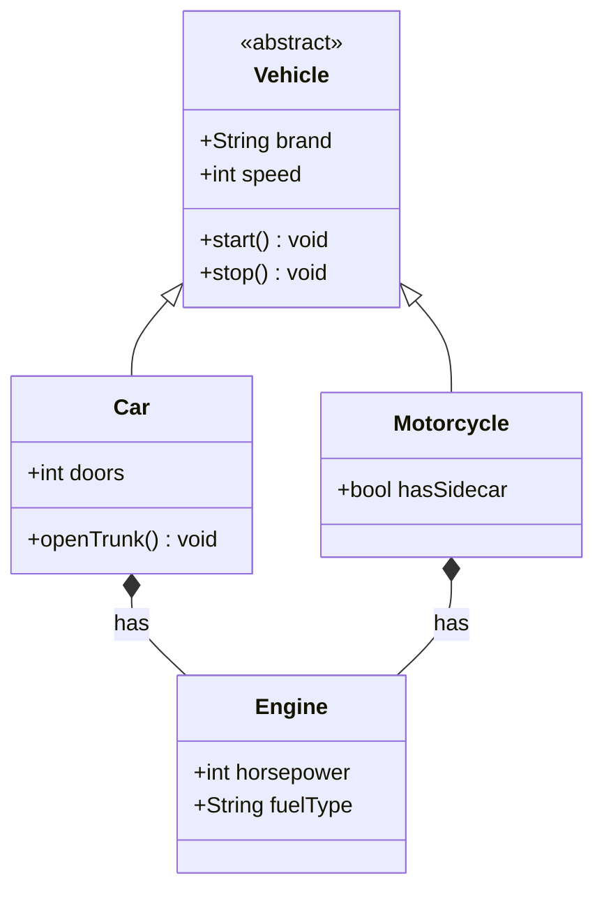
```mermaid
classDiagram
    class Vehicle {
        <<abstract>>
        +String brand
        +int speed
        +start() void
        +stop() void
    }
    class Car {
        +int doors
        +openTrunk() void
    }
    class Motorcycle {
        +bool hasSidecar
    }
    class Engine {
        +int horsepower
        +String fuelType
    }

    Vehicle <|-- Car
    Vehicle <|-- Motorcycle
    Car *-- Engine : has
    Motorcycle *-- Engine : has
```

**推荐尺寸：** `-w 1000 -H 700`

---

### 4. State Diagram（状态图）

**使用场景：** 状态机、对象生命周期、协议状态

**语法模板：**
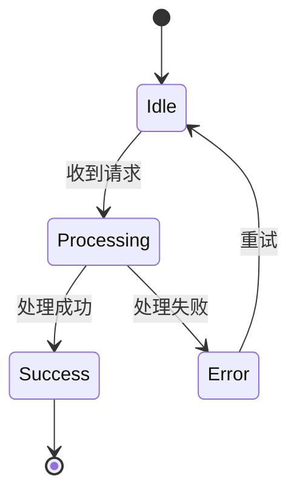
```mermaid
stateDiagram-v2
    [*] --> Idle
    Idle --> Processing : 收到请求
    Processing --> Success : 处理成功
    Processing --> Error : 处理失败
    Success --> [*]
    Error --> Idle : 重试
```

**高级功能：**
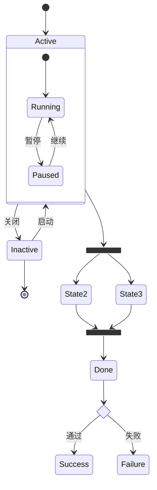
```mermaid
stateDiagram-v2
    [*] --> Active

    state Active {
        [*] --> Running
        Running --> Paused : 暂停
        Paused --> Running : 继续
    }

    Active --> Inactive : 关闭
    Inactive --> Active : 启动
    Inactive --> [*]

    state fork_state <<fork>>
    Active --> fork_state
    fork_state --> State2
    fork_state --> State3

    state join_state <<join>>
    State2 --> join_state
    State3 --> join_state
    join_state --> Done

    state Decision <<choice>>
    Done --> Decision
    Decision --> Success : 通过
    Decision --> Failure : 失败
```

**关键语法：**
- `[*]` — 起始/终止状态
- `state Name { }` — 复合状态（嵌套）
- `<<fork>>` / `<<join>>` — 并行分叉/汇合
- `<<choice>>` — 选择节点
- `note right/left of State` — 备注

**推荐尺寸：** `-w 800 -H 600`

---

### 5. Entity Relationship Diagram（ER 图）

**使用场景：** 数据库设计、数据模型、实体关系

**语法模板：**
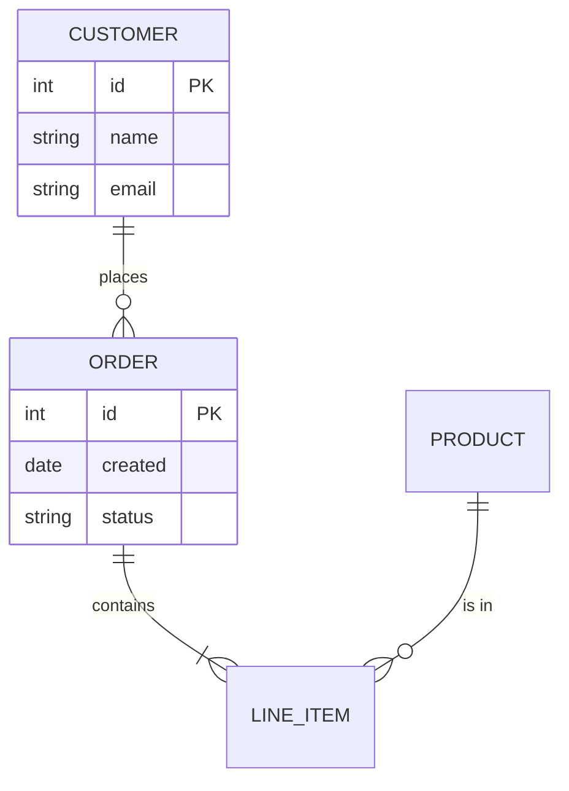
```mermaid
erDiagram
    CUSTOMER ||--o{ ORDER : places
    ORDER ||--|{ LINE_ITEM : contains
    PRODUCT ||--o{ LINE_ITEM : "is in"
    CUSTOMER {
        int id PK
        string name
        string email
    }
    ORDER {
        int id PK
        date created
        string status
    }
```

**关系符号：**
| 左侧 | 右侧 | 含义 |
|-------|-------|------|
| `\|\|` | `\|\|` | 恰好一个 |
| `\|\|` | `o{` | 零或多个 |
| `\|\|` | `\|{` | 一或多个 |
| `o\|` | `o{` | 零或一对零或多 |

**完整格式：** `<entity1> <relationship> <entity2> : <label>`

**属性语法：** `type name PK/FK/UK "注释"`

**推荐尺寸：** `-w 1000 -H 700`

**⚠️ 注意：** 实体名建议大写（如 `CUSTOMER`），关系标签有空格需用引号

---

### 6. Gantt Chart（甘特图）

**使用场景：** 项目进度、任务规划、里程碑跟踪

**语法模板：**
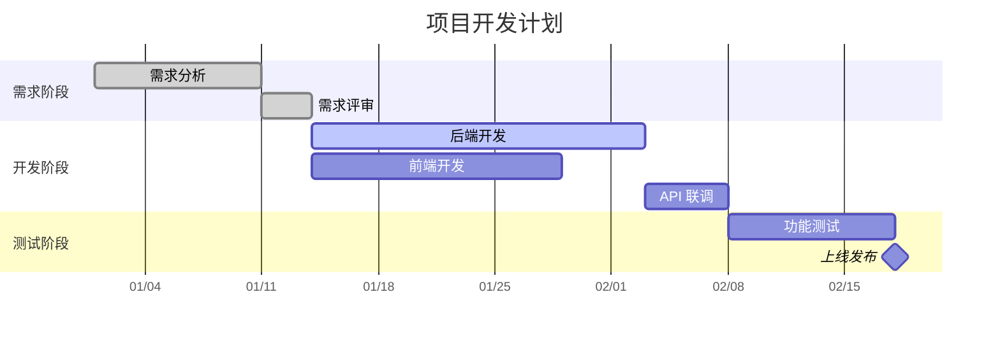
```mermaid
gantt
    title 项目开发计划
    dateFormat YYYY-MM-DD
    axisFormat %m/%d

    section 需求阶段
    需求分析        :done, req1, 2026-01-01, 10d
    需求评审        :done, req2, after req1, 3d

    section 开发阶段
    后端开发        :active, dev1, after req2, 20d
    前端开发        :dev2, after req2, 15d
    API 联调        :dev3, after dev1, 5d

    section 测试阶段
    功能测试        :test1, after dev3, 10d
    上线发布        :milestone, after test1, 0d
```

**任务标签：**
| 标签 | 说明 |
|------|------|
| `done` | 已完成（灰色） |
| `active` | 进行中（蓝色） |
| `crit` | 关键路径（红色） |
| `milestone` | 里程碑（菱形标记） |

**日期格式：**
| 格式 | 说明 |
|------|------|
| `YYYY-MM-DD` | 标准日期 |
| `after taskID` | 在某任务之后 |
| `10d` | 持续 10 天 |
| `5h` | 持续 5 小时 |

**推荐尺寸：** `-w 1000 -H 500`（≤10 任务），`-w 1200 -H 700`（>10 任务）

**⚠️ 常见陷阱：**
- `dateFormat` 和 `axisFormat` 要区分（输入格式 vs 显示格式）
- 任务 ID 不能有空格
- `excludes weekends` 可排除周末

---

### 7. Pie Chart（饼图）

**使用场景：** 比例分布、市场份额、资源分配

**语法模板：**
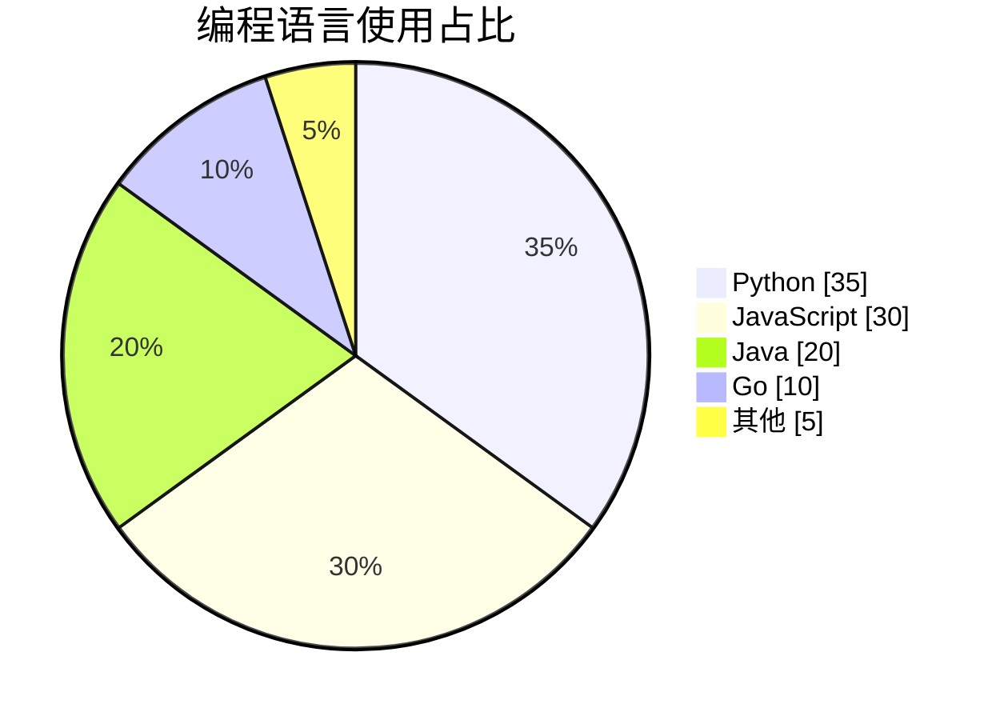
```mermaid
pie showData
    title 编程语言使用占比
    "Python" : 35
    "JavaScript" : 30
    "Java" : 20
    "Go" : 10
    "其他" : 5
```

**关键语法：**
- `pie` — 声明饼图
- `showData` — （可选）显示数值
- `title` — （可选）标题
- `"标签" : 数值` — 数据项（数值必须 >0）

**推荐尺寸：** `-w 700 -H 700`（正方形效果最佳）

**⚠️ 注意：** 不支持负数值，切片按标签顺序顺时针排列

---

### 8. Mindmap（思维导图）

**使用场景：** 知识梳理、头脑风暴、概念拆解

**语法模板：**
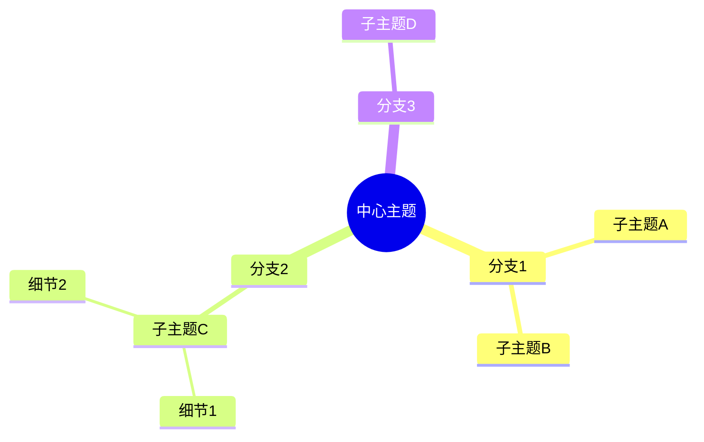
```mermaid
mindmap
  root((中心主题))
    分支1
      子主题A
      子主题B
    分支2
      子主题C
        细节1
        细节2
    分支3
      子主题D
```

**节点形状：**
| 语法 | 形状 |
|------|------|
| `id` | 默认（矩形） |
| `id[文字]` | 方形 |
| `id(文字)` | 圆角矩形 |
| `id((文字))` | 圆形 |
| `id))文字((` | 爆炸形（Bang） |
| `id)文字(` | 云朵形 |
| `id{{文字}}` | 六边形 |

**关键规则：**
- **缩进决定层级**（必须一致，建议用 2 或 4 空格）
- 根节点在第一行，无缩进
- 子节点比父节点多一级缩进

**推荐尺寸：** `-w 1000 -H 700`

**⚠️ 常见陷阱：**
- 缩进不一致会导致层级错乱
- 每层子节点不超过 5-6 个，否则图会过于拥挤
- 总层级不超过 4 层

---

### 9. Timeline（时间线）

**使用场景：** 历史事件、项目里程碑、版本发布记录

**语法模板：**
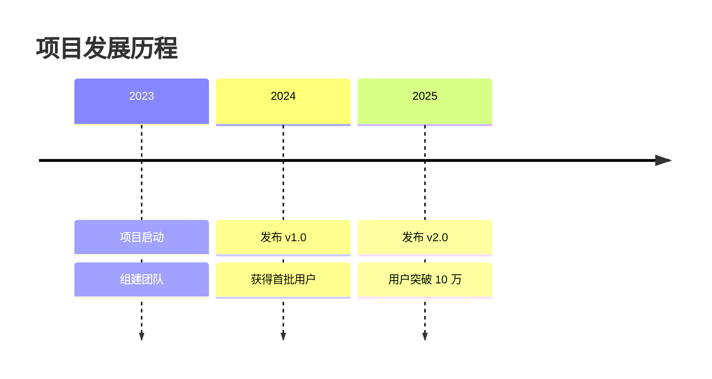
```mermaid
timeline
    title 项目发展历程
    2023 : 项目启动
         : 组建团队
    2024 : 发布 v1.0
         : 获得首批用户
    2025 : 发布 v2.0
         : 用户突破 10 万
```

**分组语法：**
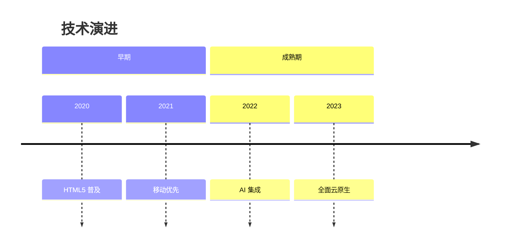
```mermaid
timeline
    title 技术演进
    section 早期
        2020 : HTML5 普及
        2021 : 移动优先
    section 成熟期
        2022 : AI 集成
        2023 : 全面云原生
```

**关键规则：**
- `时间点 : 事件` 格式
- 同一时间点多个事件用换行 + 缩进 `: 事件`
- `section` 对时间点分组

**推荐尺寸：** `-w 1000 -H 500`（≤5 时期），`-w 1200 -H 600`（>5 时期）

---

### 10. Git Graph（Git 图）

**使用场景：** Git 分支策略、版本管理流程、CI/CD 流水线

**语法模板：**
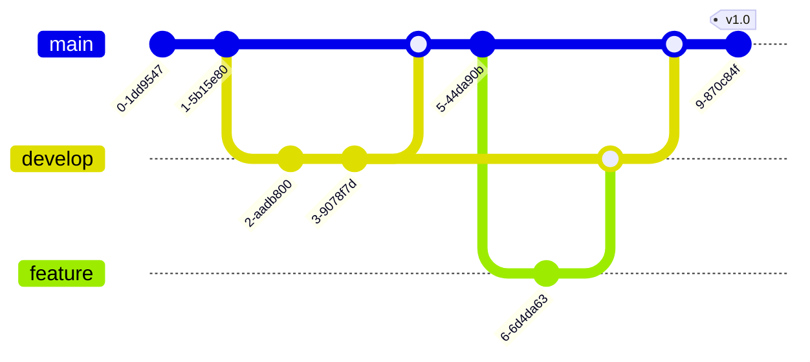
```mermaid
gitGraph
    commit
    commit
    branch develop
    checkout develop
    commit
    commit
    checkout main
    merge develop
    commit
    branch feature
    checkout feature
    commit
    checkout develop
    merge feature
    checkout main
    merge develop
    commit tag:"v1.0"
```

**关键命令：**
| 命令 | 说明 |
|------|------|
| `commit` | 提交（可选 `id: "msg"` `type: NORMAL/REVERSE/HIGHLIGHT`） |
| `branch name` | 创建并切换分支 |
| `checkout name` | 切换分支（也可用 `switch`） |
| `merge name` | 合并分支 |
| `commit tag:"v1.0"` | 带标签的提交 |

**推荐尺寸：** `-w 1000 -H 500`

---

### 11. Sankey Diagram（桑基图）

**使用场景：** 能量流向、资金流转、用户路径

**语法模板：**
```mermaid
sankey-beta

来源A,目标X,50
来源A,目标Y,30
来源B,目标X,20
来源B,目标Z,40
目标X,终点,70
目标Y,终点,30
目标Z,终点,40
```

**关键规则：**
- 类 CSV 格式：`源,目标,数值`
- 必须恰好 3 列
- 允许空行（用于视觉分隔）
- 包含逗号的文本用双引号包裹

**推荐尺寸：** `-w 1000 -H 600`

**⚠️ 实验性功能：** 语法可能在未来版本变化

---

### 12. XY Chart（XY 图表）

**使用场景：** 数据趋势、柱状图、折线图、数据对比

**语法模板（柱状图 + 折线图）：**
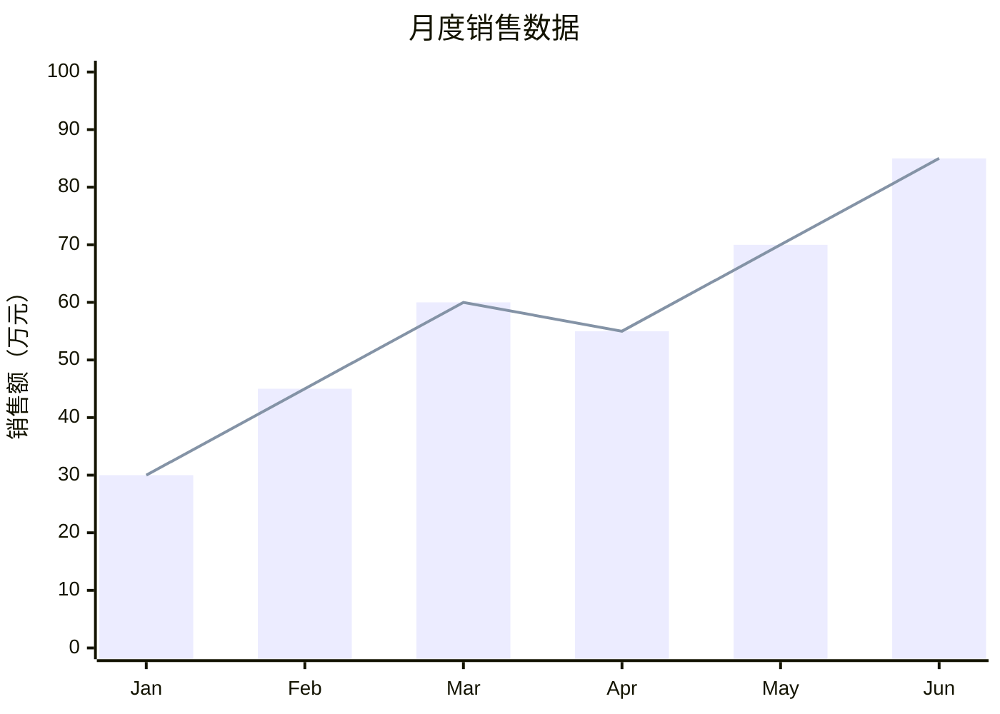
```mermaid
xychart-beta
    title "月度销售数据"
    x-axis [Jan, Feb, Mar, Apr, May, Jun]
    y-axis "销售额（万元）" 0 --> 100
    bar [30, 45, 60, 55, 70, 85]
    line [30, 45, 60, 55, 70, 85]
```

**语法要素：**
| 元素 | 说明 |
|------|------|
| `xychart-beta` | 声明（可加 `horizontal`） |
| `title "标题"` | 标题 |
| `x-axis [cat1, cat2, ...]` | X 轴分类 |
| `x-axis "title" min --> max` | X 轴数值范围 |
| `y-axis "title" min --> max` | Y 轴范围 |
| `bar [数据]` | 柱状图数据 |
| `line [数据]` | 折线图数据 |

**推荐尺寸：** `-w 800 -H 600`

---

### 13. Block Diagram（块图）

**使用场景：** 系统架构、组件关系、层级结构

**语法模板：**
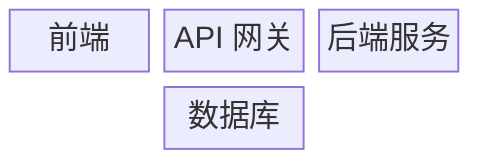
```mermaid
block-beta
    columns 3
    A["前端"] B["API 网关"] C["后端服务"]
    space D["数据库"] space
```

**关键语法：**
| 语法 | 说明 |
|------|------|
| `columns N` | 设置列数 |
| `A["文字"]` | 普通块 |
| `A("文字")` | 圆角块 |
| `A(("文字"))` | 圆形块 |
| `A{{"文字"}}` | 六边形块 |
| `space` | 空占位 |
| `A --> B` | 连线 |
| `A:N` | 块跨 N 列 |

**推荐尺寸：** `-w 800 -H 600`

**⚠️ 实验性功能**

---

### 14. Quadrant Chart（象限图）

**使用场景：** 优先级矩阵、SWOT 分析、竞品对比

**语法模板：**
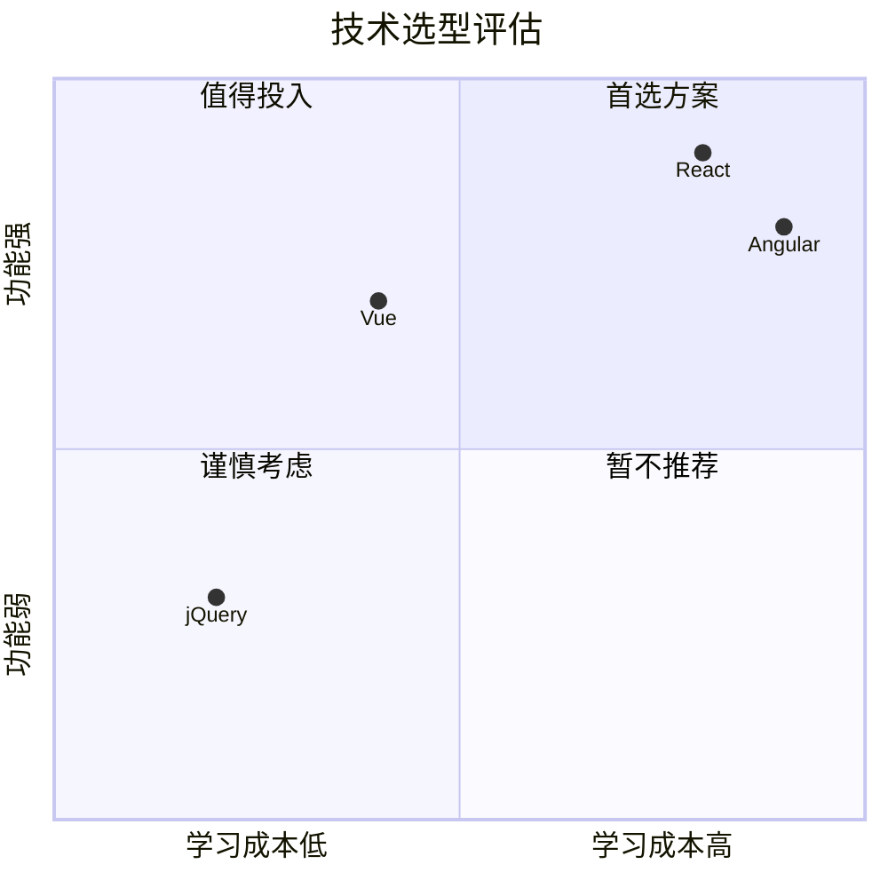
```mermaid
quadrantChart
    title 技术选型评估
    x-axis 学习成本低 --> 学习成本高
    y-axis 功能弱 --> 功能强
    quadrant-1 首选方案
    quadrant-2 值得投入
    quadrant-3 谨慎考虑
    quadrant-4 暂不推荐
    React: [0.8, 0.9]
    Vue: [0.4, 0.7]
    jQuery: [0.2, 0.3]
    Angular: [0.9, 0.8]
```

**关键语法：**
- 坐标范围 0~1
- `quadrant-1` 到 `quadrant-4`：四个象限的标签（1=右上，2=左上，3=左下，4=右下）

**推荐尺寸：** `-w 700 -H 700`（正方形）

---

### 15. User Journey（用户旅程图）

**使用场景：** 用户体验分析、服务蓝图、流程痛点

**语法模板：**
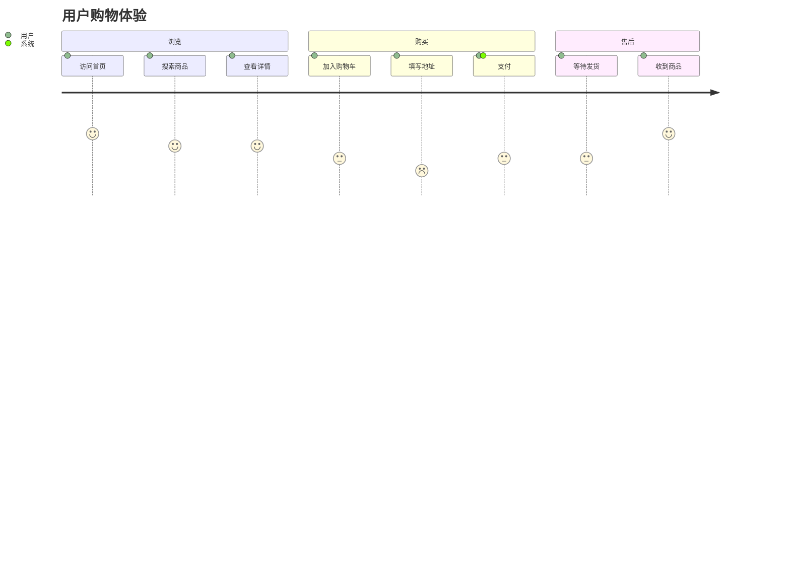
```mermaid
journey
    title 用户购物体验
    section 浏览
        访问首页: 5: 用户
        搜索商品: 4: 用户
        查看详情: 4: 用户
    section 购买
        加入购物车: 3: 用户
        填写地址: 2: 用户
        支付: 3: 用户, 系统
    section 售后
        等待发货: 3: 用户
        收到商品: 5: 用户
```

**关键语法：**
- `任务名: 评分: 参与者` （评分 1-5，5 最好）
- `section` 分段

**推荐尺寸：** `-w 1000 -H 500`

---

## 主题配置

Mermaid 内置 4 种主题，通过 `mmdc -t <theme>` 或 frontmatter 设置：

| 主题 | 说明 | 适用场景 |
|------|------|----------|
| `default` | 默认蓝色调 | 通用 |
| `forest` | 绿色调 | 自然/环保主题 |
| `dark` | 暗色背景 | 暗色文档/演示 |
| `neutral` | 黑白灰 | 正式文档/打印 |

**Frontmatter 方式设置主题：**
```mermaid
---
config:
  theme: forest
---
flowchart TD
    A --> B
```

---

## 复杂图表拆分策略

| 情况 | 策略 |
|------|------|
| 流程图节点 >15 | 按阶段拆成 2-3 张子流程图 |
| 时序图参与者 >8 | 按场景拆分（如登录流程、数据流程） |
| 类图类 >10 | 按模块/包拆分 |
| ER 图实体 >8 | 按业务域拆分 |
| 思维导图 >4 层 | 按主分支拆成独立思维导图 |

---

## 快速参考：mmdc 常用命令

```bash
# 基本 PNG 生成
mmdc -i diagram.mmd -o diagram.png

# 指定尺寸和背景
mmdc -i diagram.mmd -o diagram.png -w 1000 -H 700 -b white

# 透明背景（适合嵌入深色页面）
mmdc -i diagram.mmd -o diagram.png -b transparent

# 使用深色主题
mmdc -i diagram.mmd -o diagram.png -t dark -b "#1a1a2e"

# 生成 SVG（矢量，可缩放）
mmdc -i diagram.mmd -o diagram.svg

# 生成 PDF
mmdc -i diagram.mmd -o diagram.pdf -f

# 使用配置文件
mmdc -i diagram.mmd -o diagram.png -c config.json

# 高清输出（2 倍缩放）
mmdc -i diagram.mmd -o diagram.png -s 2
```

**配置文件示例（config.json）：**
```json
{
  "theme": "default",
  "flowchart": {
    "curve": "basis",
    "padding": 15
  },
  "sequence": {
    "actorMargin": 50,
    "messageMargin": 35
  }
}
```

---

## ⚠️ 通用注意事项

1. **保留字 `end`：** 在 Flowchart 和 Sequence Diagram 中，`end` 可能破坏解析，用引号包裹 `"end"` 或 `(end)` / `[end]`
2. **特殊字符：** 节点文字含 `(){}[]` 等符号时需用引号
3. **中文支持：** 标签文字支持中文，但节点 ID 建议用英文/数字
4. **空行：** 某些图表类型对空行敏感，保持代码紧凑
5. **缩进：** Mindmap 和 Timeline 严格依赖缩进，必须保持一致
6. **版本差异：** Sankey、XY Chart、Block Diagram 等标记为 `-beta`，语法可能变化
