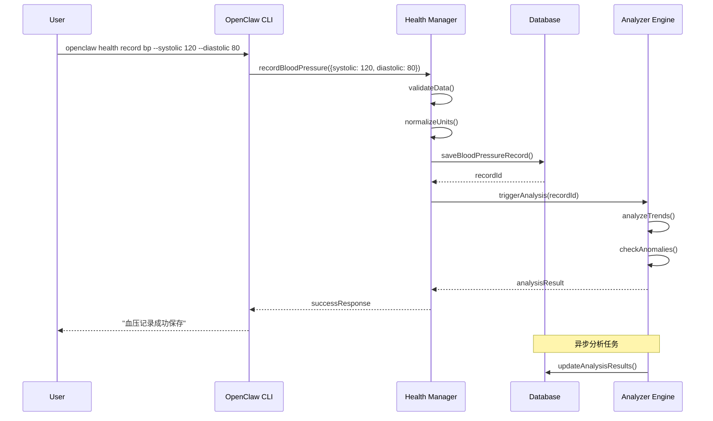
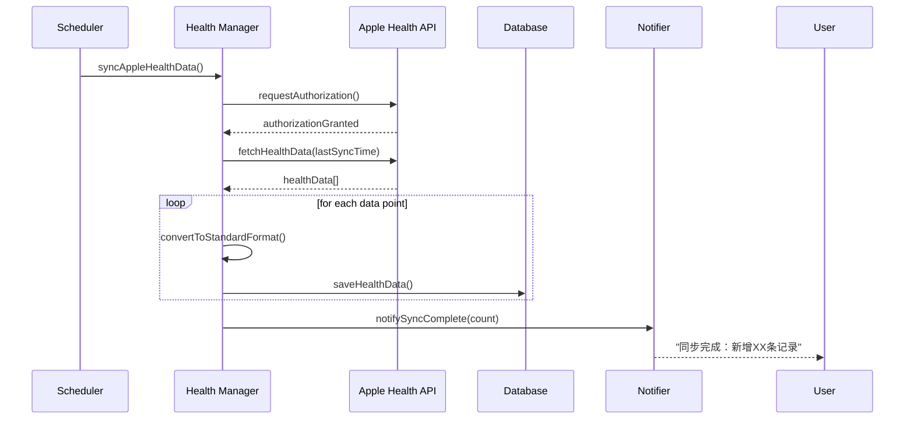
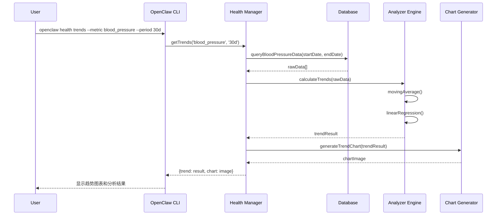
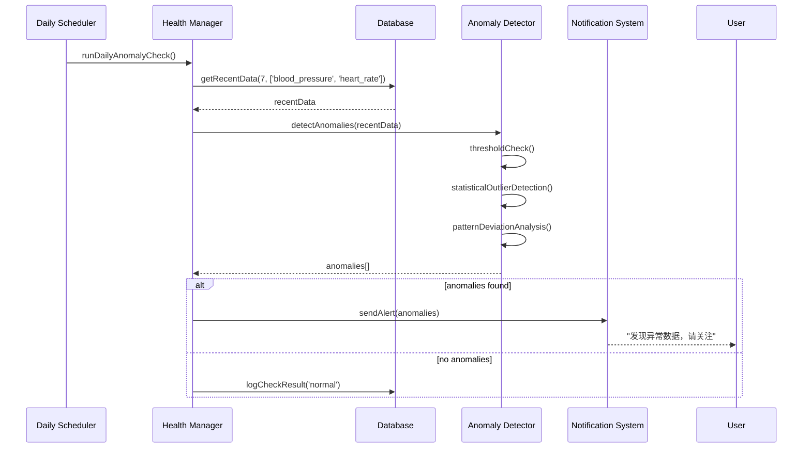
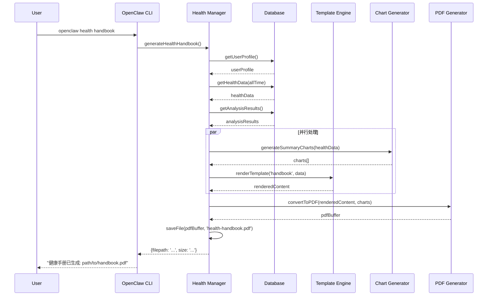
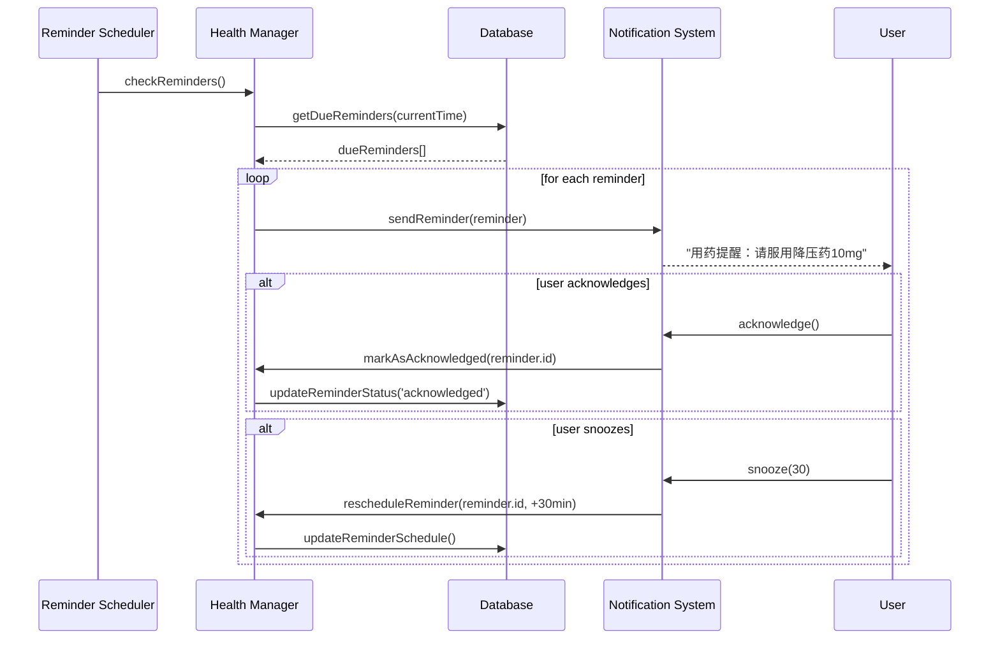
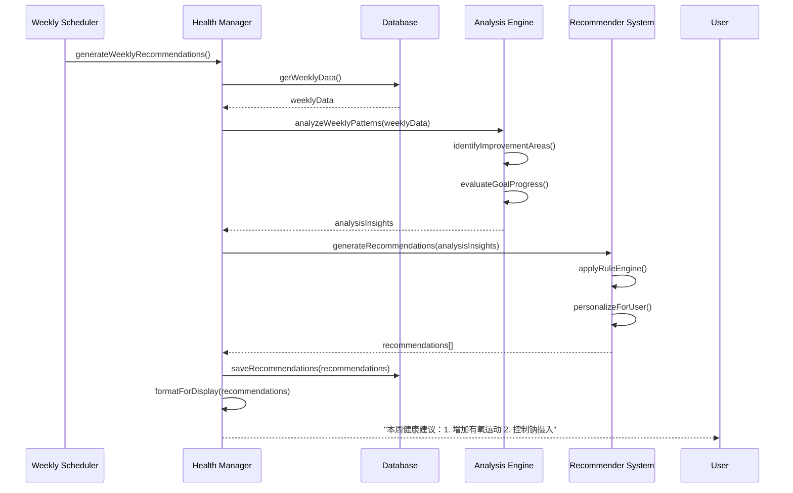
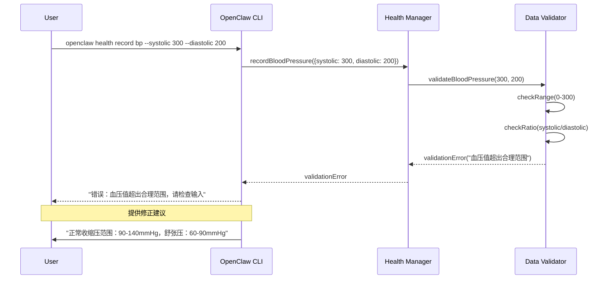

# 核心交互序列图

## 1. 数据录入序列图

### 1.1 手动录入血压数据



### 1.2 Apple Health 数据同步



## 2. 数据分析序列图

### 2.1 趋势分析请求



### 2.2 异常检测流程



## 3. 报告生成序列图

### 3.1 健康手册生成



## 4. 提醒系统序列图

### 4.1 用药提醒触发



### 4.2 智能建议生成



## 5. 错误处理序列图

### 5.1 数据验证失败



## 交互状态说明

### 关键状态转移

1. **数据录入状态**:
   ```
   IDLE → VALIDATING → PROCESSING → SAVING → ANALYZING → COMPLETE
           ↓
         ERROR → RETRY/CANCEL
   ```

2. **分析任务状态**:
   ```
   PENDING → FETCHING_DATA → ANALYZING → GENERATING_OUTPUT → COMPLETE
               ↓
             TIMEOUT → RETRY/ABORT
   ```

3. **提醒生命周期**:
   ```
   SCHEDULED → DUE → SENT → ACKNOWLEDGED/SNOOZED → COMPLETED
       ↓
     CANCELLED/EXPIRED
   ```

### 超时和重试机制

- **数据同步**: 30秒超时，最多重试3次
- **分析任务**: 5分钟超时，可后台继续
- **文件生成**: 2分钟超时，支持断点续传
- **API调用**: 15秒超时，指数退避重试

---

这些序列图展示了 Health Manager Skill 的核心交互流程，可以作为开发实现时的参考。