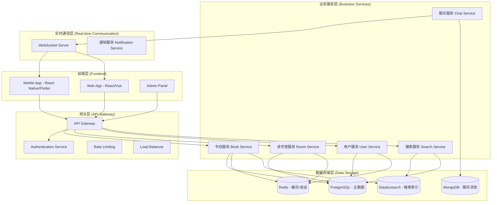

# 系统架构设计

## 总体架构图



## 模块划分与职责

### 1. 书目服务 (Book Service)
**职责**：
- 书目的 CRUD 操作
- 书目分类、标签管理
- 封面图上传与存储
- 书目统计（阅读人数、讨论热度）

**接口示例**：
- `GET /api/books` - 获取书目列表
- `POST /api/books` - 创建新书目
- `GET /api/books/:id` - 获取书目详情
- `GET /api/books/search` - 搜索书目

### 2. 读书室服务 (Room Service)
**职责**：
- 读书室的创建、加入、离开
- 房间状态管理（开放、进行中、已结束）
- 成员管理（主持人、普通成员）
- 阅读进度同步

**接口示例**：
- `POST /api/rooms` - 创建读书室
- `GET /api/rooms/available` - 获取可加入的读书室
- `POST /api/rooms/:id/join` - 加入读书室
- `POST /api/rooms/:id/leave` - 离开读书室
- `PUT /api/rooms/:id/progress` - 更新阅读进度

### 3. 聊天服务 (Chat Service)
**职责**：
- 实时消息收发
- 消息历史存储
- 表情、引用、富文本支持
- 敏感词过滤

**接口示例**：
- WebSocket 连接建立
- `message` 事件 - 发送消息
- `history` 事件 - 获取历史消息
- `typing` 事件 - 输入状态指示

### 4. 用户服务 (User Service)
**职责**：
- 用户注册、登录、资料管理
- 社交关系（关注、好友）
- 阅读历史统计
- 通知偏好设置

### 5. 搜索服务 (Search Service)
**职责**：
- 全文搜索（书目、读书室、用户）
- 搜索建议
- 热门搜索词统计

## 数据流说明

### 1. 创建读书室流程
```
用户 → API Gateway → Auth → Room Service → PostgreSQL
                                ↓
                          Redis（缓存房间状态）
                                ↓
                          WebSocket Server（通知在线用户）
```

### 2. 实时聊天流程
```
用户A → WebSocket → Chat Service → MongoDB（存储消息）
                                      ↓
                                WebSocket → 用户B（实时推送）
                                      ↓
                                Redis（在线状态管理）
```

### 3. 书目搜索流程
```
用户 → API Gateway → Search Service → Elasticsearch
                                      ↓
                                返回排序结果 → 用户
```

## 部署架构

### 开发环境
- 单节点 Docker Compose
- 本地数据库

### 生产环境
- Kubernetes 集群
- 多区域部署
- CDN 静态资源分发
- 监控与日志（Prometheus + Grafana + ELK）

## 安全考虑
1. **认证授权**：JWT + OAuth 2.0
2. **数据加密**：HTTPS/TLS 全站加密
3. **输入验证**：严格的请求参数校验
4. **防刷机制**：IP限流、用户行为分析
5. **内容安全**：敏感词过滤、图片鉴黄

---

*架构设计遵循微服务原则，各服务可独立开发、部署、扩展*