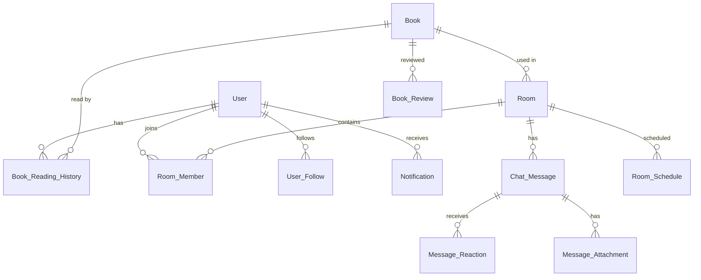

# 数据模型设计

## 核心实体关系图



## 1. 用户 (User)

```typescript
interface User {
  id: string; // UUID
  username: string; // 用户名，唯一
  email: string; // 邮箱，唯一
  displayName: string; // 显示名称
  avatarUrl?: string; // 头像URL
  bio?: string; // 个人简介
  readingStats: {
    totalBooks: number; // 已读书籍数
    totalPages: number; // 总阅读页数
    readingStreak: number; // 连续阅读天数
  };
  settings: {
    notifications: {
      email: boolean;
      push: boolean;
      roomActivity: boolean;
    };
    privacy: {
      showReadingHistory: boolean; // 是否公开阅读历史
      showOnlineStatus: boolean; // 是否显示在线状态
    };
  };
  createdAt: Date;
  updatedAt: Date;
  lastLoginAt?: Date;
}
```

## 2. 书目 (Book)

```typescript
interface Book {
  id: string; // UUID
  isbn?: string; // ISBN号（可选）
  title: string; // 书名
  subtitle?: string; // 副标题
  author: string; // 作者
  translators?: string[]; // 译者数组
  publisher: string; // 出版社
  publishDate?: Date; // 出版日期
  language: string; // 语言，如 "zh-CN", "en-US"
  
  // 分类信息
  categories: string[]; // 分类，如 ["文学", "小说", "科幻"]
  tags: string[]; // 标签，如 ["经典", "悬疑", "成长"]
  
  // 描述信息
  description: string; // 简介
  coverImageUrl: string; // 封面图URL
  pageCount: number; // 总页数
  
  // 统计信息
  stats: {
    totalReaders: number; // 阅读总人数
    activeRooms: number; // 进行中的读书室数量
    totalDiscussions: number; // 讨论总数
    averageRating?: number; // 平均评分（1-5）
  };
  
  // 元数据
  metadata: {
    source: 'manual' | 'douban' | 'openlibrary'; // 数据来源
    externalId?: string; // 外部ID（如豆瓣ID）
    lastSyncAt?: Date; // 最后同步时间
  };
  
  createdAt: Date;
  updatedAt: Date;
  createdBy: string; // User ID
}
```

## 3. 读书室 (Room)

```typescript
interface Room {
  id: string; // UUID
  bookId: string; // 关联书目ID
  title: string; // 读书室名称（可自定义）
  description?: string; // 读书室描述
  
  // 时间设置
  schedule: {
    startTime: Date; // 开始时间
    endTime: Date; // 结束时间（可选，可为长期房间）
    recurrence?: 'none' | 'daily' | 'weekly' | 'monthly'; // 重复周期
  };
  
  // 成员设置
  memberSettings: {
    maxMembers: number; // 最大成员数（0为无限制）
    isPublic: boolean; // 是否公开（公开可被发现，私密需邀请）
    joinApproval: boolean; // 是否需要批准加入
  };
  
  // 阅读设置
  readingSettings: {
    pace: 'slow' | 'moderate' | 'fast' | 'custom'; // 阅读节奏
    pagesPerDay?: number; // 自定义每日页数
    checkpointFrequency: 'daily' | 'weekly' | 'byChapter'; // 检查点频率
  };
  
  // 状态
  status: 'scheduled' | 'active' | 'paused' | 'completed' | 'cancelled';
  currentProgress: {
    currentPage: number; // 当前阅读页码
    lastUpdated: Date; // 最后更新时间
    lastUpdatedBy: string; // 最后更新者User ID
  };
  
  // 统计
  stats: {
    totalMessages: number; // 总消息数
    activeMembers: number; // 当前活跃成员数
    averageParticipation: number; // 平均参与度（0-1）
  };
  
  createdAt: Date;
  updatedAt: Date;
  createdBy: string; // 创建者User ID
}
```

## 4. 房间成员 (RoomMember)

```typescript
interface RoomMember {
  id: string; // UUID
  roomId: string; // 房间ID
  userId: string; // 用户ID
  role: 'host' | 'co-host' | 'member' | 'guest'; // 角色
  
  // 阅读进度
  personalProgress: {
    currentPage: number; // 个人阅读进度
    lastReadAt: Date; // 最后阅读时间
    totalReadingTime: number; // 总阅读时长（分钟）
    highlights: Array<{
      page: number;
      text: string;
      note?: string;
      createdAt: Date;
    }>;
  };
  
  // 参与统计
  participation: {
    messageCount: number; // 发送消息数
    lastActiveAt: Date; // 最后活跃时间
    attendanceRate: number; // 出勤率（0-1）
  };
  
  joinedAt: Date; // 加入时间
  leftAt?: Date; // 离开时间（如果已离开）
}
```

## 5. 聊天消息 (ChatMessage)

```typescript
interface ChatMessage {
  id: string; // UUID
  roomId: string; // 房间ID
  userId: string; // 发送者ID
  parentMessageId?: string; // 回复的消息ID（支持线程）
  
  // 内容
  content: {
    type: 'text' | 'image' | 'highlight' | 'progress_update' | 'system';
    text?: string; // 文本内容（对于text类型）
    metadata?: {
      // 对于highlight类型
      bookId?: string;
      page?: number;
      highlightedText?: string;
      note?: string;
      
      // 对于progress_update类型
      oldPage?: number;
      newPage?: number;
      
      // 对于image类型
      imageUrl?: string;
      altText?: string;
    };
  };
  
  // 互动
  reactions: Array<{
    emoji: string;
    userIds: string[]; // 反应的用户ID数组
  }>;
  
  // 阅读状态（用于私密消息或小范围）
  readBy: string[]; // 已读用户ID数组
  
  createdAt: Date;
  updatedAt?: Date;
  deletedAt?: Date; // 软删除
}
```

## 6. 阅读历史 (BookReadingHistory)

```typescript
interface BookReadingHistory {
  id: string; // UUID
  userId: string; // 用户ID
  bookId: string; // 书籍ID
  
  // 阅读状态
  status: 'want_to_read' | 'reading' | 'completed' | 'dropped';
  
  // 进度跟踪
  progress: {
    currentPage: number;
    startDate?: Date; // 开始阅读日期
    finishDate?: Date; // 完成阅读日期
    totalReadingTime: number; // 总阅读时长（分钟）
  };
  
  // 个人笔记
  personalNotes?: Array<{
    page: number;
    note: string;
    createdAt: Date;
  }>;
  
  // 评分与评价
  rating?: number; // 1-5分
  review?: string; // 详细评价
  
  lastUpdated: Date;
}
```

## 7. 通知 (Notification)

```typescript
interface Notification {
  id: string; // UUID
  userId: string; // 接收用户ID
  type: 'room_invite' | 'room_starting' | 'new_message' | 'progress_milestone' | 'system';
  
  // 内容
  title: string;
  body: string;
  data?: Record<string, any>; // 附加数据，如roomId, bookId等
  
  // 状态
  status: 'unread' | 'read' | 'dismissed';
  priority: 'low' | 'normal' | 'high';
  
  // 发送与接收
  sentAt: Date;
  readAt?: Date;
  expiresAt?: Date; // 过期时间（用于临时通知）
  
  // 动作（可点击执行的动作）
  actions?: Array<{
    label: string;
    action: string; // 'join_room', 'view_message', 'dismiss'
    data?: Record<string, any>;
  }>;
}
```

## 数据库表设计摘要

| 表名 | 主存储 | 用途 | 索引建议 |
|------|--------|------|----------|
| users | PostgreSQL | 用户基本信息 | username, email |
| books | PostgreSQL | 书目信息 | title, author, categories |
| rooms | PostgreSQL | 读书室信息 | bookId, status, schedule.startTime |
| room_members | PostgreSQL | 房间成员关系 | roomId, userId, role |
| chat_messages | MongoDB | 聊天消息（高写入） | roomId, createdAt |
| book_reading_history | PostgreSQL | 阅读历史 | userId, bookId, status |
| notifications | PostgreSQL | 用户通知 | userId, status, sentAt |
| user_follows | PostgreSQL | 用户关注关系 | followerId, followeeId |

## 数据迁移考虑

1. **版本控制**：所有模型需支持schema版本迁移
2. **数据归档**：历史聊天消息可归档到冷存储
3. **数据清理**：设置合理的保留策略（如：已完成房间数据保留180天）
4. **备份策略**：每日全量备份 + 实时增量备份

---

*数据模型设计支持业务扩展，后续可添加：阅读挑战、成就系统、虚拟书架等功能*