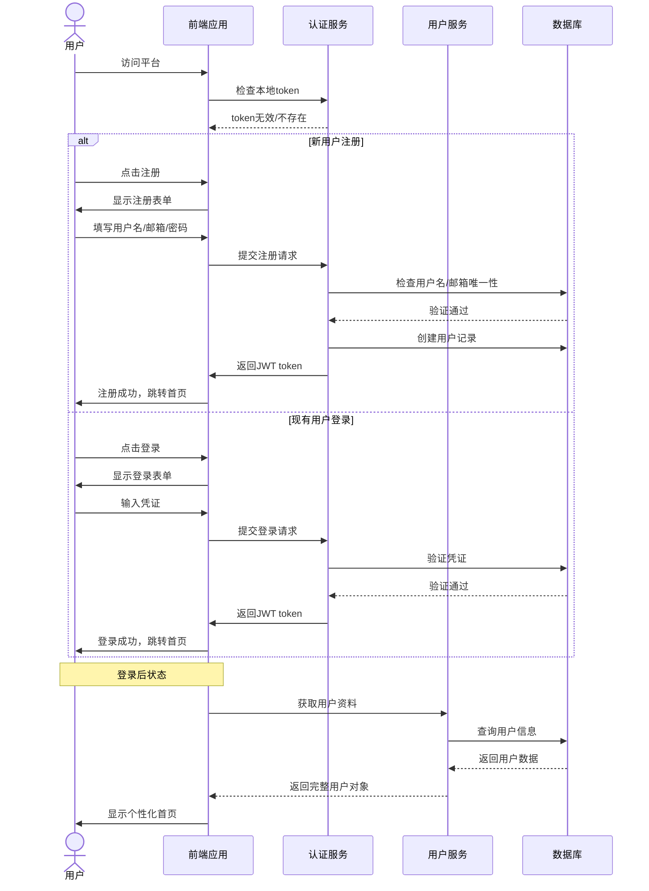
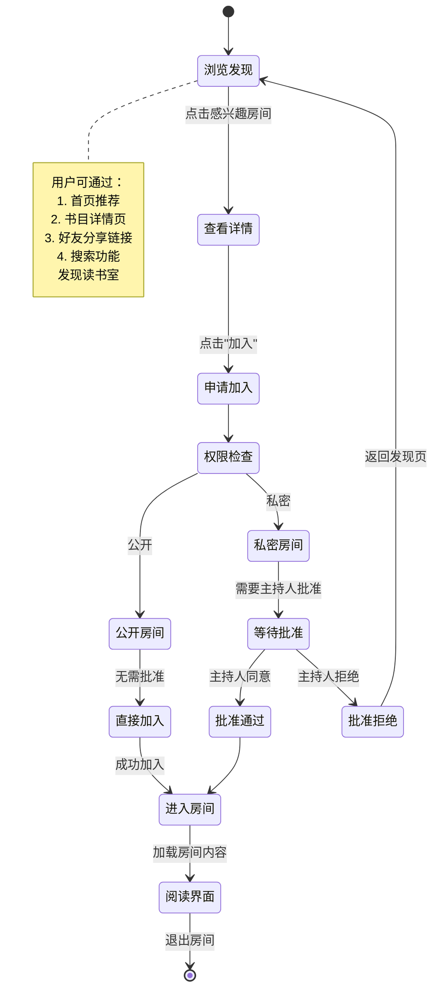
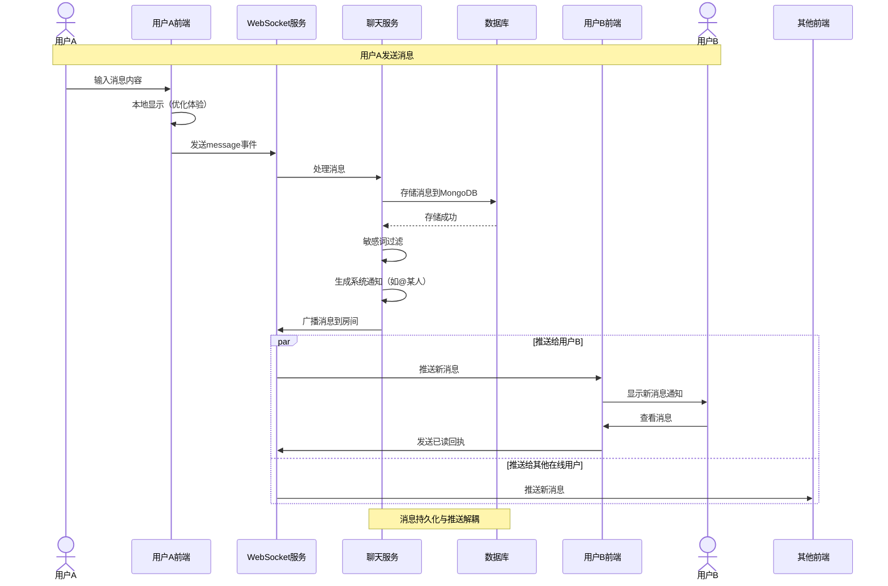
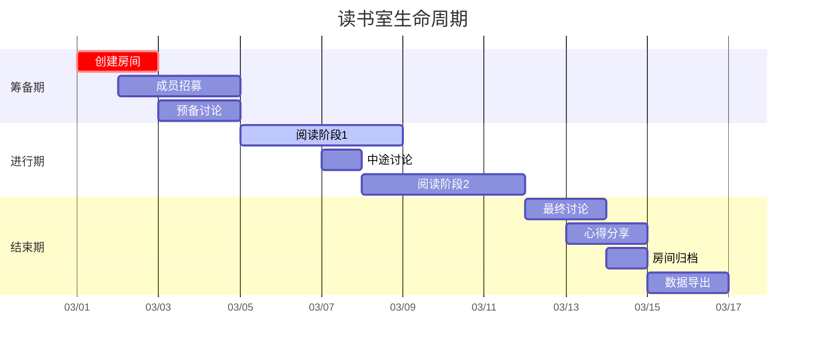
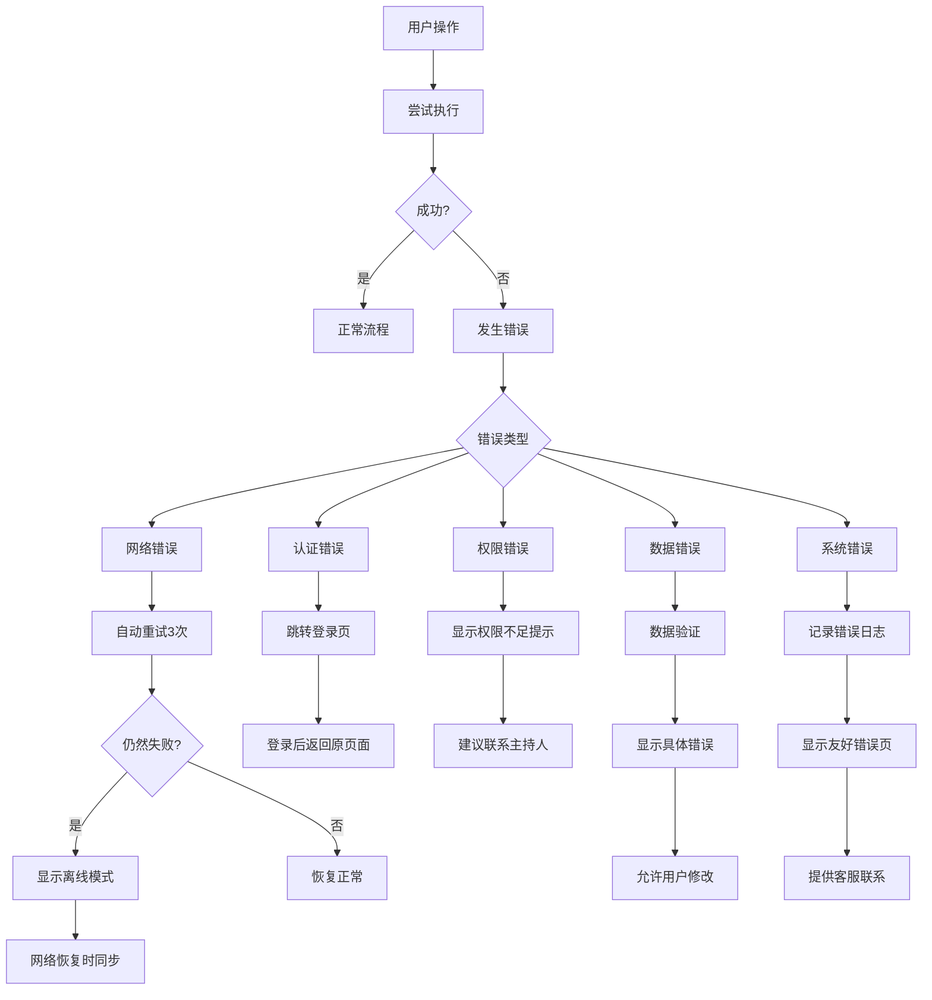

# 核心交互流程图

## 1. 用户注册与登录流程



## 2. 创建读书室流程

```mermaid
flowchart TD
    Start[用户点击"创建读书室"] --> Step1{选择书目}
    
    Step1 --> Step1a[搜索书目]
    Step1a --> Step1b[选择已有书目]
    Step1 --> Step1c[创建新书目]
    
    Step1b --> Step2
    Step1c --> Step2[填写读书室详情]
    
    Step2 --> Step3[设置时间安排]
    Step3 --> Step4[配置成员权限]
    Step4 --> Step5[设置阅读节奏]
    
    Step5 --> Step6{预览确认}
    Step6 -->|确认创建| Step7[调用API创建房间]
    Step6 -->|返回修改| Step2
    
    Step7 --> Step8[创建成功]
    Step8 --> Step9[生成邀请链接]
    Step9 --> Step10[分享给好友]
    
    Step10 --> End[进入读书室管理界面]
    
    subgraph Step1 [书目选择]
        direction LR
        S1a[搜索] --> S1b[浏览分类] --> S1c[热门推荐]
    end
    
    subgraph Step2 [房间详情]
        direction LR
        S2a[房间名称] --> S2b[房间描述] --> S2c[封面图]
    end
    
    subgraph Step3 [时间安排]
        direction LR
        S3a[开始时间] --> S3b[结束时间] --> S3c[重复设置]
    end
```

## 3. 加入读书室流程



## 4. 读书室内交流流程



## 5. 阅读进度同步流程

```mermaid
graph TD
    A[用户开始阅读] --> B[前端记录阅读时间]
    B --> C{到达进度同步点}
    
    C -->|是| D[更新本地进度]
    D --> E[检查网络连接]
    
    E --> F{在线}
    F -->|是| G[立即同步到服务器]
    F -->|否| H[本地缓存等待]
    
    G --> I[服务器接收进度]
    I --> J[更新房间总进度]
    J --> K[广播进度更新]
    K --> L[其他成员收到更新]
    
    H --> M[用户恢复网络]
    M --> N[同步缓存进度]
    N --> G
    
    subgraph "进度同步策略"
        P1[每阅读5页同步一次]
        P2[每5分钟同步一次]
        P3[章节结束时同步]
        P4[手动点击"更新进度"]
    end
    
    C --> P1
    C --> P2
    C --> P3
    C --> P4
```

## 6. 房间生命周期管理



## 7. 异常处理流程



## 关键交互原则

### 1. 实时反馈原则
- 所有用户操作应在100ms内得到视觉反馈
- 网络请求需显示加载状态
- 成功/失败有明确提示

### 2. 渐进式交互
- 复杂操作分步引导
- 提供默认值减少用户输入
- 支持撤销/重做

### 3. 上下文感知
- 根据用户角色显示不同界面
- 根据设备类型优化布局
- 根据网络状况调整功能

### 4. 无障碍设计
- 支持键盘导航
- 提供足够的颜色对比度
- 支持屏幕阅读器
- 文字大小可调整

---

*交互设计以用户体验为核心，确保流程直观、高效、愉悦*