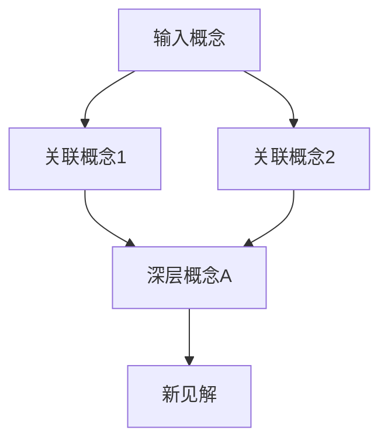

# Same-Idea Skill 架构与用户体验设计文档

## 1. 设计审查与现状分析

### 1.1 现有设计优势
- **清晰的触发场景**：明确界定使用时机（寻找共鸣、发现关联）
- **结构化的工作流程**：四步流程（解析→搜索→匹配→输出）逻辑清晰
- **多知识库支持**：已支持Logseq和Obsidian两大主流知识管理工具
- **实用的输出格式**：包含来源、共鸣点解释，便于理解

### 1.2 当前设计不足
- **搜索技术简单**：依赖grep/ripgrep关键词匹配，缺乏语义理解
- **交互流程单向**：用户输入→输出结果，缺少中间交互和参数调节
- **匹配标准模糊**："强/中/弱匹配"定义不够具体，缺乏量化标准
- **结果价值有限**：仅返回表面匹配，缺少深度关联发现
- **扩展性不足**：硬编码知识库路径，不支持动态添加新知识源

## 2. 改进设计目标

### 2.1 核心目标
1. **提升搜索结果价值**：从关键词匹配升级到概念关联发现
2. **优化用户体验**：提供更自然、灵活的交互方式
3. **增强扩展性**：支持多种知识库类型和搜索后端
4. **提供个性化**：根据用户使用习惯和历史优化推荐

### 2.2 成功指标
- **准确性**：返回的"共鸣"确实与输入思想相关
- **惊喜度**：发现用户未意识到的深层关联
- **实用性**：帮助用户连接知识碎片，形成新见解
- **效率**：在合理时间内返回有价值结果

## 3. 系统架构设计

### 3.1 总体架构
```
┌─────────────────┐    ┌─────────────────┐    ┌─────────────────┐
│  用户输入接口   │───▶│  语义解析层     │───▶│  知识库适配层   │
└─────────────────┘    └─────────────────┘    └─────────────────┘
         │                       │                       │
         ▼                       ▼                       ▼
┌─────────────────┐    ┌─────────────────┐    ┌─────────────────┐
│  交互控制层     │◀──▶│  关联发现引擎   │◀──▶│  搜索执行层     │
└─────────────────┘    └─────────────────┘    └─────────────────┘
         │                       │                       │
         ▼                       ▼                       ▼
┌─────────────────┐    ┌─────────────────┐    ┌─────────────────┘
│  结果格式化层   │    │  反馈学习模块   │    │
└─────────────────┘    └─────────────────┘    │
         │                                    │
         ▼                                    ▼
┌─────────────────┐                  ┌─────────────────┐
│  输出渲染层     │                  │  用户画像更新   │
└─────────────────┘                  └─────────────────┘
```

### 3.2 核心模块设计

#### 3.2.1 语义解析层 (Semantic Parser)
- **功能**：从用户输入提取概念、主题、情感倾向
- **技术方案**：
  - 第一阶段：基于规则的提取（关键词、实体识别）
  - 第二阶段：集成LLM进行深层语义分析（可选）
  - 输出：结构化概念表示（concepts, themes, sentiment）

#### 3.2.2 知识库适配层 (Knowledge Base Adapter)
- **插件化架构**：支持不同知识库类型
- **内置适配器**：
  - LogseqAdapter：处理Logseq图数据库结构
  - ObsidianAdapter：处理Obsidian Markdown文件
  - NotionAdapter（未来）：通过API访问Notion
  - FeishuDocAdapter（未来）：访问飞书文档
- **统一查询接口**：抽象化不同知识源的查询方式

#### 3.2.3 关联发现引擎 (Association Discovery Engine)
- **多层次匹配策略**：
  1. **表层匹配**：关键词、短语匹配（现有方案）
  2. **概念匹配**：同义词、相关概念匹配
  3. **主题匹配**：主题模型、LDA分析
  4. **网络关联**：基于知识图谱的关联发现
- **相关性评分**：综合多个维度的匹配度评分

#### 3.2.4 交互控制层 (Interaction Controller)
- **对话式交互**：支持多轮对话精化搜索
- **参数调节**：允许用户设置搜索范围、匹配精度等
- **探索引导**：提供相关概念探索路径

#### 3.2.5 反馈学习模块 (Feedback Learning)
- **显式反馈**：用户对结果进行评分（相关/不相关）
- **隐式反馈**：分析用户后续行为（点击、阅读时间）
- **个性化模型**：基于反馈优化用户专属的关联发现模型

## 4. 用户体验流程设计

### 4.1 标准流程（无参数）
```
用户：输入一个想法/引用
系统：自动搜索 → 显示Top 5共鸣结果
```

### 4.2 交互式流程（推荐）
```
用户：输入想法
系统：解析概念后询问参数
      "您希望：
      1. 快速搜索（默认，30秒内）
      2. 深度探索（可能需要2-3分钟）
      3. 仅搜索最近3个月的内容
      4. 自定义搜索范围"
用户：选择选项
系统：执行相应搜索 → 展示结果
```

### 4.3 探索式流程
```
用户：输入初始想法
系统：返回结果，并提示：
      "发现这些相关概念：[A, B, C]
      您想深入探索哪一个？"
用户：选择概念A
系统：展示与A相关的内容，形成概念网络
```

## 5. 搜索结果价值提升方案

### 5.1 关联类型扩展
- **直接共鸣**：表达相同或相似思想（现有）
- **对立观点**：提供不同视角的思考
- **历史演进**：展示该思想的发展脉络
- **应用实例**：提供实际应用案例
- **拓展阅读**：推荐相关书籍、文章

### 5.2 结果排序算法
```
总分 = 语义相似度 × 0.4
     + 概念覆盖度 × 0.2
     + 来源可信度 × 0.1
     + 时间新鲜度 × 0.1
     + 用户偏好 × 0.2
```

### 5.3 结果丰富化
- **上下文片段**：不只是匹配行，提供前后文
- **概念标注**：标记出核心概念在文本中的位置
- **关系可视化**：生成简单的概念关系图
- **行动建议**：基于发现的知识关联提出行动建议

## 6. 输出格式模板设计

### 6.1 基础模板（兼容现有）
```markdown
## 输入想法
[用户输入]

## 共鸣发现

### 1. [匹配标题/概念]
> "[匹配内容]"

**匹配度**：⭐️⭐️⭐️⭐️☆ (85%)
**来源**：[书籍/文章] - [作者]
**类型**：[直接共鸣/对立观点/应用实例]
**共鸣点**：[解释为什么相关]
**相关概念**：[A, B, C]（点击可探索）

---
```

### 6.2 增强模板（可选）
```markdown
## 思想探索报告

### 核心概念
- **主要概念**：[概念1], [概念2], [概念3]
- **情感倾向**：[积极/中性/消极]
- **知识领域**：[哲学/心理学/商业/...]

### 发现路径


### 推荐探索
1. **阅读**：[相关书籍/文章推荐]
2. **实践**：[行动建议]
3. **关联**：[值得探索的相邻领域]

### 结果详情
[各匹配项的详细展示]
```

### 6.3 交互式模板
```markdown
## 共鸣探索 (交互模式)

**输入**: "[用户输入]"

### 📊 概览
发现 **5** 个强相关匹配，涉及 **3** 个主要概念。

### 🔍 按相关性排序
1. [结果1] (92%匹配) [👍|👎|💾]
2. [结果2] (85%匹配) [👍|👎|💾]
...

### 🎯 按概念分组
- **概念A**：[结果1, 结果3]
- **概念B**：[结果2, 结果5]
- **概念C**：[结果4]

### 💡 下一步建议
- 输入 `深入 [概念A]` 探索该概念
- 输入 `比较 [概念A] 与 [概念B]`
- 输入 `时间线` 查看该思想的演进
- 输入 `保存` 将此探索保存到知识库
```

## 7. 扩展性设计

### 7.1 知识库类型扩展
```python
class KnowledgeBaseAdapter(ABC):
    """知识库适配器抽象类"""
    
    @abstractmethod
    def search(self, query: SearchQuery) -> List[SearchResult]:
        pass
    
    @abstractmethod
    def get_metadata(self) -> KnowledgeBaseMetadata:
        pass
    
    @abstractmethod
    def supports_incremental_update(self) -> bool:
        pass
```

### 7.2 配置管理
```yaml
# config.yaml
knowledge_bases:
  logseq:
    enabled: true
    path: ~/Library/Mobile Documents/iCloud~com~logseq~logseq/Documents/
    priority: 1
    
  obsidian:
    enabled: true
    path: ~/Library/Mobile Documents/iCloud~md~obsidian/Documents/
    priority: 2
    
  notion:
    enabled: false
    api_token: ""
    database_id: ""
    priority: 3

search:
  default_timeout: 30
  max_results: 10
  enable_semantic_search: true
  
ui:
  interactive_mode: true
  default_template: "enhanced"
  enable_feedback: true
```

### 7.3 插件系统
- **搜索策略插件**：添加新的匹配算法
- **结果渲染插件**：自定义输出格式
- **数据源插件**：支持新的知识库类型
- **分析插件**：添加新的分析维度

## 8. 实施路线图

### 阶段1：核心优化（1-2周）
1. 改进关键词提取算法（加入同义词库）
2. 实现基础交互模式（快速/深度搜索选项）
3. 添加匹配度评分系统
4. 优化输出模板，增加元数据展示

### 阶段2：语义增强（2-3周）
1. 集成本地embedding模型（sentence-transformers）
2. 实现向量相似度搜索
3. 添加概念网络发现
4. 实现基础反馈机制

### 阶段3：扩展性与高级功能（3-4周）
1. 实现插件化架构
2. 添加Notion/Feishu支持
3. 实现个性化推荐
4. 添加可视化输出选项

### 阶段4：智能化（未来）
1. LLM深度分析集成
2. 主动知识发现
3. 跨用户匿名洞察聚合
4. 预测性关联建议

## 9. 技术选型建议

### 9.1 搜索与匹配
- **向量搜索**：sentence-transformers + FAISS/Chroma
- **关键词扩展**：Synonyms（中文同义词库）
- **主题建模**：Gensim LDA（轻量级）

### 9.2 NLP处理
- **基础NLP**：Jieba（中文分词），spaCy（英文）
- **实体识别**：自定义规则+少量标注数据
- **情感分析**：SnowNLP（中文情感分析）

### 9.3 存储与缓存
- **搜索结果缓存**：SQLite + Redis（可选）
- **用户画像**：JSON文件存储
- **配置管理**：YAML配置文件

### 9.4 交互界面
- **命令行界面**：Rich库（彩色输出、表格）
- **Web界面**：Streamlit/FastAPI（可选扩展）
- **API接口**：FastAPI提供RESTful API

## 10. 风险评估与缓解

### 10.1 技术风险
- **性能问题**：大知识库搜索慢
  - 缓解：索引预构建、增量更新、异步搜索
- **语义理解不准确**
  - 缓解：多算法组合、用户反馈校正

### 10.2 用户体验风险
- **结果不相关**：降低用户信任
  - 缓解：透明展示匹配依据、提供反馈渠道
- **交互过于复杂**
  - 缓解：渐进式复杂度、智能默认值

### 10.3 隐私风险
- **知识库内容暴露**
  - 缓解：本地处理、可选匿名化、明确隐私政策

## 11. 成功度量与迭代

### 11.1 定量指标
- **准确率**：用户评分≥4星的比例
- **响应时间**：P95搜索时间<目标值
- **使用频率**：日/周活跃用户数
- **探索深度**：平均交互轮数>1.5

### 11.2 定性指标
- **用户访谈**：定期收集深度反馈
- **案例研究**：记录成功使用故事
- **可用性测试**：新用户任务完成率

### 11.3 迭代机制
- **快速迭代**：每周发布小改进
- **A/B测试**：关键功能对比测试
- **反馈循环**：用户反馈→改进→验证闭环

---
*设计文档版本：1.0*
*创建日期：2026-03-08*
*设计目标：为same-idea技能提供系统化、可扩展的架构和优秀的用户体验*
