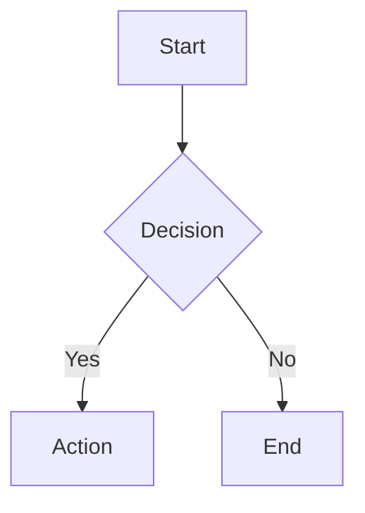

# Obsidian Writer

Write .md and .canvas files that render correctly in Obsidian. Output to the vault directory, synced via Git.

## Vault Location

Default: `~/obsidian-vault/` (configurable per request).

## Workflow

1. Write `.md` / `.canvas` files following specs below
2. Git commit + push (agent does this automatically)
3. User's Mac Mini pulls → syncs to iCloud → Obsidian reads

## Markdown — Obsidian-Specific Syntax

Standard Markdown (headings, bold, lists, code blocks) is assumed known. Only Obsidian extensions below:

### Properties (Frontmatter)

Must be the **very first thing** in the file:

```yaml
---
tags:
  - finance/macro
  - iran-war
aliases:
  - 伊朗战争概览
cssclasses:
  - wide-page
created: 2026-03-10
---
```

Reserved keys: `tags`, `aliases`, `cssclasses`, `publish`, `permalink`, `description`.

### Internal Links (Wikilinks)

```markdown
[[Note Name]]                    # link to note
[[Note Name|Display Text]]      # custom display
[[Note Name#Heading]]            # link to heading
[[Note Name#^block-id]]          # link to block
```

### Block References

Add `^block-id` at end of any paragraph/list item:

```markdown
This is an important paragraph. ^key-insight

- List item ^item-ref
```

Then link: `[[Note Name#^key-insight]]`

Block IDs: lowercase alphanumeric + dashes only.

### Embeds

```markdown
![[Note Name]]                   # embed entire note
![[Note Name#Heading]]           # embed section
![[image.png]]                   # embed image
![[image.png|300]]               # resize width 300px
![[image.png|300x200]]           # exact dimensions
![[audio.mp3]]                   # embed audio player
![[video.mp4]]                   # embed video player
![[document.pdf]]                # embed PDF
![[document.pdf#page=3]]         # embed specific page
```

Supported formats — see `references/file-formats.md`.

### Callouts

```markdown
> [!note] Optional Title
> Content with **Markdown** and [[wikilinks]].

> [!tip]- Foldable (collapsed by default)
> Hidden content.

> [!warning]+ Foldable (expanded by default)
> Shown content.
```

13 types: `note`, `abstract`/`summary`/`tldr`, `info`, `todo`, `tip`/`hint`/`important`, `success`/`check`/`done`, `question`/`help`/`faq`, `warning`/`caution`/`attention`, `failure`/`fail`/`missing`, `danger`/`error`, `bug`, `example`, `quote`/`cite`.

### Other Obsidian Extensions

```markdown
==highlighted text==             # highlight
%%hidden comment%%               # not rendered
- [ ] incomplete task            # task
- [x] completed task             # done task
$E = mc^2$                       # inline LaTeX
$$\int_0^\infty f(x)dx$$         # block LaTeX
This is a footnote[^1].         # footnote
[^1]: Footnote content.
```

### Tags

```markdown
#tag                             # simple tag
#parent/child                    # nested tag
```

Tags in body text or frontmatter. No spaces allowed.

### Mermaid Diagrams

````markdown

````

## Canvas — JSON Canvas Spec 1.0

Full spec: `references/canvas-spec.md`

### Quick Reference

```json
{
  "nodes": [
    {
      "id": "node1",
      "type": "text",
      "x": 0, "y": 0,
      "width": 400, "height": 200,
      "text": "# Title\n\nMarkdown content",
      "color": "4"
    },
    {
      "id": "node2",
      "type": "file",
      "x": 500, "y": 0,
      "width": 400, "height": 400,
      "file": "path/to/note.md",
      "subpath": "#heading"
    },
    {
      "id": "node3",
      "type": "link",
      "x": 0, "y": 300,
      "width": 400, "height": 300,
      "url": "https://example.com"
    },
    {
      "id": "group1",
      "type": "group",
      "x": -50, "y": -50,
      "width": 1000, "height": 500,
      "label": "Group Name",
      "color": "5"
    }
  ],
  "edges": [
    {
      "id": "edge1",
      "fromNode": "node1",
      "fromSide": "right",
      "toNode": "node2",
      "toSide": "left",
      "color": "1",
      "label": "relates to"
    }
  ]
}
```

Node types: `text`, `file`, `link`, `group`.
Colors: `"1"` red, `"2"` orange, `"3"` yellow, `"4"` green, `"5"` cyan, `"6"` purple, or hex `"#FF0000"`.
Edge endpoints: `fromEnd`/`toEnd` → `"none"` or `"arrow"` (toEnd defaults to `"arrow"`).
Sides: `top`, `right`, `bottom`, `left`.

### Canvas Layout Tips

- Use a grid: nodes at multiples of 50px
- Standard node: 400×200 (text), 400×400 (file/link)
- Groups: 50px padding around contained nodes
- Nodes array order = z-index (last = top)

## File Naming

```
kebab-case.md                    # note files
YYYY-MM-DD-title.md             # daily/dated notes
kebab-case.canvas               # canvas files
```

No spaces, no special chars, no CJK in filenames (for Git cross-platform safety).

## Vault Structure

```
vault/
├── 00-inbox/                    # new/unsorted notes
├── 01-projects/                 # active projects
├── 02-areas/                    # ongoing areas
├── 03-resources/                # reference material
├── 04-archive/                  # archived notes
├── assets/                      # images, PDFs, attachments
├── canvas/                      # .canvas files
├── templates/                   # note templates
└── .gitignore
```

## .gitignore

```gitignore
.obsidian/workspace.json
.obsidian/workspace-mobile.json
.obsidian/app.json
.trash/
.DS_Store
.smart-connections/
```

Keep `.obsidian/` tracked (minus volatile files) so plugins/themes sync.

## Guardrails

- Never modify `.obsidian/` config files
- Always use `[[wikilinks]]` not `[text](file.md)` for internal links
- UTF-8 encoding, LF line endings
- Attachment paths relative to vault root
- Test canvas JSON validity before writing
